编译器是将源代码一次性转换成目标代码的程序。它的工作过程是这样的：首先把整个源代码文件读入，进行词法分析、语法分析、语义分析，然后生成中间代码，最后优化并生成目标代码。整个编译过程可以分为前端和后端：

前端主要包括：
1. 词法分析：将源代码分解成一个个的标记（token），比如把`int main()`分解成`int`、`main`、`(`、`)`这样的基本单元
2. 语法分析：根据语言的语法规则，将这些标记组织成抽象语法树（AST）
3. 语义分析：检查程序是否符合语言的语义规则，比如类型检查、变量声明检查等

后端主要包括：
1. 中间代码生成：将AST转换成平台无关的中间表示（IR）
2. 代码优化：对IR进行各种优化，如循环优化、内联展开等
3. 目标代码生成：将优化后的IR转换成目标平台的代码（通常是汇编代码）
4. 如果需要最终的可执行文件，则还要经过汇编和链接阶段

典型的编译型语言有`C`、`C++`、`Rust`等。这些语言的程序必须先完整编译成目标代码才能运行，但运行时性能通常较好。

解释器则是另一种实现方式。它是一边读取源代码一边执行，不需要事先生成目标代码。解释器的工作流程是：
1. 读取一行（或一个语句块）源代码
2. 进行必要的词法分析和语法分析
3. 立即执行这行代码的操作
4. 重复以上步骤直到程序结束

典型的解释型语言有`Python`、`JavaScript`、`Ruby`等。这些语言不需要编译就能运行，开发效率高，但运行速度通常比编译型语言慢。

现代语言实现经常会混合使用这两种方式。比如`Java`使用的是一种混合模式：首先将源代码编译成字节码（`.class`文件），然后在运行时由JVM解释执行这些字节码。而且JVM还会对热点代码进行即时编译（JIT），把频繁执行的代码编译成机器码以提高性能。

`Python`的实现也很有趣，它先将源代码编译成字节码（`.pyc`文件），然后用Python虚拟机（PVM）解释执行这些字节码。这种方式结合了编译器和解释器的特点，既保留了解释执行的灵活性，又通过字节码缓存提高了运行效率。

总的来说，编译器和解释器各有优势。编译器生成的程序运行更快，而解释器则提供了更好的开发体验和更强的动态特性。选择哪种方式主要取决于具体的应用场景和需求。

***

这个问题其实挺有意思的。`Python`确实是个混合体，我们可以从它的执行过程来理解这一点。

当你运行一个`Python`程序时，实际上发生了这样的过程：

首先，`Python`会把源代码编译成字节码。这时候会经过：
1. 解析源代码生成AST（抽象语法树）
2. 将AST编译成字节码
3. 如果是导入的模块，字节码会被保存成`.pyc`文件（这就是为什么你有时会看到项目里有`__pycache__`目录）

然后，`Python`虚拟机（PVM）会解释执行这些字节码。每条字节码指令都会被逐个解释执行。

所以从技术上讲，`Python`确实是混合了编译和解释两种方式：
- 编译特征：源代码→字节码的转换过程
- 解释特征：字节码由PVM解释执行

但在日常交流中，我们通常还是把`Python`归类为解释型语言，主要有这些原因：
1. 最终执行过程是解释的
2. 不需要显式的编译步骤
3. 编译产生的是中间字节码而不是机器码
4. 运行时的动态特性很强

比如看这段代码：
```python
x = 1
x = "hello"
def foo():
    print(x)
```
这种动态类型和动态作用域的特性，在运行时才能确定具体行为，这更接近传统解释型语言的特点。

而典型的编译型语言比如`C++`：
```cpp
int x = 1;
x = "hello";  // 编译错误！
```
在编译阶段就会报错，因为所有类型都必须在编译时确定。

所以虽然从实现角度看`Python`是混合型的，但从使用者的角度和语言的核心特性来看，把它归类为解释型语言也是合理的。毕竟我们并不会像使用`C++`那样先编译再运行，而是直接用`python script.py`就能执行程序。

这种分类其实也不用太过纠结，因为现代编程语言的实现往往都会根据实际需求采用混合的方式。比如就算是传统的解释型语言`JavaScript`，现代浏览器中的V8引擎也会使用JIT编译来提升性能。重要的是理解它们的工作原理和适用场景。

***

让我详细解释一下中间代码和目标代码的概念。

中间代码（Intermediate Representation，简称IR）是编译器在源代码和目标代码之间的一种表示形式。它是编译过程中的一个重要中间产物，具有几个特点：

1. 平台无关性：中间代码是一种与具体机器架构无关的表示，这让编译器能够支持多种目标平台
2. 易于优化：中间代码的结构更适合进行各种编译优化
3. 简化编译过程：将编译分为前端（源码到IR）和后端（IR到目标代码）两个相对独立的阶段

常见的中间代码形式有：

三地址码（Three-Address Code）：每条指令最多包含三个操作数，形式类似：
```
t1 = a + b
t2 = t1 * c
x = t2
```

静态单赋值形式（SSA）：每个变量只能被赋值一次，这样更容易进行优化：
```
t1 = a0 + b0
t2 = t1 * c0
x1 = t2
```

LLVM IR是现代编译器常用的中间表示，它类似于一种抽象的汇编语言：
```llvm
define i32 @add(i32 %a, i32 %b) {
  %1 = add i32 %a, %b
  ret i32 %1
}
```

目标代码（Target Code）则是编译器最终输出的代码，通常是特定CPU架构的机器码或汇编代码。这个目标代码可能是：
1. 直接生成二进制的机器码
2. 生成汇编语言代码，再交给汇编器转换成机器码
3. 有些特殊场合甚至可能生成其他更高级的目标代码（比如把C编译成JavaScript）

大多数现代编译器会选择先生成汇编代码，因为：
1. 汇编代码便于调试和检查编译结果
2. 可以利用现有的汇编器和链接器
3. 允许程序员手动修改生成的代码
4. 方便在汇编级别做一些平台特定的优化

目标代码具有以下特点：

1. 平台相关：目标代码严格依赖于特定的CPU架构
2. 直接执行：CPU可以直接识别和执行这些指令

比如同样的加法操作，在不同架构上的目标代码是不同的：

x86汇编：
```x86asm
mov eax, [esp+4]   ; 加载第一个参数
add eax, [esp+8]   ; 加上第二个参数
ret                ; 返回结果
```

ARM汇编：
```arm
add r0, r0, r1    ; r0和r1中存放两个参数
bx lr             ; 返回结果
```

来看一个完整的例子，展示从源代码到目标代码的转换过程：

源代码：
```c
int sum = a + b * c;
```

可能的中间代码（三地址码）：
```
t1 = b * c
t2 = a + t1
sum = t2
```

x86目标代码：
```x86asm
mov eax, [b]       ; 加载b的值
mul dword [c]      ; 与c相乘
add eax, [a]       ; 加上a的值
mov [sum], eax     ; 存储结果
```

在现代编译器中，可能会有多个中间代码表示形式，每种形式都针对特定的优化阶段。比如：

1. 高级中间表示（HIR）：接近源语言，适合进行高级优化
2. 中级中间表示（MIR）：平衡了抽象性和具体性
3. 低级中间表示（LIR）：接近目标机器，适合进行底层优化

在LLVM编译器架构中，整个过程是这样的：

1. 前端（如`clang`）将源代码转换为LLVM IR
2. LLVM优化器对IR进行优化
3. 后端针对特定目标平台将IR转换为目标代码

这种设计让不同的编程语言（前端）和不同的目标平台（后端）可以共享中间的优化过程，大大提高了编译器的可重用性和维护性。

从中间代码到目标代码的转换涉及很多复杂的步骤：

1. 指令选择：将IR指令映射到目标机器的指令
2. 寄存器分配：决定哪些值存在寄存器中，哪些存在内存中
3. 指令调度：调整指令顺序以优化流水线性能
4. 窥孔优化：在局部范围内对生成的代码进行优化

现代编译器在生成目标代码时还会考虑很多硬件特性：

1. 缓存结构：调整数据布局和访问模式
2. 分支预测：通过代码重排减少分支预测失败
3. SIMD指令：利用向量化指令并行处理数据
4. 指令流水线：避免流水线停顿

比如下面这段简单的C代码：
```c
int sum(int a, int b, int c) {
    return a + b + c;
}
```

可能会被优化成这样的x86-64目标代码：
```x86asm
sum:
    lea eax, [rdi + rsi]   ; 一条指令完成a+b
    add eax, edx           ; 加上c
    ret
```

编译器用`lea`（load effective address）指令代替了普通的`add`，因为在x86架构上`lea`指令有更好的流水线特性。这就是编译器在生成目标代码时所做的智能优化的一个例子。

***

啊对，让我重新梳理一下整个过程。从源代码到最终可执行文件，实际上要经过预处理、编译、汇编、链接四个主要阶段：

1. 预处理阶段  
   预处理器（Preprocessor）对源代码进行预处理，主要处理以`#`开头的预处理指令：
   - 展开宏定义（`#define`）
   - 处理条件编译指令（`#if`、`#ifdef`等）
   - 包含头文件（`#include`）
   - 删除注释
   - 添加行号标记
   
   比如这段代码：
   ```c
   #include <stdio.h>
   #define MAX(a,b) ((a)>(b)?(a):(b))
   
   int main() {
       int x = MAX(3,4);
       printf("%d\n", x);
   }
   ```
   
   预处理后会变成：
   ```c
   // stdio.h的内容被展开在这里
   // ...
   
   int main() {
       int x = ((3)>(4)?(3):(4));
       printf("%d\n", x);
   }
   ```
   
2. 编译阶段  
   这才是真正的"编译"过程，将预处理后的源代码转换成汇编代码：
   - 词法分析  
      首先把源程序分解成一个个最小的单位（称为token）。比如遇到标识符`sum`、关键字`int`、运算符`+`、数字`123`等都会被识别出来。词法分析器（Scanner）会去掉源程序中的注释、空格等。

   - 语法分析  
      将词法单元组织成语法短语，构建抽象语法树（AST）。比如`a+b*c`会被解析成一个表达式树：
      ```
         +
        / \
       a   *
          / \
         b   c
      ```

   - 语义分析  
      检查程序的语义是否正确，包括：
      - 变量和函数是否已声明
      - 类型是否匹配
      - 运算是否合法
      同时还会收集类型信息，为代码生成做准备。

   - 中间代码生成  
      将AST转换成更接近机器语言的中间表示（IR）。比如三地址码：
      ```
      t1 = b * c
      t2 = a + t1
      ```

   - 代码优化  
      对中间代码进行优化，如：
      - 删除冗余计算
      - 常量折叠
      - 循环优化
      - 内联展开

   - 目标代码生成  
      将优化后的中间代码转换成目标机器的汇编代码。
   
   编译器的输出是汇编代码（`.s`文件），比如：
   ```x86asm
   main:
       push rbp
       mov rbp, rsp
       mov DWORD PTR [rbp-4], 4
       mov edi, OFFSET FLAT:.LC0
       mov esi, DWORD PTR [rbp-4]
       mov eax, 0
       call printf
       pop rbp
       ret
   ```
   
3. 汇编阶段  
   汇编器（Assembler）将汇编代码转换成机器码，生成目标文件（`.o`文件）。这个文件包含：
   - 机器指令
   - 数据
   - 重定位信息
   - 符号表
   - 调试信息
   
4. 链接阶段  
   链接器（Linker）将多个目标文件和库文件组合成最终的可执行文件：
   - 符号解析：解析所有的外部引用
   - 重定位：调整代码和数据的地址
   - 合并段：将相同属性的段合并
   
   比如你的程序用了`printf`函数，链接器会把C标准库中的`printf`实现链接到你的程序中。

我用一个完整的例子说明这个过程。假设有两个源文件：

`main.c`：
```c
#include <stdio.h>
#include "calc.h"

int main() {
    int result = add(3, 4);
    printf("%d\n", result);
    return 0;
}
```

`calc.h`：
```c
#ifndef CALC_H
#define CALC_H
int add(int a, int b);
#endif
```

`calc.c`：
```c
int add(int a, int b) {
    return a + b;
}
```

编译过程是这样的：

1. 预处理：
   ```bash
   gcc -E main.c -o main.i
   gcc -E calc.c -o calc.i
   ```
   
2. 编译：
   ```bash
   gcc -S main.i -o main.s
   gcc -S calc.i -o calc.s
   ```
   
3. 汇编：
   ```bash
   gcc -c main.s -o main.o
   gcc -c calc.s -o calc.o
   ```
   
4. 链接：
   ```bash
   gcc main.o calc.o -o program
   ```

所以你说得对，单纯的"编译"确实就是把预处理后的源代码转换成汇编代码的过程。之前我把整个过程都写在编译阶段下了，这样确实不够准确。不过有时候我们也会用"编译"这个词来笼统地指代从源代码到可执行文件的整个过程，这可能会造成一些混淆。

运行阶段（执行目标程序）：

1. 装入
   操作系统将可执行文件装入内存：
   - 建立虚拟地址空间
   - 加载代码段和数据段
   - 设置程序计数器

2. 执行
   CPU开始执行程序：
   - 取指令
   - 译码
   - 执行
   - 更新程序计数器

以一个简单的C程序为例：
```c
int main() {
    int a = 1, b = 2;
    return a + b;
}
```

它的编译过程大致如下：

词法分析后的token序列：
```
INT MAIN LPAREN RPAREN LBRACE
INT ID(a) ASSIGN NUM(1) COMMA ID(b) ASSIGN NUM(2) SEMICOLON
RETURN ID(a) PLUS ID(b) SEMICOLON
RBRACE
```

生成的中间代码可能是：
```
ASSIGN a, 1
ASSIGN b, 2
t1 = a + b
RETURN t1
```

最后生成的x86汇编代码可能是：
```x86asm
main:
    push rbp
    mov rbp, rsp
    mov DWORD PTR [rbp-4], 1
    mov DWORD PTR [rbp-8], 2
    mov edx, DWORD PTR [rbp-4]
    mov eax, DWORD PTR [rbp-8]
    add eax, edx
    pop rbp
    ret
```

这就是一个完整的编译执行过程。每个阶段都在为最终的程序执行做准备，通过这种分阶段的处理，编译器可以生成高效的目标代码。

***

让我深入讲解一下解释器的工作原理。

解释器的核心工作流程可以分为这几个主要阶段：

词法分析阶段：
首先是词法分析器（Lexer）会将源代码文本转换成token流。比如对于这样一行Python代码：
```python
x = 1 + 2 * 3
```
会被转换成类似这样的token序列：
```
[ID("x"), ASSIGN, NUMBER(1), PLUS, NUMBER(2), MULTIPLY, NUMBER(3)]
```

语法分析阶段：
然后语法分析器（Parser）会根据语言的文法规则，将token流转换成抽象语法树（AST）。上面那行代码会生成类似这样的AST：
```
Assignment(
    target=Name("x"),
    value=BinOp(
        left=Number(1),
        op=Add,
        right=BinOp(
            left=Number(2),
            op=Multiply,
            right=Number(3)
        )
    )
)
```

执行阶段：
解释器会遍历这棵AST，对每个节点进行求值。整个求值过程是递归的：
1. 遇到`Number`节点，直接返回其值
2. 遇到`BinOp`节点，先求左右子树的值，再进行运算
3. 遇到`Assignment`节点，先求右侧表达式的值，再将结果存入变量表

这个过程中解释器会维护一个执行环境，包括：
1. 全局命名空间：存储全局变量
2. 局部命名空间：存储局部变量
3. 调用栈：记录函数调用信息
4. 异常处理机制：处理运行时错误

以Python解释器为例，它的工作方式更复杂一些。它会先将源代码编译成字节码，这个过程产生的字节码大概是这样的：
```
  LOAD_CONST     1        # 压入常量1
  LOAD_CONST     2        # 压入常量2
  LOAD_CONST     3        # 压入常量3
  BINARY_MULTIPLY        # 将栈顶两个元素相乘
  BINARY_ADD            # 将栈顶两个元素相加
  STORE_NAME     x      # 将结果存入变量x
```

然后Python虚拟机（PVM）会执行这些字节码。它使用一个基于栈的虚拟机，执行过程是：
1. 维护一个操作数栈
2. 依次读取并执行字节码指令
3. 指令从栈上取操作数，将结果压回栈上

现代解释器通常还会使用一些优化技术：

即时编译（JIT）：
```python
def hot_function(x, y):
    result = 0
    for i in range(1000000):
        result += x * i + y
    return result
```
这样的热点代码会被动态编译成机器码直接执行。

内联缓存：
```python
class Point:
    def __init__(self, x, y):
        self.x = x
        self.y = y

p = Point(1, 2)
# 反复访问p.x时，解释器会缓存属性查找的结果
```

特化：
```python
# 解释器可能会为特定类型生成优化版本
def add(a, b):
    return a + b
    
# 如果经常用整数调用，会生成针对整数的快速路径
```

最后补充一个有趣的点：有些解释器采用AST解释器（直接解释执行AST），有些采用字节码解释器（先生成字节码再执行），还有些混合使用这两种方式。比如：
- Ruby原先是AST解释器，后来改用字节码
- Python一直使用字节码方式
- Lua则同时支持这两种模式

不同实现方式各有优劣：AST解释器实现简单但效率较低，字节码解释器实现复杂但效率更高。现代解释器往往会根据实际需求选择合适的实现方式。

***

解释方式的特点：

1. 更灵活，交互方便，节省空间
2. 效率低（时间开销、空间开销）

灵活性和交互便利性：
1. 动态类型：解释器在运行时才进行类型检查，这让代码更灵活。比如Python：
   ```python
   x = 1        # x是整数
   x = "hello"  # x可以随时变成字符串
   x = [1,2,3]  # x又可以变成列表
   ```
   
2. 动态执行：可以随时执行新代码。比如Python的`eval`和`exec`：
   ```python
   # 运行时动态执行代码
   code = input("输入表达式：")  # 假设输入"1 + 2 * 3"
   result = eval(code)         # 动态计算结果
   ```
   
3. 交互式开发：可以在REPL（Read-Eval-Print Loop）环境中即时尝试代码：
   ```python
   >>> def test(x):
   ...     return x * 2
   ... 
   >>> test(3)
   6
   >>> # 立即看到结果，方便调试和学习
   ```

空间节省：
1. 源码直接执行，不需要生成完整的目标代码
2. 可以按需加载模块，而不是一次性加载全部代码
3. 不需要为不同平台维护不同的二进制文件

效率问题主要体现在：

时间开销：
1. 重复解析开销：每次执行都要进行词法分析和语法分析
   ```python
   # 每次循环都要重新解析这段代码
   for i in range(1000000):
       result = i * 2 + 3
   ```
   
2. 类型检查开销：每次操作都要进行动态类型检查
   ```python
   def add(a, b):
       # 每次调用都要检查a和b的类型
       return a + b
   
   add(1, 2)        # 整数加法
   add("a", "b")    # 字符串连接
   ```
   
3. 间接执行开销：需要通过虚拟机解释执行指令
   ```python
   x = 1
   y = 2
   z = x + y  # 编译型语言：直接生成一条ADD指令
              # 解释型语言：需要先读取指令，再执行加法
   ```

空间开销：
1. 需要维护解释器运行时环境
   ```python
   def create_counter():
       count = 0
       def counter():
           nonlocal count
           count += 1
           return count
       return counter
   # 需要保存闭包信息和变量作用域
   ```
   
2. 动态特性导致的额外开销
   ```python
   class Dynamic:
       def __init__(self):
           pass
         
   obj = Dynamic()
   obj.new_attr = 100  # 动态添加属性需要额外的字典存储
   ```
   
3. 垃圾回收开销
   ```python
   def process_data():
       # 创建大量临时对象
       data = [i * 2 for i in range(1000000)]
       # 需要跟踪这些对象的生命周期
   ```
   
为了提高效率，现代解释器采用了很多优化措施：
   
1. 字节码缓存：
   ```python
   # 第一次运行时编译成字节码
   # 后续运行直接加载.pyc文件
   import some_module
   ```
   
2. JIT编译：
   ```python
   # 频繁执行的代码会被编译成机器码
   for i in range(10000000):
       result = complex_calculation(i)
   ```
   
3. 内存池优化：
   ```python
   # 小整数和短字符串会被缓存复用
   x = 100
   y = 100
   print(x is y)  # True，复用了同一个对象
   ```

这些优化措施在一定程度上缓解了解释执行的效率问题，但与编译执行相比仍然存在性能差距。选择解释型还是编译型语言，主要取决于你的具体需求：是更看重开发效率和灵活性，还是更看重运行效率。

***

词法分析是编译的第一个阶段，它的主要任务是把源代码文本转换成词法单元（token）序列。让我详细解释一下这个过程。

词法分析过程主要处理两个概念：词素（lexeme）和词法单元（token）。

词素是源程序中具有独立意义的字符序列。比如在下面这行`C`代码中：

```c
position = initial + rate * 60
```

可以识别出这些词素：`position`、`=`、`initial`、`+`、`rate`、`*`、`60`

词素包括：

- 关键字：比如`if`、`while`、`int`等语言预定义的特殊单词
- 标识符：变量名、函数名等用户定义的名字
- 运算符：`+`、`-`、`*`、`/`、`=`等
- 分隔符：括号、逗号、分号等
- 常量：数字、字符串等

而词法单元是由词素及其属性组成的二元组，通常表示为`<类型，值>`。对于上面的例子，词法单元序列是：

```
<id, "position">
<assign_op, "=">
<id, "initial">
<add_op, "+">
<id, "rate">
<mult_op, "*">
<number, "60">
```

词法分析器（也叫扫描器scanner或词法器lexer）通常使用有限状态自动机来实现。它会一个字符一个字符地读取源代码，根据当前状态和读入的字符决定下一步操作。

下面是一个简单的例子，展示词法分析器如何识别一个数字常量：

1. 开始状态
2. 读到一个数字，进入"正在读取数字"状态
3. 继续读取数字，保持在当前状态
4. 如果读到小数点，进入"读取小数部分"状态
5. 读取小数部分的数字
6. 遇到非数字非小数点字符时，生成数字类型的词法单元

用状态转换图表示就是：

```
[start] --digit--> [in_number] --digit--> [in_number]
                                 |
                                 +--dot--> [in_fraction] --digit--> [in_fraction]
```

词法分析还需要处理一些特殊情况：

1. 空白字符和注释的处理：
   ```c
   int x = 5;  // 这是注释
   ```
   词法分析器通常会跳过空格、制表符、换行符和注释

2. 关键字的识别：
   ```c
   while (count < 100)
   ```
   这里的`while`虽然看起来像标识符，但它是语言的关键字，需要生成特殊的词法单元

3. 字符串常量的处理：
   ```c
   printf("Hello, world!\n");
   ```
   需要正确处理转义序列和字符串边界

4. 错误处理：
   ```c
   int 123abc;
   ```
   这种非法标识符需要被检测出来并报错

在实际编译器中，词法分析器通常会使用像`flex`（`lex`的改进版）这样的工具自动生成。使用这些工具，我们只需要用正则表达式定义各种词法规则：

```lex
digit    [0-9]
letter   [a-zA-Z]
id       {letter}({letter}|{digit})*
number   {digit}+(\.{digit}+)?
```

词法分析的输出会被传递给语法分析器，构建语法树。一个高效的词法分析器对编译器的整体性能有重要影响，因为它需要处理源程序的每一个字符。

最后补充一点：现代编译器可能会将词法分析和语法分析合并在一起，这种技术叫做扫描器生成器（scanner-less parsing）。它可以处理一些用传统词法分析难以处理的情况，比如上下文相关的词法规则。但理解独立的词法分析过程对于学习编译原理仍然很重要。

***

啊这确实是另一种很重要的表示方法！这种方式更接近实际编译器的实现。

符号表是编译器维护的一个重要数据结构，用来存储程序中出现的各种符号的详细信息。当词法分析器识别出一个标识符或常量时，它不会直接把这个词素的值放在token里，而是在符号表中为它创建一个条目，然后token中只保存指向这个条目的引用（通常是条目的序号或指针）。

这样做有几个重要的好处：

1. 节省空间：比如对于特别长的标识符名称，只需要在符号表中存储一次，多次使用时只需要引用同一个条目
2. 效率更高：字符串比较很耗时，而比较整数引用就快得多
3. 便于收集和维护符号的各种属性：比如变量的类型、作用域、内存地址等信息

让我用一个更复杂的例子来说明：

```c
int count = 0;
while (count < 100) {
    count = count + 1;
}
```

按照传统表示法，词法分析得到的token序列可能是：
```
<keyword, "int"> <id, "count"> <assign_op, "="> <number, "0"> <semicolon, ";"> 
<keyword, "while"> <lparen, "("> <id, "count"> <relop, "<"> <number, "100"> <rparen, ")"> 
<lbrace, "{"> <id, "count"> <assign_op, "="> <id, "count"> <add_op, "+"> <number, "1"> <semicolon, ";"> <rbrace, "}">
```

但使用符号表引用的方式，token序列会变成：
```
<keyword,1> <id,2> <=> <number,3> <;>
<keyword,4> <(> <id,2> <<> <number,5> <)>
<{> <id,2> <=> <id,2> <+> <number,6> <;> <}>
```

对应的符号表可能是：

| 序号 | 名称 | 类型 | 值 | 作用域 | 其他信息 |
|-----|------|-----|-----|--------|----------|
| 1 | int | 关键字 | - | - | - |
| 2 | count | 变量 | - | 1 | 偏移量：0 |
| 3 | 0 | 常量 | 0 | - | 类型：int |
| 4 | while | 关键字 | - | - | - |
| 5 | 100 | 常量 | 100 | - | 类型：int |
| 6 | 1 | 常量 | 1 | - | 类型：int |

可以看到：
1. 标识符`count`出现了多次，但在符号表中只有一个条目（序号2）
2. 符号表可以存储很多额外信息，这些信息在编译后续阶段会很有用：
   - 变量的作用域
   - 内存分配信息（偏移量）
   - 类型信息
   - 对于函数还可以存储参数个数、返回类型等

而且在编译过程中，符号表会不断更新：
- 语义分析阶段会填充类型信息
- 代码生成阶段会填充内存地址信息
- 作用域进入和退出时会更新作用域相关的信息

这种设计实际上体现了一个重要的原则：把词法单元的"身份信息"（token类型）和它的"详细属性"（在符号表中的各种信息）分开存储和管理。这样不仅内存使用更高效，也让各个编译阶段能更方便地访问和更新符号的属性。

运算符（比如`+`、`-`、`*`等）和一些分隔符（比如括号、分号）用一个分量表示，是因为它们是"固定词素"——这类符号本身就完全表达了它的含义，不需要额外的属性信息。

我们再对比一下不同类型的词素：

1. 像`id`（标识符）这样的词素需要两个分量，因为：
   - 第一个分量表示这是个标识符
   - 第二个分量（符号表索引）用来查找它的具体信息：名字是什么、是变量还是函数、类型是什么、作用域等

2. 像`number`这样的词素也需要两个分量，因为：
   - 第一个分量表示这是个数字常量
   - 第二个分量指向符号表中存储的值、类型等信息

3. 但是对于`+`这样的运算符：
   - 它就是加法运算符，不会是别的
   - 不需要存储额外的属性
   - 所以用`<+>`就足够了，不需要符号表索引

举个例子：
```c
sum = first + second
```

词法单元序列是：
```
<id,1> <=> <id,2> <+> <id,3>
```

因为：
- `sum`、`first`、`second`都是标识符，需要在符号表中查询它们的各种属性
- 但`=`和`+`就是它们自己，不需要任何额外信息

不过要注意的是，在一些语言中，运算符可能有重载（比如`C++`中的运算符重载）。这种情况下，符号表的设计可能会更复杂一些，运算符可能也需要更多的属性信息。但在基本的编译原理教学中，通常采用这种简化的处理方式。

同理，像`if`、`while`这样的关键字，在有些实现中也可能直接用`<if>`、`<while>`这样的一个分量表示，因为它们也是固定词素。不过有些实现会把它们放在符号表里，使用两个分量表示，这主要是为了统一处理。

***

语法分析是编译器的第二个阶段，它接收词法分析器输出的token序列，检查这些token是否符合语言的语法规则，并构建抽象语法树（AST）。

让我们以一个简单的算术表达式为例：
```c
3 * (4 + 5)
```

词法分析后得到的token序列是：
```
<number,1> <*> <(> <number,2> <+> <number,3> <)>
```

语法分析要做的事情就是判断这个序列是否满足语法规则，并构建出表达式的语法结构。我们一般用上下文无关文法（CFG）来描述语言的语法规则。比如一个简单的算术表达式文法可能是：

```
expr → expr + term | expr - term | term
term → term * factor | term / factor | factor
factor → number | ( expr )
```

为了消除左递归（避免无限递归），我们通常改写成：
```
expr → term expr'
expr' → + term expr' | - term expr' | ε
term → factor term'
term' → * factor term' | / factor term' | ε
factor → number | ( expr )
```

语法分析有两种主要方法：自顶向下分析和自底向上分析。

自顶向下分析从文法的开始符号出发，试图推导出输入串
- LL分析法：最左推导，向前看k个符号（LL(k)）
- 递归下降分析：用函数调用直接实现推导过程

最常用的是递归下降分析，它为每个非终结符构造一个分析函数。比如对于上面的文法：

```c
AST* expr() {
    AST* term_node = term();
    return expr_prime(term_node);
}

AST* expr_prime(AST* left) {
    Token token = peek_next_token();
    if (token.type == PLUS) {
        consume_token();  // 跳过'+'
        AST* term_node = term();
        AST* plus_node = create_node(PLUS, left, term_node);
        return expr_prime(plus_node);
    }
    return left;  // 如果是ε产生式
}

AST* factor() {
    Token token = peek_next_token();
    if (token.type == NUMBER) {
        consume_token();
        return create_leaf_node(NUMBER, token.value);
    }
    if (token.type == LPAREN) {
        consume_token();  // 跳过'('
        AST* expr_node = expr();
        if (peek_next_token().type != RPAREN) 
            error("Expected ')'");
        consume_token();  // 跳过')'
        return expr_node;
    }
    error("Unexpected token");
}
```

自底向上分析从输入串开始，试图规约到文法的开始符号
- LR分析法：最左归约，包括SLR、LR(1)、LALR(1)等
- 移入-规约分析：使用状态机和分析表

最常用的是LR分析，它使用状态机和分析表来指导规约过程。比如对于前面的表达式`3 * (4 + 5)`，规约过程大致是：

```
3       规约为factor
3       规约为term
3 *     移入*
3 * 4   规约为factor
3 * 4   规约为term
3 * 4 + 移入+
3 * 4 + 5 规约为factor
3 * 4 + 5 规约为term
3 * (4 + 5) 规约为expr
3 * (4 + 5) 规约为factor
3 * (4 + 5) 规约为term
3 * (4 + 5) 规约为expr
```

最终会构建出这样的AST：
```
      *
     / \
    3   +
       / \
      4   5
```

在实际编译器中，语法分析还需要处理很多复杂情况：

1. 错误处理和恢复：
   ```c
   if (x > 0  // 缺少右括号
   ```

2. 运算符优先级和结合性：
   ```c
   a + b * c  // 应该解析为 a + (b * c)
   ```

3. 上下文相关的语法：
   ```c
   typedef int T;
   T * p;     // 这里的*是指针声明，不是乘法
   ```

现代编译器通常使用自动生成工具（如`yacc`/`bison`）来生成语法分析器。只需要写出文法规则和对应的语义动作：

```yacc
expr : expr '+' term { $$ = create_node(PLUS, $1, $3); }
     | expr '-' term { $$ = create_node(MINUS, $1, $3); }
     | term         { $$ = $1; }
     ;
```

语法分析的输出（AST）会被传递给后续的语义分析阶段。AST节点通常包含：
- 节点类型（操作符、标识符、常量等）
- 指向子节点的指针
- 位置信息（用于错误报告）
- 其他需要的属性

这个AST结构非常重要，因为它保留了程序的结构信息，为后续的语义分析、优化和代码生成提供了基础。

***

语义分析是编译器的第三个阶段，接收语法分析生成的AST，主要负责检查程序是否符合语言的语义规则，并收集类型信息。

让我们先看一个例子：
```c
int main() {
    float x;
    int a[10];
    x = a[3] + 2.5;
}
```

语法分析后得到的AST大概是这样：
```
     =
    / \
   x   +
      / \
  a[3]  2.5
```

语义分析要做的工作包括：

1. 类型检查：
   - 检查`a[3]`的类型是`int`
   - 检查`2.5`的类型是`float`
   - 检查`int`和`float`是否可以相加（需要插入类型转换节点）
   - 检查结果类型`float`是否可以赋值给`x`

2. 变量声明检查：
   - 确保`x`和`a`在使用前已经声明
   - 检查没有重复声明

3. 数组访问检查：
   - 确保`a`确实是数组类型
   - 检查下标`3`是整数类型
   - 检查下标范围（如果语言要求的话）

4. 作用域规则检查：
   ```c
   {
       int x = 1;
       {
           float x = 2.0;  // 检查是否允许变量遮蔽
           int y = x + 1;  // 确定使用的是哪个x
       }
   }
   ```

5. 语言特定的语义规则：
   ```c
   int func() {
       return;      // 错误：返回值类型不匹配
       break;       // 错误：break不在循环内
       continue;    // 错误：continue不在循环内
   }
   ```

语义分析过程中会不断更新符号表，添加类型信息。比如：

| 序号 | 名称 | 类型 | 作用域 | 大小 | 其他属性 |
|-----|------|------|-------|------|---------|
| 1 | x | float | 1 | 4 | 偏移量：0 |
| 2 | a | int[] | 1 | 40 | 偏移量：4，长度：10 |

在进行类型检查时，编译器会使用类型的等价规则和类型的兼容规则：

1. 类型等价：
   ```c
   typedef int Integer;
   Integer x;
   int y;
   x = y;  // 结构等价：这两个类型实际上是一样的
   ```

2. 类型兼容：
   ```c
   int x;
   float y;
   y = x;    // 允许：int可以隐式转换为float
   x = y;    // 警告：float转int可能丢失精度
   ```

对于更复杂的类型检查，比如函数调用：
```c
void swap(int *a, int *b);

int main() {
    int x = 1, y = 2;
    swap(&x, &y);     // 正确
    swap(x, y);       // 错误：类型不匹配
    swap(&x, &x, &y); // 错误：参数个数不匹配
}
```

语义分析还会处理类型推导：
```c
auto x = 1;    // 推导x为int类型
auto y = 1.5;  // 推导y为double类型
```

在进行语义分析的同时，编译器通常也会做一些简单的语义检查：

1. 常量表达式求值：
   ```c
   int arr[3 * 2];  // 在编译时计算为int arr[6]
   ```

2. 到达性分析：
   ```c
   int func() {
       return 1;
       x = 3;    // 警告：这行代码永远不会执行
   }
   ```

3. 控制流检查：
   ```c
   switch (x) {
       case 1: return 1;
       case 1: return 2;  // 错误：重复的case标签
   }
   ```

语义分析的结果是一个带有类型信息的"装饰"过的AST（有时称为装饰语法树），以及完整的符号表。这些信息将用于后续的中间代码生成和优化阶段。例如，之前的表达式`x = a[3] + 2.5`可能被转换成：

```
     =:float
    /        \
   x:float    +:float
             /        \
    array_ref:int    const:float
    /    \           |
   a    const:int    2.5
        |
        3
```

注意节点上都标注了类型信息，并且在需要的地方插入了类型转换节点（这里是把`int`转换成`float`）。

***

出错处理是贯穿整个编译过程的一个重要任务，我们来看看在不同阶段是如何处理错误的。

### 1. 词法分析中的错误处理

词法分析主要处理词法错误，比如非法字符、字符串不封闭等：

```c
int m@in() {    // 非法字符@
float x = 3.1.2; // 非法数字
char c = 'abc;   // 字符串未封闭
```

词法分析器通常采用这些策略：
1. 跳过错误字符，继续扫描
2. 在错误位置插入缺失的引号或其他分隔符
3. 删除多余的字符

### 2. 语法分析中的错误处理

语法分析要处理的是语法错误，比如括号不匹配、缺少分号等：

```c
if (x > 0    // 缺少右括号
    printf("positive"；  // 中文分号
int x y;     // 缺少逗号
```

常见的错误恢复策略：

1. 恐慌模式恢复：
   ```c
   void statement() {
       try {
           // 语法分析代码
       } catch (SyntaxError e) {
           while (!isValidStartingToken(getCurrentToken())) {
               advanceToken();  // 跳过token直到遇到语句开始标志
           }
       }
   }
   ```

2. 短语级恢复：在出错点插入或删除某些token
   ```c
   if (x > 0    // 自动插入')'
   x = 5        // 自动插入';'
   ```

3. 局部恢复：根据上下文进行最小化修正
   ```c
   int x + y;   // 可能是想写'int x, y;'或'int z = x + y;'
   ```

### 3. 语义分析中的错误处理

语义分析处理的是语义错误，比如类型不匹配、未声明变量等：

```c
int main() {
    int x;
    float y;
    x = "hello";   // 类型不匹配
    z = 10;        // 未声明的变量
    x();           // 非函数调用
}
```

语义分析的错误处理策略：

1. 类型推导和隐式转换：
   ```c
   int x;
   float y = x;    // 自动插入int到float的转换
   ```

2. 错误标记和继续分析：
   ```c
   void analyze(AST* node) {
       if (hasError(node)) {
           markError(node);
           node->type = ERROR_TYPE;  // 标记错误类型但继续分析
       }
   }
   ```

3. 默认类型假设：
   ```c
   undeclared_func();  // 假设返回int类型继续分析
   ```

### 4. 错误信息的生成

好的错误信息应该：

1. 准确指出错误位置：
   ```
   error: test.c:10:15: undefined variable 'z'
         z = 10;
         ^
   ```

2. 提供错误原因：
   ```
   error: cannot assign string literal to variable of type 'int'
   ```

3. 给出修正建议：
   ```
   error: use of undeclared variable 'frist'
   note: did you mean 'first'?
   ```

例如一个实际的错误处理实现：

```c
void reportError(SourceLocation loc, const char* message) {
    // 获取出错行的内容
    const char* line = getSourceLine(loc.lineNo);
    
    // 打印错误位置和信息
    fprintf(stderr, "%s:%d:%d: error: %s\n",
            loc.filename, loc.lineNo, loc.column, message);
            
    // 打印出错行
    fprintf(stderr, "    %s\n", line);
    
    // 打印错误位置指示符
    fprintf(stderr, "    ");
    for (int i = 0; i < loc.column - 1; i++) {
        fprintf(stderr, " ");
    }
    fprintf(stderr, "^\n");
}
```

### 5. 错误恢复的级联效应

一个错误可能导致多个错误报告：

```c
struct Point {
    int x
    int y;    // 缺少第一行的分号会导致这行也报错
};
```

处理方法：
1. 限制每个函数或代码块报告的错误数量
2. 区分主要错误和次生错误
3. 在发现严重错误后跳过一段代码的分析

实际的错误恢复代码可能是这样：

```c
void analyze(AST* node, int& errorCount) {
    if (errorCount > MAX_ERRORS) {
        return;  // 超过最大错误数就停止分析
    }
    
    if (hasError(node)) {
        reportError(node->location, getErrorMessage(node));
        errorCount++;
        
        if (isSevereError(node)) {
            skipToNextStatement();  // 严重错误则跳过当前语句
            return;
        }
    }
    
    // 继续分析
    for (AST* child : node->children) {
        analyze(child, errorCount);
    }
}
```

好的错误处理机制不仅要检测出错误，还要：
1. 避免崩溃继续编译
2. 不产生过多的级联错误报告
3. 提供有用的错误信息和修复建议
4. 在可能的情况下进行自动恢复

***

三地址码和四元式都是编译器常用的中间代码表示形式，它们把高级语言的复杂表达式分解成更简单的指令序列。我来详细说说这两种表示方法。

先说三地址码。一条三地址指令通常包含一个运算符和最多三个操作数，基本格式是：

```
result = operand1 operator operand2
```

比如下面这个表达式：
```c
a = b * c + d * e
```

会被转换成这样的三地址码序列：
```
t1 = b * c
t2 = d * e
a = t1 + t2
```

三地址码的常见指令类型有：

1. 赋值指令：
   ```
   x = y
   x = 5      // 常量赋值
   ```

2. 二元运算：
   ```
   t1 = x + y
   t2 = a * b
   ```

3. 一元运算：
   ```
   t1 = -x
   t2 = !flag
   ```

4. 数组访问：
   ```
   t1 = a[i]     // 取数组元素
   a[i] = t1     // 存数组元素
   ```

5. 跳转指令：
   ```
   goto L1       // 无条件跳转
   if x > y goto L2   // 条件跳转
   ```

再来说说四元式。四元式是另一种表示形式，每条指令由四个域组成：`(op, arg1, arg2, result)`。同样拿上面那个例子：
```c
a = b * c + d * e
```

用四元式表示就是：
```
(*, b, c, t1)
(*, d, e, t2)
(+, t1, t2, t3)
(=, t3, -, a)     // 这里的'-'表示不需要第二个操作数
```

四元式的不同类型：

1. 算术运算：
   ```
   (+, x, y, t1)    // t1 = x + y
   (*, a, b, t2)    // t2 = a * b
   ```

2. 赋值操作：
   ```
   (=, x, -, t1)    // t1 = x
   ```

3. 关系运算：
   ```
   (>, x, y, t1)    // t1 = x > y
   ```

4. 跳转指令：
   ```
   (jmp, -, -, L1)     // 无条件跳转到L1
   (jnz, x, L2, -)     // if x != 0 goto L2
   ```

这两种表示方法各有特点：

三地址码：
1. 更接近机器语言，容易转换成目标代码
2. 指令格式统一，便于优化
3. 可以直接表示复杂的寻址方式

四元式：
1. 结构更规整，便于存储和处理
2. 适合用于构建基本块和数据流分析
3. 操作数位置固定，便于程序分析

在实际实现中，编译器通常会用类似这样的数据结构来表示四元式：

```c
struct Quadruple {
    enum Op op;        // 操作符
    union {
        char *name;    // 变量名
        int val;       // 常量值
        int label;     // 标号
    } arg1, arg2, result;
};
```

中间代码生成过程中还会涉及一些优化技术：

1. 常量折叠：
   ```
   // 原始三地址码
   t1 = 2 * 3
   t2 = t1 + 4
   
   // 优化后
   t2 = 10
   ```

2. 公共子表达式消除：
   ```
   // 原始代码
   t1 = a + b
   t2 = c + d
   t3 = a + b    // 重复计算
   
   // 优化后
   t1 = a + b
   t2 = c + d
   t3 = t1       // 直接使用之前的结果
   ```

最后要说的是，虽然三地址码和四元式看起来结构不同，但它们的表达能力是等价的，选择哪种形式主要取决于编译器的具体需求。有些编译器甚至会使用更简单的双地址码（类似汇编语言）或更复杂的抽象语法树作为中间表示。

***

在编译原理中，"遍"（pass）是指对程序代码进行一次完整的处理过程。每一遍都会完成特定的任务，从源代码或中间结果读取输入，然后产生某种形式的输出。

具体来说，编译器的遍分为这几类：

1. 单遍编译器（one-pass compiler）：
   只需要扫描一次源程序就能产生目标代码。这种编译器结构简单，编译速度快，但优化能力有限。比如早期的`Pascal`编译器就是单遍的。

2. 多遍编译器（multi-pass compiler）：
   需要多次扫描源程序或中间代码。现代编译器基本都是多遍的，常见的遍包括：
   - 第一遍：词法分析和语法分析，生成抽象语法树
   - 第二遍：语义分析，生成中间代码
   - 第三遍：代码优化
   - 第四遍：目标代码生成

举个具体例子，假设有这样一段`C`代码：

```c
int factorial(int n) {
    if (n <= 1) return 1;
    return n * factorial(n-1);
}
```

多遍编译处理过程：

第一遍（词法语法分析）会将其转换为语法树：
```
Function(name: factorial, type: int)
  Parameter(name: n, type: int)
  Block
    If
      Condition: (<=, n, 1)
      Then: Return(1)
    Return
      (*，n，Call(factorial, (-, n, 1)))
```

第二遍（语义分析）会：
- 检查变量声明和使用
- 检查函数递归调用
- 进行类型检查
- 生成符号表

第三遍（优化）可能会：
- 发现这是尾递归，将其转换为循环
- 进行常量传播
- 执行其他优化

第四遍（代码生成）最终生成汇编代码：
```nasm
factorial:
    push rbp
    mov rbp, rsp
    cmp edi, 1    ; n <= 1?
    jle .L1
    dec edi       ; n-1
    call factorial
    imul eax, edi ; n * factorial(n-1)
    pop rbp
    ret
.L1:
    mov eax, 1
    pop rbp
    ret
```

每一遍都专注于特定任务，这样的设计有几个好处：
1. 模块化，每个遍的功能清晰，便于实现和维护
2. 优化更容易实现，因为可以在不同遍中收集和使用各种信息
3. 内存使用更有效率，因为不同阶段的数据结构可以及时释放

但多遍编译也有缺点：
- 需要多次扫描代码，编译速度相对较慢
- 需要更多的内存来保存中间结果
- 实现复杂度更高

在实际应用中，编译器的遍数是编译器设计中的重要决策之一，需要在编译速度、优化效果和实现复杂度之间做出权衡。现代编译器比如`LLVM`就采用了多遍设计，但通过各种技术（如内存管理优化、并行处理等）来提高编译效率。

***

让我来详细说说编译器中这三种语言的角色和它们之间的关系。

源语言就是我们要翻译的原始程序语言。比如当我们写`C++`程序时，`C++`就是源语言。源语言是编译器的输入，它包含了程序员编写的所有源代码。源语言可以是任何一种高级编程语言，比如`Java`、`C++`、`Python`等。

宿主语言是用来实现编译器的语言。简单来说，就是用什么语言写这个编译器。比如`GCC`编译器主要是用`C`语言实现的，那么`C`就是它的宿主语言。再比如，如果我们用`Java`写一个`Pascal`语言的编译器，那么`Java`就是宿主语言。选择宿主语言时通常要考虑：
1. 语言的系统级编程能力
2. 运行效率
3. 开发效率
4. 目标平台的支持程度
5. 工具链的完整性

目标语言是编译器最终输出的语言。在传统编译器中，目标语言通常是汇编语言或机器码。不过现代编译器的目标语言也可能是其他形式：
1. 有些编译器会输出中间语言，比如`Java`编译器输出字节码
2. 有些会生成其他高级语言的代码，比如把`TypeScript`编译成`JavaScript`
3. 还有一些会直接生成可执行的机器码

这三种语言之间的关系可以用一个具体的例子来说明：假设我们要实现一个把`C++`编译成`x86`汇编的编译器，并且用`Rust`来写这个编译器。那么：
- 源语言是`C++`
- 宿主语言是`Rust`
- 目标语言是`x86`汇编

在编译器的实现过程中，这三种语言各自发挥着不同的作用：
- 源语言决定了编译器前端的设计，包括词法分析器、语法分析器的规则
- 宿主语言影响了编译器的开发效率和运行性能
- 目标语言决定了代码生成阶段的具体实现

有趣的是，一个语言可以同时扮演多个角色。比如用`C`语言开发一个`C`编译器时，`C`既是源语言又是宿主语言。这种情况叫做自举（bootstrapping），很多现代编译器都是通过这种方式实现的。

实际开发中，我们经常会看到多层次的语言转换。比如：
1. 用`Java`写了一个编译器（`Java`是宿主语言）
2. 这个编译器把`Kotlin`代码（源语言）翻译成`Java`字节码（第一个目标语言）
3. 然后`JVM`再把字节码翻译成机器码（最终的目标语言）

这种层次化的设计让编译器开发变得更加模块化和灵活，也方便了跨平台支持。不同的语言角色各自承担不同的责任，共同完成从源代码到可执行程序的转换过程。

***

啊，这个问题问得很棒！让我来理清一下这些概念。

首先我要纠正一下之前对宿主语言的定义：宿主语言指的是编译器**源代码所使用的语言**。也就是说，如果我们用C语言写了一个编译器，那么这个编译器的宿主语言就是C，不管它最终被编译成什么样的目标代码。

现在来看你说的场景：假设有两个编译器A和B。
- 编译器A是用语言X写的（比如C语言）
- 编译器B可以编译语言X的代码（也就是说B的源语言是X）
- 用B来编译A的源代码

这时：
1. A的宿主语言是X（因为A是用X写的）
2. B编译A的源代码后得到的新编译器，它的宿主语言**依然是**X
3. 这个新编译器在功能上应该和直接用其他编译器编译A得到的程序是一样的

也就是说，**宿主语言是编译器源代码的属性，而不是编译器二进制文件的属性**。不管用什么编译器去编译这份源代码，得到的程序的宿主语言都是不变的。

让我用一个具体例子来说明：
```
假设：
- 编译器A是用C语言写的Pascal编译器
- 编译器B是一个C编译器（GCC）

那么：
A的宿主语言 = C（因为A是用C写的）
A的源语言 = Pascal（因为A用来编译Pascal代码）
A的目标语言 = 机器码

用GCC编译A的源代码得到的新编译器C：
C的宿主语言 = C（因为C编译器的源代码是用C写的）
C的源语言 = Pascal（因为这个编译器的功能是编译Pascal代码）
C的目标语言 = 机器码
```

所以关键点是：**宿主语言是静态的**，它反映的是编译器的源代码是用什么语言写的，而不是这个编译器最终是被什么编译器编译出来的。用什么工具去编译这份源代码并不会改变这个属性。

这就像如果你用Word写了一篇中文文章，不管用什么打印机打印，它始终是一篇中文文章。打印机的类型并不会改变文章的语言属性。

这个概念在编译器自举（bootstrapping）中特别重要。比如：
1. 最初用语言A写了一个编译器X的1.0版本
2. 然后用语言X重写了这个编译器，得到2.0版本的源代码
3. 用1.0版本编译2.0版本的源代码

在这种情况下：
- 1.0版本的宿主语言是A
- 2.0版本的宿主语言是X
- 用1.0编译出来的2.0版本的宿主语言依然是X

这样就彻底理清了编译器的宿主语言概念：它是编译器源代码的固有属性，与用什么工具去编译这份源代码无关。

***

对，你说得非常准确！让我再展开解释一下。

想象我们有一个用C语言写的Pascal编译器的源代码，它的三种语言角色是固定的：
- 宿主语言：C（因为源代码是用C写的）
- 源语言：Pascal（因为它处理Pascal代码）
- 目标语言：x86机器码（假设它生成x86平台的机器码）

现在如果我们用不同的C编译器去编译这份源代码：
1. 用Windows上的MinGW编译：得到的是Windows平台可执行的编译器
2. 用Linux上的GCC编译：得到的是Linux平台可执行的编译器
3. 用Mac上的Clang编译：得到的是macOS平台可执行的编译器

这三个编译出来的编译器：
- 它们的宿主语言都是C
- 它们的源语言都是Pascal
- 它们的目标语言都是x86机器码
- 但它们**能运行的平台**不同

这就像同一份菜谱（源代码），用不同的厨具（编译器）做出来，最终都是同一道菜（功能相同的编译器），只是可以在不同的餐厅（平台）供应。厨具的不同并不会改变这道菜的本质（三种语言角色），只是决定了在哪里可以吃到这道菜（运行平台）。

***

编译器的宏观架构里，宿主语言（Host Language）是实现编译器本身的编程语言。它扮演着非常重要的角色，让我来仔细说说。

宿主语言的选择其实挺有意思。一个编译器完全可以用任何图灵完备的语言来写，但在实际中，不同的宿主语言会带来不同的优势和挑战。一般来说，编译器开发者会考虑这些因素：

系统级控制能力是一个重点。像`C`和`C++`这样的语言特别受欢迎，因为它们能直接操作内存、指针，对系统资源有精细的控制。比如著名的`GCC`就是用`C`写的，而`LLVM`是用`C++`实现的。这些语言的底层控制能力让编译器能够进行很多优化工作。

但现代编译器开发中，高级语言也开始崭露头角。比如`Rust`编写的编译器项目越来越多，它既保留了底层控制能力，又提供了更安全的内存管理。`OCaml`在学术界特别受欢迎，像`Facebook`的`Flow`类型检查器就是用它写的。

有趣的是，还有一种叫自举（Bootstrapping）的概念。就是说编译器用它要编译的语言来写自己。比如`Go`语言的编译器就是用`Go`写的。当然最开始需要一个用其他语言写的编译器来编译第一版，后面就能自己编译自己了。

具体选择宿主语言时，我们通常会考虑这些方面：
1. 性能表现：编译器需要处理大量数据和复杂计算
2. 内存管理：需要高效且可控的内存操作能力
3. 开发效率：好的工具链和调试支持很重要
4. 库生态：丰富的库能大大减少开发工作量
5. 元编程能力：处理语法树和代码生成时特别有用

来看几个真实的例子：
- `V8`（JavaScript引擎）主要用`C++`开发，这让它能精确控制内存布局和优化
- `Scala`编译器用`Scala`自己编写，展示了函数式编程在编译器开发中的优势
- `Rust`编译器用`Rust`写成，充分利用了语言的内存安全特性
- `CPython`（Python的参考实现）用`C`语言开发，平衡了性能和开发简便性

不同阶段的编译过程可能会用到不同的工具和语言。比如词法分析器生成工具`lex`/`flex`，语法分析器生成工具`yacc`/`bison`，它们会生成`C`语言代码。这种组合使用多种工具和语言的方式在编译器开发中很常见。

选择宿主语言时没有绝对的对错，关键是要根据项目需求和团队特点来权衡。有时候用多种语言配合开发可能是更好的选择。比如核心部分用`C++`保证性能，工具链用`Python`提高开发效率，这样的组合就很实用。

***

高级语言的自编译性（Self-Hosting）是一个很有趣的概念，它指的是用一门编程语言来编写这门语言自己的编译器。这个过程听起来可能有点绕，让我来详细解释一下。

自编译的基本原理是这样的：假设我们有一个语言X，用X语言写了一个编译器，这个编译器能够编译X语言的代码。这就意味着这个编译器可以编译它自己的源代码，因为它自己也是用X语言写的。

这个过程通常分为几个阶段：

初始阶段：先用另一种语言（比如`C`）写一个X语言的编译器，我们叫它编译器A。这时我们就能用编译器A来编译X语言的程序了。

过渡阶段：用X语言重写一个编译器，我们叫它编译器B。这个源代码可以用编译器A来编译，得到一个可执行文件。

自举阶段：用编译器B来编译它自己的源代码，得到编译器C。如果编译器B写得对，那么编译器C应该和编译器B的功能完全一样。

来看一个具体的例子，比如`Go`语言的自举过程：
1. 最早的`Go`编译器是用`C`写的
2. 后来用`Go`重写了编译器
3. 用`C`写的编译器编译这个`Go`写的编译器
4. 新的`Go`编译器就能自己编译自己了

自编译有几个有趣的特点：

安全性检查：如果编译器能正确编译自己，这是一个很好的正确性证明。因为编译器的代码通常会用到语言的大部分特性，所以如果有bug，在自举过程中很容易暴露出来。

持续改进：一旦实现了自举，就可以用语言自身的新特性来改进编译器。比如能用更高级的语言特性重写某些部分，使代码更清晰。

性能优化：因为编译器开发者深入理解自己的编译器如何工作，所以能针对性地优化编译器生成的代码。

不过自编译也带来了一些挑战：

引导问题：需要一个初始的编译器（通常用其他语言实现）来启动整个过程。这就是所谓的"引导程序"（Bootstrap）。

调试复杂：如果编译器出现bug，可能会导致它编译自己时产生更多bug，形成一个麻烦的循环。

一些流行的自编译语言例子：
- `Rust`的编译器是用`Rust`写的
- `Haskell`的GHC编译器主要用`Haskell`写成
- `OCaml`的编译器是用`OCaml`写的
- `Go`的编译器现在完全是`Go`写的

自编译不是必需的，但它确实展示了一门语言的成熟度和表达能力。如果一门语言能够编写自己的编译器，这通常意味着这门语言已经足够强大和稳定，能够胜任复杂的系统编程任务。不过有些语言选择不走自编译路线，比如`Python`的官方实现`CPython`就是用`C`写的，这也是完全合理的选择。

***

让我来详细解释一下自举迭代的过程，这个过程其实很巧妙。

首先要理解自举迭代的基本流程。假设我们开发的是X语言的编译器，每个版本分别称为$V_1$、$V_2$、$V_3$等。整个迭代过程是这样的：

1. 初始版本$V_1$  
   通常用另一种成熟的语言（比如`C`）开发，它能把X语言编译成目标代码
   
2. 改进版本$V_2$  
   用X语言重写编译器，然后用$V_1$编译这个新版本  
   这样就得到了X语言写的、能编译X语言的编译器

3. 后续版本$V_n$  
   每次改进都遵循一个固定模式：
   - 用X语言写新版本的源代码
   - 用上一个版本编译这份源代码
   - 用新生成的编译器再编译一次源代码
   - 比较两次编译结果是否一致

这个过程中有个重要的验证步骤叫"编译器自举测试"：
```
源代码 --[当前编译器]--> 新编译器A
源代码 --[新编译器A]--> 新编译器B
if (新编译器A == 新编译器B) {
    测试通过
} else {
    可能存在bug
}
```

来看一个具体的例子。假设我们要给编译器添加一个新的优化功能：

1. 修改编译器源代码，加入新的优化逻辑
2. 用当前的编译器（比如5.0版本）编译这份新代码，得到6.0版本
3. 用刚生成的6.0版本再编译一次同样的源代码
4. 比较两次生成的二进制文件是否完全相同

如果两次生成的结果不同，可能意味着：
- 新加入的优化功能有bug
- 编译器在处理自己的代码时表现不一致
- 某些语言特性的实现存在问题

几个真实的例子：

`Go`编译器的迭代：
```
原始版本（C语言） --编译--> Go1.0源码 --> Go1.0编译器
Go1.0编译器 --编译--> Go1.1源码 --> Go1.1编译器
Go1.1编译器 --编译--> Go1.2源码 --> Go1.2编译器
```

`Rust`编译器的发展：
```
最初版本（OCaml） --编译--> Rust 0.1源码 --> Rust 0.1编译器
Rust 0.1编译器 --编译--> Rust 0.2源码 --> Rust 0.2编译器
```

自举迭代过程中的一些关键点：

1. 性能优化  
   每次迭代都可能带来性能改进：
   - 改进代码生成策略
   - 优化内存使用
   - 提升编译速度

2. 功能扩展  
   渐进式地添加新特性：
   - 增加语言构造
   - 改进类型系统
   - 添加新的优化pass

3. 调试技巧
   - 保留每个版本的编译器二进制
   - 详细的日志记录
   - 增量式地添加修改，便于定位问题

4. 向后兼容  
   新版本通常需要能够：
   - 编译用旧版本语法写的代码
   - 保持ABI兼容性
   - 支持渐进式迁移

这个迭代过程看起来可能有点复杂，但它确实是确保编译器质量的重要手段。每次自举都是对编译器正确性的一次验证，也是语言本身表达能力的一次展示。

***

让我用具体例子来解释交叉编译。

交叉编译就是在一个平台上生成另一个平台上的可执行代码。比如我们在x86架构的Linux电脑上编译ARM架构的Android程序。这里最关键的是要理解：编译器的运行平台（host platform）和目标代码的运行平台（target platform）是不同的。

让我们通过一个典型场景来说明：
在Windows电脑（x86架构）上开发树莓派（ARM架构）程序。

假设我们使用一个交叉编译器，它：
- 运行在Windows x86平台上
- 把C语言代码编译成ARM平台的可执行文件

这个交叉编译器的特点是：
1. 它本身是x86架构的Windows程序
2. 它生成的代码是ARM架构的Linux程序
3. 虽然编译发生在Windows上，但编译出的程序只能在树莓派上运行

用更技术化的说法：
```
Host Platform（编译器运行的平台）：Windows x86
Target Platform（目标代码运行的平台）：Linux ARM
源语言：C
目标语言：ARM机器码
```

交叉编译器的工作过程：
1. 在前端部分和普通编译器一样进行词法分析、语法分析
2. 但在后端生成代码时，要生成目标平台（ARM）的指令集，而不是当前平台（x86）的指令集
3. 链接时要使用目标平台的库文件和ABI（应用程序二进制接口）

这在嵌入式开发中特别常见：
- 开发板资源有限，不适合直接在上面编译
- 在性能更好的开发机上编译，然后把可执行文件传到开发板上运行
- 使用交叉编译工具链，比如用于ARM平台的GCC交叉编译器`arm-linux-gnueabi-gcc`

交叉编译中还有一个有趣的概念叫"Canadian Cross"（加拿大交叉编译），它更复杂一些：
1. 在平台A上运行编译器
2. 这个编译器生成在平台B上运行的程序
3. 而这个程序实际是一个编译器，用来生成平台C的代码

这种三层结构在编译器自举和跨平台开发中很有用，虽然看起来有点绕，但确实能解决一些特殊场景下的编译需求。

***

编译器移植主要指的是把一个编译器改造成能在新的平台上运行，或者让它能够生成新平台上的目标代码。

我们可以从两个维度来理解编译器移植：

从运行平台角度（Host Platform移植）：
- 目标是让编译器能在新的平台上运行
- 需要修改编译器中与平台相关的代码
- 比如把Windows上的编译器改造成能在Linux上运行
- 主要涉及操作系统API调用、文件系统访问、内存管理等部分的修改

从目标平台角度（Target Platform移植）：
- 目标是让编译器能生成新平台的目标代码
- 需要重写或修改代码生成器部分
- 比如让编译器能够生成ARM架构的代码
- 主要涉及指令选择、寄存器分配、调用约定等后端部分的修改

举个具体例子：
假设我们有个`C`编译器：
1. 它运行在x86 Windows上
2. 生成x86 Windows的可执行文件

如果要移植这个编译器，可能有几种情况：

1. Host平台移植：
   ```
   改造前：
   - 运行平台：x86 Windows
   - 目标平台：x86 Windows
   
   改造后：
   - 运行平台：x86 Linux
   - 目标平台：x86 Windows
   ```
   
2. Target平台移植：
   ```
   改造前：
   - 运行平台：x86 Windows
   - 目标平台：x86 Windows
   
   改造后：
   - 运行平台：x86 Windows
   - 目标平台：ARM Linux
   ```
   
3. 同时移植Host和Target：
   ```
   改造前：
   - 运行平台：x86 Windows
   - 目标平台：x86 Windows
   
   改造后：
   - 运行平台：x86 Linux
   - 目标平台：ARM Linux
   ```

移植工作的难度主要取决于：
1. 编译器的架构设计是否良好
2. 平台相关代码是否被很好地隔离
3. 目标平台之间的差异程度
4. 是否需要支持新的语言特性或优化

一个设计良好的编译器通常会：
- 把平台相关代码封装在特定模块中
- 使用中间表示（IR）来隔离前端和后端
- 提供清晰的接口来支持新平台的添加
- 使用统一的抽象来处理不同平台的特性

比如LLVM的设计就非常适合移植：
1. 前端把各种语言转换成LLVM IR
2. 中间层做平台无关的优化
3. 后端负责生成不同目标平台的代码
4. 添加新平台主要是实现新的后端模块

所以移植LLVM到新平台，通常只需要：
- 实现新的后端Target描述
- 添加平台特定的代码生成规则
- 处理ABI和调用约定的差异
- 适配工具链和调试信息生成

这种模块化的设计大大降低了移植的难度。

***

让我详细讲解一下具有自编译性的高级语言在编译器移植时的具体流程。假设我们要把一个语言X的编译器移植到新的目标平台。

为了说明清楚，我们先定义几个概念：
- 源语言：编译器接受的输入语言
- 宿主语言：实现编译器的语言
- 目标语言：编译器生成的输出代码的语言

现在，假设语言X的编译器是自编译的（即源语言和宿主语言都是X），我们把它从平台A移植到平台B的过程是这样的：

第一阶段：交叉编译
1. 在平台A上，我们有一个能正常工作的X语言编译器（源代码），记为`CompilerA`
   - 源语言：X
   - 宿主语言：X
   - 目标语言：平台A的机器码
2. Target平台移植
   
   修改`CompilerA`的代码，让它生成平台B的机器码，得到`CompilerA-B`（源代码）
   - 源语言：X
   - 宿主语言：X
   - 目标语言：平台B的机器码
3. 用原来的`CompilerA`编译这个修改后的`CompilerA-B`，得到一个交叉编译器
   - 这个交叉编译器在平台A上运行
   - 但它生成的代码能在平台B上运行

第二阶段：生成目标平台编译器
1. Host平台移植

   在平台A上，用刚才得到的交叉编译器编译`CompilerA-B`的源代码
   - 得到`CompilerB`，这个编译器：
     - 源语言：X
     - 宿主语言：X
     - 目标语言：平台B的机器码
   - 而且这个`CompilerB`是能在平台B上运行的
2. 把`CompilerB`转移到平台B上
3. 现在在平台B上就有了一个完整的、能自举的X语言编译器

验证阶段：
1. 在平台B上用`CompilerB`编译`CompilerA-B`的源代码
2. 如果编译成功，并且新生成的编译器功能与`CompilerB`一致，说明移植成功

一个具体的例子：把`Go`编译器从x86平台移植到ARM平台

初始状态：
- 在x86平台上有一个工作的`Go`编译器
  - 源语言：Go
  - 宿主语言：Go
  - 目标语言：x86机器码

移植步骤：
1. 修改x86平台上的`Go`编译器，增加ARM后端代码生成器
2. 用原有的x86编译器编译这个修改后的版本，得到一个交叉编译器
   - 这个编译器在x86上运行
   - 但能生成ARM平台的代码
3. 在x86上用这个交叉编译器编译修改后的`Go`编译器的源代码
   - 得到一个能在ARM平台运行的`Go`编译器
4. 把这个编译器放到ARM平台上
5. 在ARM平台上用这个编译器重新编译`Go`编译器源代码

整个过程最关键的是要确保交叉编译器生成的代码质量。因为如果这一步出问题，可能导致在新平台上的编译器无法正常工作，从而无法完成自举。所以在移植过程中，通常需要进行大量的测试和验证。

这就是为什么许多语言在最初设计时就会考虑到跨平台移植的问题，通常会采用生成中间代码（IR）的方式，这样在移植时只需要修改后端代码生成部分，前端部分可以保持不变，大大简化了移植的复杂度。

***

形式语言是一个在计算机科学和数学中非常重要的概念。它是一个定义明确的符号串的集合，这些符号串是根据特定的规则从给定的字母表中的符号构造出来的。

让我从几个方面来详细解释形式语言：

首先，形式语言的基本组成部分包括：

- 字母表$\Sigma$：包含所有可用的基本符号  
  比如，二进制字母表就是$\Sigma=\{0,1\}$
  英文字母表可以是$\Sigma=\{a,b,c,\dots,z\}$

- 符号串：将字母表中的符号按顺序连接形成的序列  
  空串通常用$\epsilon$或$\lambda$表示
  比如用二进制字母表，可以构造出`0101`、`1100`等符号串

- 语言：所有"合法"的符号串的集合  
  形式地说，语言$L$是$\Sigma^*$（字母表中所有可能符号串的集合）的子集
  可以写作$L\subseteq\Sigma^*$

形式语言通常需要通过某种方式来定义，主要有以下几种定义方法：

1. 通过形式文法  
   形式文法$G$由一组产生式规则组成，这些规则指定了如何从起始符号推导出语言中的符号串。比如：
   $$
   \begin{aligned}
   S &\rightarrow aS|bS|\epsilon \\
   \end{aligned}
   $$
   这个文法生成了所有由a和b组成的字符串。

2. 通过代数表达式  
   使用集合运算来定义，如：
   $L=\{w\in\{0,1\}^*|w\text{中0的个数是偶数}\}$

3. 通过识别器  
   比如使用有限自动机、下推自动机或图灵机来定义一个语言。这些设备能够"接受"属于该语言的符号串，"拒绝"不属于该语言的符号串。

形式语言在计算机科学中有广泛应用：

- 程序设计语言就是一种形式语言，它的语法规则定义了什么是合法的程序
- 正则表达式描述的模式也是一种形式语言
- 在编译原理中，词法分析和语法分析都依赖于形式语言理论
- 在通信协议设计中，消息格式的定义也用到形式语言

根据乔姆斯基层级（Chomsky hierarchy），形式语言可以分为4类：

- 0型语言：无限制语言
- 1型语言：上下文相关语言
- 2型语言：上下文无关语言
- 3型语言：正则语言

每种类型都有对应的形式文法和自动机模型，能力逐级递减，但实现复杂度也相应降低。这种分类帮助我们理解不同类型语言的表达能力和计算复杂度。

***

好的，我来详细解释形式语言的三个主要成分：

字母表（符号集）  
首先来说字母表，用数学符号$\Sigma$表示，它是形式语言最基本的组成部分。字母表是一个有限的符号集合，比如：

- 二进制字母表：$\Sigma=\{0,1\}$
- ASCII字母表：包含了128个字符，包括英文字母、数字、标点符号等
- 编程语言的字母表：包括关键字`if`、`while`、运算符`+`、`-`、标识符等

在字母表的基础上，我们可以构造字符串。如果$\Sigma$是一个字母表，那么$\Sigma^*$表示由这些符号构成的所有可能字符串的集合，包括空串$\epsilon$。比如二进制字母表可以构造出`00`、`101`、`1100`等字符串。

文法（语法）  
文法定义了如何使用字母表中的符号来构造"合法"的字符串。一个形式文法$G$通常由四个部分组成：

$G=(V_N,V_T,P,S)$
其中：
- $V_N$是非终结符集合
- $V_T$是终结符集合（也就是字母表$\Sigma$）
- $P$是产生式规则集合
- $S$是开始符号

举个例子，描述简单算术表达式的文法可以写作：
$$
\begin{aligned}
E &\rightarrow E+T|T \\
T &\rightarrow T*F|F \\
F &\rightarrow (E)|id
\end{aligned}
$$

这个文法可以生成类似`id+id*id`这样的算术表达式。

语义  
语义定义了语言中符号串的含义。它告诉我们这些符号串到底表达了什么。语义可以通过几种方式来定义：

1. 操作语义：通过描述程序执行时的行为来定义含义  
   比如，赋值语句`x=1`的语义就是"将变量x的值设置为1"

2. 指称语义：将语言构造映射到数学对象  
   比如，表达式`1+2*3`可以映射到数学计算：
   $$
   \begin{aligned}
   \text{eval}(1+2*3) &= \text{eval}(1) + \text{eval}(2*3) \\
   &= 1 + (2 * 3) \\
   &= 7
   \end{aligned}
   $$

3. 公理语义：通过逻辑规则和公理来定义程序的性质  
   比如，循环语句的一个性质可以表示为：
   $$
   \{P\}\text{ while }b\text{ do }S\{Q\}
   $$
   表示如果在执行前满足条件$P$，那么执行后一定满足条件$Q$

这三个组成部分之间的关系是：字母表提供了基本的构建块，文法规定了如何组合这些构建块形成合法的结构，而语义则赋予这些结构实际的含义。

比如在编程语言中：
```python
if x > 0:
    y = x + 1
```
- 字母表包含了`if`、`>`、`=`等符号
- 文法规定了这些符号必须按照特定方式组合（关键字`if`后面要跟条件表达式，然后是冒号和缩进的代码块）
- 语义定义了这段代码的实际行为（当x大于0时，将y设置为x加1的值）

***

好的，我来详细讲解符号、符号串及其运算。

首先说符号和符号串的基本概念：

符号就是字母表中的一个元素。对于一个字母表$\Sigma$，任何$a\in\Sigma$都是一个符号。比如在二进制字母表$\{0,1\}$中，0和1都是符号。我们通常用小写字母表示单个符号，例如$a$、$b$、$c$等。

符号串是将符号顺序排列形成的有限序列。如果$a_1,a_2,\dots,a_n$都是$\Sigma$中的符号，那么$a_1a_2\dots a_n$就是一个符号串。我们通常用小写字母$w,x,y,z$等表示符号串。


关于符号串，有一些重要的概念：

1. 空串
   - 用$\epsilon$或$\lambda$表示
   - 长度为0的符号串
   - 是所有符号串的单位元（就像数字中的1一样）

2. 前缀、后缀和子串
   - 前缀：符号串的开头部分，包括$\epsilon$和整个串本身
     比如`abc`的所有前缀是：$\{\epsilon,a,ab,abc\}$
   
   - 后缀：符号串的结尾部分，包括$\epsilon$和整个串本身
     比如`abc`的所有后缀是：$\{\epsilon,c,bc,abc\}$
   
   - 子串：符号串中连续的一段，包括$\epsilon$和整个串本身
     比如`abc`的所有子串是：$\{\epsilon,a,b,c,ab,bc,abc\}$


每个符号串都有一个长度，用$|w|$表示。比如：
- $|abc|=3$
- $|\epsilon|=0$（空串长度为0）

对于特定符号$a$，我们用$|w|_a$表示符号$a$在串$w$中出现的次数。比如对于$w=\text{abcab}$：
- $|w|_a=2$
- $|w|_b=2$
- $|w|_c=1$

下面来讲符号串的运算：

1. 连接运算  
   两个符号串$x$和$y$的连接写作$xy$，就是把$y$接在$x$后面：
   - 如果$x=ab$且$y=cd$，那么$xy=abcd$
   - 空串是连接运算的单位元：$w\epsilon=\epsilon w=w$
   - 连接运算满足结合律：$(xy)z=x(yz)$
   - 长度满足：$|xy|=|x|+|y|$
   
2. 幂运算  
   符号串的幂运算$w^n$表示把$w$重复$n$次：
   $$
   \begin{aligned}
   w^0 &= \epsilon \\
   w^1 &= w \\
   w^n &= ww^{n-1} \text{（}n>1\text{）}
   \end{aligned}
   $$
   
3. 反转运算  
   符号串$w$的反转记作$w^R$，表示将$w$的符号顺序颠倒：
   - 如果$w=abc$，那么$w^R=cba$
   - $\epsilon^R=\epsilon$
   - $((x)^R)^R=x$
   - $(xy)^R=y^Rx^R$

接下来讲符号串集合的运算：

1. 并运算  
   对于两个符号串集合$S_1$和$S_2$，它们的并记作$S_1\cup S_2$：
   $$S_1\cup S_2=\{w|w\in S_1\text{ 或 }w\in S_2\}$$

2. 交运算  
   两个符号串集合的交记作$S_1\cap S_2$：
   $$S_1\cap S_2=\{w|w\in S_1\text{ 且 }w\in S_2\}$$

3. 连接运算  
   两个符号串集合的连接记作$S_1S_2$：
   $$S_1S_2=\{xy|x\in S_1\text{ 且 }y\in S_2\}$$

   - 幺元是$\{\epsilon\}$（只包含空串的集合）  
      对于任意符号串集合$S$：$S\{\epsilon\}=\{\epsilon\}S=S$
      
   - 零元是$\emptyset$（空集）  
      对于任意符号串集合$S$：$S\emptyset=\emptyset S=\emptyset$
   
   要注意区分$\{\epsilon\}$和$\emptyset$：
   - $\{\epsilon\}$是包含一个元素（空串）的集合
   - $\emptyset$是不包含任何元素的集合
   
   另外，连接运算具有结合律但不具有交换律：
   - 结合律：$(S_1S_2)S_3=S_1(S_2S_3)$
   - 不满足交换律：一般来说$S_1S_2\neq S_2S_1$
   
   比如当$S_1=\{a\}$且$S_2=\{b\}$时：
   - $S_1S_2=\{ab\}$
   - $S_2S_1=\{ba\}$
   - 显然$\{ab\}\neq\{ba\}$

4. 幂运算  
   符号串集合$S$的幂运算定义为：
   $$
   \begin{aligned}
   S^0 &= \{\epsilon\} \\
   S^1 &= S \\
   S^n &= SS^{n-1} \text{（}n>1\text{）}
   \end{aligned}
   $$

5. 克林闭包  
   符号串集合$S$的克林闭包记作$S^*$：
   $$S^*=S^0\cup S^1\cup S^2\cup\cdots=\bigcup_{i=0}^{\infty}S^i$$

6. 正闭包  
   符号串集合$S$的正闭包记作$S^+$：
   $$S^+=S^1\cup S^2\cup S^3\cup\cdots=\bigcup_{i=1}^{\infty}S^i$$
   
区别在于$S^*$包含空串而$S^+$不包含。

有了这些基本运算的定义，我们就可以定义语言了：给定字母表$\Sigma$，一个语言$L$是$\Sigma^*$（即字母表中所有可能符号串的集合）的子集，记作$L\subseteq\Sigma^*$。

让我用一个具体例子来说明这些运算：  
设$S_1=\{a,ab\}$，$S_2=\{b,ba\}$，那么：
- $S_1\cup S_2=\{a,ab,b,ba\}$
- $S_1\cap S_2=\emptyset$
- $S_1S_2=\{ab,aba,abb,abba\}$
- $S_1^2=\{aa,aab,aba,abab\}$
- $S_1^*$包含$\{\epsilon,a,ab,aa,aab,aba,abab,\dots\}$
- $S_1^+$包含$\{a,ab,aa,aab,aba,abab,\dots\}$

这些运算在形式语言理论中非常重要，它们为我们提供了构造和分析更复杂语言的工具。

***

好的，我来详细讲解符号串幂运算的运算律。

对于符号串$x$、$y$和自然数$m$、$n$，幂运算满足以下运算律：

1. 乘方为0时的特殊情况
   $$x^0=\epsilon\text{（任何符号串的0次幂都是空串）}$$

2. 乘方的乘积律
   $$x^m\cdot x^n=x^{m+n}$$
   例如：$(\text{ab})^2\cdot(\text{ab})^3=(\text{ab})^5$

3. 乘方的幂律
   $$(x^m)^n=x^{mn}$$
   例如：$((\text{ab})^2)^3=(\text{ab})^6$

4. 空串的幂运算
   $$\epsilon^n=\epsilon\text{（空串的任意次幂都是空串）}$$

5. 连接串的幂运算
   $$(xy)^n=x^ny^n\text{不成立！}$$
   这是一个常见的错误认识。实际上：
   - $(xy)^2=xyxy\neq x^2y^2=xxyy$
   - 一般地，$(xy)^n=\underbrace{xy\cdot xy\cdots xy}_{n\text{个}}$

6. 反转串的幂运算
   $$(x^n)^R=(x^R)^n$$
   例如：若$x=\text{ab}$，则：
   $$(\text{ab}^2)^R=(\text{abab})^R=\text{baba}=(\text{ba})^2=(\text{ab}^R)^2$$

7. 幂运算的单调性
   对于符号串$x$和自然数$m<n$：
   - $|x^m|<|x^n|$（当$x\neq\epsilon$时）
   - $x^m$是$x^n$的前缀

8. 幂运算与连接运算的分配律
   $$(xy)^n=\underbrace{xy\cdot xy\cdots xy}_{n\text{个}}\neq x^ny^n$$
   但是如果$xy=yx$（即$x$和$y$可交换），那么：
   $$(xy)^n=x^ny^n$$

一些具体的例子：

1. 设$x=\text{ab}$，计算几个幂：
   - $x^0=\epsilon$
   - $x^1=\text{ab}$
   - $x^2=\text{abab}$
   - $x^3=\text{ababab}$

2. 验证乘方的乘积律：
   设$x=\text{ab}$，$m=2$，$n=3$
   $$
   \begin{aligned}
   x^m\cdot x^n &= (\text{ab})^2\cdot(\text{ab})^3 \\
   &= \text{abab}\cdot\text{ababab} \\
   &= \text{abababab} \\
   &= (\text{ab})^5 \\
   &= x^{m+n}
   \end{aligned}
   $$

3. 说明$(xy)^n\neq x^ny^n$：
   设$x=\text{a}$，$y=\text{b}$，$n=2$
   $$
   \begin{aligned}
   (xy)^2 &= (\text{ab})^2 = \text{abab} \\
   x^2y^2 &= \text{aa}\text{bb} = \text{aabb}
   \end{aligned}
   $$
   显然$\text{abab}\neq\text{aabb}$

这些运算律在形式语言理论中经常用到，尤其是在证明某些语言性质时，理解这些运算律很重要。特别要注意的是连接串的幂运算不满足类似代数中的分配律，这是初学者容易犯的一个错误。

***

符号串集合的幂运算规律和符号串的幂运算有一些相似之处，但也有自己的特点。我来详细说明：

对于符号串集合$S_1$、$S_2$和自然数$m$、$n$，幂运算满足以下规律：

1. 空集和单元素集的特殊情况
   $$
   \begin{aligned}
   \emptyset^0 &= \{\epsilon\} \\
   \emptyset^n &= \emptyset\text{（当}n>0\text{时）} \\
   \{\epsilon\}^n &= \{\epsilon\}
   \end{aligned}
   $$

2. 乘方的乘积律
   $$S^m\cdot S^n=S^{m+n}$$
   比如$\{a,b\}^2\cdot\{a,b\}^1=\{a,b\}^3$

3. 乘方的幂律
   $$(S^m)^n=S^{mn}$$

4. 并集的幂运算
   $$(S_1\cup S_2)^n=\bigcup_{i_1+i_2=n}S_1^{i_1}S_2^{i_2}$$
   
   特别地，当$n=2$时：
   $$(S_1\cup S_2)^2=S_1^2\cup(S_1S_2)\cup(S_2S_1)\cup S_2^2$$

5. 单调性：  
   对于符号串集合$S_1$、$S_2$：
   - 如果$S_1\subseteq S_2$，那么$S_1^n\subseteq S_2^n$
   - 对任意符号串集合$S$和整数$m,n\geq 0$，如果$m\leq n$，那么$S^m\subseteq S^n$当且仅当$\epsilon\in S$

***

好的，我来详细介绍克林闭包（Kleene closure）和正闭包（positive closure）的性质。

1. 基本定义回顾
   - 克林闭包：$S^*=\bigcup_{i=0}^{\infty}S^i$
   - 正闭包：$S^+=\bigcup_{i=1}^{\infty}S^i$
   - 它们的关系：$S^*=S^+\cup\{\epsilon\}$且$S^+=SS^*=S^*S$

2. 幂等性  
   克林闭包和正闭包都具有幂等性：
   $$
   \begin{aligned}
   (S^*)^* &= S^* \\
   (S^+)^+ &= S^+
   \end{aligned}
   $$

4. 闭包的连接运算
   $$
   \begin{aligned}
   S^*S^* &= S^* \\
   S^+S^+ &= S^+ \\
   S^*S^+ &= S^+S^* = S^+
   \end{aligned}
   $$

5. 闭包的特殊性质
   - 如果$\epsilon\in S$，那么$S^+=S^*$
   - 如果$S_1\subseteq S_2$，那么$S_1^*\subseteq S_2^*$且$S_1^+\subseteq S_2^+$
   - $(S^*)^+=S^+$
   - $(S^+)^*=S^*$

6. 空集的闭包
   $$
   \begin{aligned}
   \emptyset^* &= \{\epsilon\} \\
   \emptyset^+ &= \emptyset
   \end{aligned}
   $$

7. 单元素集的闭包  
   对于$S=\{a\}$：
   - $S^*=\{\epsilon,a,aa,aaa,\dots\}$
   - $S^+=\{a,aa,aaa,\dots\}$

9. 复合运算  
   设$S_1$和$S_2$是两个符号串集合：
   $$
   \begin{aligned}
   (S_1S_2)^* &\neq S_1^*S_2^* \\
   (S_1S_2)^+ &\neq S_1^+S_2^+
   \end{aligned}
   $$

10. 应用举例  
    假设$S=\{a,b\}$：
    - $S^*$包含所有由a和b组成的字符串，包括空串
    - $S^+$包含所有由a和b组成的非空字符串
    - $(ab)^*=\{\epsilon,ab,abab,ababab,\dots\}$
    - $(ab)^+=\{ab,abab,ababab,\dots\}$

这些性质在形式语言理论中经常用到，特别是在：
- 正则表达式的构造和化简
- 自动机理论中语言的描述
- 形式语言的封闭性证明
- 文法转换和语言识别

理解这些性质对于处理形式语言问题非常重要，比如在构造能识别特定语言的自动机时，我们经常需要用到这些性质来简化问题或证明某些结论。

***

我来详细讲解形式文法的组成和相关概念。

形式文法（Formal Grammar）是一个四元组$G=(V_N,V_T,P,S)$，每个部分都有其特定的含义和作用：

1. 终结符集合$V_T$（Terminal Symbols）
   - 这就是我们前面说的字母表$\Sigma$
   - 是语言中最基本的符号，不能再被分解
   - 比如在编程语言中，包括：
     - 关键字：`if`、`while`、`for`等
     - 运算符：`+`、`-`、`*`、`/`等
     - 标点符号：`{`、`}`、`;`等
     - 数字：`0`、`1`、`2`等
     - 变量名、字符串常量等

2. 非终结符集合$V_N$（Non-terminal Symbols）
   - 用来表示语言的语法结构
   - 通常用大写字母表示，如$S$、$E$、$T$等
   - 每个非终结符都代表一类语法结构，比如：
     - $E$可能代表"表达式"
     - $S$可能代表"语句"
     - $T$可能代表"项"

3. 开始符号$S$（Start Symbol）
   - 是一个特殊的非终结符
   - 所有的推导都从这个符号开始
   - 通常用$S$表示（不过也可以用其他符号）
   - 任何一个属于该语言的句子都可以从$S$推导出来

4. 产生式规则集合$P$（Production Rules）
   - 定义了如何从非终结符推导出其他符号串
   - 形式：$\alpha\rightarrow\beta$
   - 其中：
     - $\alpha$是至少包含一个非终结符的符号串
     - $\beta$是任意的符号串（可以包含终结符和非终结符）
     - $\rightarrow$表示可以将$\alpha$替换为$\beta$

让我用一个具体的例子来说明。假设我们要定义简单的算术表达式，可以这样设计文法：

$$
\begin{aligned}
S &\rightarrow E \\
E &\rightarrow E+T|E-T|T \\
T &\rightarrow T*F|T/F|F \\
F &\rightarrow (E)|id|num
\end{aligned}
$$

在这个文法中：
- $V_N=\{S,E,T,F\}$
- $V_T=\{+,-,*,/,(,),id,num\}$
- $S$就是开始符号
- $P$包含了所有上面列出的产生式规则

使用这个文法，我们可以推导出表达式。比如推导`id+num*id`的过程：

$$
\begin{aligned}
S &\Rightarrow E \\
&\Rightarrow E+T \\
&\Rightarrow T+T \\
&\Rightarrow id+T \\
&\Rightarrow id+T*F \\
&\Rightarrow id+F*F \\
&\Rightarrow id+num*id
\end{aligned}
$$

关于产生式规则，有一些常用的简写方式：
- $A\rightarrow\alpha_1|\alpha_2|\alpha_3$表示多个选择
  相当于：
  $$
  \begin{aligned}
  A &\rightarrow\alpha_1 \\
  A &\rightarrow\alpha_2 \\
  A &\rightarrow\alpha_3
  \end{aligned}
  $$

- $A\rightarrow\alpha A|\epsilon$表示重复（包括零次）
  可以生成：$\epsilon,\alpha,\alpha\alpha,\alpha\alpha\alpha,\dots$

***

首先来说明几个基本的记号：
- $V=V_N\cup V_T$表示所有符号的集合
- $V^*$表示由这些符号构成的所有可能字符串的集合
- 用$\alpha,\beta,\gamma$等希腊字母表示$V^*$中的元素
- 用$a,b,c$等小写字母表示终结符
- 用$A,B,C$等大写字母表示非终结符
- 用$w,x,y,z$表示终结符串

产生式规则是形式文法中最核心的部分，它定义了语言的生成规则。一个产生式规则的基本形式是：

$\alpha\rightarrow\beta$

其中：
- $\alpha\in V^*V_NV^*$称为产生式的左部（左手边），必须至少包含一个非终结符
- $\rightarrow$是重写符号，表示"可以重写为"或"推导出"
- $\beta\in V^*$（$\beta$称为产生式的右部（右手边），可以是$V^*$中的任意符号串，包括空串$\epsilon$

***

按照乔姆斯基的分类法，形式文法从上到下分为4种类型，每种类型都有其特定的产生式规则限制。

0型文法（无限制文法）
- 产生式规则形式：$\alpha\rightarrow\beta$
- 其中$\alpha$和$\beta$都是任意的符号串，但$\alpha$中必须至少包含一个非终结符，即
  - $\alpha\in V^*V_NV^*$（即$\alpha$中至少要有一个非终结符）
  - $\beta\in V^*$（可以是任意符号串）
  - 这里$V=V_T\cup V_N$是终结符和非终结符的并集
- 这种文法对产生式规则没有任何其他限制
- 对应图灵机，能够识别所有可计算的语言

1型文法（上下文相关文法）
- 产生式规则形式：$\alpha\rightarrow\beta$
- 其中：
  - $\alpha\in V^*V_NV^*$（即$\alpha$中至少要有一个非终结符）
  - $\beta\in V^+$（即$\beta$是非空的）
  - $|\alpha|\leq|\beta|$（非压缩性）
- 对应线性有界自动机

2型文法（上下文无关文法）
- 基本产生式规则形式：$A\rightarrow\alpha$
  - $A$是一个非终结符
  - $\alpha\in V^+$（即$\alpha$是非空的）
- 扩充的2型文法允许额外的规则：$A\rightarrow\epsilon$
- 对应下推自动机
- 大多数程序设计语言的核心语法都是上下文无关的

3型文法分为三类：
1. 正则文法（RG）
   - 产生式规则形式：$A\rightarrow a$ 或 $A\rightarrow aB$
   - 其中$A,B\in V_N$，$a\in V_T$

2. 左线性文法（LLG）
   - 产生式规则形式：$A\rightarrow\alpha$ 或 $A\rightarrow B\alpha$
   - 其中$A,B\in V_N$，$\alpha\in V_T^*$

3. 右线性文法（RLG）
   - 产生式规则形式：$A\rightarrow\alpha$ 或 $A\rightarrow\alpha B$
   - 其中$A,B\in V_N$，$\alpha\in V_T^*$

对于3型文法，扩充形式也允许$A\rightarrow\epsilon$规则。这三种3型文法的生成能力是等价的，都对应于有限自动机。

我用例子来说明各类文法的产生式规则：

0型文法示例：
$$
\begin{aligned}
AB &\rightarrow BA \\
aAb &\rightarrow aaabb
\end{aligned}
$$

1型文法示例：
$$
\begin{aligned}
AB &\rightarrow CDE \\
aAb &\rightarrow aaabb \\
A &\rightarrow aa
\end{aligned}
$$

2型文法示例：
$$
\begin{aligned}
S &\rightarrow aSb \\
S &\rightarrow ab \\
A &\rightarrow\epsilon \text{（扩充形式）}
\end{aligned}
$$

3型文法示例：

正则文法（RG）：
$$
\begin{aligned}
A &\rightarrow aB \\
B &\rightarrow b \\
C &\rightarrow\epsilon \text{（扩充形式）}
\end{aligned}
$$

左线性文法（LLG）：
$$
\begin{aligned}
A &\rightarrow Ba \\
B &\rightarrow ab \\
A &\rightarrow a
\end{aligned}
$$

右线性文法（RLG）：
$$
\begin{aligned}
A &\rightarrow aB \\
B &\rightarrow ba \\
A &\rightarrow a
\end{aligned}
$$

这些文法类型之间存在包含关系：
$$
\text{3型}\subset\text{2型}\subset\text{1型}\subset\text{0型}
$$

为了更好理解，我用具体例子说明各类文法能够描述的语言：

1. 3型文法（正则）可以描述：
   - `(a|b)*`：所有由a和b组成的字符串
   - `a*b`：任意个a后跟一个b

2. 2型文法（上下文无关）可以描述：
   - $\{a^nb^n|n\geq 0\}$：相同数量的a和b
   - 包含配对括号的表达式：`((()))`

3. 1型文法（上下文相关）可以描述：
   - $\{a^nb^nc^n|n\geq 0\}$：相同数量的a、b和c
   - 复制语言：$\{ww|w\in\{a,b\}^*\}$

4. 0型文法可以描述：
   - 任何可计算的语言
   - 比如：$\{a^n|n\text{是质数}\}$

在实际应用中：
- 词法分析主要使用3型文法
- 语法分析主要使用2型文法
- 某些需要进行语义检查的场合（如变量声明后才能使用）可能需要1型文法

  在实际的编程语言设计中，我们通常会尽量使用2型文法。即使有些语言特性（比如变量必须先声明后使用）实际上是上下文相关的，我们也会通过其他方式（如语义分析）来处理，而不是直接在文法层面表达这种上下文相关性
- 0型文法因为太过复杂，很少直接使用

***

四种类型文法从上往下限制逐渐增强，能力逐渐减弱，定义（生成）的语言集逐渐减小。

0型文法（无限制文法）
- 计算能力最强，但实现代价也最高
- 识别过程可能不会终止
- 主要用途：
  - 理论研究和形式化证明
  - 复杂的语言规范定义
  - 某些需要图灵完备性的场合
- 局限性：
  - 无法保证停机性
  - 实现复杂度过高
  - 难以自动化处理

1型文法（上下文相关）
- 可以处理一些依赖上下文的语言特性
- 主要用途：
  - 编程语言的语义检查
  - 变量作用域规则描述
  - 类型检查系统
- 实际应用例子：
  - 变量必须先声明后使用
  - 函数调用时参数类型匹配
  - 数组下标范围检查
- 局限性：
  - 分析算法复杂度高
  - 实现成本较大

2型文法（上下文无关）
- 表达能力和实现复杂度的良好平衡
- 主要用途：
  - 程序设计语言的语法定义
  - 结构化文档格式（如XML、JSON）
  - 数学表达式语法
- 实际应用例子：
  ```
  expr → expr + term
       | expr - term
       | term
  term → term * factor
       | term / factor
       | factor
  factor → ( expr )
         | number
  ```
- 优点：
  - 有高效的分析算法
  - 容易实现自动生成器
  - 直观且易于理解

3型文法（正则）
- 表达能力最弱但实现最简单
- 主要用途：
  - 词法分析
  - 文本模式匹配
  - 简单协议的消息格式
- 实际应用例子：
  - 标识符：`[a-zA-Z_][a-zA-Z0-9_]*`
  - 数字常量：`[0-9]+(\.[0-9]*)?`
  - 简单的字符串匹配
- 优点：
  - 分析效率最高
  - 可以使用有限自动机实现
  - 内存需求固定

在编译器设计中的应用层次：

1. 词法分析阶段：
   - 使用3型文法
   - 将输入文本转换为token序列
   ```python
   identifier: [a-zA-Z_][a-zA-Z0-9_]*
   number: [0-9]+(\.[0-9]*)?
   operator: [+\-*/=<>]
   ```

2. 语法分析阶段：
   - 使用2型文法
   - 构建抽象语法树
   ```
   statement → if_stmt | while_stmt | assign_stmt
   if_stmt → 'if' expr 'then' statement
   ```

3. 语义分析阶段：
   - 使用1型文法
   - 进行类型检查和作用域分析
   - 验证变量使用是否合法

4. 代码优化和生成：
   - 可能需要0型文法的特性
   - 处理复杂的程序转换和优化

在实际工程中，通常会结合使用多种文法：
- 用正则文法处理词法
- 用上下文无关文法描述基本语法结构
- 用额外的语义规则（类似上下文相关）处理类型检查等
- 在需要图灵完备性的地方使用0型文法的特性

从计算复杂度看：
- 3型文法识别算法时间复杂度：$O(n)$
- 2型文法识别算法时间复杂度：$O(n^3)$
- 1型文法识别算法时间复杂度：$O(2^n)$
- 0型文法识别算法：可能不可判定

***

我来依次分析并给出这些语言的文法描述。为了保证使用最受限的文法，我们需要仔细分析每个语言的特点。

**【例1】** $L(G_1)=\{ a^nb^n \mid n>0 \}$  
这是一个典型的上下文无关语言，但不是正则语言。因为它需要"记住"a的个数，以确保后面有相同个数的b。最简单的2型文法描述如下：

$G_1=(V_N,V_T,P,S)$，其中：
- $V_N=\{S\}$
- $V_T=\{a,b\}$
- $P:S\rightarrow aS b \mid ab$

**【例2】** $L(G_2)=\{ a^nb^n \mid n\geq0 \}$  
与例1类似，也是上下文无关语言，只是多了空串的情况：

$G_2=(V_N,V_T,P,S)$，其中：
- $V_N=\{S\}$
- $V_T=\{a,b\}$
- $P:S\rightarrow aS b \mid \epsilon$

**【例3】** $L(G_3)=\{ a^nb^m \mid n\geq0, m>0 \}$  
这个语言实际上是正则语言，因为a和b的数量没有关联。可以用3型文法（右线性文法）描述：

$G_3=(V_N,V_T,P,S)$，其中：
- $V_N=\{S,B\}$
- $V_T=\{a,b\}$
- $P$包含：  
  $S\rightarrow aS \mid B$  
  $B\rightarrow bB \mid b$

用正则文法来描述如下：

$G_3=(V_N,V_T,P,S)$，其中：
- $V_N=\{S,B\}$
- $V_T=\{a,b\}$
- $P$包含：  
  $S\rightarrow aS \mid b \mid bB$  
  $B\rightarrow b \mid bB$

  >去$\epsilon$前：  
  >$S\rightarrow aS \mid bB$  
  >$B\rightarrow \epsilon \mid bB$

**【例4】** $L(G_4)=\{ a^nb^{2m-1} \mid n\geq1, m\geq1 \}$  
这也是正则语言，因为a和b的数量没有直接关联，只需要保证a至少一个，b是奇数个即可：

$G_4=(V_N,V_T,P,S)$，其中：
- $V_N=\{S,B\}$
- $V_T=\{a,b\}$
- $P$包含：  
  $S\rightarrow aS \mid B$  
  $B\rightarrow b^2B \mid b$

用正则文法描述如下：

$G_3=(V_N,V_T,P,S)$，其中：
- $V_N=\{S,A,B\}$
- $V_T=\{a,b\}$
- $P$包含：  
  $S\rightarrow aA$  
  $A\rightarrow aA \mid bB$  
  $B\rightarrow bB \mid b$

**【例5】** $L(G_5)=\{ a^nb^{2n-1} \mid n\geq1 \}$  
这个语言是上下文无关语言，因为b的数量与a的数量有关联且需要计数。2型文法描述如下：

$G_5=(V_N,V_T,P,S)$，其中：
- $V_N=\{S\}$
- $V_T=\{a,b\}$
- $P:S\rightarrow aSbb \mid ab$

每个语言我都给出了最受限的文法类型。对于例3和例4，尽管可以用2型文法描述，但由于它们实际上是正则语言，所以使用3型文法更合适。而例1、例2和例5由于涉及到计数和配对，必须使用2型文法。

**【例6】** 分别用右线性文法、左线性文法、正规文法来描述语言：
"所有以0开头，后接0个或多个10组成的符号串的集合"。即：

$L=\{ 0(10)^n \mid n\geq0 \}$

**1. 用正则文法（RG）描述**

$G_{RG}=(V_N,V_T,P,S)$，其中：
- $V_N=\{S,A\}$
- $V_T=\{0,1\}$
- $P$包含：  
  $S\rightarrow 0A \mid 0$  
  $A\rightarrow 1S$

  >去$\epsilon$前：  
  $S\rightarrow 0A$  
  $A\rightarrow 1S \mid \epsilon$

**2. 用左线性文法（LLG）描述**

$G_{LLG}=(V_N,V_T,P,S)$，其中：
- $V_N=\{S\}$
- $V_T=\{0,1\}$
- $P$包含：  
  $S\rightarrow S10 \mid 0$

**3. 用右线性文法（RLG）描述**

$G_{RLG}=(V_N,V_T,P,S)$，其中：
- $V_N=\{S,A\}$
- $V_T=\{0,1\}$
- $P$包含：  
  $S\rightarrow 0A \mid 0$  
  $A\rightarrow 10A \mid 10$

  >去$\epsilon$前：  
  $S\rightarrow 0A$  
  $A\rightarrow 10A \mid \epsilon$

这三种文法都能生成相同的语言，即所有以0开头，后面跟着0个或多个10的字符串集合。虽然它们的描述方式不同，但生成能力是等价的。

***

好的，我来详细解释文法的推导过程和相关概念。

推导的基本概念：
- 如果有产生式规则$\alpha\rightarrow\beta$，那么可以把符号串中的$\alpha$替换为$\beta$
- 用符号$\Rightarrow$表示一步推导
- 用符号$\xRightarrow{*}$表示零步或多步推导（推导的自反传递闭包）
- 用符号$\xRightarrow{+}$表示至少一步推导（推导的传递闭包）

举个例子，假设有以下文法：
$$
\begin{aligned}
S &\rightarrow AB \\
A &\rightarrow aA|a \\
B &\rightarrow bB|b
\end{aligned}
$$

一个完整的推导过程可能是：
$$
\begin{aligned}
S &\Rightarrow AB \\
&\Rightarrow aAB \\
&\Rightarrow aaB \\
&\Rightarrow aabB \\
&\Rightarrow aabb
\end{aligned}
$$

推导有两种重要的方式：

1. 最左推导（leftmost derivation）  
   在每一步都替换最左边的非终结符  
   用符号$\Rightarrow_{lm}$表示最左推导  
   例如：
   $$
   \begin{aligned}
   E &\Rightarrow_{lm} E+T \\
   &\Rightarrow_{lm} T+T \\
   &\Rightarrow_{lm} F+T \\
   &\Rightarrow_{lm} id+T \\
   &\Rightarrow_{lm} id+F \\
   &\Rightarrow_{lm} id+num
   \end{aligned}
   $$

2. 最右推导（rightmost derivation）  
   在每一步都替换最右边的非终结符  
   用符号$\Rightarrow_{rm}$表示最右推导  
   对于同样的结果：
   $$
   \begin{aligned}
   E &\Rightarrow_{rm} E+T \\
   &\Rightarrow_{rm} E+F \\
   &\Rightarrow_{rm} E+num \\
   &\Rightarrow_{rm} T+num \\
   &\Rightarrow_{rm} F+num \\
   &\Rightarrow_{rm} id+num
   \end{aligned}
   $$

最左和最右直接推导的形式化定义：

对于符号串$\alpha,\beta\in V^*$：

1. 最左直接推导（leftmost direct derivation）  
   如果$\alpha=\gamma A\delta$且$\beta=\gamma\eta\delta$，其中：
   - $A\in V_N$（非终结符）
   - $\gamma\in V_T^*$（仅包含终结符的串）
   - $A\rightarrow\eta$是一个产生式
   
   那么称$\alpha$最左直接推导出$\beta$，记作$\alpha\Rightarrow_{lm}\beta$

2. 最右直接推导（rightmost direct derivation）  
   如果$\alpha=\gamma A\delta$且$\beta=\gamma\eta\delta$，其中：
   - $A\in V_N$
   - $\delta\in V_T^*$
   - $A\rightarrow\eta$是一个产生式
   
   那么称$\alpha$最右直接推导出$\beta$，记作$\alpha\Rightarrow_{rm}\beta$

最右推导又称为规范推导，由规范推导得到的句型称为规范句型。对于没有二义性的文法，一个句子的规范推导是唯一的。

句型和句子：
- 句型（sentential form）：从开始符号推导出的任何符号串（可以包含非终结符）
  - 形式化定义：如果$S\xRightarrow{*}\alpha$，那么$\alpha$是一个句型
  - 如上面例子中的`E+T`、`T+num`等都是句型
- 句子（sentence）：只包含终结符的句型  
  - 形式化定义：如果$S\xRightarrow{*}w$且$w\in V_T^*$，那么$w$是一个句子
  - 如`id+num`是一个句子

语言的形式化定义：  
给定文法$G=(V_N,V_T,P,S)$，文法$G$生成的语言（language）记作$L(G)$：
$$L(G)=\{w\in V_T^*|S\xRightarrow{*}w\}$$
即从开始符号$S$经过零步或多步推导能得到的所有终结符串的集合。

二义性：  
如果一个句子可以有多个最左（或最右）推导，那么这个文法就是二义的。例如下面的文法：
$$
\begin{aligned}
E &\rightarrow E+E|E*E|id
\end{aligned}
$$

对于表达式`id+id*id`，有两种不同的最左推导：
$$
\begin{aligned}
E &\Rightarrow E+E \Rightarrow id+E \Rightarrow id+E*E \Rightarrow id+id*E \Rightarrow id+id*id \\
E &\Rightarrow E*E \Rightarrow E+E*E \Rightarrow id+E*E \Rightarrow id+id*E \Rightarrow id+id*id
\end{aligned}
$$

这就导致了不同的语法树和不同的运算优先级解释：
- $(id+id)*id$
- $id+(id*id)$

在实际应用中，我们通常希望避免这种二义性，因为它会导致语义解释的不确定性。

***

首先，这里涉及到几个重要概念：
- 句子：只由终结符构成的符号串
- 句型：从开始符号推导出的任意符号串（可以包含非终结符）
- 规范推导：按照固定策略（如最左推导或最右推导）进行的推导

>第一个断言"每个句子都有一个规范推导"：

这是正确的，因为：
- 句子只包含终结符，是推导的最终结果
- 从开始符号$S$到这个句子必然存在至少一条推导路径
- 我们总能按照最左（或最右）策略重新组织这个推导过程
- 即使文法是二义的，虽然可能有多个推导，但每种规范推导策略下都至少存在一个推导

例如对于句子`id+id`，假设有文法：
$$
\begin{aligned}
E &\rightarrow E+E|id
\end{aligned}
$$
虽然这是个二义文法，但按最左推导一定能得到：
$$
\begin{aligned}
E &\Rightarrow_{lm} E+E \\
&\Rightarrow_{lm} id+E \\
&\Rightarrow_{lm} id+id
\end{aligned}
$$

>第二个断言"每个句型不一定存在规范推导"：

这也是正确的，因为：
- 某些句型可能是通过"不规范"的推导得到的
- 按照规范推导的策略，可能永远无法得到这个句型

举个例子，假设有文法：
$$
\begin{aligned}
S &\rightarrow AB \\
A &\rightarrow a \\
B &\rightarrow b
\end{aligned}
$$

考虑句型`aB`：
- 它确实是一个句型，因为可以通过以下推导得到：
  $$S \Rightarrow AB \Rightarrow aB$$
- 但如果我们规定必须使用最右推导，那么就无法得到这个句型
- 因为最右推导必须先把$B$替换成$b$：
  $$S \Rightarrow AB \Rightarrow Ab \Rightarrow ab$$

所以：
- `aB`是一个合法的句型
- 但在最右推导策略下，无法推导出这个句型
- 最右推导只能得到完全替换了$B$的结果

这就解释了为什么句型不一定存在规范推导，因为规范推导的策略可能与得到某些中间句型所需的推导顺序相矛盾。

***

关于文法等价：  
如果两个文法$G_1$和$G_2$生成相同的语言，即$L(G_1)=L(G_2)$，则称这两个文法是等价的。

等价文法的一些重要应用：
1. 文法化简  
   将复杂的文法转换为等价但更简单的形式。比如：
   - 消除无用符号
   - 消除$\epsilon$产生式
   - 消除单一产生式

2. 消除二义性  
   将二义文法转换为等价的无二义文法。例如表达式文法：
   $$
   \begin{aligned}
   E &\rightarrow E+E|E*E|id  \text{（二义的）}
   \end{aligned}
   $$
   可以转换为：
   $$
   \begin{aligned}
   E &\rightarrow E+T|T \\
   T &\rightarrow T*F|F \\
   F &\rightarrow id|(E)
   \end{aligned}
   $$

3. 范式转换  
   将文法转换为某种标准形式，如乔姆斯基范式（CNF）：
   - 所有产生式都具有形式$A\rightarrow BC$或$A\rightarrow a$
   - 其中$A,B,C$是非终结符，$a$是终结符

文法转换时需要保证转换前后的文法是等价的，即生成相同的语言。这种转换在编译器构造、形式语言理论研究等方面都有重要应用。

***

文法和语言的关系其实就是"生成"与"被生成"的关系。我来详细解释一下：

文法生成语言的过程：
1. 从开始符号$S$出发
2. 反复应用产生式规则进行推导
3. 得到所有可能的终结符串（句子）
4. 这些句子的集合就构成了这个文法生成的语言

形式化定义：
给定文法$G=(V_N,V_T,P,S)$，它生成的语言记作$L(G)$：

$L(G)=\{w\in V_T^*|S\xRightarrow{*}w\}$

这表示：由开始符号$S$能够推导出的所有终结符串的集合就是这个文法生成的语言。

举几个例子：

1. 最简单的例子：
   $$
   \begin{aligned}
   S &\rightarrow aS|a
   \end{aligned}
   $$
   生成的语言是：$L(G)=\{a,aa,aaa,\dots\}=\{a^n|n\geq1\}$

2. 描述括号匹配的文法：
   $$
   \begin{aligned}
   S &\rightarrow (S)|SS|\epsilon
   \end{aligned}
   $$
   生成的语言是所有合法的括号串，如：  
   $L(G)=\{\epsilon,(),(()),()(),(()()),\dots\}$

3. 描述算术表达式的文法：
   $$
   \begin{aligned}
   E &\rightarrow E+T|T \\
   T &\rightarrow T*F|F \\
   F &\rightarrow (E)|id
   \end{aligned}
   $$
   生成的语言包含所有合法的算术表达式

值得注意的是：

1. 不同的文法可能生成相同的语言  
   比如下面两个文法都生成了所有由a和b组成的字符串：
   $$
   \begin{aligned}
   S &\rightarrow aS|bS|\epsilon
   \end{aligned}
   $$
   $$
   \begin{aligned}
   S &\rightarrow Sa|Sb|\epsilon
   \end{aligned}
   $$

2. 文法的分类对应着语言的分类
   - 0型文法：生成0型语言（无限制语言/递归可枚举语言）
   - 1型文法：生成1型语言（上下文相关语言）
   - 2型文法：生成2型语言（上下文无关语言）
   - 3型文法：生成3型语言（正则语言）

3. 有些语言可以用多种类型的文法来生成  
   比如正则语言既可以用正则文法生成，也可以用更强大的上下文无关文法生成

4. 但有些语言需要特定类型的文法才能生成  
   比如$\{a^nb^nc^n|n\geq0\}$这样的语言就需要上下文相关文法，用上下文无关文法是无法生成的

文法和语言的这种关系在编译原理中特别重要：
- 我们使用文法来定义编程语言的语法
- 文法的形式化描述让我们能够自动构造语法分析器
- 通过研究文法的性质，我们可以了解语言的特征和限制

***

递归在文法中指的是非终结符直接或间接地出现在其自身的推导序列中。递归是构造复杂语言结构的重要手段，主要分为以下几种：

1. 直接递归/规则递归（Direct Recursion）  
   当一个非终结符$A$的产生式右部直接包含$A$自身，这就构成了直接递归。
   比如：
   $$
   \begin{aligned}
   A &\rightarrow Aa \\
   A &\rightarrow b
   \end{aligned}
   $$
   这个文法可以生成`b`、`ba`、`baa`、`baaa`等，都是在末尾不断添加`a`

2. 间接递归/文法递归（Indirect Recursion）  
   如果一个非终结符通过其他非终结符的推导最终又回到自身，这就是间接递归。
   比如：
   $$
   \begin{aligned}
   A &\rightarrow Ba \\
   B &\rightarrow Ab
   \end{aligned}
   $$
   这里$A$通过$B$间接地引用了自身

3. （直接）左递归（Left Recursion）  
   如果一个产生式的右部开头就包含其左部符号，这就是左递归。
   比如：
   $$
   \begin{aligned}
   E &\rightarrow E+T \\
   E &\rightarrow T
   \end{aligned}
   $$
   左递归可能导致编译器无限循环，通常需要消除。消除左递归的标准方法是：
   $$
   \begin{aligned}
   E &\rightarrow TE' \\
   E' &\rightarrow +TE'|\epsilon
   \end{aligned}
   $$

4. （直接）右递归（Right Recursion）  
   如果一个产生式的右部末尾包含其左部符号，这就是右递归。
   比如：
   $$
   \begin{aligned}
   A &\rightarrow aA \\
   A &\rightarrow b
   \end{aligned}
   $$
   右递归通常用于构造从左到右的结构，处理起来相对简单。

递归在实际应用中的例子：

1. 表达式的嵌套
   ```
   1 + (2 * (3 + 4))
   ```
   对应的文法：
   $$
   \begin{aligned}
   E &\rightarrow E+T|T \\
   T &\rightarrow T*F|F \\
   F &\rightarrow (E)|num
   \end{aligned}
   $$

2. 嵌套的程序块
   ```c
   {
     int x = 1;
     {
       int y = 2;
     }
   }
   ```
   对应的文法：
   $$
   \begin{aligned}
   block &\rightarrow \{stmts\} \\
   stmts &\rightarrow stmt\;stmts|\epsilon \\
   stmt &\rightarrow block|other
   \end{aligned}
   $$

递归的重要性：

1. 表达能力
   - 递归允许我们用有限的规则描述无限的语言
   - 可以处理嵌套的语言结构
   - 能够表达自然语言中的复杂语法结构

2. 语言处理
   - 递归下降分析器直接基于递归文法实现
   - 有助于构建语法树和抽象语法树
   - 便于实现语义分析和代码生成

3. 注意事项
   - 需要避免导致无限递归的文法规则
   - 某些类型的递归（如左递归）需要特殊处理
   - 递归深度可能影响解析效率

比如一个完整的表达式文法示例：
$$
\begin{aligned}
expr &\rightarrow expr + term \\
&|expr - term \\
&|term \\
term &\rightarrow term * factor \\
&|term / factor \\
&|factor \\
factor &\rightarrow (expr) \\
&|number \\
&|identifier
\end{aligned}
$$

这个文法通过合理使用递归，可以处理任意复杂度的数学表达式，并且自然地体现了运算符的优先级。

***

各种递归可以形式化定义如下：

1. 直接递归  
   对于非终结符$A$，如果存在产生式$A\rightarrow\alpha A\beta$，其中：$\alpha,\beta\in V^*$（任意符号串），则称$A$是直接递归的。

2. 间接递归  
   对于非终结符$A$，如果存在一个推导序列：
   $$A\xRightarrow{+}\alpha A\beta$$
   其中$\alpha,\beta\in V^*$，则称$A$是间接递归的。
   
   如果存在非终结符序列$A_1,A_2,\dots,A_n\text{（}n\geq2\text{）}$，使得：
   $$
   \begin{aligned}
   A_1 &\rightarrow \alpha_1A_2\beta_1 \\
   A_2 &\rightarrow \alpha_2A_3\beta_2 \\
   &\vdots \\
   A_n &\rightarrow \alpha_nA_1\beta_n
   \end{aligned}
   $$
   其中$\alpha_i,\beta_i\in V^*$，则称这些非终结符构成间接递归。

3. 左递归  
   对于非终结符$A$，直接左递归是指存在产生式：
   $$A\rightarrow A\alpha$$
   
   而间接左递归是指存在推导序列：
   $$A\xRightarrow{+}A\alpha$$

   其中$\alpha\in V^*$

4. 右递归  
   对于非终结符$A$，直接右递归是指存在产生式：
   $$A\rightarrow\alpha A$$
   
   而间接右递归是指存在推导序列：
   $$A\xRightarrow{+}\alpha A$$

   其中$\alpha\in V^*$

一些重要的定理：

1. 对于左递归文法，可以通过以下变换消除直接左递归：
   如果有产生式：
   $$
   \begin{aligned}
   A &\rightarrow A\alpha_1|\dots|A\alpha_m|\beta_1|\dots|\beta_n
   \end{aligned}
   $$
   其中所有的$\beta_i$都不以$A$开头，可以改写为：
   $$
   \begin{aligned}
   A &\rightarrow \beta_1A'|\dots|\beta_nA' \\
   A' &\rightarrow \alpha_1A'|\dots|\alpha_mA'|\epsilon
   \end{aligned}
   $$

2. 可以证明：如果一个文法不含$\epsilon$产生式且不存在间接递归，那么这个文法生成的语言一定是有限的。

这些递归形式在实际的编译器构造中都有重要应用：
```c
// 左递归的例子
expr → expr + term   // 处理加法
     | expr - term   // 处理减法
     | term         // 基本情况

// 右递归的例子
stmt → if (expr) stmt else stmt  // 处理if语句
     | other                    // 其他语句
```

***

好的，我来详细解释语法分析树（也叫推导树或语法树）的概念和结构。

语法分析树是一个表示推导过程的树形结构，它直观地展示了句子的语法结构。一棵语法分析树具有以下特点：

- 根节点是文法的开始符号$S$
- 内部节点是非终结符
- 叶子节点可以包含终结符、非终结符或$\epsilon$
  - 如果这棵树对应一个句型的推导，叶子节点可以包含终结符和非终结符
  - 如果这棵树对应一个句子的推导，那么所有叶子节点都必须只含终结符或$\epsilon$
- 如果有产生式$A\rightarrow X_1X_2\dots X_n$，那么节点$A$的子节点从左到右依次是$X_1,X_2,\dots,X_n$

让我们用一个具体的例子来说明。假设有以下算术表达式文法：
$$
\begin{aligned}
E &\rightarrow E+T|T \\
T &\rightarrow T*F|F \\
F &\rightarrow (E)|id
\end{aligned}
$$

对于表达式`id+id*id`，它的语法分析树是：
```
       E
      /|\
     / | \
    E  +  T
    |    /|\
    T   T * F
    |   |   |
    F   F   id
    |   |
    id  id
```

从语法分析树我们可以得到很多重要信息：

1. 树的结构反映了操作符的优先级
   - `*`在树中的层次比`+`低，说明`*`的优先级更高
   - 上面的树表明`id+id*id`会被解释为`id+(id*id)`

2. 最左推导和最右推导分别对应：
   - 最左推导：按照从左到右的顺序处理最左边的非终结符
   - 最右推导：按照从右到左的顺序处理最右边的非终结符

3. 二义性的判断：
   - 如果一个句子可以有多个不同的语法分析树，那么这个文法就是二义的
   - 比如考虑另一个文法：
     $$
     \begin{aligned}
     E &\rightarrow E+E|E*E|id
     \end{aligned}
     $$
     同样的表达式`id+id*id`可以有两棵不同的语法树：

     ```
         E             E
         /|\           /|\
       / | \         / | \
       E  +  E       E  *  E
       |    /|\     /|\   |
       id  E * E   E + E  id
           |   |   |   |
           id  id  id  id
     ```

为了更好地理解语法分析树的构建过程，我们来看一个完整的最左推导示例：
$$
\begin{aligned}
E &\Rightarrow E+T \\
&\Rightarrow T+T \\
&\Rightarrow F+T \\
&\Rightarrow id+T \\
&\Rightarrow id+T*F \\
&\Rightarrow id+F*F \\
&\Rightarrow id+id*F \\
&\Rightarrow id+id*id
\end{aligned}
$$

每一步推导都对应着在语法分析树中添加一层节点。这个过程可以帮助我们：
- 验证句子的语法正确性
- 理解句子的结构
- 进行语义分析和代码生成
- 识别潜在的语法错误

在编译器的实现中，语法分析树是一个非常重要的中间数据结构，它连接了词法分析和语义分析阶段。通过遍历语法分析树，我们可以：
- 生成中间代码
- 进行类型检查
- 优化程序结构
- 生成目标代码

***

我来详细解释一下这三个论断：

1. **"对于任意一个推导过程，它唯一确定一棵语法分析树"**：  
   这是正确的。因为：
   - 推导过程中的每一步替换都对应着语法树中的一个分支
   - 无论我们是从上到下还是从下到上看这个推导过程，最终形成的树形结构都是一样的
   - 推导$S \Rightarrow AB \Rightarrow aB \Rightarrow ab$只能生成这样的语法树：
     ```
        S
       / \
      A   B
      |   |
      a   b
     ```

2. **"对于一棵给定的语法分析树，可能存在多个不同的推导序列"**：  
   这也是正确的。因为：
   - 同一棵语法树可以用不同顺序遍历来得到不同的推导序列
   - 比如对于上面的树，我们可以有：
     - $S \Rightarrow AB \Rightarrow aB \Rightarrow ab$
     - $S \Rightarrow AB \Rightarrow Ab \Rightarrow ab$
   - 这两个推导序列虽然步骤不同，但都对应着相同的语法树

3. **"对于句子的一棵给定的语法分析树，按照最左（或最右）规范推导策略，其推导序列是唯一的"**：  
   这是正确的。因为：
   - 最左推导要求必须替换最左边的非终结符
   - 最右推导要求必须替换最右边的非终结符
   - 每个句子都存在规范推导
   - 这种严格的替换顺序保证了对于句子的同一棵语法树，其最左（或最右）推导序列是唯一的
   - 例如上面的树：
     - 最左推导只能是：$S \Rightarrow AB \Rightarrow aB \Rightarrow ab$
     - 最右推导只能是：$S \Rightarrow AB \Rightarrow Ab \Rightarrow ab$

这三个性质实际上反映了语法树和推导之间的重要关系：
- 语法树是推导过程的一种等价表示
- 树的结构消除了推导顺序的差异
- 规范推导（最左/最右）为我们提供了一种标准的方式来构造和分析语法树

***

我来详细解释文法的二义性问题，按照从具体到抽象的顺序来讲解。

1. 句子的二义性
   - 对于某个文法G，如果存在一个句子有多个不同的语法分析树，那么这个句子在该文法下是二义的
   - 换句话说，存在多个最左（或最右）推导序列，导致不同的语法结构
   - 一个典型的例子是算术表达式文法：
     $$E \rightarrow E+E|E*E|id$$
   - 考虑句子`id+id*id`，它有两种不同的语法树：
     ```
         E             E
        /|\           /|\
      / | \         / | \
      E + E        E * E
      |   /|\     /|\  |
      id E * E   E + E id
         |   |   |   |
         id  id  id  id
     ```
   - 这两棵树分别对应$(id+id)*id$和$id+(id*id)$两种不同的语义解释

2. 文法的二义性
   - 如果一个文法中存在至少一个二义句子，则说这个文法是二义的
   - 判断文法是否二义的方法：
     - 寻找是否存在一个句子有多个最左（或最右）推导
     - 寻找是否存在一个句子有多个语法分析树
     - 一般来说只要考察句型就足以判断
   - 消除二义性的方法：
     - 重写文法，引入新的非终结符
     - 增加运算符优先级和结合性的限制
   - 例如，上面的二义文法可以改写为无二义的版本：
     $$
     \begin{aligned}
     E &\rightarrow E+T|T \\
     T &\rightarrow T*F|F \\
     F &\rightarrow id|(E)
     \end{aligned}
     $$

3. 语言的二义性
   - 如果一个语言的所有文法都是二义的，则称这个语言是固有二义的
   - 一个经典的例子是$L=\{a^nb^nc^m\}\cup\{a^nb^mc^m\},n,m\geq1$
   - 对于字符串$a^nb^nc^n$：
     - 它既可以由$\{a^nb^nc^m\}$生成（当$m=n$时）
     - 也可以由$\{a^nb^mc^m\}$生成（当$m=n$时）
     - 这种歧义性无法通过重写文法来消除

二义性的影响：

1. 在编译器设计中：
   - 二义性会导致语义解释的不确定性
   - 影响代码生成的正确性
   - 可能产生不符合预期的执行结果

2. 实际应用中的处理：
   - 通常通过定义运算符优先级和结合性来解决二义性
   - 在语法分析器中硬编码优先级规则
   - 使用语义动作来消除歧义

3. 二义性的判定：
   - 判断上下文无关文法是否二义是不可判定的
   - 判断一个上下文无关语言是否固有二义是不可判定的
   - 通常需要具体分析和数学证明来证明语言的固有二义性

在程序设计语言中，我们总是希望避免二义性，因为：
- 二义性会导致程序行为的不确定性
- 影响编译器的实现和优化
- 使程序的语义变得难以理解和预测

因此，在设计程序设计语言的语法时，我们通常会：
1. 仔细设计语法规则以避免二义性
2. 引入适当的优先级和结合性规则
3. 使用更复杂但无二义的文法来代替简单但有二义的文法

***

判断上下文无关文法是否二义是不可判定的。这是一个著名的不可判定性结论，我们可以通过归约来证明：

1. 首先，我们知道判断两个上下文无关文法是否生成相同的语言是不可判定的
2. 如果判断文法二义性是可判定的，那么我们可以构造一个算法来判断两个文法是否等价：
   - 给定文法$G_1$和$G_2$
   - 构造新文法$G'$：$S'\rightarrow S_1|S_2$，其中$S_1$和$S_2$分别是$G_1$和$G_2$的开始符号
   - 如果$G_1$和$G_2$生成不同的语言，那么$G'$一定不是二义的
   - 如果$G_1$和$G_2$生成相同的语言，那么$G'$一定是二义的
   - 这就意味着通过判断$G'$是否二义，我们就能判断$G_1$和$G_2$是否等价
3. 但既然我们知道判断两个上下文无关文法是否等价是不可判定的，那么判断文法二义性也必须是不可判定的

所以最终的结论是：
- 判断上下文无关文法是否二义是不可判定的
- 判断上下文无关语言是否固有二义也是不可判定的

这两个问题都属于不可判定问题。在实际应用中，我们通常是：
1. 对于特定的文法，通过具体分析来判断它是否二义
2. 当发现二义性时，尝试重写文法来消除二义性
3. 对于某些特殊情况，可以证明特定文法的二义性或非二义性

***

排除文法二义性通常有两种方法：
1. 设定消除二义性规则：在语义上加些限制。
2. 重写文法：重新构造一个等价的无二义性文法。

第一种方法"设定消除二义性规则"主要是通过在语义分析阶段引入一些固定的规则来消除语法分析时的歧义。主要包括以下几种常见的限制规则：

1. 运算符优先级规则  
   - 给不同的运算符指定不同的优先级
   - 比如在算术表达式中：
     - `*`、`/`的优先级高于`+`、`-`
     - `++`、`--`的优先级高于`*`、`/`
     - 括号`()`的优先级最高
   - 这样对于`a+b*c`这样的表达式就能确定是`a+(b*c)`而不是`(a+b)*c`

2. 运算符结合性规则
   - 规定相同优先级的运算符如何结合
   - 常见的结合性有：
     - 左结合：从左到右计算，如`a-b-c`解释为`(a-b)-c`
     - 右结合：从右到左计算，如`a=b=c`解释为`a=(b=c)`
   - 在大多数语言中：
     - 算术运算符（`+`、`-`、`*`、`/`）是左结合的
     - 赋值运算符（`=`、`+=`、`-=`等）是右结合的
     - 一元运算符（`++`、`--`）通常是右结合的

<!-- 3. 最短匹配原则  
   在词法分析里经常用，比如正则表达式中的`*`默认是贪婪匹配（最长匹配），但有时候我们会限制它使用最短匹配。比如在识别注释时，`/*...*/`就应该采用最短匹配原则 -->

4. 最近匹配原则（Nearest Match Rule）
   - 主要用于解决嵌套结构的二义性
   - 典型应用是if-else语句的匹配问题
   例如下面的文法：
   $$
   \begin{aligned}
   stmt &\rightarrow if\;expr\;then\;stmt \\
   &|\;if\;expr\;then\;stmt\;else\;stmt \\
   &|\;other
   \end{aligned}
   $$
   对于：
   ```
   if E1 then
     if E2 then S1
     else S2
   ```
   采用最近匹配规则，else会和最近的if匹配


5. 类型优先规则
   - 在类型转换或运算时，按照预定义的类型等级来决定结果类型
   - 例如：
     - `int`和`float`运算，结果是`float`
     - `int`和`double`运算，结果是`double`
     - `float`和`double`运算，结果是`double`

6. 重载解析规则
   - 在函数重载时，按照特定的规则选择最合适的函数
   - 通常的优先级顺序是：
     - 完全匹配优先于需要类型转换的匹配
     - 派生类到基类的转换优先于内置类型的转换
     - 更特殊的匹配优先于更通用的匹配

这些规则都是在语义分析阶段实现的，它们不改变文法本身，而是在语法分析产生多种可能解释时，通过这些规则来选择唯一的正确解释。这种方法的优点是：
- 保持文法的简洁性
- 容易理解和实现
- 符合程序员的直觉和编程习惯

但也有一些缺点：
- 需要在语义分析阶段做额外的处理
- 可能影响编译效率
- 规则可能变得复杂，难以维护

***

考虑如下的算术表达式文法：

$E \rightarrow E+E\mid E-E\mid E*E\mid E/E\mid (E)\mid id$

这个文法存在明显的二义性问题，因为它：
1. 没有体现运算符优先级（所有运算符都在同一层次）
2. 没有限定运算符的结合性（可以左结合也可以右结合）

***

我来解释如何通过引入优先级联（非终结符的层次结构）来处理运算符优先级。为了体现乘除运算优先于加减运算，我们需要引入新的非终结符来表示不同优先级的表达式。

对于给定的文法：
$E \rightarrow E+E\mid E-E\mid E*E\mid E/E\mid (E)\mid id$

我们引入非终结符$T$（term，项）来处理乘除运算，得到如下中间文法：
$$
\begin{aligned}
E &\rightarrow E+E\mid E-E\mid T \\
T &\rightarrow T*T\mid T/T\mid F \\
F &\rightarrow (E)\mid id
\end{aligned}
$$

这个文法中：
- $E$表示一般的表达式，可以包含所有运算符
- $T$表示项，只能包含乘除运算符
- $F$（factor，因子）表示最基本的表达式单元

通过这种层次结构，我们确保了：
- 乘除运算只能在$T$级别发生
- 加减运算在更高的$E$级别发生
- 任何加减运算的操作数至少是一个$T$

以表达式`a+b*c`为例：
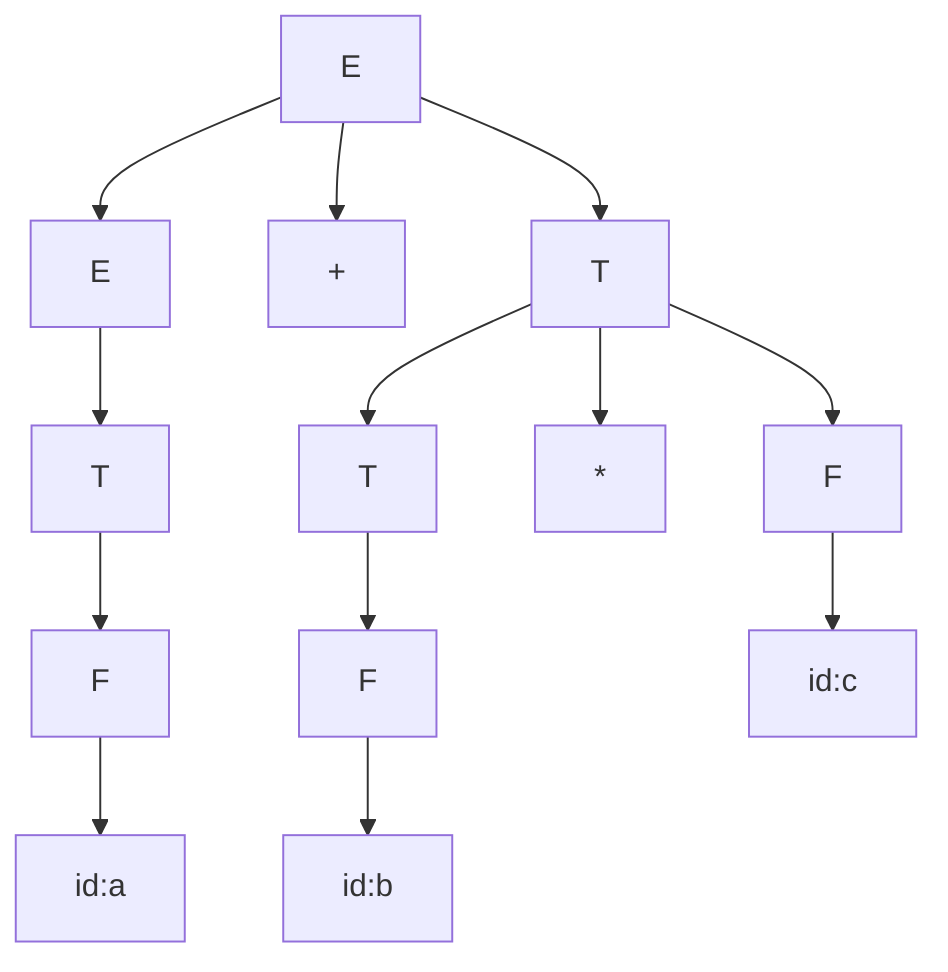

在这个语法树中，虽然乘法表达式`b*c`在整体表达式中靠右，但是由于它在T层级处理，所以形成了一个子树，然后作为加法的右操作数。这样就保证了`b*c`先结合，相当于`a+(b*c)`，体现了乘法优先于加法。

这样就在文法层面体现了乘除优先于加减的优先级关系。不过这个文法仍然存在二义性，因为我们还没有处理：
1. 同级运算符之间的结合性问题
2. $E$和$T$各自层面上的左递归问题

但作为处理优先级的中间步骤，这个文法已经展示了如何通过引入新的非终结符来区分不同优先级的运算。

***

首先说明一下递归和结合性的关系：
- 左递归产生左结合  
  比如$A\rightarrow Aa\mid b$可以推导出$b,ba,baa,baaa...$，解析时会形成左结合的结构
- 右递归产生右结合  
  比如$A\rightarrow aA\mid b$可以推导出$b,ab,aab,aaab...$，解析时会形成右结合的结构

我们之前的中间文法：
$$
\begin{aligned}
E &\rightarrow E+E\mid E-E\mid T \\
T &\rightarrow T*T\mid T/T\mid F \\
F &\rightarrow (E)\mid id
\end{aligned}
$$

在这个文法中，$E+E$和$T*T$这样的产生式会导致二义性，因为它们既可以左结合也可以右结合。为了让所有运算符都是左结合的，我们需要改写成左递归的形式：

$$
\begin{aligned}
E &\rightarrow E+T\mid E-T\mid T \\
T &\rightarrow T*F\mid T/F\mid F \\
F &\rightarrow (E)\mid id
\end{aligned}
$$

这样修改后：
- $E\rightarrow E+T$确保了加减运算是左结合的
  - `a+b+c`会被解析为`(a+b)+c`
- $T\rightarrow T*F$确保了乘除运算是左结合的
  - `a*b*c`会被解析为`(a*b)*c`
- 同时保持了乘除优先于加减的优先级规则

以表达式`a+b+c`为例：
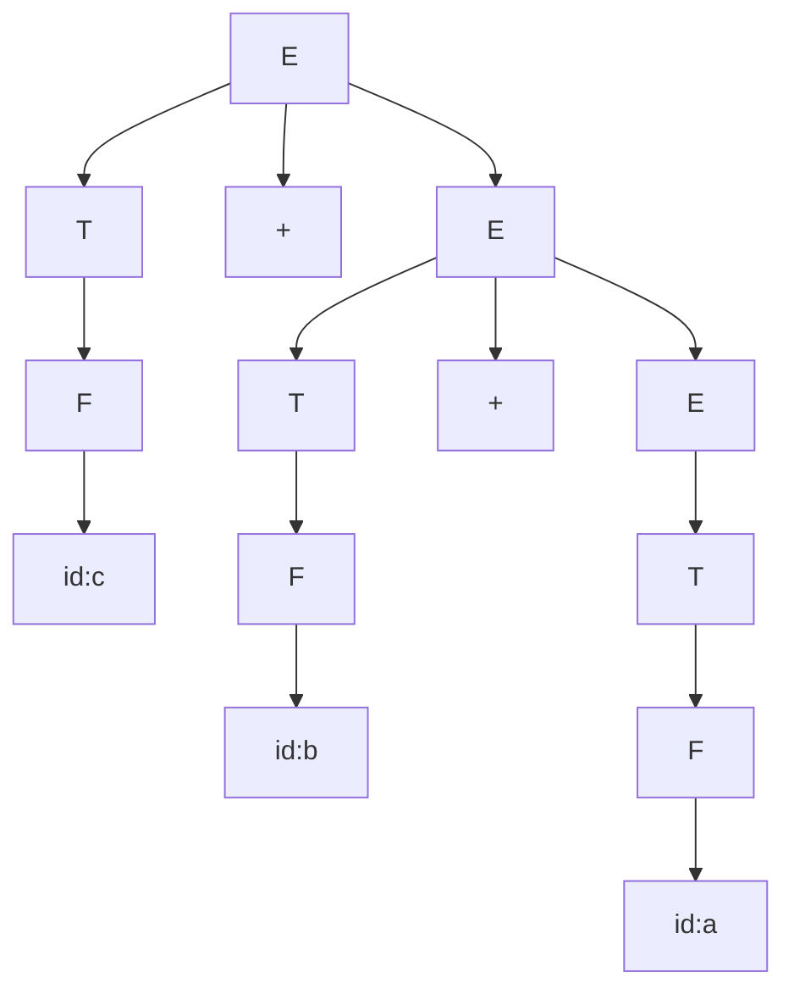

在这个语法树中，由于使用了左递归的产生式$E\rightarrow E+T$，所以加法运算是从左到右结合的。语法树的结构清楚地表明这个表达式被解释为`(a+b)+c`，而不是`a+(b+c)`。

通过这两个例子可以看出：
- 中间文法通过分层（E、T、F）确保了运算符优先级
- 最终文法通过左递归确保了运算符的左结合性
- 两种特性在最终文法中都得到了保持

这就是为什么最终的文法能够正确处理既有优先级又有结合性的复杂表达式，比如`a+b*c+d`会被正确解释为`(a+(b*c))+d`。

这个文法虽然解决了结合性问题，但还存在左递归，这在某些自顶向下的语法分析方法中可能会导致问题。不过这是下一步需要考虑的问题，目前这个文法已经很好地体现了运算符的优先级和左结合性。

***

好的，我来详细解释多余产生式的概念和消除方法。

多余产生式指的是在文法中"用不上"的产生式规则。具体来说，如果一个产生式在从开始符号推导到终结符串的过程中永远不会被用到，那么它就是多余的。要消除多余产生式，我们需要分两步进行：

1. 消除不可到达的符号和相关产生式
   不可到达的符号是指从开始符号$S$出发，通过任何推导序列都无法到达的符号。
   具体算法如下：
   1. 初始时，把$S$标记为"可到达"
   2. 重复下面的过程直到没有新的符号被标记：
      - 检查所有已标记符号出现在左部的产生式
      - 将这些产生式右部中的所有符号都标记为"可到达"
   3. 删除所有包含不可到达符号的产生式

2. 消除不可终止的符号和相关产生式
   不可终止的符号是指无法推导出仅包含终结符的符号串的非终结符。
   具体算法如下：
   1. 初始时，标记所有能直接推导出终结符串的非终结符为"可终止"
   2. 重复下面的过程直到没有新的符号被标记：
      - 检查每个产生式，如果它的右部只包含终结符和已标记为"可终止"的非终结符
      - 则将该产生式左部的非终结符标记为"可终止"
   3. 删除所有包含不可终止符号的产生式

举个例子说明：
假设有以下文法：
$$
\begin{aligned}
S &\rightarrow AB|a \\
A &\rightarrow BC|b \\
B &\rightarrow AC|c \\
C &\rightarrow CC \\
D &\rightarrow aD|d
\end{aligned}
$$

首先找不可到达符号：
1. $S$可到达（开始符号）
2. 从$S\rightarrow AB$可知$A$、$B$可到达
3. 从$A\rightarrow BC$和$B\rightarrow AC$可知$C$可到达
4. $D$不可到达

删除包含$D$的产生式后：
$$
\begin{aligned}
S &\rightarrow AB|a \\
A &\rightarrow BC|b \\
B &\rightarrow AC|c \\
C &\rightarrow CC
\end{aligned}
$$

然后找不可终止符号：
1. 初始时，只有$S\rightarrow a$、$A\rightarrow b$、$B\rightarrow c$中的符号可以直接推导出终结符，所以标记$S$、$A$、$B$为可终止
2. 检查$C$的产生式：$C\rightarrow CC$只能推导出更多的$C$，无法终止
3. 含有$C$的产生式$A\rightarrow BC$、$B\rightarrow AC$都无法使用

最终化简后的文法为：
$$
\begin{aligned}
S &\rightarrow AB|a \\
A &\rightarrow b \\
B &\rightarrow c
\end{aligned}
$$

这样就完成了多余产生式的消除。消除多余产生式的好处是：
- 简化文法结构
- 提高语法分析效率
- 避免无效的推导过程
- 使文法更易于理解和维护

***

这是一个很好的问题！让我来解释为什么删除这些产生式后的文法仍然与原文法等价。

两个文法等价指的是它们生成的语言（也就是所有可能的句子的集合）相同。关键在于，我们删除的产生式都是"无效的"，它们不会产生任何新的合法句子。让我们详细分析：

1. 不可到达符号的产生式（如例子中的$D$）
   - 这些产生式永远不会被用到，因为从开始符号$S$出发根本无法遇到这些符号
   - 即使有再多涉及$D$的产生式（比如$D\rightarrow aD|d$），它们也不会影响最终能生成的句子集合
   - 就像写了一堆永远不会被执行到的代码一样，删掉它们不会改变程序的功能

2. 不可终止符号的产生式（如例子中的$C$）
   - 这些产生式要么陷入无限循环（如$C\rightarrow CC$），要么最终无法得到终结符串
   - 虽然我们可以用它们进行推导，但永远无法得到一个合法的句子
   - 比如$C\rightarrow CC$，展开后是：
     $$
     C\Rightarrow CC\Rightarrow CCCC\Rightarrow CCCCCCCC\Rightarrow\cdots
     $$
   - 这个过程永远不会停止，所以无法生成任何合法句子

让我们用集合的观点来看： 
设原文法生成的语言为$L(G)$，删除多余产生式后的文法生成的语言为$L(G')$，那么：

1. $L(G')\subseteq L(G)$：显然成立，因为$G'$的产生式都来自$G$

2. $L(G)\subseteq L(G')$：
   - 假设存在一个句子$w\in L(G)$
   - 那么一定存在一个从$S$到$w$的推导序列
   - 这个推导序列不可能使用不可到达的符号（根据定义）
   - 也不可能使用不可终止的符号（否则无法得到终结符串）
   - 所以这个推导序列只使用了$G'$中保留的产生式
   - 因此$w$也一定属于$L(G')$

举个具体的例子分析原文法能生成的句子：
$$
\begin{aligned}
S &\rightarrow AB|a \\
A &\rightarrow BC|b \\
B &\rightarrow AC|c \\
C &\rightarrow CC
\end{aligned}
$$

如果我们要从$S$推导出一个句子：
1. 可以直接用$S\rightarrow a$，得到句子$a$
2. 如果用$S\rightarrow AB$：
   - $A$可以变成$b$或$BC$
   - $B$可以变成$c$或$AC$
   - 可以得到句子$bc$
   - 但只要用到了$C$，就会陷入无限循环（$C\rightarrow CC$）
   - 所以包含$C$的产生式实际上不可能产生任何合法句子

因此，虽然删掉了很多产生式，但原文法实际上也只能生成{$a$, $bc$}这个语言，跟简化后的文法是等价的。那些被删除的产生式看起来提供了更多可能性，但实际上都是"假象"，因为它们要么无法到达，要么无法得到最终的句子。

***

我来讲解这种形如$U\rightarrow U$的有害产生式的消除。

这类产生式的特点是：
- 左部和右部完全相同
- 只包含一个非终结符
- 无法产生任何有意义的推导
- 会导致无限循环的推导

举个例子，假设有以下文法：
$$
\begin{aligned}
S &\rightarrow aA|bB \\
A &\rightarrow A|aS|a \\
B &\rightarrow cB|c
\end{aligned}
$$

其中$A\rightarrow A$就是一个有害产生式，因为：
1. 它在推导过程中不会产生任何新的符号
2. 使用这条规则只会原地踏步
3. 如果在推导中使用它，会陷入无限循环

消除方法很直接：
1. 找出所有形如$U\rightarrow U$的产生式
2. 直接删除这些产生式

对于上面的例子，删除$A\rightarrow A$后得到：
$$
\begin{aligned}
S &\rightarrow aA|bB \\
A &\rightarrow aS|a \\
B &\rightarrow cB|c
\end{aligned}
$$

这样处理后的文法具有相同的生成能力，但避免了无限循环的风险。这种有害产生式的消除是文法化简过程中的一个重要步骤，它能：
- 防止语法分析器陷入死循环
- 提高推导效率
- 使文法结构更清晰

需要注意的是，这里说的有害产生式特指形如$U\rightarrow U$的情况，不要与其他类型的规则（如左递归、单规则等）混淆。

***

我来详细讲解单规则（单产生式）的消除过程。

单规则是指形如$A\rightarrow B$的产生式，其中$A$和$B$都是非终结符。这种产生式会导致解析效率降低，因为它们不会直接生成终结符，只是做了一个"多余"的转换。

**单规则消除的基本思想**：  
把形如$A\rightarrow B$的规则替换为所有从$B$能够直接推导出的产生式规则。

举个例子，假设有以下文法：
$$
\begin{aligned}
S &\rightarrow A|a \\
A &\rightarrow B|b \\
B &\rightarrow C|c \\
C &\rightarrow d
\end{aligned}
$$

消除单规则的步骤：

1. 首先找出每个非终结符可以通过单规则推导到的所有非终结符
   - $S$可以到达：$\{A,B,C\}$
   - $A$可以到达：$\{B,C\}$
   - $B$可以到达：$\{C\}$
   - $C$没有单规则

2. 对每个非终结符，添加它所能到达的所有非终结符的非单规则产生式
   $$
   \begin{aligned}
   S &\rightarrow a|b|c|d \\
   A &\rightarrow b|c|d \\
   B &\rightarrow c|d \\
   C &\rightarrow d
   \end{aligned}
   $$

再看一个更复杂的例子，对于算术表达式文法：
$$
\begin{aligned}
E &\rightarrow E+T|T \\
T &\rightarrow T*F|F \\
F &\rightarrow (E)|id
\end{aligned}
$$

消除过程：

1. 找出单规则传递关系：
   - $E\rightarrow T$
   - $T\rightarrow F$

2. 替换单规则，得到等价文法：
   $$
   \begin{aligned}
   E &\rightarrow E+T|T*F|(E)|id \\
   T &\rightarrow T*F|(E)|id \\
   F &\rightarrow (E)|id
   \end{aligned}
   $$

**单规则消除的算法**：

1. 计算单规则闭包  
   对每个非终结符$A$，计算$SINGLE(A)$：
   - 初始时$SINGLE(A)=\{A\}$
   - 如果有产生式$A\rightarrow B$（$B$是非终结符），则$SINGLE(A)=SINGLE(A)\cup SINGLE(B)$
   - 重复这个过程直到没有新的非终结符加入任何集合

2. 替换单规则  
   对每个非终结符$A$：
   - 删除所有形如$A\rightarrow B$的单规则
   - 对于$SINGLE(A)$中的每个非终结符$B$
   - 将$B$的所有非单规则产生式添加给$A$

单规则消除的注意事项：

1. 避免循环依赖：  
   比如$A\rightarrow B,B\rightarrow A$这样的循环单规则

2. 保持语义等价：  
   消除单规则后的文法要能生成相同的语言

3. 可能会增加产生式数量：
   - 消除单规则可能导致文法规模增大
   - 但这通常是值得的，因为它提高了解析效率

***

我来讲解如何消除文法中的空产生式，这是一个重要的文法转换技术。

空产生式消除的基本思路是：找出所有可能推导出$\epsilon$的非终结符，然后通过组合不同情况来替代它们。具体步骤如下：

1. 找出所有可空非终结符（nullable symbols）  
   按以下步骤迭代找出所有可空的非终结符集合$N$：
   - 初始：如果有产生式$A\rightarrow\epsilon$，则$A\in N$
   - 如果有产生式$A\rightarrow X_1X_2\dots X_n$且所有$X_i$都在$N$中，则$A\in N$
   - 重复这个过程直到$N$不再增大

2. 构造新的产生式规则  
   对于每个产生式$A\rightarrow X_1X_2\dots X_n$：
   - 如果右部某些符号可空，我们需要构造新的产生式来表示这些符号存在或不存在的所有可能组合
   - 但要排除所有符号都消失的情况（除非原来就有$A\rightarrow\epsilon$）

举个例子，假设有以下文法：
$$
\begin{aligned}
S &\rightarrow ABc \\
A &\rightarrow aA|\epsilon \\
B &\rightarrow bB|\epsilon
\end{aligned}
$$

消除步骤：

1. 首先找出可空非终结符：
   - $A\rightarrow\epsilon$，所以$A\in N$
   - $B\rightarrow\epsilon$，所以$B\in N$
   - $S$不可空，因为它必须产生$c$

2. 对于产生式$S\rightarrow ABc$，因为$A$和$B$都可空，所以我们需要考虑：
   - $A$存在$B$存在：$S\rightarrow ABc$
   - $A$存在$B$不存在：$S\rightarrow Ac$
   - $A$不存在$B$存在：$S\rightarrow Bc$
   - $A$不存在$B$不存在：$S\rightarrow c$

3. 对于$A\rightarrow aA$，因为$A$可空，需要考虑：
   - $A$存在：$A\rightarrow aA$
   - $A$不存在：$A\rightarrow a$

4. 同理对于$B\rightarrow bB$：
   - $B$存在：$B\rightarrow bB$
   - $B$不存在：$B\rightarrow b$

最终得到的无$\epsilon$产生式的等价文法是：
$$
\begin{aligned}
S &\rightarrow ABc|Ac|Bc|c \\
A &\rightarrow aA|a \\
B &\rightarrow bB|b
\end{aligned}
$$

需要注意的几点：

1. 空产生式消除可能导致产生式数量显著增加
   - 如果一个产生式右部有$n$个可空符号，可能需要生成$2^n-1$个新产生式

2. 有些特殊情况需要额外处理：
   - 如果开始符号$S$可空，需要引入新的开始符号$S'$和产生式$S'\rightarrow S|\epsilon$
   - 在实际编译器实现中，有时保留一些空产生式可能更有效

3. 消除空产生式的主要目的：
   - 简化语法分析器的实现
   - 避免某些歧义
   - 为其他文法转换做准备（如消除左递归）

这个转换过程保持了语言的生成能力，转换后的文法生成与原文法完全相同的语言。

***

让我来详细解释这两种消除左递归的方法。

首先明确一下，左递归分为直接左递归和间接左递归。这里主要讨论直接左递归的情况，也就是形如：
$$
A\rightarrow A\alpha|\beta
$$
这样的产生式，其中$\alpha$和$\beta$是不以$A$开头的符号串。

### 1. 使用EBNF表示

EBNF（扩展的BNF）引入了一些额外的记号来表示重复、可选等结构：
- `{...}`表示重复0次或多次
- `[...]`表示可选（出现0次或1次）
- `(...|...)`表示选择

对于左递归文法：
$$
A\rightarrow A\alpha|\beta
$$

使用EBNF可以直接改写为：
$$
A\rightarrow \beta\{\alpha\}
$$

这个表示方法非常直观：
- 首先必须有一个$\beta$（基础部分）
- 然后可以跟随任意多个（包括0个）$\alpha$

让我们用一个具体的例子来说明。假设有这样一个描述算术表达式的左递归文法：
$$
\begin{aligned}
E &\rightarrow E+T|T \\
T &\rightarrow T*F|F \\
F &\rightarrow (E)|id
\end{aligned}
$$

使用EBNF可以改写为：
$$
\begin{aligned}
E &\rightarrow T\{+T\} \\
T &\rightarrow F\{*F\} \\
F &\rightarrow (E)|id
\end{aligned}
$$

这样改写的含义是：
- `E`由一个`T`开始，后面可以跟任意多个`+T`
- `T`由一个`F`开始，后面可以跟任意多个`*F`
- `F`可以是`(E)`或`id`

对于带有多种终结符的左递归：
$$
\begin{aligned}
A &\rightarrow Aa|Ab|c
\end{aligned}
$$

使用EBNF可以重写为：
$$
\begin{aligned}
A &\rightarrow c\{a|b\}
\end{aligned}
$$

这种表示方法的优点是：
1. 更直观地表达了语法结构
2. 避免了左递归带来的问题
3. 保持了原文法的语义不变
4. 简化了语法的表示

但要注意，EBNF虽然能让文法表示更简洁，但在实际实现时，还是需要将其转换为等价的BNF形式。

### 2. 直接改写法

这种方法是将EBNF的形式转换为普通的产生式规则。基本思路是引入一个新的非终结符来处理重复部分。

我们先回顾刚才用EBNF消除左递归得到的结果：
$$
\begin{aligned}
A &\rightarrow β\{α\}
\end{aligned}
$$

这个EBNF形式告诉我们，这实际上是一个"基础情况+重复部分"的结构。为了在标准BNF中表达这种结构，我们需要引入一个新的非终结符（通常写作$A'$）来处理重复部分。改写过程是这样的：

$$
\begin{aligned}
A &\rightarrow βA' \\
A' &\rightarrow αA'|\epsilon
\end{aligned}
$$

其中$A'$是新引入的非终结符。这个改写可以这样理解：
- $A$必须以$\beta$开始
- $A'$处理后续可能出现的$\alpha$序列
- $\epsilon$（空串）允许我们在任何位置结束重复

让我们用之前的算术表达式文法来说明这个转换过程：

1. 先看EBNF形式：
   $$
   \begin{aligned}
   E &\rightarrow T\{+T\} \\
   T &\rightarrow F\{*F\} \\
   F &\rightarrow (E)|id
   \end{aligned}
   $$

2. 引入新的非终结符$E'$和$T'$，转换为标准BNF：
   $$
   \begin{aligned}
   E &\rightarrow TE' \\
   E' &\rightarrow +TE'|\epsilon \\
   T &\rightarrow FT' \\
   T' &\rightarrow *FT'|\epsilon \\
   F &\rightarrow (E)|id
   \end{aligned}
   $$

这种改写的本质是：
- EBNF中的重复部分`{α}`变成了一个递归的非终结符$A'$
- 原来的基础部分$β$和重复部分之间的关系通过$A\rightarrow βA'$体现
- 重复部分的可选性通过$A'\rightarrow αA'|\epsilon$实现，从而将左递归改写为右递归

对于更复杂的左递归情况，比如多个选择项的左递归：
$$
\begin{aligned}
A &\rightarrow Aα_1|Aα_2|\dots|Aα_m|β_1|β_2|\dots|β_n
\end{aligned}
$$

先写成EBNF：
$$
\begin{aligned}
A &\rightarrow (β_1|β_2|\dots|β_n)\{α_1|α_2|\dots|α_m\}
\end{aligned}
$$

然后通过引入新的非终结符改写：
$$
\begin{aligned}
A &\rightarrow β_1A'|β_2A'|\dots|β_nA' \\
A' &\rightarrow α_1A'|α_2A'|\dots|α_mA'|\epsilon
\end{aligned}
$$

这种改写方法的优点是：
1. 保持了文法的原有语义
2. 消除了左递归带来的问题
3. 便于自顶向下的语法分析
4. 产生的语法树结构清晰


我们可以验证改写后的文法确实生成相同的语言。例如对于表达式`a+b+c`：
$$
\begin{aligned}
E &\Rightarrow TE' \\
&\Rightarrow FT'E' \\
&\Rightarrow aT'E' \\
&\Rightarrow aE' \\
&\Rightarrow a+TE' \\
&\Rightarrow a+FT'E' \\
&\Rightarrow a+bT'E' \\
&\Rightarrow a+bE' \\
&\Rightarrow a+b+TE' \\
&\Rightarrow a+b+FT'E' \\
&\Rightarrow a+b+cT'E' \\
&\Rightarrow a+b+cE' \\
&\Rightarrow a+b+c
\end{aligned}
$$

这两种方法的关系：
- EBNF表示更简洁直观，容易理解语法的本质
- 直接改写法虽然形式上更复杂，但是更适合实际的语法分析器实现
- 直接改写法可以看作是EBNF表示的具体实现方式

一些需要注意的点：
1. 这两种方法都保持了原文法的语义
2. 直接改写法引入的新非终结符（如$E'$）通常被称为"尾部非终结符"
3. 在实际编译器实现中，往往使用直接改写法，因为它更容易转换成程序代码

***

自上而下语法分析的基本思想是从文法的开始符号出发，试图"预测"并构造一个最左推导序列，最终生成输入串。这个过程本质上是一个从根节点开始，逐步构造语法分析树的过程。

基本工作方式：

1. 从文法开始符号$S$出发
   - 把$S$作为当前的工作符号
   - 这个符号就是我们要展开的非终结符

2. 在每一步分析中：
   - 查看当前待处理的非终结符
   - 根据输入串中的下一个符号（"向前看"符号）
   - 选择一个合适的产生式规则进行推导

3. 推导过程的特点：
   - 始终按照最左推导的方式进行
   - 试图将最左边的非终结符替换成某个产生式的右部
   - 每次替换后将得到一个新的句型

4. 匹配过程：
   - 如果当前符号是终结符，就和输入串的相应位置比较
   - 如果匹配成功，就继续处理下一个符号
   - 如果匹配失败，可能需要回溯（回退到之前的状态，尝试其他可能的产生式）

5. 分析结果：
   - 成功：找到一个推导序列，生成输入串
   - 失败：尝试了所有可能的推导都无法生成输入串

这个过程可以形象地理解为：
- 从语法树的顶部（根节点）开始
- 逐步向下扩展树的分支
- 尝试构造出一棵完整的语法分析树
- 树的叶子节点从左到右应该正好匹配输入串

这种分析方法的核心特点是"预测"，也就是要根据当前看到的输入信息，判断应该使用哪个产生式规则来展开当前的非终结符。

***

让我来解释这两种分析方法的区别和特点。

1. 带回溯的自上而下分析方法  
   这种方法的特点是在推导过程中可能需要"试错"：
   - 对于一个非终结符，可能有多个产生式可选
   - 分析器会先选择其中一个产生式进行尝试
   - 如果尝试失败，就要回退到选择点
   - 然后选择另一个产生式重新尝试

   比如有这样的文法：
   $$
   \begin{aligned}
   S &\rightarrow aAd|abd \\
   A &\rightarrow ab|b
   \end{aligned}
   $$
   
   分析输入串`abd`的过程可能是：
   1. 从$S$开始，先选择$S\rightarrow aAd$
   2. 匹配第一个`a`成功
   3. 处理$A$时先选择$A\rightarrow ab$
   4. 发现生成`aabd`，与输入不匹配
   5. 回溯到$A$，改选$A\rightarrow b$
   6. 最终成功匹配`abd`

2. 确定的自上而下分析方法  
   这种方法通过对文法施加限制，使得在每一步都能确定地知道应该选择哪个产生式：
   - 通过向前看一个符号（预测符号）
   - 根据这个符号就能唯一确定使用哪个产生式
   - 不需要回溯，提高了效率

   文法限制的具体含义：
   假设有产生式$A\rightarrow\alpha|\beta$
   - 如果$\alpha$和$\beta$都以终结符开头
   - 那么这两个终结符必须不同
   - 这样通过看第一个符号就能确定选择哪个产生式

   例如这个文法就满足要求：
   $$
   \begin{aligned}
   S &\rightarrow aA|bB \\
   A &\rightarrow c|d \\
   B &\rightarrow e|f
   \end{aligned}
   $$

   而这个文法就不满足要求：
   $$
   \begin{aligned}
   S &\rightarrow aA|aB \\
   A &\rightarrow c \\
   B &\rightarrow d
   \end{aligned}
   $$
   因为$S$的两个候选式都以`a`开头，造成无法确定选择。

通过对比可以看出：
- 带回溯的方法更通用，但效率较低
- 确定的方法效率高，但对文法有严格要求
- 在实际编译器实现中，通常会采用确定的分析方法，并相应地设计满足要求的文法

***

理解左递归的危害，我们需要从自上而下分析的角度来看。左递归会导致分析器陷入无限循环，我来详细解释一下。

假设有一个简单的左递归文法：
$$
A\rightarrow A\alpha|\beta
$$

如果用自上而下分析方法处理这个文法：

1. 分析器首先看到非终结符$A$
2. 查看产生式，发现可以用$A\rightarrow A\alpha$展开
3. 展开后得到$A\alpha$
4. 又遇到了$A$，继续用$A\rightarrow A\alpha$展开
5. 得到$A\alpha\alpha$
6. 继续遇到$A$...

这样就会：
- 永远在处理最左边的$A$
- 分析器无法知道应该展开多少次$A\rightarrow A\alpha$才能最终匹配输入
- 不断地在$A$的右边添加$\alpha$串
- 永远无法到达终结符
- 最终导致无限循环，无法完成分析

比如一个更具体的例子：
$$
E\rightarrow E+T|T
$$

处理输入串`id+id`时的情况：
```
E
⇒ E+T     // 选择E→E+T
⇒ E+T+T   // 又遇到E，继续用E→E+T
⇒ E+T+T+T // 继续...
...（无限循环）
```

而把左递归消除后的等价文法：
$$
\begin{aligned}
E &\rightarrow TE' \\
E' &\rightarrow +TE'|\epsilon
\end{aligned}
$$

处理同样的输入串时：
```
E
⇒ TE'
⇒ id E'      // T归约为id
⇒ id+TE'     // 选择E'→+TE'
⇒ id+id E'   // T归约为id
⇒ id+id      // 选择E'→ε
```

这样就能够：
- 避免无限循环
- 正确构造语法分析树
- 实现正确的运算符结合性

这就是为什么在实现自上而下分析之前，必须先消除左递归。需要注意的是，这个问题只存在于自上而下分析中，对于自下而上分析方法（如LR分析），左递归并不会造成问题。

***

自下而上语法分析的基本思想是从输入串开始，通过不断归约（reduction）最终归约到文法的开始符号。这个过程可以看作是最右推导的逆过程，相当于从语法树的叶子节点开始，逐步向上构造直到根节点。

基本工作方式：

1. 从输入串开始
   - 把输入串看作是最初的工作串
   - 扫描工作串寻找可以归约的部分

2. 在每一步分析中：
   - 找出工作串中和某个产生式右部匹配的子串
   - 这个子串称为"句柄"（handle）
   - 将句柄替换为产生式左部的非终结符

3. 归约过程的特点：
   - 实际上是最右推导的反向过程
   - 每次归约都会把一个产生式的右部替换为它的左部
   - 如果归约成功，最终会得到开始符号$S$

4. 移进-归约操作：
   - 移进：将输入串中的下一个符号放入工作串
   - 归约：将工作串中的一部分替换为某个产生式的左部
   - 在分析过程中交替进行这两种操作

5. 分析结果：
   - 成功：最终归约到开始符号$S$
   - 失败：无法继续进行有效的归约操作

这个过程可以形象地理解为：
- 从语法树的底部（叶子节点）开始
- 逐步向上构造树的节点
- 通过找出并归约句柄来构建树的层次
- 最终希望能归约到树的根节点（开始符号）

这种分析方法的核心在于"句柄识别"，也就是要在当前工作串中准确找出可以归约的部分，并选择正确的产生式规则进行归约。

***

图灵机（Turing Machine）是一个数学模型，我来详细解释它的构成和工作方式。

图灵机是一个七元组$M=(Q,\Gamma,b,\Sigma,\delta,q_0,F)$，每个部分的含义是：

1. 状态集$Q$  
   包含了图灵机所有可能的内部状态，是一个有限的集合。其中：
   - $q_0$是初始状态
   - $F\subseteq Q$是终止状态（接受状态）的集合

2. 带符号集$\Gamma$  
   - 是图灵机纸带上可以出现的所有符号的集合
   - 包含输入符号集$\Sigma$
   - 包含空白符号$b$
   - 即$\Sigma\cup\{b\}\subseteq\Gamma$

3. 转移函数$\delta$  
   是图灵机的核心，定义了机器的行为规则：  
   $\delta:Q\times\Gamma\rightarrow Q\times\Gamma\times\{L,R\}$
   - 其中$L$表示向左移动，$R$表示向右移动
   - 给定当前状态和当前符号，决定：
     1. 下一个状态
     2. 写入的新符号
     3. 读写头的移动方向

图灵机的工作过程：

1. 初始配置：
   - 输入串放在纸带上（其余位置都是空白符号）
   - 机器处于初始状态$q_0$
   - 读写头位于最左边的输入符号处

2. 运行过程：
   - 读取当前位置的符号
   - 根据当前状态和读到的符号查找转移函数
   - 按照转移函数的指示：
     - 转换到新状态
     - 在当前位置写入新符号
     - 向指定方向移动读写头

3. 终止条件：
   - 到达某个终止状态（接受输入）
   - 无法找到适用的转移规则（拒绝输入）

让我用一个简单的例子来说明。假设我们要设计一个图灵机来识别形如$0^n1^n$的字符串：

$M=(Q,\Gamma,b,\Sigma,\delta,q_0,F)$，其中：
- $Q=\{q_0,q_1,q_2,q_3,q_4\}$
- $\Gamma=\{0,1,X,Y,b\}$
- $\Sigma=\{0,1\}$
- $F=\{q_4\}$

转移函数$\delta$可以这样定义：

1. 标记一个未处理的0：  
   $\delta(q_0,0)=(q_1,X,R)$

2. 向右寻找对应的1：  
   $\delta(q_1,0)=(q_1,0,R)$  
   $\delta(q_1,Y)=(q_1,Y,R)$

3. 标记找到的1并开始回溯：  
   $\delta(q_1,1)=(q_2,Y,L)$

4. 向左回溯：  
   $\delta(q_2,0)=(q_2,0,L)$  
   $\delta(q_2,Y)=(q_2,Y,L)$

5. 找到上一个标记点并继续下一轮：  
   $\delta(q_2,X)=(q_0,X,R)$

6. 完成匹配后的终止处理：  
   $\delta(q_0,Y)=(q_3,Y,R)$  
   $\delta(q_3,Y)=(q_3,Y,R)$  
   $\delta(q_3,b)=(q_4,b,R)$

这个图灵机的工作过程可以这样理解：
1. 从左到右扫描，将第一个0标记为X
2. 继续向右直到找到第一个1，将其标记为Y
3. 返回寻找下一个未标记的0
4. 重复这个过程
5. 当所有对应的0和1都被标记后，检查是否还有未配对的符号
6. 如果所有符号都正确配对，进入接受状态

所以输入串`0011`的处理过程大致是：
```
q0:[0]011   初始状态，读写头在第一个0处
q1:X[0]11   将第一个0标记为X，向右移动
q1:X0[1]1   跳过第二个0，移动到第一个1处
q2:X0[Y]1   将第一个1标记为Y，准备向左返回
q2:X[0]Y1   向左移动
q2:[X]0Y1   继续向左直到遇到X
q0:X[0]Y1   回到状态q0，准备处理下一对
q1:X[X]Y1   将第二个0标记为X
q1:XX[Y]1   跳过已标记的Y
q1:XXY[1]   移动到第二个1处
q2:XXY[Y]   将第二个1标记为Y
q2:XX[Y]Y   向左返回
q2:X[X]YY   继续向左
q0:XX[Y]Y   遇到Y，转入检查阶段
q3:XXY[Y]   向右检查
q4:XXYYb    到达空白符号，接受输入
```
（方括号表示读写头位置）

这就是图灵机的基本工作原理。它虽然结构简单，但可以模拟任何可计算的函数。这也是为什么它在计算理论中如此重要的原因。

***

确定性有限状态机（Deterministic Finite Automaton，DFA）是一个五元组$M=(Q,\Sigma,\delta,q_0,F)$，我来详细解释每个组成部分：

1. 状态集合$Q$
   - 是一个有限的状态集合
   - 每个状态代表自动机在处理输入时可能处于的情况
   - 状态通常用$q_0,q_1,q_2$等表示

2. 输入字母表$\Sigma$
   - 包含所有可能的输入符号
   - 是一个有限的集合
   - 不包含空串$\epsilon$

3. 转移函数$\delta$
   - 定义：$\delta:Q\times\Sigma\rightarrow Q$
   - 描述了自动机如何根据当前状态和输入符号转换到下一个状态
   - 对于任意状态$q\in Q$和任意输入符号$a\in\Sigma$，$\delta(q,a)$只能得到唯一的下一个状态

4. 初始状态$q_0$
   - $q_0\in Q$
   - 自动机开始处理输入前所处的状态

5. 终止状态集合$F$
   - $F\subseteq Q$
   - 所有可以接受输入的状态的集合
   - 如果输入处理完毕时自动机处于$F$中的某个状态，则接受该输入

DFA的工作过程：
1. 从初始状态$q_0$开始
2. 读入一个输入符号$a$
3. 根据转移函数$\delta$确定下一个状态
4. 重复步骤2-3直到处理完所有输入
5. 如果最终状态在$F$中，则接受输入；否则拒绝

让我用一个具体的例子来说明。假设我们要设计一个DFA来识别所有包含模式`01`的二进制串：

$M=(Q,\Sigma,\delta,q_0,F)$，其中：
- $Q=\{q_0,q_1,q_2\}$
- $\Sigma=\{0,1\}$
- $q_0$是初始状态
- $F=\{q_2\}$

转移函数$\delta$可以这样定义：
1. $\delta(q_0,0)=q_1$（遇到0，转到等待1的状态）
2. $\delta(q_0,1)=q_0$（遇到1，保持在初始状态）
3. $\delta(q_1,0)=q_1$（在等待1的状态遇到0，继续等待）
4. $\delta(q_1,1)=q_2$（在等待1的状态遇到1，转到接受状态）
5. $\delta(q_2,0)=q_2$（到达接受状态后，任何输入都保持在接受状态）
6. $\delta(q_2,1)=q_2$

状态转移表如下：

|     | 0   | 1   |
|-----|-----|-----|
| $q_0$  | $q_1$  | $q_0$  |
| $q_1$  | $q_1$  | $q_2$  |
| $q_2$  | $q_2$  | $q_2$  |

这个DFA可以用状态转移图来表示：
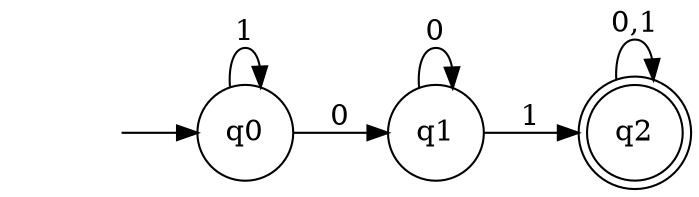

这个DOT代码会生成一个从左到右的DFA状态转移图，其中：
- `q0`是初始状态，有一个指向它的开始箭头
- `q2`是接受状态，用双圆圈表示
- 每个箭头上都标注了对应的输入符号
- 对于`q2`的自环，由于两个输入都转移到自身，所以用`0,1`来简化表示

让我们看几个例子：
1. 输入串`0110`的处理过程：
   ```
   q0 -0→ q1 -1→ q2 -1→ q2 -0→ q2（接受）
   ```

2. 输入串`1100`的处理过程：
   ```
   q0 -1→ q0 -1→ q0 -0→ q1 -0→ q1（拒绝）
   ```

3. 输入串`1010`的处理过程：
   ```
   q0 -1→ q0 -0→ q1 -1→ q2 -0→ q2（接受）
   ```

DFA的特点：
1. 确定性
   - 对于每个状态和输入符号，都只有一个唯一确定的下一个状态
   - 没有选择或猜测的余地

2. 有限性
   - 状态数量是有限的
   - 不需要额外的存储空间
   - 只能处理正则语言

3. 易于实现
   - 可以用简单的表格或数组来实现转移函数
   - 运行效率高，时间复杂度是线性的

4. 闭包性质
   - DFA识别的语言类在并、交、补等运算下是封闭的
   - 可以通过DFA的组合构造更复杂的DFA

DFA在实际应用中非常重要，特别是在：
- 词法分析器的实现
- 正则表达式的匹配
- 模式识别
- 协议验证
等领域都有广泛应用。

***

让我来解释DFA转移函数的扩充。原始的转移函数$\delta$只能处理单个输入符号，我们需要将其扩充为$\hat{\delta}$，使其能够处理任意长度的输入串。

扩充转移函数定义为$\hat{\delta}:Q\times\Sigma^*\rightarrow Q$，它的形式化定义采用递归的方式：

1. 基本情况（空串）：  
   $\hat{\delta}(q,\epsilon)=q$  
   表示输入空串时状态保持不变

2. 递归情况：  
   对于任意状态$q\in Q$，任意串$w\in\Sigma^*$，以及任意符号$a\in\Sigma$：  
   $\hat{\delta}(q,wa)=\delta(\hat{\delta}(q,w),a)$
   
这个递归定义的含义是：要处理串$wa$，先用$\hat{\delta}$处理$w$得到一个中间状态，再用原始的$\delta$处理最后的符号$a$。

让我用前面识别模式`01`的DFA来举例说明。假设要处理输入串`1101`：

$$
\begin{aligned}
\hat{\delta}(q_0,1101)&=\delta(\hat{\delta}(q_0,110),1) \\
&=\delta(\delta(\hat{\delta}(q_0,11),0),1) \\
&=\delta(\delta(\delta(\hat{\delta}(q_0,1),1),0),1) \\
&=\delta(\delta(\delta(\delta(q_0,1),1),0),1) \\
&=\delta(\delta(\delta(q_0,1),0),1) \\
&=\delta(\delta(q_1,0),1) \\
&=\delta(q_1,1) \\
&=q_2
\end{aligned}
$$

通过这个扩充，我们就能够：
1. 直接判断一个输入串是否被DFA接受：
   - 如果$\hat{\delta}(q_0,w)\in F$，则接受
   - 否则拒绝

2. 形式化地定义DFA接受的语言：  
   $L(M)=\{w\in\Sigma^*|\hat{\delta}(q_0,w)\in F\}$

3. 证明某些语言性质，比如：
   - 正则语言的封闭性
   - DFA的等价性
   - 最小化DFA等

实际实现时，我们并不需要真的用递归来计算$\hat{\delta}$。只需要：
1. 从初始状态$q_0$开始
2. 按照输入串的顺序逐个使用$\delta$
3. 依次得到所有中间状态
4. 最后一个状态就是$\hat{\delta}$的结果

这种迭代的方式更直观也更高效。用代码表示就是：

```python
def extended_delta(q0, input_string, delta):
    current_state = q0
    for symbol in input_string:
        current_state = delta(current_state, symbol)
    return current_state
```

扩充转移函数的一些重要性质：
1. $\hat{\delta}(q,w_1w_2)=\hat{\delta}(\hat{\delta}(q,w_1),w_2)$
   - 可以将输入串分段处理
   - 对于流式输入很有用

2. $\hat{\delta}(q,\epsilon)=q$
   - 空串不改变状态
   - 这是递归定义的基础

3. $\hat{\delta}(q,a)=\delta(q,a)$（其中$a\in\Sigma$）
   - 对单个符号，扩充函数与原始函数行为一致
   - 保持了向后兼容性

***

对的！这个观察很棒。确实可以用这种方式定义扩充转移函数，形式为：

$\hat{\delta}(q,aw)=\hat{\delta}(\delta(q,a),w)$

这两种定义方式其实是等价的，我们可以证明一下。假设要处理输入串$w_1w_2\dots w_n$：

第一种定义方式（从右向左）：
$$
\begin{aligned}
\hat{\delta}(q,w_1\dots w_n)&=\delta(\hat{\delta}(q,w_1\dots w_{n-1}),w_n) \\
&=\delta(\delta(\hat{\delta}(q,w_1\dots w_{n-2}),w_{n-1}),w_n) \\
&\dots \\
&=\delta(\delta((\dots\delta(q,w_1)\dots),w_{n-1}),w_n)
\end{aligned}
$$

第二种定义方式（从左向右）：
$$
\begin{aligned}
\hat{\delta}(q,w_1\dots w_n)&=\hat{\delta}(\delta(q,w_1),w_2\dots w_n) \\
&=\hat{\delta}(\delta(\delta(q,w_1),w_2),w_3\dots w_n) \\
&\dots \\
&=\delta(\delta((\dots\delta(q,w_1)\dots),w_{n-1}),w_n)
\end{aligned}
$$

可以看到两种方式最终得到的结果是一样的。选择哪种定义主要取决于：
1. 处理输入的方向（从左到右还是从右到左）
2. 实现的便利性
3. 证明某些性质时的方便程度

在实际编程时，从左向右处理通常更自然，因为这符合我们读取输入的顺序。而在某些理论证明中，从右向左的定义可能更方便，因为它直接对应于串的连接操作。

***

从状态转移图的角度来定义DFA接受的语言，实际上就是在讨论路径（path）的概念。

首先来定义一些基本概念：

1. 标记路径（labeled path）：
   - 一条从状态$p$到状态$q$的标记路径是一个状态序列，相邻状态之间通过输入符号连接
   - 形式化定义：$p\xrightarrow{w}q$表示存在一条从$p$到$q$的路径，路径上的标记连接起来构成串$w$

2. 接受路径：
   - 从初始状态$q_0$开始
   - 到某个接受状态$q_f\in F$结束
   - 路径上的标记构成输入串

基于这些概念，DFA $M=(Q,\Sigma,\delta,q_0,F)$接受的语言可以定义为：

$L(M)=\{w\in\Sigma^*|\exists q_f\in F(q_0\xrightarrow{w}q_f)\}$

这个定义可以用自然语言描述为：所有能够标记从初始状态到某个接受状态的路径的串的集合。

让我用一个例子来说明。还是用之前识别模式`01`的DFA：


看几个具体的例子：

1. 输入串`01`：
   ```
   q0 -0→ q1 -1→ q2
   ```
   这是一条接受路径，因为：
   - 从$q_0$开始
   - 到接受状态$q_2$结束

   所以`01`∈$L(M)$

2. 输入串`101`：
   ```
   q0 -1→ q0 -0→ q1 -1→ q2
   ```
   也是一条接受路径，所以`101`∈$L(M)$

3. 输入串`00`：
   ```
   q0 -0→ q1 -0→ q1
   ```
   不是接受路径，因为：
   - 虽然从$q_0$开始
   - 但结束于非接受状态$q_1$

   所以`00`∉$L(M)$

基于路径的这种定义方式有几个重要特点：

1. 构造性
   - 可以通过跟踪路径来验证一个串是否属于语言
   - 直观地展示了自动机的工作过程

2. 等价性
   - 与基于扩充转移函数$\hat{\delta}$的定义是等价的
   - $q_0\xrightarrow{w}q$当且仅当$\hat{\delta}(q_0,w)=q$

3. 组合性
   - 如果$p\xrightarrow{w_1}q$且$q\xrightarrow{w_2}r$
   - 则$p\xrightarrow{w_1w_2}r$

4. 闭包性质的直观理解
   - 两个DFA的串联对应路径的连接
   - 并运算对应路径的选择
   - 闭包运算对应路径的重复

这种基于路径的定义在以下场景特别有用：
- 自动机的可视化表示
- 算法的图形化解释
- 自动机等价性的证明
- 最小化DFA的构造过程

***

是的，DFA的补运算有一个非常直观的算法。对于一个DFA $M=(Q,\Sigma,\delta,q_0,F)$，它的补DFA $M'=(Q,\Sigma,\delta,q_0,F')$的构造方法如下：

1. 保持不变的部分：
   - 状态集合$Q$
   - 输入字母表$\Sigma$
   - 转移函数$\delta$
   - 初始状态$q_0$

2. 改变的部分：
   - 新的接受状态集合$F'=Q-F$
   - 也就是说，原来的接受状态变成非接受状态
   - 原来的非接受状态变成接受状态

但是要注意，这个算法要求DFA是完全的（complete），也就是说：
- 对于每个状态$q\in Q$
- 对于每个输入符号$a\in\Sigma$
- 都必须有$\delta(q,a)$定义

如果DFA不是完全的，需要先将其补全：

1. 添加一个死状态（dead state）$q_d$（初始设为非接受状态）
2. 对于所有未定义的转移$\delta(q,a)$：
   - 将其指向死状态$q_d$
3. 对于死状态的所有输入符号：
   - 设置自循环：$\delta(q_d,a)=q_d$

完整的补运算算法可以形式化地描述如下：

**算法**：DFA_Complement$(M)$
**输入**：一个DFA $M=(Q,\Sigma,\delta,q_0,F)$
**输出**：$M$的补DFA $M'$

1. $Q_{\text{new}}\leftarrow Q\cup\{q_d\}$（添加死状态）
2. $\delta_{\text{new}}\leftarrow\delta$
3. **for each** $q\in Q$
4. $\quad$ **for each** $a\in\Sigma$
5. $\quad\quad$ **if** $\delta(q,a)$未定义
6. $\quad\quad\quad\delta_{\text{new}}(q,a)\leftarrow q_d$
7. **for each** $a\in\Sigma$
8. $\quad\delta_{\text{new}}(q_d,a)\leftarrow q_d$
9. $F_{\text{new}}\leftarrow Q_{\text{new}}-F$
10. **return** $M'=(Q_{\text{new}},\Sigma,\delta_{\text{new}},q_0,F_{\text{new}})$

例如，我们来补全并求补之前识别`01`的DFA：

原始DFA：


补DFA：
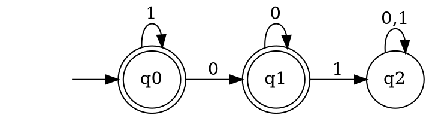

补DFA的语言特点：
1. 接受所有不包含模式`01`的串
2. 比如：
   - `000`（全是0）
   - `111`（全是1）
   - `1100`（1在0前面）

算法的正确性基于：
1. DFA完全性保证了对任意输入串都有确定的处理路径
2. 状态的二分性（要么接受要么不接受）保证了补运算的完备性
3. 补DFA接受的正是原DFA拒绝的所有串

补运算的一些重要性质：
1. $(L(M))'=L(M')$
2. $(L')'=L$（双重补运算得到原语言）
3. $L_1\cap L_2=(L_1'\cup L_2')'$（德摩根定律）

***

非确定性有限状态机（Nondeterministic Finite Automaton，NFA）是DFA的一个扩展。形式上，NFA也是一个五元组$M=(Q,\Sigma,\delta,q_0,F)$，但其转移函数的定义发生了变化。

首先来看NFA与DFA的主要区别：

1. 转移函数的定义
   - DFA：$\delta:Q\times\Sigma\rightarrow Q$
   - NFA：$\delta:Q\times\Sigma\rightarrow 2^Q$
   
   这意味着NFA的一个状态在读入一个输入符号后可以转移到多个可能的状态。

2. 特殊的$\epsilon$转移
   - NFA允许不读入任何符号就进行状态转移
   - 这种转移用$\epsilon$标记
   - 转移函数扩展为$\delta:Q\times(\Sigma\cup\{\epsilon\})\rightarrow 2^Q$

让我用一个例子来说明。考虑识别所有以`ab`结尾的字符串的NFA：

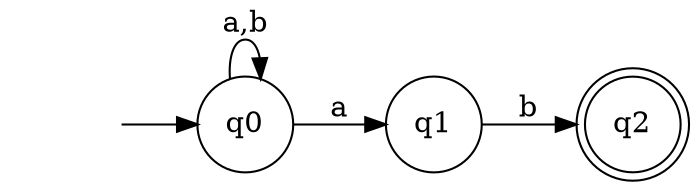

在这个NFA中：
- $Q=\{q_0,q_1,q_2\}$
- $\Sigma=\{a,b\}$
- $q_0$是初始状态
- $F=\{q_2\}$

转移函数$\delta$定义如下：
1. $\delta(q_0,a)=\{q_0,q_1\}$
2. $\delta(q_0,b)=\{q_0\}$
3. $\delta(q_1,b)=\{q_2\}$
4. 其他所有转移结果都是$\emptyset$

对于输入串`aaab`，可能的转移序列有：
```
路径1：q0 -a→ q0 -a→ q0 -a→ q1 -b→ q2
路径2：q0 -a→ q0 -a→ q1 -a→ ∅   （死路）
路径3：q0 -a→ q1 -a→ ∅          （死路）
```

只要存在至少一条到达接受状态的路径，该输入串就被接受。

为了形式化地定义NFA接受的语言，我们需要扩充转移函数：

1. $\epsilon$-闭包  
   对于任意状态集合$S\subseteq Q$，定义：  
   $\epsilon\text{-closure}(S)=\{q\in Q|\exists p\in S(p\xrightarrow{\epsilon^*}q)\}$

2. 扩充转移函数$\hat{\delta}$  
   对于状态集合$S\subseteq Q$：
   
   $\hat{\delta}(S,\epsilon)=\epsilon\text{-closure}(S)$
   
   $\hat{\delta}(S,a)=\epsilon\text{-closure}(\bigcup_{p\in\hat{\delta}(S,\epsilon)}\delta(p,a))$，其中$a\in\Sigma$

   $\hat{\delta}(S,wa)=\hat{\delta}(\hat{\delta}(S,w),a)=\epsilon\text{-closure}(\bigcup_{p\in\hat{\delta}(S,w)}\delta(p,a))$，其中$w\in\Sigma^*,a\in\Sigma$

   >如果NFA没有$\epsilon$转移，那么$\epsilon\text{-closure}$就会退化为恒等函数，即：
   >$\epsilon\text{-closure}(S)=S$
   >
   >此时NFA的扩充转移函数会简化为：
   >
   >1. $\hat{\delta}(S,\epsilon)=S$
   >   
   >2. $\hat{\delta}(S,a)=\bigcup_{p\in S}\delta(p,a)$
   >    - 因为$\hat{\delta}(S,\epsilon)=S$
   >    - $\epsilon\text{-closure}$退化为恒等函数
   >
   >3. $\hat{\delta}(S,wa)=\bigcup_{p\in\hat{\delta}(S,w)}\delta(p,a)$
   >    - 递归定义保持不变
   >    - 但每一步都不再需要计算$\epsilon\text{-closure}$

于是NFA接受的语言可以定义为：

$L(M)=\{w\in\Sigma^*|\hat{\delta}(\{q_0\},w)\cap F\neq\emptyset\}$

NFA的一些重要性质：

1. 非确定性的优点
   - 设计更简单直观
   - 状态数可能比等价DFA少很多
   - 更容易表达某些模式

2. 与DFA的关系
   - 每个NFA都有一个等价的DFA
   - 可以通过子集构造法转换
   - 可能导致状态数指数增长

3. $\epsilon$转移的作用
   - 提供更大的灵活性
   - 简化自动机的设计
   - 便于自动机的组合

4. 闭包性质
   - NFA和DFA的表达能力相同
   - 都只能识别正则语言
   - 在语言操作（并、连接、星闭包等）下封闭

NFA在实际应用中的意义：
- 正则表达式到自动机的转换
- 模式匹配算法
- 词法分析器的设计
- 协议规范的验证

虽然NFA在理论上并不比DFA强大，但它的非确定性特征使得某些问题的解决方案更加优雅和直观。在实际实现时，我们通常先设计NFA，然后再转换为等价的DFA以获得更高的运行效率。

***

啊确实，我来解释一下这两种定义方式的区别。

让我们比较两种定义：

1. 单一初始状态的NFA：$M=(Q,\Sigma,\delta,q_0,F)$
   - 初始状态是单个状态$q_0\in Q$
   - 这是我刚才讲的版本

2. 多初始状态的NFA：$M=(Q,\Sigma,\delta,S,F)$
   - 初始状态是一个状态集合$S\subseteq Q$
   - 这是你们老师讲的版本

实际上这两种定义是等价的，原因如下：

1. 单初始状态→多初始状态
   - 显然单个状态可以看作只有一个元素的集合
   - 即$\{q_0\}$就是特殊的$S$
   所以单初始状态是多初始状态的特例

2. 多初始状态→单初始状态
   - 可以通过添加一个新的初始状态$q_{\text{new}}$
   - 从$q_{\text{new}}$添加$\epsilon$转移到原来所有的初始状态

   转换后：
   ```dot
   digraph NFA {
       rankdir=LR;
       node [shape=circle];
       
       start [shape=none, label=""];
       start -> q_new;
       
       q_new [label="q_new"];
       q1 [label="q1"];
       q2 [label="q2"];
       q3 [label="q3"];
       
       q_new -> q1 [label="ε"];
       q_new -> q2 [label="ε"];
       q_new -> q3 [label="ε"];
   }
   ```

使用多初始状态定义的优点：
1. 更加简洁
   - 不需要引入额外的状态
   - 不需要$\epsilon$转移

2. 在某些场景下更自然
   - 比如NFA的并运算
   - 两个NFA的初始状态集合直接合并即可

3. 理论上更优雅
   - 与状态集合的其他操作更一致
   - 便于形式化证明

但在实际实现时，单初始状态的定义可能更方便：
1. 实现更直观
   - 程序的入口点更明确
   - 调试和跟踪更容易

2. 与DFA的结构更相似
   - 便于进行NFA到DFA的转换
   - 代码结构可以复用

所以这两种定义方式各有优势，选择哪种主要取决于具体的应用场景和教学需求。

想想看是不是还有其他变体的定义？让我们一起来思考一下：

1. 多初始状态+多结束状态（目前的定义）  
   $M=(Q,\Sigma,\delta,S,F)$

2. 单初始状态+多结束状态  
   $M=(Q,\Sigma,\delta,q_0,F)$

3. 单初始状态+单结束状态  
   $M=(Q,\Sigma,\delta,q_0,f)$

4. 多初始状态+单结束状态  
   $M=(Q,\Sigma,\delta,S,f)$

这些变体都是等价的，可以相互转换。选择哪种定义主要考虑：
- 理论的优雅性
- 实现的便利性
- 具体问题的特点
- 教学的需求

***

让我来解释一下FA的等价性。两个FA（可以是DFA或NFA）如果识别相同的语言，就称它们是等价的。形式化定义为：

对于FA $M_1$和$M_2$，如果$L(M_1)=L(M_2)$，则称$M_1$和$M_2$等价。

我们主要有以下几种判断等价性的方法：

1. 基于语言定义的判断
   - 需要证明$L(M_1)\subseteq L(M_2)$且$L(M_2)\subseteq L(M_1)$
   - 这种方法比较理论化，实际操作困难
   - 需要考虑无限多的可能输入串

2. 基于可区分状态的判断（主要用于DFA）
   - 两个状态$p$和$q$是可区分的，如果存在串$w$使得：
     - 从$p$开始处理$w$到达的状态和从$q$开始处理$w$到达的状态
     - 一个是接受状态，另一个不是
   - 记为：$p\not\equiv q$

3. 转换为最小化DFA比较
   - 将两个FA都转换为最小化DFA
   - 比较这两个最小化DFA是否同构
   - 这是最实用的方法

让我用一个例子来说明。考虑两个识别"包含01"的DFA：

$M_1$：


$M_2$：
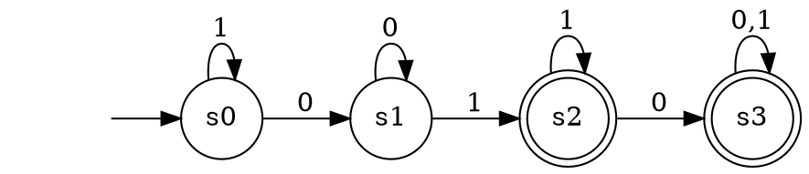

证明这两个DFA等价：

1. 首先构造等价关系  
   定义状态等价关系$\equiv$：
   - $p\equiv q$表示$p$和$q$不可区分
   - 初始时，将所有状态分为接受状态和非接受状态两组

2. 不断细化等价类
   - 检查每对状态，看它们在相同输入下是否转移到等价状态
   - 如果不是，则这两个状态可区分

3. 最终得到：
   - $M_1$：$q_2$是一类，$q_0,q_1$各自一类
   - $M_2$：$s_2,s_3$是一类，$s_0,s_1$各自一类

4. 比较对应关系：
   - $q_0\equiv s_0$（初始状态）
   - $q_1\equiv s_1$（等待1的状态）
   - $q_2\equiv s_2\equiv s_3$（接受状态）

因此这两个DFA是等价的。

判断FA等价性的重要性：

1. 优化自动机
   - 找到更简单的等价自动机
   - 减少状态数
   - 提高效率

2. 验证正确性
   - 检查实现是否符合规范
   - 比较不同设计方案

3. 自动机最小化
   - 等价性是最小化的基础
   - 合并等价状态

一些相关的重要概念：

1. 不可区分性  
   如果对于所有输入串$w$，$\hat{\delta}_1(p,w)\in F_1\Leftrightarrow\hat{\delta}_2(q,w)\in F_2$，则状态$p$和$q$不可区分

2. Myhill-Nerode关系
   - 定义在$\Sigma^*$上的等价关系
   - 两个串$x$和$y$等价，当且仅当对于所有$z$，$xz\in L\Leftrightarrow yz\in L$
   - 可用于构造最小DFA

3. 状态的可达性
   - 从初始状态可以到达的状态集合
   - 对等价性判断很重要
   - 不可达状态可以删除

实际应用中的一些技巧：

1. 先化简再比较
   - 先删除不可达状态
   - 再合并等价状态
   - 最后比较最小化DFA

2. 增量式判断
   - 从短的输入串开始检查
   - 如果找到区分串就可以停止
   - 提高效率

3. 使用等价类
   - 维护状态的等价类
   - 逐步细化
   - 减少比较次数

***

让我来详细讲解NFA到DFA的转换过程，也就是子集构造法（Subset Construction）。

基本思路是：将NFA的状态集合的幂集作为DFA的状态集，每个DFA状态对应NFA的一个状态子集。

设NFA $M_N=(Q_N,\Sigma,\delta_N,S,F_N)$，转换得到的DFA $M_D=(Q_D,\Sigma,\delta_D,q_0,F_D)$：

1. DFA的状态集$Q_D$
   - $Q_D\subseteq 2^{Q_N}$
   - 即$Q_D$中的每个元素都是$Q_N$的一个子集
   - 注意不一定所有可能的子集都会出现在$Q_D$中

2. DFA的初始状态$q_0$
   - $q_0=\epsilon\text{-closure}(S)$
   - 即从NFA的初始状态集合出发，经过任意多个$\epsilon$转移能到达的所有状态的集合

3. DFA的转移函数$\delta_D$
   - 对于$R\subseteq Q_N$和$a\in\Sigma$：
   - $\delta_D(R,a)=\hat{\delta_N}(R,a)=\epsilon\text{-closure}(\bigcup_{q\in\hat{\delta_N}(R,\epsilon)}\delta_N(q,a))$
   - 这个式子可以这样理解：
     1. 先计算$\hat{\delta_N}(R,\epsilon)$
        - 从状态集$R$出发
        - 经过任意多个$\epsilon$转移能到达的所有状态集合
     2. 对这个状态集合中的每个状态$q$
        - 计算$\delta_N(q,a)$
        - 也就是读入符号$a$后能到达的状态集合
     3. 对所有这些状态集合取并集  
        $\bigcup_{q\in\hat{\delta_N}(R,\epsilon)}\delta_N(q,a)$
     4. 最后再计算$\epsilon\text{-closure}$
        - 因为转移后还可能有$\epsilon$转移

4. DFA的接受状态集合$F_D$
   - $F_D=\{R\in Q_D|R\cap F_N\neq\emptyset\}$
   - 即所有包含NFA接受状态的DFA状态

子集构造算法的具体步骤如下：

输入：NFA $M_N=(Q_N,\Sigma,\delta_N,S,F_N)$  
输出：DFA $M_D=(Q_D,\Sigma,\delta_D,q_0,F_D)$

算法步骤：

1. 初始化
   - 令$q_0=\epsilon\text{-closure}(S)$为DFA的初始状态
   - 令$Q_D=\{q_0\}$为DFA的状态集
   - 建立一个待处理状态表$\text{Unprocessed}=\{q_0\}$
   - 建立一个空的转移函数表$\delta_D$

2. 主循环  
   当$\text{Unprocessed}$非空时，执行：
   1. 从$\text{Unprocessed}$中取出一个状态$T$
   2. 对每个输入符号$a\in\Sigma$：
      - 计算$U=\epsilon\text{-closure}(\bigcup_{q\in T}\delta_N(q,a))$

        >这两个表达式确实是等价的：
        >- $\epsilon\text{-closure}(\bigcup_{q\in T}\delta_N(q,a))$
        >- $\epsilon\text{-closure}(\bigcup_{q\in\hat{\delta_N}(T,\epsilon)}\delta_N(q,a))$
        >
        >因为任何进入$Q_D$和$\text{Unprocessed}$的状态集合都已经是$\epsilon$闭包了，所以对于任何$T\in Q_D$，都有$T=\hat{\delta_N}(T,\epsilon)$
      - 将转移$\delta_D(T,a)=U$加入转移函数表
      - 如果$U\notin Q_D$：
        - 将$U$加入$Q_D$
        - 将$U$加入$\text{Unprocessed}$

3. 确定接受状态  
   $F_D=\{T\in Q_D|T\cap F_N\neq\emptyset\}$

让我用一个具体例子来说明。考虑下面这个识别所有包含子串`ab`的NFA：


转换过程：

1. 初始状态：$q_0=\{q_0\}$
   - $Q_D=\{\{q_0\}\}$
   - $\text{Unprocessed}=\{\{q_0\}\}$

2. 从$\text{Unprocessed}$取出状态$\{q_0\}$：

   $$
   \begin{array}{c|c|c|c}
   \text{状态编号} & \text{状态集合} & a & b \\\hline
   1 & \{q_0\} & \mathbf{\{q_0,q_1\}}^2 & \{q_0\}^1
   \end{array}
   $$
   
3. 从$\text{Unprocessed}$取出状态$\{q_0,q_1\}$：
   
   $$
   \begin{array}{c|c|c|c}
   \text{状态编号} & \text{状态集合} & a & b \\\hline
   1 & \{q_0\} & \mathbf{\{q_0,q_1\}}^2 & \{q_0\}^1 \\\hline
   2 & \{q_0,q_1\} & \{q_0,q_1\}^2 & \mathbf{\{q_0,q_2\}}^3
   \end{array}
   $$
   
4. 从$\text{Unprocessed}$取出状态$\{q_0,q_2\}$：
   
   $$
   \begin{array}{c|c|c|c}
   \text{状态编号} & \text{状态集合} & a & b \\\hline
   1 & \{q_0\} & \mathbf{\{q_0,q_1\}}^2 & \{q_0\}^1 \\\hline
   2 & \{q_0,q_1\} & \{q_0,q_1\}^2 & \mathbf{\{q_0,q_2\}}^3 \\\hline
   3 & \{q_0,q_2\} & \{q_0,q_1\}^2 & \{q_0\}^1
   \end{array}
   $$

5. $\text{Unprocessed}$为空，算法终止

6. 确定接受状态
   - $F_D=\{\{q_0,q_2\}\}$，即状态3是接受状态

其中：
- 上标数字表示对应的状态编号
- 加粗的状态集合表示新产生的状态。这个加粗标记会在后续的所有表格中保持

最终得到的DFA为：

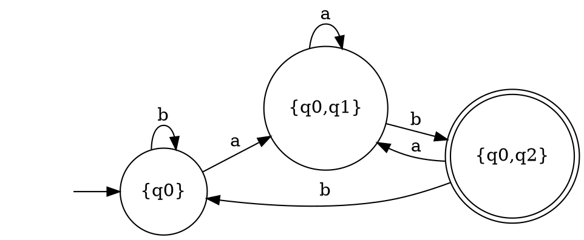

子集构造算法的复杂度分析：
1. 空间复杂度
   - 最坏情况下，$|Q_D|=2^{|Q_N|}$
   - 每个状态需要$O(|Q_N|)$的空间来存储
   - 总空间复杂度：$O(|Q_N|\cdot 2^{|Q_N|})$

2. 时间复杂度
   - 每个DFA状态需要处理$|\Sigma|$个输入符号
   - 每次转移计算需要$O(|Q_N|)$时间
   - 总时间复杂度：$O(|Q_N|\cdot|\Sigma|\cdot 2^{|Q_N|})$

实现时的一些重要考虑：

1. 状态数量
   - DFA的状态数可能达到$2^n$（n是NFA的状态数）
   - 这是指数级增长
   - 但实际中通常不会达到这个上限

2. 构造过程的优化
   - 只生成可达状态
   - 可以边构造边简化
   - 可以使用按需构造的方法

3. 实现考虑
   - 需要高效的集合操作
   - 状态集合的表示方法很重要
   - 可以使用位向量优化

4. 时间复杂度
   - 最坏情况：$O(2^n)$
   - 实际应用中通常表现良好

这个转换过程在编译原理中特别重要，因为：
- 正则表达式通常先转换为NFA
- NFA再转换为DFA
- DFA用于实际的词法分析

***

**子集法**：

1. 空移环路的寻找和消除
2. 消除余下的空移
3. 利用子集法确定化

让我详细讲解一下空移环路（$\epsilon$-loop）的寻找和消除。

首先解释什么是空移环路：
- 一个状态序列$q_1,q_2,\dots,q_n$，其中$q_1=q_n$
- 序列中相邻状态之间都通过$\epsilon$转移连接
- 形式化表示为：$q_1\xrightarrow{\epsilon}q_2\xrightarrow{\epsilon}\dots\xrightarrow{\epsilon}q_n=q_1$

寻找和消除空移环路的步骤：

1. 环路的寻找
   - 可以使用深度优先搜索（DFS）
   - 只考虑$\epsilon$转移
   - 记录访问过的状态
   - 当遇到已访问状态时就找到了环路

2. 环路的消除
   - 将环路上的所有状态合并为一个状态
   - 新状态继承环路上所有状态的：
     - 入边（指向环路上任意状态的转移）
     - 出边（从环路上任意状态出发的转移）
     - 如果环路上有初始（或接受）状态，新状态也是初始（或接受）状态

让我用一个例子来说明：

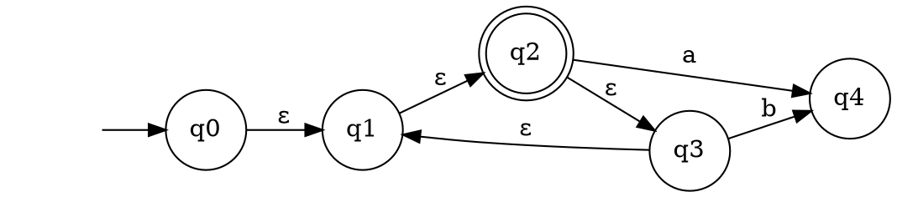

在这个例子中：
1. 存在空移环路：$q_1\xrightarrow{\epsilon}q_2\xrightarrow{\epsilon}q_3\xrightarrow{\epsilon}q_1$
2. 将$q_1,q_2,q_3$合并为新状态$q_{123}$
3. 合并后的NFA如下：

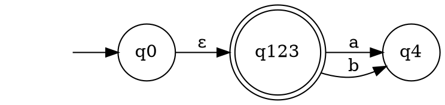

消除空移环路的重要性：
1. 避免无限循环
   - 原NFA可能在环路上无限转移
   - 合并后简化了状态转移

2. 简化后续处理
   - 便于消除剩余的$\epsilon$转移
   - 减少状态数量

3. 保持等价性
   - 合并前后NFA接受的语言相同
   - 因为$\epsilon$转移不改变输入串

需要注意的细节：
1. 可能存在多个空移环路
   - 需要逐个找出并处理
   - 处理顺序不影响最终结果

2. 环路可能相交
   - 相交的环路要一起处理
   - 将所有相关状态合并

3. 状态属性的继承
   - 只要环路中有一个初始（或接受）状态
   - 合并后的状态就是初始（或接受）状态

4. 转移的合并
   - 相同标记的转移合并
   - 保留所有不同的转移

这是NFA确定化过程的第一步，目的是简化自动机的结构，为后续的处理做准备。

***

在消除了空移环路后，我们需要消除剩余的$\epsilon$转移。这个过程的核心思想是：通过修改转移函数，使得原本需要经过$\epsilon$转移才能达到的行为可以直接通过一步转移完成。

具体步骤：

1. 消除空移  
   对于每个空移$p\xrightarrow{\epsilon}q$：
   - 将$q$的所有出边复制给$p$
     - 即对于$q$的每个出转移$q\xrightarrow{a}r$
     - 在$p$处添加相同的转移$p\xrightarrow{a}r$
   - 如果$q$是接受状态，则将$p$也标记为接受状态
   - 最后删除这个空移

2. 形式化定义  
   为了表述方便，先引入$\epsilon$-闭包的概念：  
   $\epsilon\text{-closure}(q)=\{p|\text{从}q\text{经过若干（包括0个）}\epsilon\text{转移可达}p\}$

   则新的转移函数定义为：  
   $\delta'(q,a)=\bigcup_{p\in\epsilon\text{-closure}(q)}\delta(p,a)$

   新的接受状态集合$F'$：  
   $F'=\{q|\epsilon\text{-closure}(q)\cap F\neq\emptyset\}$

让我用一个例子来说明：

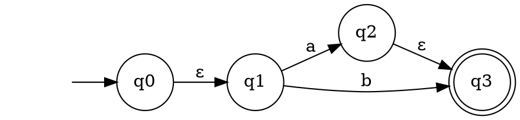

消除过程：

1. 先处理$q_0\xrightarrow{\epsilon}q_1$
   - $q_1$有两个出转移：$q_1\xrightarrow{a}q_2$和$q_1\xrightarrow{b}q_3$
   - 在$q_0$处添加相应转移：$q_0\xrightarrow{a}q_2$和$q_0\xrightarrow{b}q_3$
   - 删除空移$q_0\xrightarrow{\epsilon}q_1$

2. 再处理$q_2\xrightarrow{\epsilon}q_3$
   - $q_3$没有出转移
   - 但$q_3$是接受状态，所以将$q_2$标记为接受状态
   - 删除空移$q_2\xrightarrow{\epsilon}q_3$

消除$\epsilon$转移后的NFA：

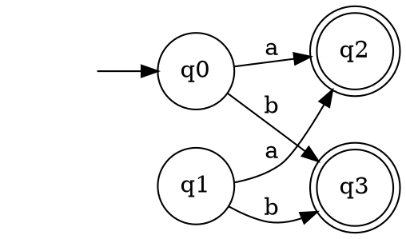

这个过程的几个关键点：
1. 空移的处理顺序不影响最终结果
2. 处理完一个空移后立即删除它
3. 注意接受状态的传递

这样我们就得到了一个没有$\epsilon$转移的等价NFA，为后续的子集法确定化做好了准备。

***

我来讲解这种"暴力"的子集法确定化过程。这种方法虽然不如标准子集构造法优雅，但思路更直观。

核心思想是：
1. DFA的状态集直接取NFA状态集的幂集（不含空集）
2. 在此基础上定义转移函数和接受状态集

形式化定义如下：
对于没有$\epsilon$转移的NFA $A=(Q,\Sigma,\delta,q_0,F)$，构造DFA $A'=(Q',\Sigma,\delta',q_0',F')$：

1. 状态集$Q'$
   - $Q'=2^Q\setminus\{\emptyset\}$
   - 即$Q$的所有非空子集构成的集合

2. 初始状态$q_0'$
   - $q_0'=\{q_0\}$
   - 就是只包含NFA初始状态的单元素集合

3. 接受状态集$F'$
   - $F'=\{S\in Q'|S\cap F\neq\emptyset\}$
   - 即所有包含NFA接受状态的子集

4. 转移函数$\delta'$
   - 对于任意$S\in Q'$和$a\in\Sigma$：
   - $\delta'(S,a)=\bigcup_{q\in S}\delta(q,a)$
   - 如果结果为$\emptyset$则该转移不存在

让我用一个例子来说明：

原NFA：
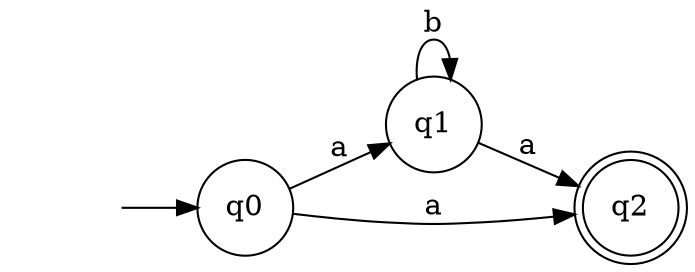

构造过程：

1. 确定$Q'$  
   所有可能的非空子集：
   - $S_1=\{q_0\}$
   - $S_2=\{q_1\}$
   - $S_3=\{q_2\}$
   - $S_4=\{q_0,q_1\}$
   - $S_5=\{q_0,q_2\}$
   - $S_6=\{q_1,q_2\}$
   - $S_7=\{q_0,q_1,q_2\}$

2. $q_0'=\{q_0\}$

3. $F'$包含所有含有$q_2$的子集：
   - $\{q_2\}$
   - $\{q_0,q_2\}$
   - $\{q_1,q_2\}$
   - $\{q_0,q_1,q_2\}$

4. 计算$\delta'$  
   计算每个状态在每个输入符号下的转移：

   对于输入符号a：
   - $\delta'(S_1,a)=\delta'(\{q_0\},a)=\{q_1,q_2\}=S_6$
   - $\delta'(S_2,a)=\delta'(\{q_1\},a)=\{q_2\}=S_3$
   - $\delta'(S_3,a)=\delta'(\{q_2\},a)=\emptyset$（无转移）
   - $\delta'(S_4,a)=\delta'(\{q_0,q_1\},a)=\{q_1,q_2\}=S_6$
   - $\delta'(S_5,a)=\delta'(\{q_0,q_2\},a)=\{q_1,q_2\}=S_6$
   - $\delta'(S_6,a)=\delta'(\{q_1,q_2\},a)=\{q_2\}=S_3$
   - $\delta'(S_7,a)=\delta'(\{q_0,q_1,q_2\},a)=\{q_1,q_2\}=S_6$
   
   对于输入符号b：
   - $\delta'(S_1,b)=\delta'(\{q_0\},b)=\emptyset$（无转移）
   - $\delta'(S_2,b)=\delta'(\{q_1\},b)=\{q_1\}=S_2$
   - $\delta'(S_3,b)=\delta'(\{q_2\},b)=\emptyset$（无转移）
   - $\delta'(S_4,b)=\delta'(\{q_0,q_1\},b)=\{q_1\}=S_2$
   - $\delta'(S_5,b)=\delta'(\{q_0,q_2\},b)=\emptyset$（无转移）
   - $\delta'(S_6,b)=\delta'(\{q_1,q_2\},b)=\{q_1\}=S_2$
   - $\delta'(S_7,b)=\delta'(\{q_0,q_1,q_2\},b)=\{q_1\}=S_2$

现在画出完整的DFA（包括不可达状态）：

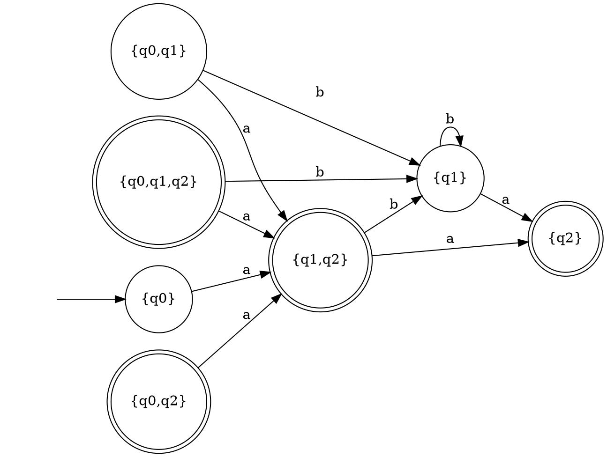

这个DFA中：
1. 初始状态是$S_1=\{q_0\}$
2. 接受状态是所有包含$q_2$的状态集合：$S_3,S_5,S_6,S_7$
3. 有些状态是不可达的，比如$S_4,S_5,S_7$
4. 有些状态是等价的，可以合并

这种方法的特点：
1. 直接性
   - 一次性生成所有可能的状态
   - 不需要迭代构造

2. 完整性
   - 包含了所有可能的状态组合
   - 有些状态可能是不可达的

3. 效率
   - 状态数可能达到$2^n-1$（$n$是NFA的状态数）
   - 比标准子集构造法产生更多冗余状态

实际应用时，我们通常会：
1. 移除不可达状态
2. 进行最小化处理
3. 优先使用标准子集构造法

这就是完整的子集法确定化结果。如果要得到更实用的DFA，我们需要：
1. 删除所有不可达状态
2. 合并等价状态

但这就是DFA最小化的内容了。

***

状态等价关系是DFA最小化的理论基础。两个状态等价意味着从这两个状态出发，对于任何输入串都会得到相同的接受/拒绝结果。

形式化定义如下：

对于DFA $M=(Q,\Sigma,\delta,q_0,F)$中的两个状态$p,q\in Q$，如果对于任意输入串$w\in\Sigma^*$都有：

$\hat{\delta}(p,w)\in F\Leftrightarrow\hat{\delta}(q,w)\in F$

则称状态$p$和$q$是等价的，记作$p\equiv q$。

这个等价关系具有以下性质：

1. 自反性：$p\equiv p$

2. 对称性：若$p\equiv q$，则$q\equiv p$

3. 传递性：若$p\equiv q$且$q\equiv r$，则$p\equiv r$

为了判断两个状态是否等价，可以使用区分串（distinguishing string）的概念：

1. 如果存在一个串$w$，使得：
   - $\hat{\delta}(p,w)\in F$且$\hat{\delta}(q,w)\notin F$
   - 或者$\hat{\delta}(p,w)\notin F$且$\hat{\delta}(q,w)\in F$
   则称$w$是状态$p$和$q$的一个区分串

2. 如果不存在这样的区分串，那么$p$和$q$就是等价的

基于等价关系的定义，我们可以得到一个重要定理：

如果$p\equiv q$，则对于任意输入符号$a\in\Sigma$，都有$\delta(p,a)\equiv\delta(q,a)$

这意味着：
1. 等价状态的后继状态也是等价的
2. 可以通过逐步比较来判断状态是否等价

这就引出了求解状态等价关系的算法思路：

1. 初始分组
   - 将所有状态分成两组：接受状态和非接受状态
   - 这是最粗的可能分组

2. 逐步细化
   - 检查每个分组中的状态
   - 如果它们在某个输入下转移到不同的分组
   - 就需要进一步分割该分组

举个例子，考虑下面这个DFA：

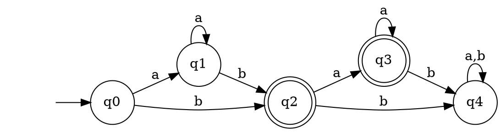

分析过程：

1. 初始分组：
   - $\pi_0=\{\{q_0,q_1,q_4\},\{q_2,q_3\}\}$
   - 非接受状态：$\{q_0,q_1,q_4\}$
   - 接受状态：$\{q_2,q_3\}\}$

2. 第一次细化：  
   考虑$\{q_0,q_1,q_4\}$在输入$a$下：
   - $\delta(q_0,a)=q_1\in\{q_0,q_1,q_4\}$
   - $\delta(q_1,a)=q_1\in\{q_0,q_1,q_4\}$
   - $\delta(q_4,a)=q_4\in\{q_0,q_1,q_4\}$

   考虑输入$b$：
   - $\delta(q_0,b)=q_2\in\{q_2,q_3\}$
   - $\delta(q_1,b)=q_2\in\{q_2,q_3\}$
   - $\delta(q_4,b)=q_4\in\{q_0,q_1,q_4\}$

   因此需要分割：$\{q_0,q_1\},\{q_4\}$

   考虑$\{q_2,q_3\}$：
   - 在$a$和$b$下都转移到相同的分组
   
3. 得到新的分组：  
   $\pi_1=\{\{q_0,q_1\},\{q_4\},\{q_2,q_3\}\}$

4. 继续细化，直到不能再分割

最终得到：  
$\pi_{\text{final}}=\{\{q_0,q_1\},\{q_4\},\{q_2,q_3\}\}$

>首先根据接受状态和非接受状态进行初始划分：
>$\pi_0=\{\{q_0,q_1,q_4\},\{q_2,q_3\}\}$
>- 非接受状态：$\{q_0,q_1,q_4\}$
>- 接受状态：$\{q_2,q_3\}$
>
>建立初始状态转移表：
>
>$$
>\begin{array}{c|c|c|c}
>\text{状态} & \text{分组} & a & b \\\hline
>q_0 & 1 & q_1^{(1)} & q_2^{(2)} \\
>q_1 & 1 & q_1^{(1)} & q_2^{(2)} \\
>q_4 & 1 & q_4^{(1)} & q_4^{(1)} \\
>q_2 & 2 & q_3^{(2)} & q_4^{(1)} \\
>q_3 & 2 & q_3^{(2)} & q_4^{(1)}
>\end{array}
>$$
>
>其中上标数字表示**当前分组编号**。
>
>现在看第一组$\{q_0,q_1,q_4\}$内的状态：
>- $q_0$和$q_1$在输入$a$下都转到分组1，在输入$b$下都转到分组2
>- $q_4$则在所有输入下都转到分组1
>- 因此这组需要分割成$\{q_0,q_1\}$和$\{q_4\}$
>
>再看第二组$\{q_2,q_3\}$内的状态：
>- 它们在输入$a$下都转到分组2
>- 在输入$b$下都转到分组1
>- 因此这组不需要分割
>
>得到新的划分$\pi_1=\{\{q_0,q_1\},\{q_4\},\{q_2,q_3\}\}$和对应的状态转移表：
>
>$$
>\begin{array}{c|c|c|c}
>\text{状态} & \text{分组} & a & b \\\hline
>q_0 & 1.1 & q_1^{(1.1)} & q_2^{(2)} \\
>q_1 & 1.1 & q_1^{(1.1)} & q_2^{(2)} \\
>q_4 & 1.2 & q_4^{(1.2)} & q_4^{(1.2)} \\
>q_2 & 2 & q_3^{(2)} & q_4^{(1.2)} \\
>q_3 & 2 & q_3^{(2)} & q_4^{(1.2)}
>\end{array}
>$$
>
>检查新的划分：
>- $\{q_0,q_1\}$中的状态在各输入下转移到相同分组
>- $\{q_4\}$只有一个状态
>- $\{q_2,q_3\}$中的状态在各输入下转移到相同分组
>
>因此不需要进一步分割，$\pi_1$就是最终划分。

这说明：
- $q_0\equiv q_1$
- $q_2\equiv q_3$
- $q_4$与其他状态都不等价

状态等价关系的一些重要应用：

1. DFA最小化
   - 合并等价状态
   - 得到状态数最少的等价DFA

2. 自动机等价性判定
   - 两个DFA是否接受相同的语言
   - 可以通过构造它们的并机并检查状态等价性

3. 正则表达式简化
   - 通过最小化对应的DFA
   - 再转换回正则表达式

理解状态等价关系对于：
- 自动机理论的学习
- 编译器优化
- 系统简化

都很重要。

***

Hopcroft算法是一个计算DFA状态等价关系的经典算法，比之前提到的简单细化方法更高效。设DFA的形式化定义为$(Q,\Sigma,\delta,q_0,F)$，算法的形式化描述如下：

1. $\pi \leftarrow \{F, Q\setminus F\}$
2. $W \leftarrow \{F, Q\setminus F\}$
3. **while** $W \neq \emptyset$
4. $\quad A \leftarrow W.\text{pop}()$
5. $\quad$ **for each** $a \in \Sigma$
6. $\quad\quad X \leftarrow \{q \in Q \mid \delta(q,a) \in A\}$
7. $\quad\quad$ **for each** $Y \in \pi$
8. $\quad\quad\quad Y_1 \leftarrow Y \cap X$
9. $\quad\quad\quad Y_2 \leftarrow Y \setminus X$
10. $\quad\quad\quad$ **if** $Y_1 \neq \emptyset$ and $Y_2 \neq \emptyset$
11. $\quad\quad\quad\quad \pi \leftarrow (\pi \setminus \{Y\}) \cup \{Y_1, Y_2\}$
12. $\quad\quad\quad\quad$ **if** $Y \in W$
13. $\quad\quad\quad\quad\quad W \leftarrow (W \setminus \{Y\}) \cup \{Y_1, Y_2\}$
14. $\quad\quad\quad\quad$ **else**
15. $\quad\quad\quad\quad\quad W \leftarrow W \cup \{\min(Y_1,Y_2)\}$
16. **return** $\pi$

首先看算法的输入：
- $Q$：DFA的所有状态集合
- $\Sigma$：输入字母表
- $\delta$：转移函数
- $F$：接受状态集合

算法的核心思想是维护两个重要的数据结构：
1. $\pi$：当前的状态划分（partition）
2. $W$：待处理的划分块（waiting set）

让我逐步解释算法的执行过程：

1. 初始化
   $$
   \begin{aligned}
   \pi &\leftarrow \{F, Q\setminus F\} \\
   W &\leftarrow \{F, Q\setminus F\}
   \end{aligned}
   $$
   - 最初将状态集合分为接受状态和非接受状态
   - 这两个集合都需要被处理

2. 主循环
   $$
   \begin{aligned}
   &\text{while }W \neq \emptyset:\\
   &\quad A \leftarrow W.\text{pop}()
   \end{aligned}
   $$
   - 每次从待处理集合中取出一个划分块
   - 用这个划分块来尝试分割其他所有划分

3. 对于每个输入符号
   $$
   \begin{aligned}
   &\text{for each }a \in \Sigma:\\
   &\quad X \leftarrow \{q \in Q \mid \delta(q,a) \in A\}
   \end{aligned}
   $$
   - $X$是"逆像"集合
   - 包含所有在输入$a$下能转移到$A$中的状态

4. 分割现有的划分块
   $$
   \begin{aligned}
   &\text{for each }Y \in \pi:\\
   &\quad Y_1 \leftarrow Y \cap X\\
   &\quad Y_2 \leftarrow Y \setminus X
   \end{aligned}
   $$
   - 检查每个现有的划分块$Y$
   - $Y_1$：$Y$中在输入$a$下能到达$A$的状态
   - $Y_2$：$Y$中在输入$a$下不能到达$A$的状态

5. 更新划分和待处理集合
   $$
   \begin{aligned}
   &\text{if }Y_1 \neq \emptyset \text{ and }Y_2 \neq \emptyset:\\
   &\quad \pi \leftarrow (\pi \setminus \{Y\}) \cup \{Y_1, Y_2\}\\
   &\quad \text{if }Y \in W:\\
   &\quad\quad W \leftarrow (W \setminus \{Y\}) \cup \{Y_1, Y_2\}\\
   &\quad \text{else:}\\
   &\quad\quad W \leftarrow W \cup \{\min(Y_1,Y_2)\}
   \end{aligned}
   $$
   这是算法最精妙的部分：
   - 只有当划分真正发生（产生两个非空子集）时才更新
   - 如果被分割的集合$Y$在待处理集合中，则用其子集替换它
   - 否则只添加较小的子集（这是一个重要的优化）

让我用一个具体的例子来说明：

考虑下面这个DFA：
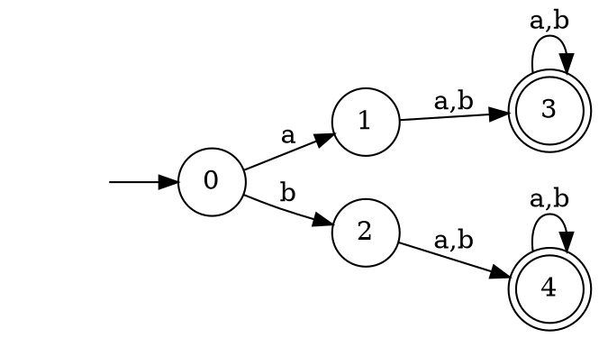

算法执行过程：

1. 初始化：
   $$
   \begin{aligned}
   \pi &= \{\{0,1,2\},\{3,4\}\} \\
   W &= \{\{0,1,2\},\{3,4\}\}
   \end{aligned}
   $$

2. 取出$A=\{3,4\}$，考虑输入$a$：
   $$
   \begin{aligned}
   X &= \{q\in Q|\delta(q,a)\in\{3,4\}\} \\
   &= \{1,2,3,4\}
   \end{aligned}
   $$
   
   对$Y=\{0,1,2\}$进行分割：
   $$
   \begin{aligned}
   Y_1 &= \{0,1,2\}\cap\{1,2,3,4\} = \{1,2\} \\
   Y_2 &= \{0,1,2\}\setminus\{1,2,3,4\} = \{0\}
   \end{aligned}
   $$
   
   由于$Y_1,Y_2$都非空，更新：
   $$
   \begin{aligned}
   \pi &= \{\{0\},\{1,2\},\{3,4\}\} \\
   W &= \{\{0\},\{1,2\}\}
   \end{aligned}
   $$

3. 考虑输入$b$：
   $$
   \begin{aligned}
   X &= \{q\in Q|\delta(q,b)\in\{3,4\}\} \\
   &= \{1,2,3,4\}
   \end{aligned}
   $$
   
   对当前$\pi$中的每个集合检查：所有$Y\in\pi$与$X$的交集或差集至少有一个为空，无需分割。

4. 取出$A=\{0\}$：
   对于输入$a,b$：
   $$
   X = \emptyset
   $$
   无需分割。

5. 取出$A=\{1,2\}$：
   对于输入$a,b$：
   $$
   X = \{0\}
   $$
   对当前$\pi$中的每个集合检查：所有$Y\in\pi$与$X$的交集或差集至少有一个为空，无需分割。

6. $W$为空，算法终止。

最终结果：
$$
\pi = \{\{0\},\{1,2\},\{3,4\}\}
$$

这个划分结果表明：
1. 状态0单独构成一个等价类
2. 状态1和2等价（虽然转移目标不同，但转移到等价的状态3和4）
3. 状态3和4等价（都是接受状态且都有相同的自循环）

算法的复杂度分析：
1. 时间复杂度：$O(|Q|\log|Q|)$
   - 这比简单的细化算法更高效
   - 主要优化来自于只添加较小子集的策略

2. 空间复杂度：$O(|Q|)$
   - 需要存储划分和待处理集合
   - 以及一些临时集合

Hopcroft算法的优点：
1. 效率高
   - 是已知最快的DFA最小化算法
   - 特别适合处理大规模自动机

2. 实现灵活
   - 可以使用不同的数据结构
   - 可以添加各种优化策略

3. 理论完备
   - 保证得到最小化DFA
   - 结果唯一（不依赖于处理顺序）

这个算法在编译器优化、正则表达式处理等领域有广泛应用。

***

让我来详细讲解无关状态的两种类型及其消除方法。

无关状态可以分为两类：
1. 不可到达状态（Unreachable States）
2. 不可终止状态（Dead States）

**一、不可到达状态**

定义：从初始状态出发，通过任何输入串都无法到达的状态。

形式化定义：状态$q$是不可到达的，如果：
$\forall w\in\Sigma^*,\hat{\delta}(q_0,w)\neq q$

查找方法：从初始状态开始进行深度优先或广度优先搜索。

算法步骤：
1. 初始化可达状态集合$R=\{q_0\}$
2. 维护一个待处理状态队列$Q=\{q_0\}$
3. 当$Q$非空时：
   1. 取出一个状态$q$
   2. 对每个输入符号$a\in\Sigma$：
      - 计算$p=\delta(q,a)$
      - 如果$p\notin R$：
        - 将$p$加入$R$
        - 将$p$加入$Q$
4. $R$就是所有可达状态的集合

示例：
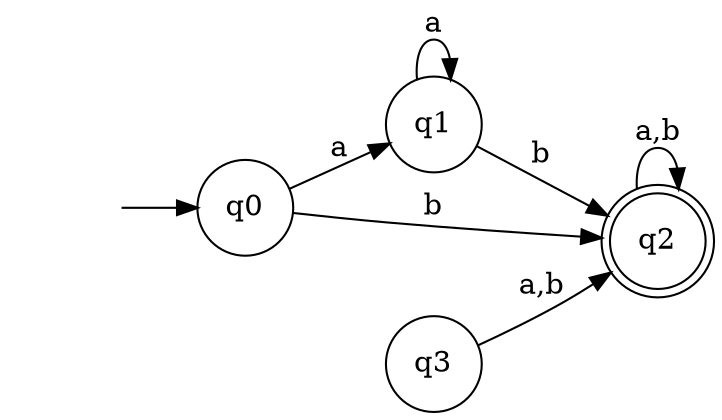

在这个例子中：
- $q_3$是不可到达状态
- 因为从$q_0$出发无法通过任何输入串到达$q_3$

**二、不可终止状态**

定义：从该状态出发，通过任何输入串都无法到达接受状态的状态。

形式化定义：状态$q$是不可终止的，如果：
$\forall w\in\Sigma^*,\hat{\delta}(q,w)\notin F$

查找方法：从接受状态反向搜索。

算法步骤：
1. 初始化可终止状态集合$T=F$（所有接受状态）
2. 重复直到$T$不再变化：
   - 对每个状态$q\in Q$和每个输入符号$a\in\Sigma$
   - 如果$\delta(q,a)\in T$且$q\notin T$
   - 则将$q$加入$T$
3. $Q-T$就是所有不可终止状态的集合

示例：
```dot
digraph DFA {
    rankdir=LR;
    node [shape=circle];
    
    start [shape=none, label=""];
    start -> q0;
    
    q0 [label="q0"];
    q1 [label="q1"];
    q2 [label="q2", shape=doublecircle];
    q3 [label="q3"];  // 不可终止状态
    
    q0 -> q1 [label="a"];
    q0 -> q2 [label="b"];
    q1 -> q2 [label="b"];
    q1 -> q1 [label="a"];
    q2 -> q2 [label="a,b"];
    q3 -> q3 [label="a,b"];  // 陷阱状态
}
```

在这个例子中：
- $q_3$是不可终止状态
- 因为一旦进入$q_3$，就永远无法到达接受状态$q_2$

**三、消除过程**

完整的无关状态消除过程：

1. 消除不可到达状态
   - 执行可达性分析算法
   - 移除所有不可到达状态及其相关转移

2. 消除不可终止状态
   - 在剩余的状态中执行可终止性分析
   - 移除所有不可终止状态及其相关转移

举个完整的例子：
```dot
digraph DFA {
    rankdir=LR;
    node [shape=circle];
    
    start [shape=none, label=""];
    start -> q0;
    
    q0 [label="q0"];
    q1 [label="q1"];
    q2 [label="q2", shape=doublecircle];
    q3 [label="q3"];  // 不可到达状态
    q4 [label="q4"];  // 不可终止状态
    
    q0 -> q1 [label="a"];
    q0 -> q2 [label="b"];
    q1 -> q2 [label="b"];
    q1 -> q1 [label="a"];
    q1 -> q4 [label="c"];
    q2 -> q2 [label="a,b"];
    q3 -> q2 [label="a,b"];
    q4 -> q4 [label="a,b,c"];
}
```

消除过程：
1. 首先找到不可到达状态：$q_3$
2. 移除$q_3$及其转移
3. 在剩余状态中找到不可终止状态：$q_4$
4. 移除$q_4$及其转移

最终得到：
```dot
digraph DFA {
    rankdir=LR;
    node [shape=circle];
    
    start [shape=none, label=""];
    start -> q0;
    
    q0 [label="q0"];
    q1 [label="q1"];
    q2 [label="q2", shape=doublecircle];
    
    q0 -> q1 [label="a"];
    q0 -> q2 [label="b"];
    q1 -> q2 [label="b"];
    q1 -> q1 [label="a"];
    q2 -> q2 [label="a,b"];
}
```

消除无关状态的意义：
1. 简化自动机结构
2. 减少状态转移表的大小
3. 提高实现效率
4. 为DFA最小化做准备

注意事项：
1. 消除顺序很重要
   - 先消除不可到达状态
   - 再消除不可终止状态
2. 某些状态可能既不可到达又不可终止
3. 消除过程不会改变自动机接受的语言

实现建议：
1. 使用邻接表或邻接矩阵表示转移关系
2. 使用集合数据结构存储状态集
3. 考虑使用位向量优化状态集操作

***

DFA的最小化是在消除无关状态的基础上，将等价状态合并的过程。让我系统地讲解DFA最小化的完整流程。

DFA最小化的完整步骤：

1. 消除无关状态
   1. 消除不可到达状态
   2. 消除不可终止状态

2. 计算等价关系
   可以使用前面讲过的Hopcroft算法，也可以使用更简单的分割法

3. 构造最小DFA
   基于等价类构造新的自动机

让我通过一个完整的例子来说明整个过程。考虑下面这个DFA：

```dot
digraph DFA {
    rankdir=LR;
    node [shape=circle];
    
    start [shape=none, label=""];
    start -> q0;
    
    q0 [label="0"];
    q1 [label="1"];
    q2 [label="2"];
    q3 [label="3", shape=doublecircle];
    q4 [label="4", shape=doublecircle];
    q5 [label="5"];  // 不可到达状态
    q6 [label="6"];  // 不可终止状态
    
    q0 -> q1 [label="a"];
    q0 -> q2 [label="b"];
    q0 -> q6 [label="a"];
    q1 -> q3 [label="a,b"];
    q2 -> q4 [label="a,b"];
    q3 -> q3 [label="a,b"];
    q4 -> q4 [label="a,b"];
    q5 -> q3 [label="a,b"];
    q6 -> q6 [label="a,b"];
}
```

**第一步：消除无关状态**

1. 找到不可到达状态：$q_5$
   - 从$q_0$开始BFS/DFS
   - 发现$q_5$无法到达

2. 找到不可终止状态：$q_6$
   - 从接受状态$\{q_3,q_4\}$反向搜索
   - 发现$q_6$无法到达任何接受状态

删除$q_5,q_6$后得到：

```dot
digraph DFA {
    rankdir=LR;
    node [shape=circle];
    
    start [shape=none, label=""];
    start -> q0;
    
    q0 [label="0"];
    q1 [label="1"];
    q2 [label="2"];
    q3 [label="3", shape=doublecircle];
    q4 [label="4", shape=doublecircle];
    
    q0 -> q1 [label="a"];
    q0 -> q2 [label="b"];
    q1 -> q3 [label="a,b"];
    q2 -> q4 [label="a,b"];
    q3 -> q3 [label="a,b"];
    q4 -> q4 [label="a,b"];
}
```

**第二步：计算等价关系**

使用Hopcroft算法：

1. 初始划分：
   $\pi_0=\{\{0,1,2\},\{3,4\}\}$
   分别是非接受状态和接受状态

2. 对$\{3,4\}$和输入$a$：
   - $X=\{1,2,3,4\}$（能转到$\{3,4\}$的状态）
   - 分割$\{0,1,2\}$得到$\{1,2\}$和$\{0\}$
   
   此时：$\pi_1=\{\{0\},\{1,2\},\{3,4\}\}$

3. 对剩余的划分块和输入符号检查，不需要进一步分割

最终的等价类划分：
- $[0]=\{0\}$
- $[1]=\{1,2\}$
- $[3]=\{3,4\}$

>使用分割法：
>
>先根据接受状态和非接受状态进行初始划分$\pi_0=\{\{0,1,2\},\{3,4\}\}$，得到第一张状态转移表：
>
>$$
>\begin{array}{c|c|c|c}
>\text{状态} & \text{分组} & a & b \\\hline
>0 & 1 & 1^{(1)} & 2^{(1)} \\
>1 & 1 & 3^{(2)} & 3^{(2)} \\
>2 & 1 & 4^{(2)} & 4^{(2)} \\
>3 & 2 & 3^{(2)} & 3^{(2)} \\
>4 & 2 & 4^{(2)} & 4^{(2)}
>\end{array}
>$$
>
>观察$G_1$（分组1）内的状态转移情况：
>- 状态0在输入$a$和$b$下都转到分组1
>- 而状态1和2在任何输入下都转到分组2
>- 所以需要将$G_1$分割成$\{0\}$和$\{1,2\}$
>
>得到新的划分$\pi_1$和对应的状态转移表：
>
>$$
>\begin{array}{c|c|c|c}
>\text{状态} & \text{分组} & a & b \\\hline
>0 & 1.1 & 1^{(1.2)} & 2^{(1.2)} \\
>1 & 1.2 & 3^{(2)} & 3^{(2)} \\
>2 & 1.2 & 4^{(2)} & 4^{(2)} \\
>3 & 2 & 3^{(2)} & 3^{(2)} \\
>4 & 2 & 4^{(2)} & 4^{(2)}
>\end{array}
>$$
>
>检查当前所有分组中的状态转移情况：
>- $G_{1.1}$只有一个状态
>- $G_{1.2}$中的状态都转到分组2
>- $G_2$中的状态都有自循环
>
>不需要进一步分割，得到最终的等价类划分：
>- $[0]=\{0\}$
>- $[1]=\{1,2\}$
>- $[3]=\{3,4\}$

**第三步：构造最小DFA**

基于等价类构造新的DFA $M'=(Q',\Sigma,\delta',q_0',F')$：

1. 状态集$Q'$
   - 每个等价类成为一个新状态
   - $Q'=\{[0],[1],[3]\}$

2. 初始状态$q_0'=[0]$
   - 原初始状态$0$所在的等价类

3. 接受状态集$F'$
   - 包含原接受状态的等价类
   - $F'=\{[3]\}$

4. 转移函数$\delta'$
   - 对每个等价类$[q]$和每个输入符号$a$
   - $\delta'([q],a)=[\delta(q,a)]$

得到最小DFA：

```dot
digraph MinDFA {
    rankdir=LR;
    node [shape=circle];
    
    start [shape=none, label=""];
    start -> q0;
    
    q0 [label="[0]"];
    q1 [label="[1]"];
    q2 [label="[3]", shape=doublecircle];
    
    q0 -> q1 [label="a,b"];
    q1 -> q2 [label="a,b"];
    q2 -> q2 [label="a,b"];
}
```

状态转移表：

|状态|a|b|
|---|---|---|
|$[0]$|$[1]$|$[1]$|
|$[1]$|$[3]$|$[3]$|
|$[3]$|$[3]$|$[3]$|

这个最小DFA有如下特点：
1. 状态数最少
2. 在所有识别相同语言的DFA中是唯一的（同构意义下）
3. 每个状态都是有用的（可到达且可终止）
4. 不存在等价状态

最小化的重要性：
1. 降低存储空间需求
2. 提高模式匹配效率
3. 简化自动机的理解和维护
4. 为等价性判定提供基础

最小化DFA在很多实际应用中都很重要：
1. 词法分析器的优化
2. 正则表达式处理
3. 协议验证
4. 模式匹配优化

***

让我们以识别标识符（由字母开头，后跟字母、数字或下划线的字符串）为例，讲解从最小化DFA到程序流程图的转换过程。

首先是识别标识符的最小化DFA：

```dot
digraph DFA {
    rankdir=LR;
    node [shape=circle];
    
    start [shape=none, label=""];
    start -> START;
    
    START [label="START"];
    ID [label="ID", shape=doublecircle];
    DEAD [label="DEAD"];  // 改名为DEAD，表示停止状态
    
    START -> ID [label="letter"];
    START -> DEAD [label="digit,_,other"];  // 这种情况才是真正的错误
    ID -> ID [label="letter,digit,_"];
    ID -> DEAD [label="other"];  // 这种情况是正常终止
    DEAD -> DEAD [label="letter,digit,_,other"];
}
```

转换为程序流程的基本思路：

1. 状态映射
   - 每个状态对应一个程序处理阶段
   - START：初始检查阶段
   - ID：标识符累积阶段
   - DEAD：停止处理阶段（包含错误停止和正常停止）

2. 转移映射
   - 每个转移对应一个条件判断和处理逻辑
   - 字符类型判断（letter、digit、underscore、other）
   - 状态转换决定下一步操作

3. 动作关联
   - 每个状态可能有对应动作
   - START状态：判断首字符
   - ID状态：累积字符
   - DEAD状态：根据到达路径决定处理方式（报错或返回结果）

程序流程图如下：

```dot
digraph FlowChart {
    rankdir=TB;
    node [shape=box];
    
    start [shape=oval, label="开始"];
    read [label="读取一个字符"];
    check_first [shape=diamond, label="是字母?"];
    dead_error [label="词法错误\n退出识别"];  // 错误情况
    accumulate [label="将字符加入\n标识符缓冲区"];
    read_next [label="读取下一个字符"];
    check_next [shape=diamond, label="是字母/数字/_?"];
    dead_normal [label="退回一个字符\n返回标识符"];  // 正常终止
    
    start -> read;
    read -> check_first;
    check_first -> accumulate [label="是"];
    check_first -> dead_error [label="否"];
    accumulate -> read_next;
    read_next -> check_next;
    check_next -> accumulate [label="是"];
    check_next -> dead_normal [label="否"];
}
```

处理流程的主要环节：

1. 初始状态（START）
   - 读取第一个字符
   - 判断是否为字母
   - 若是字母，转向ID状态
   - 若不是字母，转向DEAD状态并报错

2. 识别状态（ID）
   - 累积当前字符
   - 读取下一个字符
   - 判断是否为合法后继字符（字母、数字或下划线）
   - 若是合法字符则继续循环
   - 若不是合法字符，转向DEAD状态并返回结果

3. 停止状态（DEAD）
   - 根据来源状态判断处理方式：
     - 来自START：词法错误，报错并退出
     - 来自ID：正常终止，退回多读字符并返回标识符

***

让我来讲解DFA状态转移图到程序流程图的一般映射规则。

1. 基本映射原则：
   - 每个DFA状态映射为一组程序操作
   - 每个转移映射为一个判断分支
   - 每个接受状态对应一个成功处理流程
   - 每个非接受状态对应一个中间处理流程

2. 程序框架结构：

   ```dot
   digraph Framework {
       rankdir=TB;
       node [shape=box];
       
       start [shape=oval, label="开始"];
       init [label="初始化\n读取首个输入"];
       state_proc [label="状态处理器"];
       read [label="读取下一输入"];
       trans [shape=diamond, label="状态转移判断"];
       accept [label="接受处理"];
       error [label="错误处理"];
       end [shape=oval, label="结束"];
       
       start -> init;
       init -> state_proc;
       state_proc -> read;
       read -> trans;
       trans -> state_proc [label="继续"];
       trans -> accept [label="接受"];
       trans -> error [label="错误"];
       accept -> end;
       error -> end;
   }
   ```
   
3. 具体映射规则：
   
   ```dot
   digraph Mapping {
       rankdir=TB;
       
       subgraph cluster_dfa {
           label="DFA部分";
           node [shape=circle];
           
           q [label="状态q"];
           p1 [label="状态p1"];
           p2 [label="状态p2"];
           
           q -> p1 [label="输入a1"];
           q -> p2 [label="输入a2"];
       }
       
       subgraph cluster_flow {
           label="程序流程部分";
           node [shape=box];
           
           state_q [label="状态q处理"];
           check [shape=diamond, label="输入判断"];
           proc_p1 [label="转向p1处理"];
           proc_p2 [label="转向p2处理"];
           
           state_q -> check;
           check -> proc_p1 [label="a1"];
           check -> proc_p2 [label="a2"];
       }
   }
   ```
   
4. 状态处理器的一般结构：
   
   ```dot
   digraph StateProcessor {
       rankdir=TB;
       node [shape=box];
       
       entry [label="进入状态q"];
       action [label="执行状态动作"];
       read [label="读取输入"];
       check [shape=diamond, label="转移判断"];
       trans1 [label="转移到状态p1"];
       trans2 [label="转移到状态p2"];
       error [label="错误处理"];
       
       entry -> action;
       action -> read;
       read -> check;
       check -> trans1 [label="条件1"];
       check -> trans2 [label="条件2"];
       check -> error [label="其他"];
   }
   ```
   
5. 特殊状态的处理：
   
   1. 初始状态：
      ```dot
      digraph Initial {
          rankdir=TB;
          node [shape=box];
          
          init [label="初始化缓冲区"];
          read [label="读取首个输入"];
          check [shape=diamond, label="初始判断"];
          
          init -> read -> check;
      }
      ```
   
   2. 接受状态：
      ```dot
      digraph Accept {
          rankdir=TB;
          node [shape=box];
          
          accept [label="标记接受"];
          buffer [label="处理缓冲区"];
          return [label="返回结果"];
          
          accept -> buffer -> return;
      }
      ```
   
   3. 错误状态：
      ```dot
      digraph Error {
          rankdir=TB;
          node [shape=box];
          
          error [label="标记错误"];
          recovery [label="错误恢复"];
          report [label="错误报告"];
          
          error -> recovery -> report;
      }
      ```
   
6. 状态转移的实现方式：
   
   ```dot
   digraph TransImpl {
       rankdir=TB;
       node [shape=box];
       
       read [label="读取输入"];
       subgraph cluster_switch {
           label="转移处理";
           switch [shape=diamond, label="输入类型?"];
           case1 [label="处理类型1"];
           case2 [label="处理类型2"];
           default [label="默认处理"];
       }
       next [label="下一状态"];
       
       read -> switch;
       switch -> case1 [label="类型1"];
       switch -> case2 [label="类型2"];
       switch -> default [label="其他"];
       {case1,case2,default} -> next;
   }
   ```
   
7. 输入处理的一般模式：
   
   ```dot
   digraph InputProc {
       rankdir=TB;
       node [shape=box];
       
       read [label="读取字符"];
       classify [label="字符分类"];
       buffer [label="更新缓冲区"];
       check [shape=diamond, label="缓冲区检查"];
       cont [label="继续处理"];
       finish [label="完成处理"];
       
       read -> classify -> buffer -> check;
       check -> cont [label="未满"];
       check -> finish [label="已满"];
   }
   ```

这种映射的优点：
1. 结构化程序设计
2. 清晰的控制流程
3. 易于维护和修改
4. 便于错误处理
5. 支持流式输入

实现时需要注意：
1. 状态管理的效率
2. 输入缓冲区的设计
3. 错误处理和恢复
4. 内存使用优化
5. 代码可读性

***

正则文法（Regular Grammar，RG）和有限自动机（Finite Automaton，FA）是描述正则语言的两种不同形式化工具。我们说它们是等价的，是指对于任意正则文法$G$，存在一个有限自动机$M$，使得$L(G)=L(M)$，反之亦然。

先回顾一下正则文法的定义。一个正则文法$G=(V_N,V_T,P,S)$中的产生式规则$P$具有以下形式：
1. $A\rightarrow a$
2. $A\rightarrow aB$
3. $A\rightarrow\epsilon$（扩充形式允许）

其中$A,B\in V_N$，$a\in V_T$。

下面我们来证明正则文法和FA的等价性：

1. 正则文法→NFA的转换
   对于正则文法$G=(V_N,V_T,P,S)$，构造NFA $M=(Q,\Sigma,\delta,q_0,F)$：
   
   1. 状态集$Q=V_N\cup\{q_f\}$
      - 其中$q_f$是新增的终止状态
   
   2. 输入字母表$\Sigma=V_T$
   
   3. 初始状态$q_0=S$
   
   4. 接受状态集$F=\{q_f\}$
   
   5. 转移函数$\delta$根据产生式规则定义：
      - 对于$A\rightarrow aB$：添加转移$\delta(A,a):=\delta(A,a)\cup\{B\}$
      - 对于$A\rightarrow a$：添加转移$\delta(A,a):=\delta(A,a)\cup\{q_f\}$
      - 对于$A\rightarrow\epsilon$：添加$\epsilon$转移$\delta(A,\epsilon):=\delta(A,\epsilon)\cup\{q_f\}$

      即
      $$\delta(A,a)=\{B|A\rightarrow aB\in P\}\cup\{q_f|A\rightarrow a\in P\}$$
      $$\delta(A,\epsilon)=\{q_f|A\rightarrow\epsilon\in P\}$$

例如，考虑以下正则文法：
$$
\begin{aligned}
S &\rightarrow aA|b \\
A &\rightarrow aA|a
\end{aligned}
$$

转换为NFA：
```dot
digraph NFA {
    rankdir=LR;
    node [shape=circle];
    
    start [shape=none, label=""];
    start -> S;
    
    S [label="S"];
    A [label="A"];
    qf [label="qf", shape=doublecircle];
    
    S -> A [label="a"];
    S -> qf [label="b"];
    A -> A [label="a"];
    A -> qf [label="a"];
}
```

2. NFA→正则文法的转换
   对于NFA $M=(Q,\Sigma,\delta,q_0,F)$，构造正则文法$G=(V_N,V_T,P,S)$：
   
   1. 非终结符集合$V_N=Q$
   
   2. 终结符集合$V_T=\Sigma$
   
   3. 开始符号$S=q_0$
   
   4. 产生式规则$P$：
      1. 对于每个状态$q_i$，计算$\epsilon\text{-closure}(q_i)$
      2. 对于每个转移$\delta(q_i,a)=\{q_j\}$：
         - 对于$\epsilon\text{-closure}(q_i)$中的每个状态$p$
         - 对于$\epsilon\text{-closure}(q_j)$中的每个状态$r$
           - 添加产生式$p\rightarrow ar$
           - 如果$r\in F$，添加产生式$p\rightarrow a$
      3. 如果$q_0\in F$，添加产生式$S\rightarrow\epsilon$

例如，考虑以下NFA：
```dot
digraph NFA {
    rankdir=LR;
    node [shape=circle];
    
    start [shape=none, label=""];
    start -> q0;
    
    q0 [label="q0"];
    q1 [label="q1"];
    q2 [label="q2", shape=doublecircle];
    
    q0 -> q1 [label="ε"];
    q1 -> q1 [label="a"];
    q1 -> q2 [label="b"];
}
```

首先计算$\epsilon$闭包：
1. $\epsilon\text{-closure}(q_0)=\{q_0,q_1\}$
2. $\epsilon\text{-closure}(q_1)=\{q_1\}$
3. $\epsilon\text{-closure}(q_2)=\{q_2\}$

然后根据转移函数构造产生式规则，得到正则文法：
$$
\begin{aligned}
q_0 &\rightarrow aq_1|bq_2|b \\
q_1 &\rightarrow aq_1|bq_2|b
\end{aligned}
$$

>这样就解决了你提出的问题：
>1. 我们不直接转换$\epsilon$转移
>2. 而是通过$\epsilon$闭包来处理它们的作用
>3. 得到的产生式完全符合正则文法的形式
>4. 生成的语言与原NFA完全相同
>
>这也说明为什么在正则文法→NFA的转换中，$\epsilon$转移只出现在到接受状态的转移上：
>1. 正则文法本身就不允许$A\rightarrow B$这样的产生式
>2. $\epsilon$转移在NFA中的作用可以通过重新构造状态转移来实现
>3. 只有表示空串时才真正需要$\epsilon$转移
>
>所以这两个转换过程是完全对偶的：
>- 正则文法→NFA：空产生式转换为到接受状态的$\epsilon$转移
>- NFA→正则文法：通过$\epsilon$闭包消除中间的$\epsilon$转移，只在需要表示空串时使用空产生式

等价性的证明思路：

1. 语言的等价性
   - 如果串$w$被正则文法$G$生成
   - $\iff$存在一个推导序列$S\Rightarrow^*w$
   - $\iff$存在一条从$q_0$到$q_f$的路径，路径上的标记正好是$w$
   - $\iff$串$w$被对应的NFA接受

2. 结构对应关系
   - 文法的产生式对应于FA的转移
   - 文法的推导过程对应于FA的状态转移序列
   - 文法终止于终结符串对应于FA到达接受状态

这种等价性的重要意义在于：
1. 提供了两种等价的形式化工具，可以根据具体问题选择更合适的表示方式
2. 为自动机的设计和实现提供了理论基础
3. 在词法分析、模式匹配等实际应用中，可以灵活地在两种表示之间转换

***

正则表达式（Regular Expression，RE）是一种代数化的方式来表示正则语言。我们先给出其归纳定义：

对字母表$\Sigma$上的正则表达式$r$通过以下规则归纳定义：

1. 基本正则表达式
   - $\emptyset$（空集）
   - $\epsilon$（空串）
   - $a$，其中$a\in\Sigma$（单个字母）

2. 复合正则表达式
   如果$r$和$s$是正则表达式，那么以下也是正则表达式：
   - $(r|s)$（选择运算/或运算）
   - $(rs)$（连接运算）
   - $(r^*)$（克林闭包）

每个正则表达式$r$都定义了一个语言$L(r)$：

1. 基本情况：
   - $L(\emptyset)=\emptyset$
   - $L(\epsilon)=\{\epsilon\}$
   - $L(a)=\{a\}$，其中$a\in\Sigma$

2. 归纳情况：
   - $L(r|s)=L(r)\cup L(s)$
   - $L(rs)=L(r)L(s)=\{xy|x\in L(r)\text{ and }y\in L(s)\}$
   - $L(r^*)=L(r)^*=\{\epsilon\}\cup L(r)\cup L(r)L(r)\cup L(r)L(r)L(r)\cup\cdots$

基于语言相等，我们可以定义正则表达式间的等价关系：
两个正则表达式$r$和$s$等价（记作$r\equiv s$）当且仅当$L(r)=L(s)$。

这个等价关系满足：
1. 自反性：$r\equiv r$
2. 对称性：如果$r\equiv s$，则$s\equiv r$
3. 传递性：如果$r\equiv s$且$s\equiv t$，则$r\equiv t$

而且与正则表达式的运算相容：如果$r_1\equiv r_2$且$s_1\equiv s_2$，则：
- $r_1|s_1\equiv r_2|s_2$
- $r_1s_1\equiv r_2s_2$
- $r_1^*\equiv r_2^*$

这样的定义更加严谨，也更好地体现了正则表达式代数系统的本质。实际上，正则表达式和它们定义的语言之间构成了一个同态映射，而$\equiv$关系正是这个同态映射诱导的等价关系。

正则表达式满足以下代数性质：

1. 选择运算$|$的性质
   - 交换律：$r|s\equiv s|r$
   - 结合律：$(r|s)|t\equiv r|(s|t)$
   - 幂等律：$r|r\equiv r$
   - 单位元$\emptyset$：$r|\emptyset\equiv r$

2. 连接运算的性质
   - 结合律：$(rs)t\equiv r(st)$
   - 分配律：$r(s|t)\equiv rs|rt$和$(s|t)r\equiv sr|tr$
   - 单位元$\epsilon$：$r\epsilon\equiv\epsilon r\equiv r$
   - 零元$\emptyset$：$r\emptyset\equiv\emptyset r\equiv\emptyset$

3. 克林闭包的性质
   - $(r^*)^*\equiv r^*$
   - $\emptyset^*\equiv\{\epsilon\}$
   - $\epsilon^*\equiv\{\epsilon\}$

让我们看一些例子：

1. $r=(a|b)^*$  
   表示所有由$a$和$b$组成的字符串的集合  
   $L(r)=\{\varepsilon,a,b,aa,ab,ba,bb,aaa,aab,\ldots\}$

2. $r=a^*b^*$  
   表示所有由若干个（可能为0个）$a$后跟若干个（可能为0个）$b$组成的字符串  
   $L(r)=\{\varepsilon,a,b,aa,ab,bb,aaa,aab,abb,\ldots\}$

3. $r=(a|b)^*abb(a|b)^*$  
   表示所有包含子串`abb`的字符串  
   $L(r)=\{abb,aabb,abba,babb,abbb,\ldots\}$

运算优先级规则：
1. $^*$运算优先级最高
2. 连接运算优先级次之
3. $|$运算优先级最低
4. 括号可以改变运算优先级

正则表达式还有一些常用的简写形式：
1. $r^+=rr^*$（至少一次）
2. $r?=r|\epsilon$（零次或一次）
3. $r^n=\underbrace{r\cdot r\cdot\cdots\cdot r}_{n\text{ times}}$（恰好$n$次）
4. $r^{\{n,m\}}=r^n|r^{n+1}|\cdots|r^m$（$n$到$m$次）

在实际应用中的扩展记法：

1. 字符类
   - `[abc]`等价于`(a|b|c)`
   - `[a-z]`表示所有小写字母
   - `[^abc]`表示除了`a`、`b`、`c`之外的任意字符

2. 预定义字符类
   - `\d`等价于`[0-9]`
   - `\w`等价于`[a-zA-Z0-9_]`
   - `\s`表示空白字符

正则表达式的重要性质：

1. 封闭性
   - 正则表达式定义的语言类在选择、连接、克林闭包等运算下封闭
   - 这意味着这些运算的结果仍然可以用正则表达式表示

2. 等价性
   - 正则表达式的表达能力与有限自动机相同
   - 任何正则表达式都可以转换为等价的有限自动机，反之亦然

3. 不表达性
   - 不是所有的语言都可以用正则表达式表示
   - 经典的例子如$\{a^nb^n|n\geq 0\}$

***

让我详细讲解一下克林闭包的性质。克林闭包运算$^*$是正则表达式中最复杂的运算，有许多重要性质。

基本性质：

1. 幂等性
   $$(r^*)^*\equiv r^*$$
   意味着重复应用克林闭包不会产生新的字符串

2. 空集和空串
   $$\emptyset^*\equiv\{\epsilon\}$$
   $$\epsilon^*\equiv\{\epsilon\}$$

3. 递归展开
   $$r^*\equiv\epsilon|rr^*$$
   表示克林闭包可以通过递归方式定义

4. 分配性质
   $$(r|s)^*\equiv(r^*s^*)^*$$
   这说明选择运算和克林闭包的交互关系

5. 幂运算关系
   $$r^*\equiv\epsilon|r|r^2|r^3|\cdots$$
   $$r^*\equiv(r^n)^*，其中n>0$$

展开式性质：

1. 正则表达式$r^*$表示的语言是：
   $$L(r^*)=\{\epsilon\}\cup L(r)\cup L(r)L(r)\cup L(r)L(r)L(r)\cup\cdots$$

2. 对任意$w\in L(r^*)$，存在$k\geq 0$和$w_1,w_2,\ldots,w_k\in L(r)$使得：
   $$w=w_1w_2\cdots w_k$$

3. 最小性质：$L(r^*)$是包含$L(r)$且对连接运算封闭的最小语言

代数性质：

1. 连接运算相关
   $$(rs)^*r\equiv r(sr)^*$$
   这是一个重要的循环置换性质

2. 与正闭包的关系
   $$r^*\equiv\epsilon|r^+$$
   $$r^+\equiv rr^*\equiv r^*r$$

3. 吸收律
   $$r^*r^*\equiv r^*$$
   $$(r^*)^n\equiv r^*，其中n>0$$

4. 分解性质  
   如果$rs=sr$，则：
   $$(r|s)^*\equiv r^*s^*$$

一些重要的推论：

1. 克林闭包的单调性  
   如果$L(r)\subseteq L(s)$，则$L(r^*)\subseteq L(s^*)$

2. 关于空集和空串
   - 如果$\epsilon\in L(r)$，则$L(r^*)\equiv L(r^+)$
   - 如果$\epsilon\notin L(r)$，则$L(r^*)\equiv\{\epsilon\}\cup L(r^+)$

3. 迭代引理  
   如果$w\in L(r^*)$且$|w|>|Q|$（其中$|Q|$是对应NFA的状态数），则$w$可以分解为$w=xyz$，使得：
   - $|xy|\leq|Q|$
   - $|y|>0$
   - $xy^iz\in L(r^*)$，对所有$i\geq 0$成立

实际应用中的例子：

1. $(ab)^*$  
   生成的语言：$\{\epsilon,ab,abab,ababab,\ldots\}$  
   即所有由`ab`重复组成的字符串

2. $(a|b)^*a(a|b)^*$  
   生成的语言：所有包含至少一个`a`的字符串

3. $(aa|bb)^*$  
   生成的语言：所有由`aa`或`bb`重复组成的字符串  
   比如：$\{\epsilon,aa,bb,aaaa,aabb,bbaa,bbbb,\ldots\}$

这些性质在以下方面很重要：

1. 正则表达式的化简
   - 利用这些性质可以将复杂的正则表达式简化
   - 有助于提高正则表达式的可读性和效率

2. 正则表达式的等价性判断
   - 帮助判断两个正则表达式是否表示相同的语言
   - 在自动机优化中很有用

3. 正则表达式到自动机的转换
   - 这些性质是转换算法正确性的理论基础
   - 有助于构造更简单的自动机

***

$r=s|tr$ 当且仅当 $r=t^*s$

$r=s|rt$ 当且仅当 $r=st^*$

让我来详细解释这两个等价性质。它们实际上是描述了左递归和右递归的本质。我们逐个分析：

1. 左递归形式：$r=s|tr\iff r=t^*s$  
   让我们先理解直觉：方程$r=s|tr$表示$r$可以是$s$，或者是$t$接着$r$。这意味着我们可以：
   - 直接得到$s$
   - 得到$ts$
   - 得到$tts$
   - 得到$ttts$
   以此类推
   
   形式化证明分两步：
   
   "$\Leftarrow$"方向：假设$r=t^*s$，我们需要证明$r=s|tr$
   $$
   \begin{aligned}
   r &= t^*s \\
   &= (\epsilon|t|tt|ttt|...)s \\
   &= s|ts|tts|ttts|... \\
   &= s|t(s|ts|tts|...) \\
   &= s|t(t^*s) \\
   &= s|tr
   \end{aligned}
   $$

   "$\Rightarrow$"方向：假设$r=s|tr$，将$r$反复代入自身：
   $$
   \begin{aligned}
   r &= s|tr \\
   &= s|t(s|tr) \\
   &= s|ts|ttr \\
   &= s|ts|t(s|tr) \\
   &= s|ts|tts|tttr \\
   &= \cdots
   \end{aligned}
   $$
   这个过程会得到$r=s|ts|tts|ttts|...$，即$r=t^*s$

2. 右递归形式：$r=s|rt\iff r=st^*$  
   这个形式与左递归类似，但是$t$在右边追加。直觉上：
   - 可以得到$s$
   - 可以得到$st$
   - 可以得到$stt$
   - 可以得到$sttt$
   以此类推
   
   形式化证明同样分两步：
   
   "$\Leftarrow$"方向：假设$r=st^*$，则：
   $$
   \begin{aligned}
   r &= st^* \\
   &= s(\epsilon|t|tt|ttt|...) \\
   &= s|st|stt|sttt|... \\
   &= s|(st^*)t \\
   &= s|rt
   \end{aligned}
   $$

   "$\Rightarrow$"方向：假设$r=s|rt$，将$r$反复代入：
   $$
   \begin{aligned}
   r &= s|rt \\
   &= s|(s|rt)t \\
   &= s|st|rtt \\
   &= s|st|(s|rt)tt \\
   &= s|st|stt|rttt \\
   &= \cdots
   \end{aligned}
   $$
   最终得到$r=s|st|stt|sttt|...$，即$r=st^*$

这两个性质的实际应用：

1. 它们帮助我们化简和转换正则表达式  
   如果看到形如$r=s|tr$或$r=s|rt$的模式，我们可以直接写出其等价形式

2. 在编译原理中有重要应用  
   - 左递归形式$r=s|tr$对应左递归文法
   - 右递归形式$r=s|rt$对应右递归文法
   - 这些转换规则帮助我们处理和优化递归文法

3. 在实际编程中的应用  
   比如需要匹配类似$abc$、$tabc$、$ttabc$、$tttabc$这样的模式时，我们可以直接写成$t^*abc$而不用写$abc|tabc|ttabc|...$

***

让我逐个解释这些正则表达式表示的语言：

1. $0^*10^*$  
   所有包含恰好一个1的二进制串，即这个1的前后可以有任意数量的0（包括0个）。  
   比如：`1`、`01`、`10`、`001`、`100`、`0010`。

2. $\Sigma^*1\Sigma^*$  
   所有至少包含一个1的二进制串。也就是说，串中只要出现一个1就行，其他位置可以是任意数量的0或1。  
   比如：`1`、`10`、`11`、`101`、`011`、`111`。

3. $\Sigma^*001\Sigma^*$  
   所有包含子串`001`的二进制串。在`001`的前面和后面都可以是任意数量的0或1。  
   比如：`001`、`0011`、`1001`、`00100`、`00111`。

4. $(\Sigma\Sigma)^*$  
   所有长度为偶数的二进制串。因为每次都必须取两个字符，所以串的总长度一定是2的倍数。  
   比如：空串、`00`、`01`、`10`、`11`、`0000`、`0101`。

5. $(\Sigma\Sigma\Sigma)^*$  
   所有长度为3的倍数的二进制串。因为每次都必须取三个字符，所以串的总长度一定是3的倍数。  
   比如：空串、`000`、`001`、`111`、`000111`。

6. $0\Sigma^*0\mid1\Sigma^*1\mid0\mid1$  
   首尾字符相同的二进制串（包括长度为1的串）。可以分为几种情况：
   - 以0开头以0结尾的串（$0\Sigma^*0$）
   - 以1开头以1结尾的串（$1\Sigma^*1$）
   - 单个0（$0$）
   - 单个1（$1$）

   比如：`0`、`1`、`00`、`11`、`010`、`101`、`0110`。

***

正则表达式（RE）和有限自动机（FA）的等价性可以通过两个方向的转换及其正确性来证明：RE→NFA和NFA→RE。

1. RE→NFA的转换（Thompson构造法）：
   对正则表达式$r$，归纳地构造NFA $M$使得$L(M)=L(r)$：

   1. 基本情况：
      
      1. $r=\emptyset$：
         ```dot
         digraph NFA {
             rankdir=LR;
             node [shape=circle];
             start [shape=none, label=""];
             start -> q0;
             q0 [label="q0"];
             q1 [label="q1", shape=doublecircle];
         }
         ```

      2. $r=\epsilon$：
         ```dot
         digraph NFA {
             rankdir=LR;
             node [shape=circle];
             start [shape=none, label=""];
             start -> q0;
             q0 [label="q0"];
             q1 [label="q1", shape=doublecircle];
             q0 -> q1 [label="ε"];
         }
         ```

      3. $r=a$（$a\in\Sigma$）：
         ```dot
         digraph NFA {
             rankdir=LR;
             node [shape=circle];
             start [shape=none, label=""];
             start -> q0;
             q0 [label="q0"];
             q1 [label="q1", shape=doublecircle];
             q0 -> q1 [label="a"];
         }
         ```

   2. 归纳情况：

      归纳构造的核心思想是：对于复合的正则表达式，我们递归地构造其子表达式对应的NFA，然后仅通过调整子自动机的初始和接受状态来构造新的自动机。这意味着子自动机的内部结构和转移完全保持不变，我们只关注如何连接它们的起点和终点。
      1. $r=s|t$（选择）：

         将两个子自动机的初始状态合并为同一个初始状态，接受状态也合并为同一个接受状态。
         ```dot
         digraph NFA {
             rankdir=LR;
             node [shape=circle];
             
             start [shape=none, label=""];
             start -> q0;
             q0 [label="q0"];
             q1 [label="q1", shape=doublecircle];
             
             subgraph cluster_0 {
                 label="M(s)\n(初始：q0，接受：q1)";
                 color=blue;
                 s1 [label="..."];
             }
             
             subgraph cluster_1 {
                 label="M(t)\n(初始：q0，接受：q1)";
                 color=red;
                 t1 [label="..."];
             }
             
             q0 -> s1 [style=dotted];
             s1 -> q1 [style=dotted];
             q0 -> t1 [style=dotted];
             t1 -> q1 [style=dotted];
         }
         ```

      2. $r=st$（连接）：

         将第一个子自动机的接受状态与第二个子自动机的初始状态合并。
         ```dot
         digraph NFA {
             rankdir=LR;
             node [shape=circle];
             
             start [shape=none, label=""];
             start -> q0;
             q0 [label="q0"];
             q1 [label="q1"];
             q2 [label="q2", shape=doublecircle];
             
             subgraph cluster_0 {
                 label="M(s)\n(初始：q0，接受：q1)";
                 color=blue;
                 s1 [label="..."];
             }
             
             subgraph cluster_1 {
                 label="M(t)\n(初始：q1，接受：q2)";
                 color=red;
                 t1 [label="..."];
             }
             
             q0 -> s1 [style=dotted];
             s1 -> q1 [style=dotted];
             q1 -> t1 [style=dotted];
             t1 -> q2 [style=dotted];
         }
         ```

      3. $r=s^*$（克林闭包）：

         将子自动机的初始状态和接受状态合并为同一个状态。
         ```dot
         digraph NFA {
             rankdir=LR;
             node [shape=circle];
             
             start [shape=none, label=""];
             start -> q0;
             q0 [label="q0", shape=doublecircle];
             
             subgraph cluster_0 {
                 label="M(s)\n(初始：q0，接受：q0)";
                 color=blue;
                 s1 [label="..."];
             }
             
             q0 -> s1 [style=dotted];
             s1 -> q0 [style=dotted];
         }
         ```

   对归纳构造的理解可以通过一些基本示例加深。当子表达式是单个符号时，构造结果如下：
   
   1. $r=a|b$：选择运算将两条单字符转移合并起点和终点：
      ```dot
      digraph NFA {
          rankdir=LR;
          node [shape=circle];
          
          start [shape=none, label=""];
          start -> q0;
          q0 [label="q0"];
          q1 [label="q1", shape=doublecircle];
          
          q0 -> q1 [label="a"];
          q0 -> q1 [label="b"];
      }
      ```

   2. $r=ab$：连接运算将两个单字符自动机首尾相连：
      ```dot
      digraph NFA {
          rankdir=LR;
          node [shape=circle];
          
          start [shape=none, label=""];
          start -> q0;
          q0 [label="q0"];
          q1 [label="q1"];
          q2 [label="q2", shape=doublecircle];
          
          q0 -> q1 [label="a"];
          q1 -> q2 [label="b"];
      }
      ```

   3. $r=a^*$：闭包运算将单字符自动机的起点和终点合并：
      ```dot
      digraph NFA {
          rankdir=LR;
          node [shape=circle];
          
          start [shape=none, label=""];
          start -> q0;
          q0 [label="q0", shape=doublecircle];
          
          q0 -> q0 [label="a"];
      }
      ```

   这些基本示例展示了归纳构造规则在最简单情况下的应用效果，从而更直观地理解整个构造过程。

2. NFA→RE的转换（通过状态消除）：
   
   1. 预处理：
      - 确保NFA只有一个接受状态
      - 添加新的开始状态和接受状态
      
   2. 状态消除：
      - 选择一个中间状态$q_k$
      - 对于每对状态$q_i,q_j$：
        - 更新从$q_i$到$q_j$的正则表达式：
          $r_{ij}^{(k)}=r_{ij}^{(k-1)}|(r_{ik}^{(k-1)})(r_{kk}^{(k-1)})^*(r_{kj}^{(k-1)})$
      
   3. 最终结果：
      - 从新的开始状态到新的接受状态的正则表达式

例如，考虑以下NFA：
```dot
digraph NFA {
    rankdir=LR;
    node [shape=circle];
    
    start [shape=none, label=""];
    start -> q0;
    
    q0 [label="q0"];
    q1 [label="q1"];
    q2 [label="q2", shape=doublecircle];
    
    q0 -> q0 [label="a"];
    q0 -> q1 [label="b"];
    q1 -> q2 [label="b"];
}
```

通过状态消除，我们可以得到等价的正则表达式：$a^*bb$

等价性证明的关键点：

1. RE→NFA方向：
   - 基本构造正确性显然
   - 组合构造保持语言等价性
   - 由数学归纳法得到整体正确性

2. NFA→RE方向：
   - 状态消除保持语言等价性
   - 最终得到的表达式接受相同的语言

***

好的，让我用一个完整的例子来说明RE→NFA的转换过程。考虑正则表达式$(a|b)^*abb$，我们按照Thompson构造法，自底向上地构造NFA。

1. 首先处理基本子表达式：

   1. 对于单字符$a$：
      ```dot
      digraph NFA_a {
          rankdir=LR;
          node [shape=circle];
          start [shape=none, label=""];
          start -> q0;
          q0 [label="q0"];
          q1 [label="q1", shape=doublecircle];
          q0 -> q1 [label="a"];
      }
      ```

   2. 对于单字符$b$：
      ```dot
      digraph NFA_b {
          rankdir=LR;
          node [shape=circle];
          start [shape=none, label=""];
          start -> q0;
          q0 [label="q0"];
          q1 [label="q1", shape=doublecircle];
          q0 -> q1 [label="b"];
      }
      ```

2. 构造$(a|b)$：将上面两个NFA合并起点和终点
   ```dot
   digraph NFA_ab {
       rankdir=LR;
       node [shape=circle];
       start [shape=none, label=""];
       start -> q0;
       q0 [label="q0"];
       q1 [label="q1", shape=doublecircle];
       
       q0 -> q1 [label="a"];
       q0 -> q1 [label="b"];
   }
   ```

3. 构造$(a|b)^*$：将$(a|b)$的NFA的初始状态$q_0$和接受状态$q_1$合并
   ```dot
   digraph NFA_abstar {
       rankdir=LR;
       node [shape=circle];
       start [shape=none, label=""];
       start -> q0;
       q0 [label="q0", shape=doublecircle];
       
       q0 -> q0 [label="a"];
       q0 -> q0 [label="b"];
   }
   ```

4. 构造$abb$（连接三个基本自动机）：
   ```dot
   digraph NFA_abb {
       rankdir=LR;
       node [shape=circle];
       start [shape=none, label=""];
       start -> q0;
       q0 [label="q0"];
       q1 [label="q1"];
       q2 [label="q2"];
       q3 [label="q3", shape=doublecircle];
       
       q0 -> q1 [label="a"];
       q1 -> q2 [label="b"];
       q2 -> q3 [label="b"];
   }
   ```

5. 最后将$(a|b)^*$和$abb$通过连接运算组合。按照连接运算的规则，我们将$(a|b)^*$的接受状态和$abb$的初始状态合并：
   ```dot
   digraph NFA_final {
       rankdir=LR;
       node [shape=circle];
       start [shape=none, label=""];
       start -> q0;
       
       // (a|b)* 部分
       q0 [label="q0"];
       q0 -> q0 [label="a"];
       q0 -> q0 [label="b"];
       
       // abb 部分
       q1 [label="q1"];
       q2 [label="q2"];
       q3 [label="q3", shape=doublecircle];
       
       q0 -> q1 [label="a"];
       q1 -> q2 [label="b"];
       q2 -> q3 [label="b"];
   }
   ```

这个最终的NFA就接受所有由$(a|b)^*abb$描述的字符串。让我们来验证一些字符串：

1. 接受的字符串示例：
   - `abb`：$q_0\xrightarrow{a}q_1\xrightarrow{b}q_2\xrightarrow{b}q_3$
   - `aabb`：$q_0\xrightarrow{a}q_0\xrightarrow{a}q_1\xrightarrow{b}q_2\xrightarrow{b}q_3$
   - `babb`：$q_0\xrightarrow{b}q_0\xrightarrow{a}q_1\xrightarrow{b}q_2\xrightarrow{b}q_3$

2. 拒绝的字符串示例：
   - `ab`：到达$q_2$后无法继续
   - `bba`：无法完成$abb$模式
   - `abba`：在$abb$后还有多余字符

这个构造过程展示了Thompson构造法的几个重要特点：

1. 模块化
   - 每个子表达式独立构造
   - 通过简单的组合规则连接

2. 渐进构造
   - 从最基本的组件开始
   - 逐步构建更复杂的结构

3. 状态合并
   - 用于连接不同的子自动机
   - 保持子自动机的结构完整性

4. 状态数量
   - 与正则表达式的长度成线性关系
   - 每个操作符只增加有限个状态

5. 确定性
   - 构造过程是确定的
   - 对相同的正则表达式总是得到相同的NFA

通过这个例子，我们可以看到Thompson构造法如何系统地将任意正则表达式转换为等价的NFA。这个方法不仅在理论上优雅，而且在实际实现中也很实用。

***

是的，我来详细讲解一下使用Arden引理的NFA→RE转换方法。

Arden引理是将NFA转换为RE的重要理论基础：  
如果$P$和$Q$是正则语言，且$P$不包含空串$\epsilon$，那么方程$X=PX+Q$的唯一解是$X=P^*Q$（这里的加号$+$与之前正则表达式中的选择运算符$|$表示相同的运算，后面我们统一使用加号表示）。

基于Arden引理的转换步骤：

1. 对于一个$n$个状态的NFA，我们设$R_{ij}$表示从状态$i$直接转移到状态$j$的所有可能标号构成的正则表达式
   - 如果没有直接转移，则$R_{ij}=\emptyset$
   - 如果有$\epsilon$转移，则在对应的$R_{ij}$中包含$\epsilon$

2. 对于每个状态$i$，设$X_i$表示从状态$i$开始到某个接受状态的所有可能路径的标号构成的正则表达式

3. 根据状态转移关系，可以列出方程组：
   $$X_i=\sum_{j=1}^nR_{ij}X_j+A_i$$
   其中$A_i$表示如果状态$i$是接受状态则为$\epsilon$，否则为$\emptyset$

让我用一个具体例子来说明。考虑下面的NFA：

```dot
digraph NFA {
    rankdir=LR;
    node [shape=circle];
    
    start [shape=none, label=""];
    start -> q0;
    
    q0 [label="0"];
    q1 [label="1"];
    q2 [label="2", shape=doublecircle];
    
    q0 -> q0 [label="a"];
    q0 -> q1 [label="b"];
    q1 -> q1 [label="a"];
    q1 -> q2 [label="b"];
}
```

1. 首先写出$R_{ij}$表：

   |     | 0   | 1   | 2   |
   |-----|-----|-----|-----|
   | 0   | $a$ | $b$ | $\emptyset$ |
   | 1   | $\emptyset$ | $a$ | $b$ |
   | 2   | $\emptyset$ | $\emptyset$ | $\emptyset$ |

   其中行表示起始状态，列表示目标状态。

2. 列出方程组：
   $$
   \begin{aligned}
   X_0&=aX_0+bX_1 \\
   X_1&=aX_1+bX_2 \\
   X_2&=\epsilon
   \end{aligned}
   $$

3. 从后向前求解：
   1. $X_2=\epsilon$（已知）
   
   2. 代入第二个方程：
      $$
      \begin{aligned}
      X_1&=aX_1+b\epsilon \\
      &=aX_1+b
      \end{aligned}
      $$
      根据Arden引理，$X_1=a^*b$
   
   3. 代入第一个方程：
      $$
      \begin{aligned}
      X_0&=aX_0+b(a^*b) \\
      &=aX_0+ba^*b
      \end{aligned}
      $$
      再次应用Arden引理，得到：
      $X_0=a^*ba^*b$

4. 因为$q_0$是初始状态，所以最终的正则表达式就是$X_0=a^*ba^*b$

这个方法的优点是：
1. 系统性强
   - 可以机械化执行
   - 计算过程清晰

2. 理论基础扎实
   - 基于Arden引理
   - 解的唯一性有保证

3. 适用性广
   - 可以处理任意NFA
   - 包括带有$\epsilon$转移的情况

在实际应用中，我们通常按以下步骤执行：

1. 预处理
   - 确保单一接受状态（如有必要，合并多个接受状态）
   - 消除所有$\epsilon$转移

2. 构建方程组
   - 列出所有$R_{ij}$
   - 写出状态方程

3. 求解方程组
   - 从后向前依次求解
   - 反复应用Arden引理

4. 得到最终结果
   - 初始状态对应的解就是所求的正则表达式

这种方法特别适合于：
1. 自动化实现
2. 教学和证明
3. 系统地处理复杂的NFA

当然，这种方法也可能产生比较复杂的正则表达式，可能需要进一步化简。但它的系统性和理论基础使其成为NFA→RE转换的标准方法之一。

***

我来详细讲解正则表达式（RE）和右线性文法（RLG）间的等价性。这里我们分两个方向来证明：RLG→RE和RE→RLG。

1. RLG→RE的转换：  
   对于右线性文法$G=(V_N,V_T,P,S)$，我们可以将其转换为正则表达式：

   1. 首先，对于每个非终结符$A\in V_N$，设$R(A)$表示从$A$推导出的所有终结符串对应的正则表达式
   
   2. 根据产生式规则，可以列出方程组：  
      对于每个非终结符$A$，收集其所有产生式规则：
      $$A\rightarrow\alpha_1B_1|\alpha_2B_2|\cdots|\alpha_mB_m|\beta_1|\beta_2|\cdots|\beta_n$$
      其中$\alpha_i,\beta_j\in V_T^*$，$B_i\in V_N$
      
      可以写出方程：
      $$R(A)=\alpha_1R(B_1)+\alpha_2R(B_2)+\cdots+\alpha_mR(B_m)+\beta_1+\beta_2+\cdots+\beta_n$$
   
   3. 解方程组：
      - 从不出现在任何右部的非终结符开始
      - 依次代入其他方程
      - 最后得到$R(S)$即为所求正则表达式

   例如，考虑右线性文法：
   $$
   \begin{aligned}
   S &\rightarrow aA|b \\
   A &\rightarrow aA|b
   \end{aligned}
   $$

   列出方程组：
   $$
   \begin{aligned}
   R(S) &= aR(A)+b \\
   R(A) &= aR(A)+b
   \end{aligned}
   $$

   根据Arden引理求解：
   1. 对$R(A)$方程：
      $$R(A)=a^*b$$

   2. 代入$R(S)$方程：
      $$
      \begin{aligned}
      R(S) &= a(a^*b)+b \\
      &= aa^*b+b \\
      &= (aa^*+\epsilon)b \\
      &= a^*b
      \end{aligned}
      $$

2. RE→RLG的转换：

   1. 基本情况：
      1. $r=\emptyset$：
         $$S\rightarrow\epsilon$$
      
      2. $r=\epsilon$：
         $$S\rightarrow\epsilon$$
      
      3. $r=a$（$a\in\Sigma$）：
         $$S\rightarrow a$$

   2. 归纳情况：  
      假设$r_1$和$r_2$的右线性文法分别为$G_1=(V_{N1},V_T,P_1,S_1)$和$G_2=(V_{N2},V_T,P_2,S_2)$

      1. $r=r_1+r_2$：
         $$
         \begin{aligned}
         S &\rightarrow S_1|S_2 \\
         &\text{以及}G_1\text{和}G_2\text{的所有规则}
         \end{aligned}
         $$

         例如，当$r=a+b$时：
         $$S\rightarrow a|b$$

      2. $r=r_1r_2$：  
         将$G_1$中所有形如$A\rightarrow\alpha$的规则改写为$A\rightarrow\alpha S_2$，然后：
         $$
         \begin{aligned}
         S &\rightarrow S_1 \\
         &\text{以及修改后的}G_1\text{规则} \\
         &\text{以及}G_2\text{的所有规则}
         \end{aligned}
         $$

         例如，当$r=ab$时：
         $$
         \begin{aligned}
         S &\rightarrow aS_2 \\
         S_2 &\rightarrow b
         \end{aligned}
         $$
         化简后得到：
         $$S\rightarrow ab$$

      3. $r=r_1^*$：  
         将$G_1$中所有形如$A\rightarrow\alpha$的规则改写为$A\rightarrow\alpha S_1|\epsilon$，然后：
         $$
         \begin{aligned}
         S &\rightarrow S_1 \\
         &\text{以及修改后的}G_1\text{规则}
         \end{aligned}
         $$

         例如，当$r=a^*$时：
         $$
         \begin{aligned}
         S &\rightarrow aS|\epsilon
         \end{aligned}
         $$

   上述算法在转换过程中可能产生大量的单产生式（形如$A\rightarrow B$的规则），但这些单产生式大多可以通过代入消除，从而得到更简洁的右线性文法。

   例如，将正则表达式$a^*b$转换为右线性文法：

   1. 先构造$r_2=b$的右线性文法$G_2$：
      $$S_2\rightarrow b$$

   2. 构造$r_1=a^*$的右线性文法$G_1$：
      1. 先构造$r=a$的右线性文法：
         $$S_1\rightarrow a$$
      
      2. 对$r=a^*$，我们需要：：
         - 将$S_1\rightarrow a$改写为$S_1\rightarrow aS_1|\epsilon$

         得到（已消除单产生式）：
         $$S_1\rightarrow aS_1|\epsilon$$

   3. 最后将$r_1$和$r_2$连接：
      - 将$G_1$中的$S_1\rightarrow\epsilon$改写为$S_1\rightarrow b$（已消除单产生式）
      - 将$G_1$中的$S_1\rightarrow aS_1$保持不变
      - 添加新的开始符号$S$指向$S_1$
      
      得到：
      $$
      \begin{aligned}
      S &\rightarrow S_1 \\
      S_1 &\rightarrow aS_1|b
      \end{aligned}
      $$

   4. 消除单产生式，将$S\rightarrow S_1$代入得到最终的右线性文法：
      $$S\rightarrow aS|b$$

等价性证明的关键点：

1. RLG→RE方向：
   - 方程组的解唯一（Arden引理保证）
   - 解恰好对应于文法生成的语言

2. RE→RLG方向：
   - 基本构造正确性显然
   - 归纳步骤保持语言等价性
   - 构造始终产生右线性文法
   - 最终结果经过化简可以得到更简洁的形式

***
