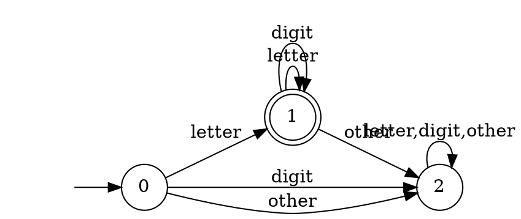
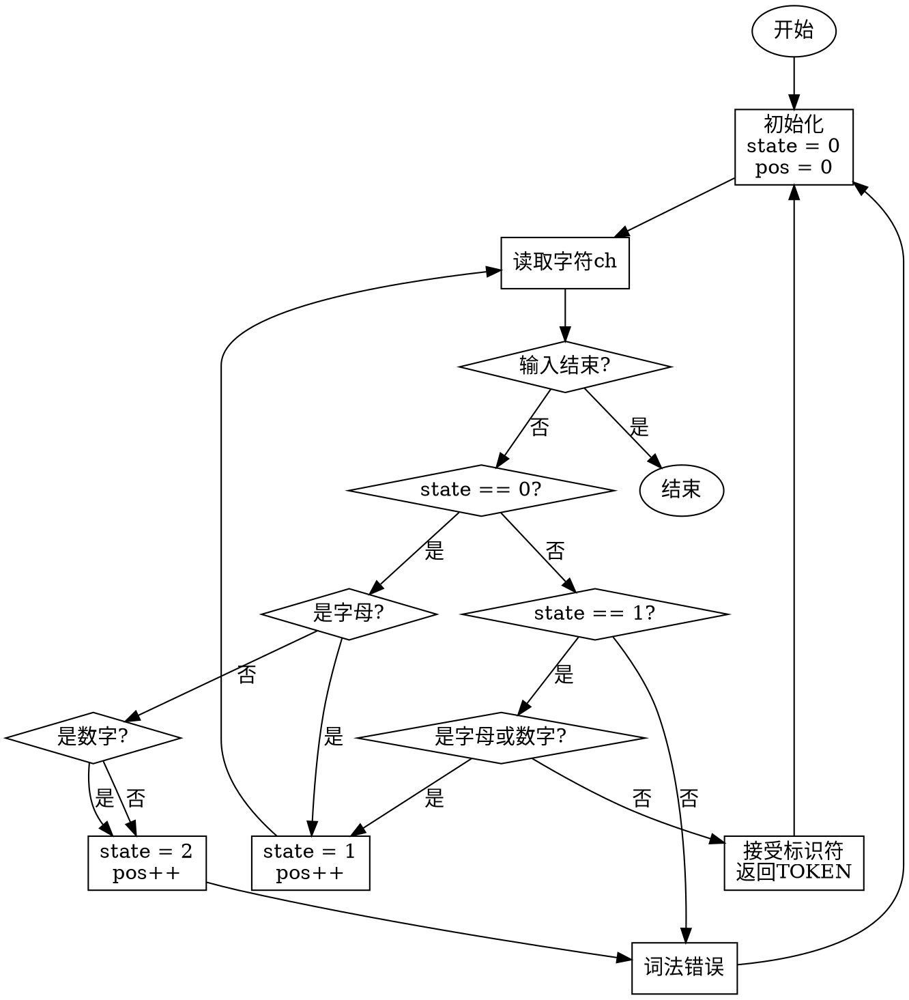
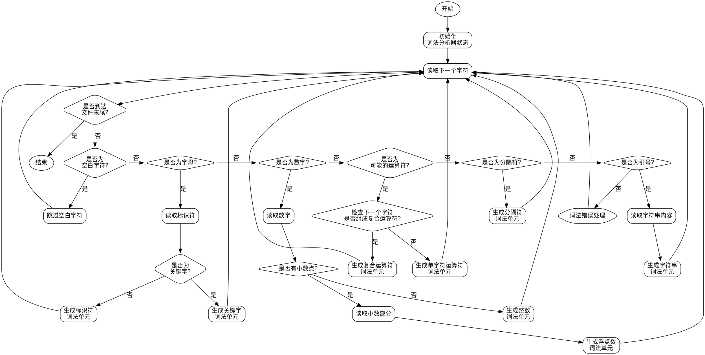
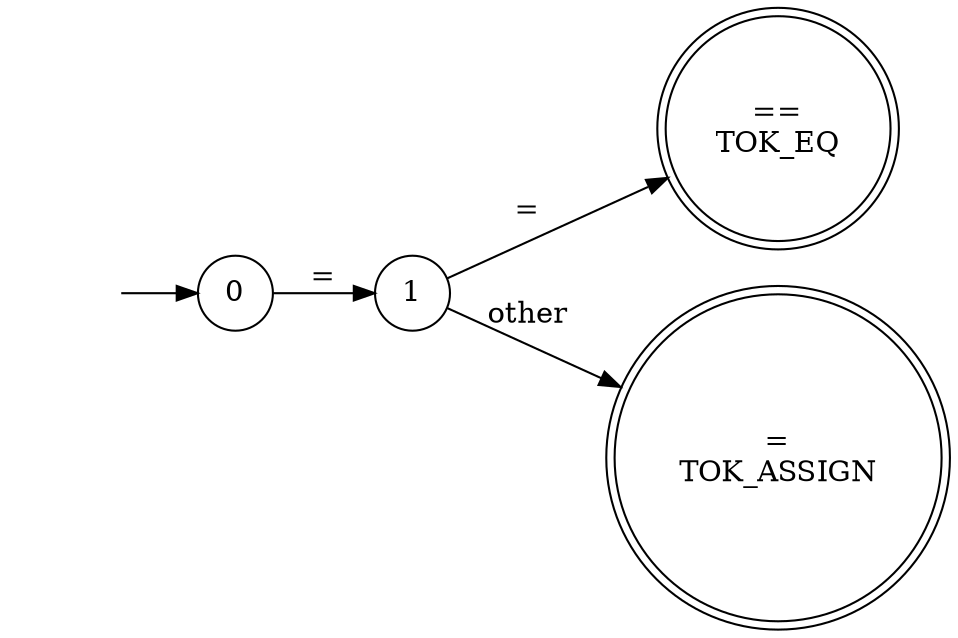
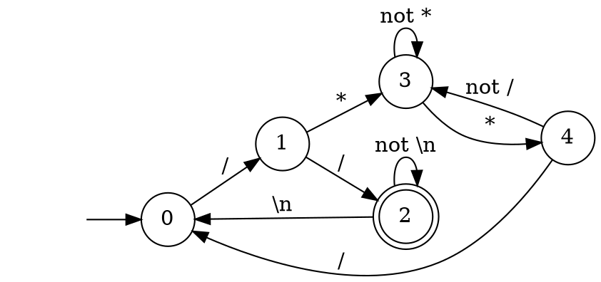
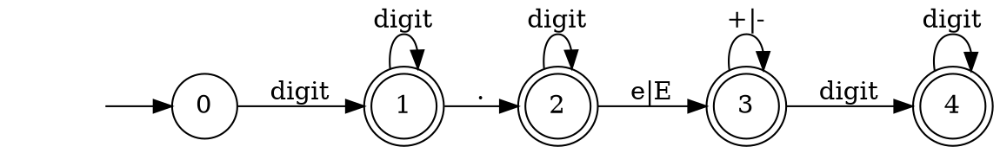

从最小化DFA的状态转换图到词法分析程序的转换，本质上是将自动机的状态转换过程转化为程序的控制流。让我详细讲解这个转换过程。

基本思路：

1. 程序的基本框架
   ```
   while(还有输入) {
     获取下一个字符
     根据当前状态和输入字符进行状态转换
     if(到达终态) {
       执行相应动作
       重置状态
     }
   }
   ```

2. 状态的表示方式
   1. switch-case方式
      ```c
      switch(state) {
        case 0:
          // 状态0的转换逻辑
          break;
        case 1:
          // 状态1的转换逻辑
          break;
        // ...
      }
      ```

   2. 状态转移表方式
      ```c
      int trans_table[STATE_NUM][CHAR_NUM];
      state = trans_table[state][char_class];
      ```

让我用一个具体例子来说明。假设有一个识别C语言标识符的最小化DFA：



转换成程序流程图：



对应的C语言代码框架：

```c
enum State { START = 0, IDENT = 1, ERROR = 2 };
enum CharClass { LETTER, DIGIT, OTHER };

int get_char_class(char ch) {
    if (isalpha(ch)) return LETTER;
    if (isdigit(ch)) return DIGIT;
    return OTHER;
}

Token get_next_token() {
    State state = START;
    int pos = 0;
    char buffer[MAX_TOKEN_LEN];
    
    while (1) {
        char ch = get_next_char();
        if (ch == EOF) {
            if (state == IDENT) {
                buffer[pos] = '\0';
                return make_token(IDENTIFIER, buffer);
            }
            return make_token(EOF_TOKEN, NULL);
        }
        
        switch (state) {
            case START:
                if (isalpha(ch)) {
                    state = IDENT;
                    buffer[pos++] = ch;
                } else {
                    state = ERROR;
                }
                break;
                
            case IDENT:
                if (isalnum(ch)) {
                    buffer[pos++] = ch;
                } else {
                    buffer[pos] = '\0';
                    unget_char(ch);
                    return make_token(IDENTIFIER, buffer);
                }
                break;
                
            case ERROR:
                return make_token(ERROR_TOKEN, NULL);
        }
    }
}
```

另外，如果DFA比较复杂，也可以用状态转移表的方式实现：

```c
// 状态转移表
int trans_table[STATE_NUM][CHAR_CLASS_NUM] = {
    // LETTER  DIGIT  OTHER
    {  IDENT,  ERROR, ERROR },  // START
    {  IDENT,  IDENT, ERROR },  // IDENT
    {  ERROR,  ERROR, ERROR }   // ERROR
};

// 状态类型表
int state_type[STATE_NUM] = {
    NON_ACCEPT,  // START
    ACCEPT,      // IDENT
    ERROR        // ERROR
};

Token get_next_token() {
    State state = START;
    int pos = 0;
    char buffer[MAX_TOKEN_LEN];
    
    while (1) {
        char ch = get_next_char();
        if (ch == EOF) {
            if (state_type[state] == ACCEPT) {
                buffer[pos] = '\0';
                return make_token(IDENTIFIER, buffer);
            }
            return make_token(EOF_TOKEN, NULL);
        }
        
        int char_class = get_char_class(ch);
        State next_state = trans_table[state][char_class];
        
        if (next_state == ERROR) {
            if (state_type[state] == ACCEPT) {
                buffer[pos] = '\0';
                unget_char(ch);
                return make_token(IDENTIFIER, buffer);
            }
            return make_token(ERROR_TOKEN, NULL);
        }
        
        buffer[pos++] = ch;
        state = next_state;
    }
}
```

转换过程的主要考虑点：

1. 状态表示
   - 使用枚举类型表示状态
   - 使用状态转移表
   - 状态类型表（接受/非接受）

2. 输入处理
   - 缓冲区管理
   - 回退机制
   - EOF处理

3. 错误处理
   - 错误状态的识别
   - 错误恢复策略
   - 错误信息的生成

4. 标记生成
   - 标记类型的定义
   - 属性值的收集
   - 符号表的管理

5. 优化考虑
   - 表驱动还是switch-case
   - 缓冲区策略
   - 状态合并

这样的转换方法具有以下优点：
1. 结构清晰，便于维护
2. 易于扩展和修改
3. 运行效率高
4. 错误处理完善

***

`buffer`是用来存储当前正在识别的词素（lexeme）的字符缓冲区。让我详细解释一下它的作用：

1. 基本功能
   - 存储输入字符流中正在识别的词素
   - 最终用于构造词法单元的属性值
   - 便于回溯和错误处理

举个例子，假设输入字符串是：
```
int abc = 123;
```

在识别标识符`abc`时的过程：

```c
while (...) {
    char ch = get_next_char();  // 依次读入'a'、'b'、'c'
    if (isalnum(ch)) {
        buffer[pos++] = ch;     // buffer中依次存入"a"、"ab"、"abc"
    } else {  // 遇到空格
        buffer[pos] = '\0';     // 在buffer末尾加上字符串结束符
        return make_token(IDENTIFIER, buffer);  // 返回标识符token，值为"abc"
    }
}
```

我们可以用一个更完整的例子来说明：

```c
#define MAX_TOKEN_LEN 1024

typedef struct {
    TokenType type;    // 词法单元类型
    char *lexeme;      // 词素字符串
    int line;          // 行号
    // 其他属性...
} Token;

Token get_next_token() {
    State state = START;
    int pos = 0;  // buffer中的当前位置
    char buffer[MAX_TOKEN_LEN];  // 词素缓冲区
    
    while (1) {
        char ch = get_next_char();
        
        switch (state) {
            case START:
                if (isalpha(ch)) {  // 遇到字母
                    state = IDENT;
                    buffer[pos++] = ch;  // 保存到buffer
                }
                else if (isdigit(ch)) {  // 遇到数字
                    state = NUMBER;
                    buffer[pos++] = ch;  // 保存到buffer
                }
                else if (ch == '"') {  // 遇到引号
                    state = STRING;
                    buffer[pos++] = ch;  // 保存到buffer
                }
                break;
                
            case IDENT:
                if (isalnum(ch)) {
                    buffer[pos++] = ch;  // 继续保存字符
                } else {
                    buffer[pos] = '\0';  // 结束字符串
                    unget_char(ch);      // 字符回退
                    
                    // 检查是否是关键字
                    TokenType type = is_keyword(buffer) ? 
                                   get_keyword_type(buffer) : IDENTIFIER;
                    
                    // 创建新的词法单元
                    return (Token){
                        .type = type,
                        .lexeme = strdup(buffer),  // 复制buffer内容
                        .line = current_line
                    };
                }
                break;
                
            case NUMBER:
                if (isdigit(ch)) {
                    buffer[pos++] = ch;  // 继续保存数字
                } else if (ch == '.') {
                    state = FLOAT;
                    buffer[pos++] = ch;  // 保存小数点
                } else {
                    buffer[pos] = '\0';
                    unget_char(ch);
                    return (Token){
                        .type = INTEGER,
                        .lexeme = strdup(buffer),
                        .line = current_line
                    };
                }
                break;
                
            case STRING:
                buffer[pos++] = ch;
                if (ch == '"') {  // 字符串结束
                    buffer[pos] = '\0';
                    return (Token){
                        .type = STRING_LITERAL,
                        .lexeme = strdup(buffer),
                        .line = current_line
                    };
                }
                break;
        }
        
        // 检查buffer是否溢出
        if (pos >= MAX_TOKEN_LEN - 1) {
            lexical_error("Token too long");
        }
    }
}
```

在这个例子中，`buffer`的主要作用有：

1. 暂存功能
   - 在词法分析过程中暂存已读入的字符
   - 直到确认词素的边界（遇到分隔符或状态转换）
   - 便于构造完整的词素字符串

2. 关键字识别
   - 存储完整的标识符字符串
   - 用于查找是否是关键字
   - 确定最终的词法单元类型

3. 错误处理
   - 记录出错位置的上下文
   - 提供错误信息和诊断
   - 便于错误恢复

4. 属性值收集
   - 为词法单元提供属性值
   - 用于后续的语法分析和语义分析
   - 保存到符号表中

5. 输入回溯
   - 在需要回退的情况下保留已读取的内容
   - 支持超前扫描
   - 处理词素边界

`buffer`的使用技巧：

1. 大小选择
   ```c
   #define MAX_TOKEN_LEN 1024  // 根据实际需求设置
   ```

2. 溢出检查
   ```c
   if (pos >= MAX_TOKEN_LEN - 1) {
       lexical_error("Token too long");
   }
   ```

3. 字符串处理
   ```c
   buffer[pos] = '\0';  // 添加字符串结束符
   char *lexeme = strdup(buffer);  // 复制到堆内存
   ```

4. 回退处理
   ```c
   unget_char(ch);  // 字符回退
   buffer[pos] = '\0';  // 当前位置结束
   ```

总的来说，`buffer`是词法分析器中的一个重要组件，它帮助我们完成从字符流到词法单元的转换过程。

***

词法单元的类型（token type）是用来标识词素属于哪一类语言元素的标签。我来详细讲解一下。

在编程语言中，常见的词法单元类型包括：

1. 标识符（identifier）：变量名、函数名等
   ```c
   int count = 0;  // count是标识符
   void test() {}  // test是标识符
   ```

2. 关键字（keyword）：语言预定义的特殊词
   - `if`、`while`、`for`、`int`、`return`等
   - 关键字通常有固定的列表，每个都是独立的类型
   - 比如`<if>`、`<while>`、`<int>`等

3. 运算符（operator）：
   - 算术运算：`+`、`-`、`*`、`/`
   - 关系运算：`<`、`>`、`==`、`!=`
   - 逻辑运算：`&&`、`||`、`!`
   - 赋值运算：`=`、`+=`、`-=`

4. 分隔符（delimiter）：
   - 括号：`(`、`)`、`{`、`}`、`[`、`]`
   - 标点：`;`、`,`、`.`

5. 常量（literal）：
   - 整数：`<integer_lit, "42">`
   - 浮点数：`<float_lit, "3.14">`
   - 字符：`<char_lit, "A">`
   - 字符串：`<string_lit, "hello">`

举个具体例子，看看这段代码如何被分解成词法单元：

```c
while (x <= 100) {
    sum += x * 2;
}
```

对应的词法单元序列是：

```
<while>
<lparen>
<id, "x">
<leq>           // 小于等于运算符
<integer_lit, "100">
<rparen>
<lbrace>
<id, "sum">
<pluseq>        // +=运算符
<id, "x">
<mult>          // 乘法运算符
<integer_lit, "2">
<semicolon>
<rbrace>
```

在实际编译器中，这些类型通常用枚举或整数常量来表示：

```c
enum TokenType {
    TOK_ID,         // 标识符
    TOK_INT_LIT,    // 整数常量
    TOK_FLOAT_LIT,  // 浮点数常量
    TOK_STRING_LIT, // 字符串常量
    TOK_PLUS,       // +
    TOK_MINUS,      // -
    TOK_MULT,       // *
    TOK_DIV,        // /
    TOK_EQ,         // ==
    TOK_ASSIGN,     // =
    TOK_SEMICOLON,  // ;
    TOK_IF,         // if关键字
    TOK_WHILE,      // while关键字
    // ...其他类型
};
```

这种类型信息对后续的语法分析非常重要：

1. 帮助语法分析器判断当前读到的是什么语言元素
2. 验证语法规则是否正确
3. 指导语法树的构建

比如当语法分析器看到：

```c
if (x > 0)
```

它知道：
- `if`的类型是`TOK_IF`，说明这是一个条件语句的开始
- `(`的类型是`TOK_LPAREN`，符合`if`语句的语法要求
- `x`的类型是`TOK_ID`，说明这是一个变量
- `>`的类型是`TOK_GT`，说明这是一个关系运算符
- `0`的类型是`TOK_INT_LIT`，说明这是一个整数常量
- `)`的类型是`TOK_RPAREN`，说明条件表达式结束

通过这些类型信息，语法分析器就能正确地构建出表示这个`if`语句的语法树节点。

***

让我系统地整理一下对词法单元类型的编码方式。

在编译器中，根据不同类型词法单元的特点，采用了不同的编码策略：

1. 独立编码  
   为每个具体的符号分配唯一的类型码，适用于数量有限且固定的符号：
   - 运算符：每个运算符都有唯一编码
     ```c
     TOK_PLUS,    // +
     TOK_MINUS,   // -
     TOK_MULT,    // *
     TOK_DIV,     // /
     TOK_GT,      // >
     TOK_LT,      // <
     TOK_EQ,      // ==
     TOK_NE,      // !=
     ```
   - 分隔符：每个分隔符都有唯一编码
     ```c
     TOK_LPAREN,  // (
     TOK_RPAREN,  // )
     TOK_LBRACE,  // {
     TOK_RBRACE,  // }
     TOK_COMMA,   // ,
     TOK_SEMI,    // ;
     ```
   - 关键字：每个关键字都有唯一编码
     ```c
     TOK_IF,      // if
     TOK_ELSE,    // else
     TOK_WHILE,   // while
     TOK_FOR,     // for
     TOK_RETURN,  // return
     TOK_INT,     // int
     TOK_FLOAT,   // float
     ```

2. 统一编码  
   用同一个类型码表示同一类的所有符号，主要用于标识符：
   ```c
   TOK_ID        // 所有标识符都用这一个类型表示
   ```
   比如下面的代码中的所有标识符：
   ```c
   int count;
   float average;
   void calculate();
   ```
   都用`TOK_ID`表示，具体是哪个标识符则记录在词法单元的值部分。

3. 分类编码  
   按照符号的性质进行分类，每类使用一个类型码，主要用于常量：
   ```c
   TOK_INT_LIT,    // 整数常量
   TOK_FLOAT_LIT,  // 浮点数常量
   TOK_CHAR_LIT,   // 字符常量
   TOK_STRING_LIT  // 字符串常量
   ```

让我们看一个具体的例子，这段代码被词法分析后会得到怎样的token序列：

```c
int sum = 0;
float pi = 3.14;
if (sum > 100) {
    printf("Too large!");
}
```

对应的词法单元序列是：
```
<TOK_INT>         // 独立编码（关键字）
<TOK_ID, "sum">   // 统一编码（标识符）
<TOK_ASSIGN>      // 独立编码（运算符）
<TOK_INT_LIT, "0">// 分类编码（整数常量）
<TOK_SEMI>        // 独立编码（分隔符）
<TOK_FLOAT>       // 独立编码（关键字）
<TOK_ID, "pi">    // 统一编码（标识符）
<TOK_ASSIGN>      // 独立编码（运算符）
<TOK_FLOAT_LIT, "3.14">  // 分类编码（浮点数常量）
<TOK_SEMI>        // 独立编码（分隔符）
<TOK_IF>          // 独立编码（关键字）
<TOK_LPAREN>      // 独立编码（分隔符）
<TOK_ID, "sum">   // 统一编码（标识符）
<TOK_GT>          // 独立编码（运算符）
<TOK_INT_LIT, "100">  // 分类编码（整数常量）
<TOK_RPAREN>      // 独立编码（分隔符）
<TOK_LBRACE>      // 独立编码（分隔符）
<TOK_ID, "printf">    // 统一编码（标识符）
<TOK_LPAREN>      // 独立编码（分隔符）
<TOK_STRING_LIT, "Too large!">  // 分类编码（字符串常量）
<TOK_RPAREN>      // 独立编码（分隔符）
<TOK_SEMI>        // 独立编码（分隔符）
<TOK_RBRACE>      // 独立编码（分隔符）
```

这种编码方式的优点是：
1. 对于固定的符号（独立编码），可以直接用类型来区分，处理简单
2. 对于可变的符号（统一编码和分类编码），通过合适的分类既节省了类型编码的数量，又保留了足够的识别信息
3. 配合词法单元的值部分，能够完整地保存源代码中的所有必要信息

***

词法单元的值部分（attribute value）用于存储除了类型之外的额外信息。

首先，根据词法单元类型的不同，值信息的存储需求也不同：

1. 独立编码的词法单元（不需要值信息）
   - 运算符如`+`、`-`、`*`、`/`
   - 关键字如`if`、`while`、`int`
   - 分隔符如`(`、`)`、`;`、`,`
  
   这些符号本身就包含了所有信息，类型就足够表达它们了。

2. 统一编码的词法单元（需要值信息）  
   标识符有两种表示方式：
   ```c
   // 方式一：直接存储字符串
   struct Token {
     int type;           // TOK_ID
     char *lexeme;       // 存储标识符字符串
   };
   
   // 方式二：使用符号表指针
   struct Token {
     int type;           // TOK_ID
     int symtab_index;   // 符号表中的索引
   };
   ```

3. 分类编码的词法单元（需要值信息）  
   常量也有两种表示方式：
   ```c
   // 方式一：直接存储值
   struct Token {
     int type;           // TOK_INT_LIT等
     union {
       int int_val;
       float float_val;
       char char_val;
       char *str_val;
     } value;
   };
   
   // 方式二：使用常量表指针
   struct Token {
     int type;           // TOK_INT_LIT等
     int const_index;    // 常量表中的索引
   };
   ```

让我们看一个具体例子：

```c
int count = 42;
float pi = 3.14;
char *msg = "hello";
```

使用内码（直接存储）方式的词法单元序列：
```c
struct Token tokens[] = {
    {TOK_INT},                    // int（不需要值）
    {TOK_ID, "count"},           // count（存储字符串）
    {TOK_ASSIGN},                // =（不需要值）
    {TOK_INT_LIT, {.int_val=42}}, // 42（存储整数值）
    {TOK_SEMI},                  // ;（不需要值）
    {TOK_FLOAT},                 // float（不需要值）
    {TOK_ID, "pi"},             // pi（存储字符串）
    {TOK_ASSIGN},                // =（不需要值）
    {TOK_FLOAT_LIT, {.float_val=3.14}}, // 3.14（存储浮点值）
    {TOK_SEMI},                  // ;（不需要值）
    {TOK_CHAR},                  // char（不需要值）
    {TOK_MULT},                  // *（不需要值）
    {TOK_ID, "msg"},            // msg（存储字符串）
    {TOK_ASSIGN},                // =（不需要值）
    {TOK_STRING_LIT, {.str_val="hello"}}, // "hello"（存储字符串）
    {TOK_SEMI}                   // ;（不需要值）
};
```

使用指针（索引）方式时，需要配合符号表和常量表：

```c
// 符号表
struct SymbolEntry {
    char *name;
    int type;
    // 其他信息...
};

// 常量表
struct ConstEntry {
    enum ConstType {INT, FLOAT, CHAR, STRING} type;
    union {
        int int_val;
        float float_val;
        char char_val;
        char *str_val;
    } value;
};

// 词法单元序列
struct Token tokens[] = {
    {TOK_INT},           // int
    {TOK_ID, 1},        // count（符号表索引1）
    {TOK_ASSIGN},       // =
    {TOK_INT_LIT, 1},   // 42（常量表索引1）
    {TOK_SEMI},         // ;
    {TOK_FLOAT},        // float
    {TOK_ID, 2},        // pi（符号表索引2）
    {TOK_ASSIGN},       // =
    {TOK_FLOAT_LIT, 2}, // 3.14（常量表索引2）
    {TOK_SEMI},         // ;
    {TOK_CHAR},         // char
    {TOK_MULT},         // *
    {TOK_ID, 3},        // msg（符号表索引3）
    {TOK_ASSIGN},       // =
    {TOK_STRING_LIT, 3},// "hello"（常量表索引3）
    {TOK_SEMI}          // ;
};
```

两种方式的比较：

1. 内码方式：
   - 优点：访问快速，不需要额外的查表操作
   - 缺点：可能占用较多空间，特别是字符串
   - 适用：小程序或对速度要求高的场合

2. 指针方式：
   - 优点：节省空间，相同的标识符或常量只存储一次
   - 优点：便于后续阶段（如语义分析）使用符号表信息
   - 缺点：需要额外的查表操作
   - 适用：大型程序或需要详细符号信息的场合

在实际编译器中，常常采用混合策略：
- 对于简单的数值常量用内码
- 对于字符串和标识符用指针
- 可能会维护一个字符串池来重用相同的字符串

这样可以在空间效率和访问速度之间取得平衡。

***

让我详细讲解符号表和常量表的结构和作用。

符号表（Symbol Table）是用来存储标识符信息的数据结构：

```c
struct SymbolEntry {
    // 基本信息
    char *name;         // 标识符名称
    int type;          // 数据类型（int、float等）
    int scope;         // 作用域级别
    
    // 根据标识符种类存储的具体信息
    union {
        // 变量信息
        struct {
            int offset;     // 内存偏移量
            bool is_const;  // 是否是常量
        } var_info;
        
        // 函数信息
        struct {
            int param_count;    // 参数个数
            int *param_types;   // 参数类型列表
            int return_type;    // 返回值类型
        } func_info;
        
        // 类型信息（用于结构体、枚举等）
        struct {
            int size;          // 类型大小
            SymbolEntry *members;  // 成员列表
        } type_info;
    } info;
    
    // 链表指针（用于处理作用域）
    struct SymbolEntry *next;
};
```

常量表（Constant Table）用来存储程序中的常量值：

```c
struct ConstEntry {
    // 常量类型
    enum ConstType {
        CONST_INT,
        CONST_FLOAT,
        CONST_CHAR,
        CONST_STRING
    } type;
    
    // 常量值
    union {
        int int_val;
        float float_val;
        char char_val;
        struct {
            char *str_val;
            int length;
        } string_info;
    } value;
    
    // 用于优化的额外信息
    bool is_used;      // 是否被使用
    int ref_count;     // 引用计数
};
```

让我们通过一个例子来看它们的使用：

```c
const int MAX = 100;
int count = 0;

struct Point {
    float x;
    float y;
};

float distance(Point p1, Point p2) {
    float dx = p1.x - p2.x;
    float dy = p1.y - p2.y;
    return sqrt(dx*dx + dy*dy);
}

char *message = "Hello, world!";
```

这段代码对应的符号表可能是这样的：

```c
// 全局作用域的符号表项
[0] {
    name: "MAX",
    type: TYPE_INT,
    scope: 0,
    info: {
        var_info: {
            offset: 0,
            is_const: true
        }
    }
}

[1] {
    name: "count",
    type: TYPE_INT,
    scope: 0,
    info: {
        var_info: {
            offset: 4,
            is_const: false
        }
    }
}

[2] {
    name: "Point",
    type: TYPE_STRUCT,
    scope: 0,
    info: {
        type_info: {
            size: 8,
            members: [
                {name: "x", type: TYPE_FLOAT, offset: 0},
                {name: "y", type: TYPE_FLOAT, offset: 4}
            ]
        }
    }
}

[3] {
    name: "distance",
    type: TYPE_FUNC,
    scope: 0,
    info: {
        func_info: {
            param_count: 2,
            param_types: [TYPE_STRUCT_POINT, TYPE_STRUCT_POINT],
            return_type: TYPE_FLOAT
        }
    }
}

[4] {
    name: "message",
    type: TYPE_PTR_CHAR,
    scope: 0,
    info: {
        var_info: {
            offset: 12,
            is_const: false
        }
    }
}

// distance函数内的局部变量
[5] {
    name: "dx",
    type: TYPE_FLOAT,
    scope: 1,
    info: {
        var_info: {
            offset: -8,
            is_const: false
        }
    }
}

[6] {
    name: "dy",
    type: TYPE_FLOAT,
    scope: 1,
    info: {
        var_info: {
            offset: -4,
            is_const: false
        }
    }
}
```

对应的常量表是这样的：

```c
// 常量表
[0] {
    type: CONST_INT,
    value: {
        int_val: 100
    },
    is_used: true,
    ref_count: 1
}

[1] {
    type: CONST_INT,
    value: {
        int_val: 0
    },
    is_used: true,
    ref_count: 1
}

[2] {
    type: CONST_STRING,
    value: {
        string_info: {
            str_val: "Hello, world!",
            length: 13
        }
    },
    is_used: true,
    ref_count: 1
}
```

这些表的使用特点：

1. 作用域管理：
   ```c
   void foo() {
       int x = 1;  // 局部作用域
       {
           int x = 2;  // 内层作用域
       }
   }
   ```
   符号表需要正确处理这种嵌套作用域，通常用链表或栈实现。

2. 查找效率：
   ```c
   struct SymbolTable {
       SymbolEntry *entries;     // 数组存储
       int size;
       HashTable *quick_lookup;  // 哈希表加速查找
   };
   ```

3. 类型检查：
   ```c
   float f = 3.14;
   int i = f;  // 需要检查类型兼容性
   ```
   符号表提供类型信息支持语义分析。

4. 内存分配：
   ```c
   struct Point p;  // 需要知道Point结构体的大小
   ```
   符号表记录的类型信息帮助确定内存布局。

5. 常量折叠：
   ```c
   const int A = 10;
   const int B = 20;
   int c = A + B;  // 可以在编译时计算
   ```
   常量表支持编译期优化。

符号表和常量表是编译器的核心数据结构，它们：
- 支持作用域管理
- 提供类型检查信息
- 辅助代码生成
- 支持编译优化
- 协助错误检查和报告

因此它们的设计需要在存储效率、查找速度和功能完备性之间取得平衡。

***

让我详细说明符号表和常量表的组织方式。

符号表的组织通常有几种方式：

**1. 哈希表（最常用）：**
首先是基本的数据结构定义：

```c
// 符号表项
struct SymbolEntry {
    char *name;                    // 符号名
    int type;                     // 符号类型
    // ... 其他属性
    struct SymbolEntry *hash_next;  // 同一哈希桶中的下一个符号
};

// 哈希桶
struct HashBucket {
    struct SymbolEntry *head;  // 桶的第一个符号
};

// 单个作用域的符号表
struct ScopeTable {
    struct HashBucket buckets[HASH_SIZE];  // 当前作用域的哈希表
    struct ScopeTable *prev;               // 外层作用域
};

// 整个符号表
struct SymbolTable {
    struct ScopeTable *current_scope;  // 当前作用域
};
```

让我们通过一个例子来看这些结构是如何工作的：

```c
int global = 100;

void foo() {
    int x = 42;
    if (x > 0) {
        float y = 3.14;
        char *msg = "hello";
    }
}
```

这段代码会形成三层嵌套的作用域，每个作用域都有自己的哈希表：

```
全局作用域的哈希表：
[0] → null
[1] → SymbolEntry("global") → null
[2] → null
[3] → SymbolEntry("foo") → null
[4] → null
...

foo函数作用域的哈希表：
[0] → null
[1] → null
[2] → SymbolEntry("x") → null
[3] → null
[4] → null
...

if块作用域的哈希表：
[0] → null
[1] → SymbolEntry("y") → null
[2] → SymbolEntry("msg") → null
[3] → null
[4] → null
...
```

这些作用域通过`ScopeTable`的`prev`指针连接成一个链：
```
if块作用域 → foo函数作用域 → 全局作用域 → null
```

在实际使用中，符号表的操作主要包括：

1. 进入新作用域：
   ```c
   void enter_scope() {
       // 创建新的作用域
       struct ScopeTable *new_scope = malloc(sizeof(struct ScopeTable));
       // 初始化哈希桶
       for(int i = 0; i < HASH_SIZE; i++) {
           new_scope->buckets[i].head = NULL;
       }
       // 链接到当前作用域
       new_scope->prev = symtab.current_scope;
       // 更新当前作用域
       symtab.current_scope = new_scope;
   }
   ```
   
2. 添加新符号：
   ```c
   void insert_symbol(char *name, int type) {
       // 计算哈希值
       int hash = hash_function(name);
       
       // 创建新符号
       SymbolEntry *entry = malloc(sizeof(SymbolEntry));
       entry->name = strdup(name);
       entry->type = type;
       
       // 插入到当前作用域的哈希表中
       entry->hash_next = symtab.current_scope->buckets[hash].head;
       symtab.current_scope->buckets[hash].head = entry;
   }
   ```
   
3. 查找符号：
   ```c
   SymbolEntry* lookup_symbol(const char *name) {
       // 计算哈希值
       int hash = hash_function(name);
       
       // 从当前作用域开始查找
       ScopeTable *scope = symtab.current_scope;
       while (scope != NULL) {
           // 在当前作用域的哈希表中查找
           SymbolEntry *entry = scope->buckets[hash].head;
           while (entry != NULL) {
               if (strcmp(entry->name, name) == 0) {
                   return entry;
               }
               entry = entry->hash_next;
           }
           // 找不到就去外层作用域找
           scope = scope->prev;
       }
       return NULL;
   }
   ```
   
4. 退出作用域：
   ```c
   void exit_scope() {
       // 保存当前作用域
       ScopeTable *old_scope = symtab.current_scope;
       // 返回到外层作用域
       symtab.current_scope = old_scope->prev;
       // 释放当前作用域的所有符号和哈希表
       free_scope(old_scope);
   }
   ```

这种实现方式的优点是：
1. 查找效率高：使用哈希表可以快速定位符号
2. 作用域管理清晰：每个作用域有独立的哈希表
3. 变量遮蔽处理自然：在当前作用域找到同名变量就直接返回
4. 内存管理方便：退出作用域时可以直接释放整个作用域的内存

如果在同一个作用域中出现哈希冲突（多个符号的哈希值相同），这些符号会通过`hash_next`指针连接在同一个哈希桶中形成链表。比如：

```c
{
    int abc = 1;
    int xyz = 2;  // 假设abc和xyz的哈希值都是2
}
```

会形成这样的结构：
```
当前作用域的哈希表：
[0] → null
[1] → null
[2] → SymbolEntry("abc") → SymbolEntry("xyz") → null
[3] → null
...
```

这就是符号表使用哈希表实现的完整结构和工作方式。这种实现既保证了符号查找的效率，又很好地支持了作用域的嵌套和变量遮蔽。

**2. 二叉搜索树：**
```c
struct SymbolTable {
    // 每个作用域一棵BST
    struct ScopeNode {
        SymbolEntry *root;    // BST根节点
        struct ScopeNode *prev;
    } *current_scope;
};

struct SymbolEntry {
    char *name;
    int type;
    // ... 其他属性
    
    // BST指针
    SymbolEntry *left;
    SymbolEntry *right;
    // 同作用域链表
    SymbolEntry *scope_next;
};
```

常量表的组织比较简单，通常用以下方式：

**1. 数组（简单常量）：**
```c
struct ConstTable {
    ConstEntry *entries;
    int size;
    int capacity;
    
    // 哈希表用于快速查找重复常量
    HashTable *lookup;
};
```

**2. 分类存储（不同类型分开存储）：**
```c
struct ConstTable {
    // 数值常量用数组
    struct {
        int *values;
        int size;
    } int_consts;
    
    struct {
        float *values;
        int size;
    } float_consts;
    
    // 字符串常量用哈希表
    StringPool *string_consts;
};
```

对于上面的示例代码，其常量表可能是这样的：
```c
struct ConstTable consttab = {
    .int_consts = {
        .values = {100, 42, 0},
        .size = 3
    },
    .float_consts = {
        .values = {3.14},
        .size = 1
    },
    .string_consts = {
        "hello"
    }
};
```

分类存储的方式有几个明显的优点：
1. 类型安全：不同类型的常量分开存储，避免类型混淆
2. 存储效率：每种类型可以选择最适合的存储方式
   - 数值常量用定长数组存储，访问高效
   - 字符串常量用哈希表存储，方便去重
3. 查找方便：根据常量类型直接定位到对应的存储区域
4. 空间利用率高：相同的常量只存储一次，特别是对字符串这样的大型常量很有帮助

这样的常量表设计配合前面的符号表，能够有效支持编译器的词法分析和语义分析工作。符号表负责管理标识符及其作用域，而常量表则专注于管理程序中的各类常量值，两者各司其职，共同构成了编译器的重要数据管理基础设施。

***

对，这就是所谓的保留字表（Reserved Word Table）和特殊符号表（Special Symbol Table）。让我详细解释一下：

1. 保留字表（存放关键字）：
   ```c
   struct KeywordEntry {
       char *lexeme;      // 关键字字符串
       int token_type;    // 对应的词法单元类型
   };
   
   // 静态定义的关键字表
   static const KeywordEntry keywords[] = {
       {"if",      TOK_IF},
       {"else",    TOK_ELSE},
       {"while",   TOK_WHILE},
       {"for",     TOK_FOR},
       {"int",     TOK_INT},
       {"float",   TOK_FLOAT},
       {"return",  TOK_RETURN},
       {"struct",  TOK_STRUCT},
       {"void",    TOK_VOID},
       // ... 其他关键字
   };
   ```
   
2. 特殊符号表（存放运算符和分隔符）：
   ```c
   struct OperatorEntry {
       char *lexeme;      // 符号字符串
       int token_type;    // 对应的词法单元类型
       int precedence;    // 优先级（用于表达式分析）
       bool is_binary;    // 是否是双目运算符
   };
   
   static const OperatorEntry operators[] = {
       {"+",   TOK_PLUS,    10, true},
       {"-",   TOK_MINUS,   10, true},
       {"*",   TOK_MULT,    20, true},
       {"/",   TOK_DIV,     20, true},
       {"++",  TOK_INC,     30, false},
       {"--",  TOK_DEC,     30, false},
       {"==",  TOK_EQ,      5,  true},
       {"!=",  TOK_NE,      5,  true},
       {"=",   TOK_ASSIGN,  1,  true},
       // ... 其他运算符
   };
   
   struct DelimiterEntry {
       char lexeme;       // 分隔符字符
       int token_type;    // 对应的词法单元类型
   };
   
   static const DelimiterEntry delimiters[] = {
       {'(',  TOK_LPAREN},
       {')',  TOK_RPAREN},
       {'{',  TOK_LBRACE},
       {'}',  TOK_RBRACE},
       {'[',  TOK_LBRACKET},
       {']',  TOK_RBRACKET},
       {';',  TOK_SEMI},
       {',',  TOK_COMMA},
       {'.',  TOK_DOT},
       // ... 其他分隔符
   };
   ```

在词法分析器中使用这些表的例子：

```c
// 检查是否是关键字
int check_keyword(const char *str) {
    for (int i = 0; i < sizeof(keywords)/sizeof(keywords[0]); i++) {
        if (strcmp(str, keywords[i].lexeme) == 0) {
            return keywords[i].token_type;
        }
    }
    return TOK_ID;  // 不是关键字就是标识符
}

// 检查是否是运算符
int check_operator(const char *str) {
    for (int i = 0; i < sizeof(operators)/sizeof(operators[0]); i++) {
        if (strcmp(str, operators[i].lexeme) == 0) {
            return operators[i].token_type;
        }
    }
    return -1;  // 不是合法运算符
}

// 检查是否是分隔符
int check_delimiter(char c) {
    for (int i = 0; i < sizeof(delimiters)/sizeof(delimiters[0]); i++) {
        if (c == delimiters[i].lexeme) {
            return delimiters[i].token_type;
        }
    }
    return -1;  // 不是合法分隔符
}
```

实际使用例子：

```c
void tokenize(const char *input) {
    char buffer[256];  // 用于暂存字符
    int pos = 0;
    
    while (*input) {
        if (isspace(*input)) {
            input++;
            continue;
        }
        
        // 检查分隔符
        int delim_type = check_delimiter(*input);
        if (delim_type != -1) {
            printf("分隔符: %c (类型: %d)\n", *input, delim_type);
            input++;
            continue;
        }
        
        // 收集可能的标识符或关键字
        if (isalpha(*input)) {
            pos = 0;
            while (isalnum(*input)) {
                buffer[pos++] = *input++;
            }
            buffer[pos] = '\0';
            
            // 检查是否是关键字
            int type = check_keyword(buffer);
            if (type != TOK_ID) {
                printf("关键字: %s (类型: %d)\n", buffer, type);
            } else {
                printf("标识符: %s\n", buffer);
            }
            continue;
        }
        
        // 收集可能的运算符
        if (ispunct(*input)) {
            pos = 0;
            buffer[pos++] = *input++;
            // 处理可能的双字符运算符
            if (ispunct(*input)) {
                buffer[pos++] = *input++;
            }
            buffer[pos] = '\0';
            
            int op_type = check_operator(buffer);
            if (op_type != -1) {
                printf("运算符: %s (类型: %d)\n", buffer, op_type);
            } else if (pos > 1) {
                // 回退一个字符，可能是单字符运算符
                input--;
                buffer[1] = '\0';
                op_type = check_operator(buffer);
                if (op_type != -1) {
                    printf("运算符: %s (类型: %d)\n", buffer, op_type);
                }
            }
            continue;
        }
        
        input++;  // 跳过未识别的字符
    }
}
```

这些表的好处是：

1. 快速识别：
   ```c
   int x = 42;  // 需要快速确定int是关键字而不是标识符
   ```

2. 运算符优先级：
   ```c
   a + b * c  // 需要知道*的优先级高于+
   ```
   通过运算符表记录的优先级信息可以支持表达式分析。

3. 错误检查：
   ```c
   if (x @ y)  // @不是合法运算符
   ```
   可以快速发现非法符号。

4. 支持多字符运算符：
   ```c
   x++; // 需要正确识别++而不是两个+
   x += y; // 需要正确识别+=而不是+和=
   ```

5. 编译器扩展：
   ```c
   // 添加新关键字很容易
   {"foreach", TOK_FOREACH},
   // 添加新运算符也很方便
   {"**", TOK_POWER, 25, true},  // 幂运算
   ```

这些表通常会被优化成更高效的形式：

1. 哈希表：
   ```c
   struct KeywordTable {
       HashTable *lookup;  // 快速查找关键字
   };
   ```

2. 状态转移表：
   ```c
   // 用于处理多字符运算符
   int state_table[STATE_COUNT][CHAR_COUNT];
   ```

3. 静态完美哈希：
   ```c
   // 编译时生成的完美哈希函数
   int keyword_hash(const char *str) {
       // 为关键字生成唯一的索引
   }
   ```

这样的设计让词法分析器能够高效且准确地识别所有的语言元素。

***

我来用DOT语言绘制词法分析程序的完整流程图：



这个流程图展示了词法分析器的主要处理流程：

1. 初始化阶段：
   - 设置初始状态
   - 准备输入缓冲区
   - 初始化各种表（关键字表、运算符表等）

2. 主处理循环：
   - 读取输入字符
   - 根据字符类型进行分支处理
   - 生成对应的词法单元

3. 各种类型的处理：
   - 空白字符：直接跳过
   - 标识符/关键字：收集字母数字序列，查表判断
   - 数字：处理整数和浮点数
   - 运算符：处理单字符和多字符运算符
   - 分隔符：直接生成对应词法单元
   - 字符串：处理引号内的内容

4. 错误处理：
   - 遇到非法字符时进行错误处理
   - 可以继续扫描后续输入

5. 结束处理：
   - 检测文件结束
   - 完成最后的清理工作

这个流程图涵盖了词法分析的主要功能，同时也展示了各个处理环节之间的关系。实际实现时可能会根据具体语言的要求添加更多的处理分支和细节。

***

词法分析器的预处理过程主要处理输入的原始文本，让它变得更容易被词法分析器处理。我来详细讲解这个过程。

预处理主要做这些工作：

1. 缓冲区管理
   ```c
   struct Buffer {
     char data[BUFFER_SIZE * 2];  // 双倍大小的缓冲区
     char *forward;   // 向前指针
     char *lexemeBegin;  // 词素起始指针
     int currentBlock;   // 当前正在读的块（0或1）
   };
   ```

2. 双缓冲技术
   将输入缓冲区分为两个相等大小的块：
   ```
   +----------------+----------------+
   |     块 0       |      块 1      |
   +----------------+----------------+
   ```
   
   工作原理：
   ```c
   void loadBuffer(Buffer *buf) {
     if (buf->currentBlock == 0) {
       // 当扫描到块0末尾时，加载块1
       read(fd, buf->data + BUFFER_SIZE, BUFFER_SIZE);
       buf->currentBlock = 1;
     } else {
       // 当扫描到块1末尾时，加载块0
       read(fd, buf->data, BUFFER_SIZE);
       buf->currentBlock = 0;
     }
   }
   ```

3. 预处理操作
   ```c
   void preprocess(Buffer *buf) {
     // 1. 移除注释
     removeComments(buf);
     
     // 2. 处理转义字符
     handleEscapeSequences(buf);
     
     // 3. 合并空白字符
     mergeWhitespace(buf);
     
     // 4. 处理宏展开（如果支持）
     expandMacros(buf);
   }
   ```

让我用一个具体例子来说明这个过程：

假设有这样的源代码：
```c
int main() {
    /* 这是一个注释 */
    int  count    = 0;  // 变量初始化
    printf("Hello\n");  // 输出
}
```

预处理的各个步骤：

1. 移除注释：
   ```c
   int main() {
       
       int  count    = 0;  
       printf("Hello\n");  
   }
   ```

2. 规范化空白字符：
   ```c
   int main() {
       int count = 0;
       printf("Hello\n");
   }
   ```

实现预处理器的代码示例：

```c
struct PreProcessor {
    char buffer[BUFFER_SIZE * 2];
    int currentPos;
    int bufferEnd;
    FILE *sourceFile;
};

void initPreProcessor(PreProcessor *pp, const char *filename) {
    pp->sourceFile = fopen(filename, "r");
    pp->currentPos = 0;
    pp->bufferEnd = 0;
}

char getNextChar(PreProcessor *pp) {
    // 如果当前位置到达缓冲区末尾，需要重新加载
    if (pp->currentPos >= pp->bufferEnd) {
        pp->bufferEnd = fread(pp->buffer, 1, BUFFER_SIZE, pp->sourceFile);
        pp->currentPos = 0;
        if (pp->bufferEnd == 0) return EOF;
    }
    return pp->buffer[pp->currentPos++];
}

void skipComment(PreProcessor *pp) {
    char c = getNextChar(pp);
    if (c == '/') {  // 单行注释
        while ((c = getNextChar(pp)) != '\n' && c != EOF);
    } else if (c == '*') {  // 多行注释
        char prev = '\0';
        while ((c = getNextChar(pp)) != EOF) {
            if (prev == '*' && c == '/') break;
            prev = c;
        }
    }
}
```

预处理器需要处理一些特殊情况：

1. 文件结束处理：
   ```c
   #define EOF_MARKER '\0'
   
   void markBufferEnd(Buffer *buf) {
     // 在每个块的末尾放置EOF标记
     buf->data[BUFFER_SIZE - 1] = EOF_MARKER;
     buf->data[BUFFER_SIZE * 2 - 1] = EOF_MARKER;
   }
   ```

2. 行号和列号跟踪：
   ```c
   struct Position {
     int line;
     int column;
   };
   
   void updatePosition(Position *pos, char c) {
     if (c == '\n') {
       pos->line++;
       pos->column = 0;
     } else {
       pos->column++;
     }
   }
   ```

3. 错误处理：
   ```c
   void handleError(PreProcessor *pp, const char *message) {
     fprintf(stderr, "Error at line %d, column %d: %s\n",
             pp->position.line, pp->position.column, message);
   }
   ```

预处理的好处是：

1. 简化词法分析器的工作：
   - 不需要处理注释
   - 不需要处理连续空白字符
   - 行号和列号信息已经准备好

2. 提高效率：
   - 使用双缓冲减少I/O操作
   - 提前处理一些特殊情况

3. 便于错误处理：
   - 准确的行号和列号信息
   - 统一的错误处理机制

预处理完成后，词法分析器就可以直接在处理过的文本上工作，专注于识别词法单元，而不必关心这些底层细节。

***

双缓冲技术是词法分析器中一个很巧妙的设计。我来详细解释它的工作原理。

双缓冲的基本思想是：把输入缓冲区分成大小相等的两个缓冲区，在扫描一个缓冲区的内容时，可以同时读入内容到另一个缓冲区中。

基本结构：

```c
struct Buffer {
    char data[BUFFER_SIZE * 2];  // 两倍大小的缓冲区
    char *forward;               // 向前指针，指向当前正在读取的字符
    char *lexemeBegin;          // 词素起始指针，指向当前词素的开始位置
    bool loading;               // 是否正在加载新的缓冲区
};
```

缓冲区的结构示意图：
```
+----------------+----------------+
|    缓冲区1     |    缓冲区2     |
+----------------+----------------+
 ↑            ↑  ↑
 lexemeBegin  |  |
          forward|
                EOF
```

1. 初始化阶段：
   ```c
   void initBuffer(Buffer *buf) {
     // 先读满第一个缓冲区
     readBlock(buf->data, 0, BUFFER_SIZE);
     // 在第一个缓冲区末尾放置EOF标记
     buf->data[BUFFER_SIZE - 1] = EOF;
     // 初始化指针
     buf->forward = buf->data;
     buf->lexemeBegin = buf->data;
   }
   ```

2. 向前扫描过程：
   ```c
   char* forward(Buffer *buf) {
     // 检查是否到达EOF标记
     if (*buf->forward == EOF) {
       // 如果在第一个缓冲区末尾
       if (buf->forward == buf->data + BUFFER_SIZE - 1) {
         // 检查词素长度
         if (buf->forward - buf->lexemeBegin >= BUFFER_SIZE) {
           error("Lexeme too long");
         }
         // 加载第二个缓冲区
         readBlock(buf->data + BUFFER_SIZE, 0, BUFFER_SIZE);
         // 在第二个缓冲区末尾放置EOF标记
         buf->data[BUFFER_SIZE * 2 - 1] = EOF;
         // 移动到第二个缓冲区开始
         buf->forward = buf->data + BUFFER_SIZE;
       }
       // 如果在第二个缓冲区末尾
       else if (buf->forward == buf->data + BUFFER_SIZE * 2 - 1) {
         // 检查词素长度
         if (buf->lexemeBegin < buf->data + BUFFER_SIZE) {
           error("Lexeme too long");
         }
         // 加载第一个缓冲区
         readBlock(buf->data, 0, BUFFER_SIZE);
         // 在第一个缓冲区末尾放置EOF标记
         buf->data[BUFFER_SIZE - 1] = EOF;
         // 移动到第一个缓冲区开始
         buf->forward = buf->data;
       }
     }
     return buf->forward++;
   }
   ```

3. 词素识别过程：
   ```c
   void skipWhitespace(Buffer *buf) {
     while (isspace(*buf->forward)) {
       forward(buf);
     }
     buf->lexemeBegin = buf->forward;
   }

   void scanToken(Buffer *buf) {
     // 跳过空白字符
     skipWhitespace(buf);
     
     // 读取词素的字符直到满足特定条件
     while (/* 词素未结束条件 */) {
       forward(buf);
     }
     
     // 获取词素内容
     int length = buf->forward - buf->lexemeBegin;
     char *lexeme = malloc(length + 1);
     memcpy(lexeme, buf->lexemeBegin, length);
     lexeme[length] = '\0';
     
     // 识别完一个词素后更新lexemeBegin
     buf->lexemeBegin = buf->forward;
   }
   ```

一个重要的限制是：词素的长度必须不大于单个缓冲区的大小（`BUFFER_SIZE`）。这是因为如果词素长度超过`BUFFER_SIZE`，在需要重新加载缓冲区时可能会丢失数据。

```c
// 假设BUFFER_SIZE = 8
缓冲区1：|abcdefgh|  // 词素在a开始
缓冲区2：|ijklmnop|  // 词素延续到p

// 如果词素还没结束，需要继续读取
缓冲区1：|qrstuvwx|  // 原来缓冲区1的内容被覆盖，a-h丢失了！
缓冲区2：|ijklmnop|
```

让我们看一个具体例子：

假设有这样的源代码：
```c
int a = 10;
```

如果缓冲区大小是8，处理过程是这样的：

1. 初始状态：
   ```
   缓冲区1：|int a = |
   缓冲区2：|10;     |
   lexemeBegin: ↑
   forward: ↑
   ```

2. 识别`int`的过程：
   ```
   缓冲区1：|int a = |
   缓冲区2：|10;     |
   lexemeBegin: ↑
   forward: 向前移动直到遇到空格，此时指向空格位置
   ```

3. 识别完`int`后：
   ```
   缓冲区1：|int a = |
   缓冲区2：|10;     |
   lexemeBegin = forward: ↑（指向空格）
   ```

4. 跳过空格：
   ```
   缓冲区1：|int a = |
   缓冲区2：|10;     |
   lexemeBegin和forward都移动到a的位置：
        ↑
   ```

双缓冲技术的优点：

1. 效率高：
   - 在处理一个缓冲区的同时可以加载另一个缓冲区
   - 减少了I/O等待时间
   - 实现了流式处理

2. 实现简单：
   - 只需要两个指针和简单的边界检查
   - 维护成本低

需要注意的细节：

1. 缓冲区大小的选择：
   ```c
   #define BUFFER_SIZE 4096  // 通常选择系统页大小的整数倍
   ```

2. EOF标记的处理：
   ```c
   #define EOF_MARKER '\0'
   
   void markEOF(Buffer *buf) {
     buf->data[BUFFER_SIZE - 1] = EOF_MARKER;
     buf->data[BUFFER_SIZE * 2 - 1] = EOF_MARKER;
   }
   ```

3. 词素长度限制：必须保证词素长度不超过`BUFFER_SIZE`，这样才能确保在缓冲区切换时不会丢失信息。

***

超前搜索（lookahead）是词法分析中一种重要的技术，用于解决某些模式识别时的歧义问题。我来详细解释一下。

在词法分析过程中，有时仅凭当前读到的字符无法确定应该生成什么词法单元，需要往前多看几个字符才能做出正确判断。我们来看几个具体的例子：

1. 区分赋值符号和相等判断
   ```c
   x = y    // 赋值符号
   if (x == y)  // 相等判断
   ```
   当扫描到第一个`=`时，需要再往前看一个字符，才能确定这是赋值符号还是相等判断的开始。

2. 区分大于号和右移运算
   ```c
   if (x > y)     // 大于号
   int z = x >> 2;  // 右移运算
   ```
   遇到`>`时需要往前看一个字符。

3. 区分标识符和关键字
   ```c
   int if_count;  // if_count是标识符
   if (count > 0) // if是关键字
   ```
   需要读完整个单词才能判断。

状态转移图可以帮助我们理解这个过程：



让我们看一个更复杂的例子，需要处理C语言中的注释：

```c
// 单行注释
int x = 5;
/* 多行
   注释 */
int y = 6;
```

这种情况下的状态转移：



超前搜索在处理某些特殊情况时也很重要：

1. 字符串常量中的转义序列
   ```c
   "Hello\n"   // \n是换行符
   "Path\\file" // \\是反斜杠
   ```

2. 浮点数的识别
   ```c
   123.456     // 常规浮点数
   123.        // 需要超前搜索确认后面没有数字
   ```

3. 科学记数法
   ```c
   1.23e+4     // 需要处理e/E后面的符号和数字
   ```

编译器生成工具（如`flex`）会自动处理这些超前搜索的情况：

```lex
%%
"="    { return TOK_ASSIGN; }
"=="   { return TOK_EQ; }
">"    { return TOK_GT; }
">>"   { return TOK_RSHIFT; }
"//"   { /* 跳过单行注释 */ }
"/*"   { /* 处理多行注释 */ }
%%
```

在实际编译器中，超前搜索的效率问题也需要考虑：

1. 缓冲区大小的选择
2. 文件读取策略（如分块读取）
3. 是否需要回退机制
4. 错误处理和恢复策略

合理使用超前搜索可以：
- 正确处理词法分析中的歧义
- 提高词法分析的准确性
- 简化后续的语法分析工作

但也要注意不要过度使用，因为过多的超前搜索会降低词法分析的效率。通常1-2个字符的超前搜索就能解决大多数问题。

***

<!-- 言语不清 -->

让我详细解释一下最长匹配（Longest Match）和最先匹配（First Match）这两个词法分析中的重要原则。

最长匹配原则：当一个字符序列可以匹配多个模式时，选择最长的那个匹配。

例如，考虑这段C代码：
```c
int ifelseif = 10;
```

这里的`ifelseif`可以有多种分割方式：
- `if`（关键字）+ `elseif`（标识符）
- `ifelseif`（整个作为标识符）

根据最长匹配原则，词法分析器会将整个`ifelseif`识别为一个标识符，而不是把它分割成多个部分。

再看一个例子：
```c
x = ===== y;  // 连续的等号
```

可能的匹配方式：
- `=`（赋值）+ `====`
- `==`（相等）+ `===`
- `===`+ `==`
- `====`+ `=`
- `=====`（整体）

最长匹配原则会尝试找出最长的合法匹配序列，在这个例子中：
```
<id, "x">
<assign_op, "=">
<eq_op, "==">
<eq_op, "==">
<assign_op, "=">
<id, "y">
```

最先匹配原则：当多个模式都能匹配相同长度的输入时，选择在模式规则中最先定义的那个。

看这个例子：
```lex
%%
if       { return IF; }
[a-z]+   { return ID; }
%%
```

对于输入`if`，它既可以匹配关键字`if`，也可以匹配标识符模式`[a-z]+`。根据最先匹配原则，由于`if`规则在前面，所以会被识别为关键字而不是标识符。

让我们通过一个更复杂的例子来说明这两个原则：

```c
int test = 1234.567e-10;
```

词法分析时的决策过程：

1. 数字`1234.567e-10`的识别：
   ```
   1234     // 可以是整数
   1234.    // 可以是浮点数
   1234.567 // 可以是浮点数
   1234.567e // 不完整的科学记数法
   1234.567e-10 // 完整的科学记数法
   ```
   根据最长匹配原则，会选择最长的合法形式`1234.567e-10`作为一个浮点数常量。

2. 标识符和关键字的识别：
   ```lex
   int      return INT;
   [a-z]+   return ID;
   ```
   - `int`既可以匹配关键字规则，也可以匹配标识符规则
   - `test`只能匹配标识符规则

实现这两个原则的状态转移图示例：



在实际编译器中实现这两个原则：

```c
typedef struct {
    int type;
    char *lexeme;
    int line;
} Token;

Token* getNextToken() {
    char buffer[1024];
    int pos = 0;
    Token *longest = NULL;
    
    while (!isEOF()) {
        char c = peekNextChar();
        buffer[pos++] = c;
        buffer[pos] = '\0';
        
        // 尝试所有可能的模式
        Token *current = tryMatch(buffer);
        if (current != NULL) {
            // 保存最长的合法匹配
            if (longest == NULL || strlen(current->lexeme) > strlen(longest->lexeme)) {
                longest = current;
            }
        } else {
            // 如果当前序列无法匹配，返回之前找到的最长匹配
            if (longest != NULL) {
                return longest;
            }
        }
        
        consumeChar();
    }
    return longest;
}
```

这两个原则的重要性：

1. 消除歧义：
   - 明确定义如何处理可能有多种解释的输入
   - 保证词法分析结果的一致性

2. 提高效率：
   - 避免不必要的回溯
   - 简化词法分析器的实现

3. 符合程序员直觉：
   - 大多数编程语言的设计都遵循这两个原则
   - 使代码更易于理解和维护

***

LEX是一个词法分析器生成工具，它能根据用户定义的正则表达式规则自动生成词法分析器的C代码。我来详细解释它的工作原理和使用方法。

LEX源程序的基本结构分为三个部分：

```lex
定义部分
%%
规则部分
%%
C代码部分
```

1. 定义部分：包含变量定义、头文件包含等
   ```lex
   %{
   #include <stdio.h>
   int count = 0;
   %}
   
   /* 正则表达式定义 */
   digit    [0-9]
   letter   [a-zA-Z]
   id       {letter}({letter}|{digit})*
   number   {digit}+(\.{digit}+)?
   ```

2. 规则部分：包含模式和动作
   ```lex
   %%
   {id}        { printf("标识符: %s\n", yytext); }
   {number}    { printf("数字: %s\n", yytext); }
   "+"         { printf("加号\n"); }
   "-"         { printf("减号\n"); }
   "="         { printf("等号\n"); }
   [ \t\n]     { /* 忽略空白字符 */ }
   .           { printf("未知字符: %s\n", yytext); }
   %%
   ```

3. C代码部分：包含主函数和辅助函数
   ```lex
   int main() {
       yylex();
       return 0;
   }
   
   int yywrap() {
       return 1;
   }
   ```

让我们看一个完整的例子，这个LEX程序用来识别简单的算术表达式：

```lex
%{
#include <stdio.h>
enum {
    TOK_ID = 1,
    TOK_NUM,
    TOK_PLUS,
    TOK_MINUS,
    TOK_MULT,
    TOK_DIV,
    TOK_ASSIGN
};
%}

digit   [0-9]
number  {digit}+(\.{digit}+)?
letter  [a-zA-Z]
id      {letter}({letter}|{digit})*
ws      [ \t\n]

%%
{number}    { printf("<TOK_NUM, %s>\n", yytext); return TOK_NUM; }
{id}        { printf("<TOK_ID, %s>\n", yytext); return TOK_ID; }
"+"         { printf("<TOK_PLUS>\n"); return TOK_PLUS; }
"-"         { printf("<TOK_MINUS>\n"); return TOK_MINUS; }
"*"         { printf("<TOK_MULT>\n"); return TOK_MULT; }
"/"         { printf("<TOK_DIV>\n"); return TOK_DIV; }
"="         { printf("<TOK_ASSIGN>\n"); return TOK_ASSIGN; }
{ws}        { /* 忽略空白字符 */ }
.           { printf("Error: unexpected character %s\n", yytext); }

%%

int main() {
    yylex();
    return 0;
}

int yywrap() {
    return 1;
}
```

使用这个词法分析器处理以下输入：
```c
sum = 100 + count * 2
```

会得到这样的输出：
```
<TOK_ID, sum>
<TOK_ASSIGN>
<TOK_NUM, 100>
<TOK_PLUS>
<TOK_ID, count>
<TOK_MULT>
<TOK_NUM, 2>
```

LEX的一些重要特性：

1. 自动变量和函数：
   - `yytext`：当前匹配的文本
   - `yyleng`：当前匹配的文本长度
   - `yylex()`：开始词法分析的函数

2. 正则表达式规则：
   ```lex
   "while"     { return WHILE; }      // 精确匹配
   [0-9]+      { return NUMBER; }     // 一个或多个数字
   [a-z][a-z0-9]*  { return ID; }     // 标识符
   [ \t\n]+    { }                    // 忽略空白字符
   .           { return ERROR; }       // 任意单个字符
   ```

3. 状态和条件：
   ```lex
   %s STRING
   %%
   \"         { BEGIN STRING; }
   <STRING>\" { BEGIN INITIAL; }
   <STRING>.  { /* 处理字符串内容 */ }
   ```

4. 与YACC的集成：
   ```lex
   %{
   #include "y.tab.h"  // YACC生成的头文件
   %}
   %%
   [0-9]+  { yylval = atoi(yytext); return NUMBER; }
   ```

LEX的工作流程：

1. LEX源文件（`.l`）→ LEX编译器 → C源文件（`lex.yy.c`）
2. C源文件编译 → 可执行的词法分析器
3. 词法分析器读取输入文本 → 生成词法单元序列

使用命令：
```bash
lex example.l        # 生成lex.yy.c
gcc lex.yy.c -o lexer -ll   # 编译（-ll链接lex库）
./lexer < input.txt  # 运行词法分析器
```

最后要注意的是，现代编译器开发中经常使用LEX的改进版本flex（Fast Lexical Analyzer Generator），它提供了更多功能和更好的性能。但基本概念和使用方法是一样的。

***

让我详细讲解LEX的构造思想，通过这几个步骤来说明。

1. 对token按类构造状态转换图
   ```dot
   digraph TokenDFA {
       rankdir=LR;
       node [shape=circle];
       
       subgraph cluster_id {
           label="标识符";
           id_start [label="S1"];
           id_accept [label="A1", shape=doublecircle];
           
           id_start -> id_accept [label="letter"];
           id_accept -> id_accept [label="letter,digit"];
       }
       
       subgraph cluster_num {
           label="数字";
           num_start [label="S2"];
           num_accept [label="A2", shape=doublecircle];
           num_dot [label="D"];
           num_frac [label="F", shape=doublecircle];
           
           num_start -> num_accept [label="digit"];
           num_accept -> num_accept [label="digit"];
           num_accept -> num_dot [label="."];
           num_dot -> num_frac [label="digit"];
           num_frac -> num_frac [label="digit"];
       }
       
       subgraph cluster_op {
           label="运算符";
           op_start [label="S3"];
           op_accept [label="A3", shape=doublecircle];
           
           op_start -> op_accept [label="+,-,*,/"];
       }
   }
   ```

2. 增加初态，合并状态转换图
   ```dot
   digraph MergedDFA {
       rankdir=LR;
       node [shape=circle];
       
       start [label="START"];
       
       id_accept [label="ID", shape=doublecircle];
       num_accept [label="NUM", shape=doublecircle];
       num_dot [label="DOT"];
       num_frac [label="FRAC", shape=doublecircle];
       op_accept [label="OP", shape=doublecircle];
       
       start -> id_accept [label="letter"];
       start -> num_accept [label="digit"];
       start -> op_accept [label="+,-,*,/"];
       
       id_accept -> id_accept [label="letter,digit"];
       
       num_accept -> num_accept [label="digit"];
       num_accept -> num_dot [label="."];
       num_dot -> num_frac [label="digit"];
       num_frac -> num_frac [label="digit"];
   }
   ```

3. 化简状态转换图
   需要检查状态的等价性，考虑的因素包括：
   1. 状态的类型（接受/非接受）
   2. 输入字符的转换目标状态
   3. 语义动作的一致性

   例如，对于浮点数识别中的状态：
   ```dot
   digraph MinDFA {
       rankdir=LR;
       node [shape=circle];
       
       start [label="S"];
       int_part [label="I", shape=doublecircle];
       frac_part [label="F", shape=doublecircle];
       
       start -> int_part [label="digit"];
       int_part -> int_part [label="digit"];
       int_part -> frac_part [label=".digit"];
       frac_part -> frac_part [label="digit"];
   }
   ```

   这里的`int_part`和`frac_part`虽然都是接受状态，但由于语义动作不同（一个返回整数token，一个返回浮点数token），所以不能合并。

4. 增加出错处理终态
   ```dot
   digraph ErrorDFA {
       rankdir=LR;
       node [shape=circle];
       
       start [label="START"];
       id [label="ID", shape=doublecircle];
       num [label="NUM", shape=doublecircle];
       op [label="OP", shape=doublecircle];
       error [label="ERROR", shape=doublecircle, style=filled, fillcolor=lightgray];
       
       start -> id [label="letter"];
       start -> num [label="digit"];
       start -> op [label="+,-,*,/"];
       start -> error [label="other"];
       
       id -> id [label="letter,digit"];
       id -> error [label="other"];
       
       num -> num [label="digit"];
       num -> error [label="letter,other"];
       
       error -> error [label="any"];
   }
   ```

将这些思想实现在LEX程序中：

```lex
%{
#include <stdio.h>
#define TOK_ID    1
#define TOK_INT   2
#define TOK_FLOAT 3
#define TOK_OP    4
#define TOK_ERROR 5
%}

/* 定义正则表达式 */
digit    [0-9]
letter   [a-zA-Z]
op       [+\-*/]

%%
{letter}({letter}|{digit})*    { 
    /* 标识符的语义动作 */
    printf("ID: %s\n", yytext);
    return TOK_ID;
}

{digit}+    { 
    /* 整数的语义动作 */
    printf("INT: %s\n", yytext);
    return TOK_INT;
}

{digit}+\.{digit}+    { 
    /* 浮点数的语义动作 */
    printf("FLOAT: %s\n", yytext);
    return TOK_FLOAT;
}

{op}    { 
    /* 运算符的语义动作 */
    printf("OP: %s\n", yytext);
    return TOK_OP;
}

[ \t\n]    { /* 忽略空白字符 */ }

.    { 
    /* 错误处理 */
    printf("Error: unexpected character %s\n", yytext);
    return TOK_ERROR;
}

%%

int main() {
    int token;
    while ((token = yylex()) != 0) {
        // 处理token
    }
    return 0;
}

int yywrap() {
    return 1;
}
```

LEX构造过程的几个重要原则：

1. 最长匹配原则
   - 当多个模式都能匹配时，选择最长的匹配
   ```lex
   "if"      { return IF; }         // 优先匹配关键字
   [a-z]+    { return ID; }         // 其次匹配标识符
   ```

2. 优先级原则
   - 当多个模式匹配相同长度的输入时，选择在规则部分先出现的模式
   ```lex
   "=="    { return EQ; }          // 优先匹配"=="
   "="     { return ASSIGN; }      // 其次匹配"="
   ```

3. 错误恢复策略
   - 定义清晰的错误状态和处理方法
   - 提供适当的错误信息
   - 确保词法分析器能够从错误中恢复并继续处理后续输入

4. 状态管理
   - 使用起始条件来处理上下文相关的词法规则
   - 合理设计状态转换以处理复杂的词法结构

这种构造思想使得LEX能够：
1. 自动处理词法分析中的回溯问题
2. 高效地实现最长匹配原则
3. 正确处理词法规则的优先级
4. 提供灵活的错误处理机制

***

词法分析程序的这两种处理结构各有特点，我来详细解释一下。

作为主程序的单趟扫描方式（One-Pass Scanner）：
这种方式下，词法分析器独立运行，一次性扫描整个源文件，生成所有词法单元。它会把结果存储在文件或内存中，供语法分析器后续使用。处理过程类似这样：

```c
void scan_source_file() {
    Token token;
    while (!is_end_of_file()) {
        token = get_next_token();
        write_token_to_buffer(token);
    }
}
```

这种方式的特点是：词法分析完全独立，会一次性处理所有输入。比如，如果源代码是：

```c
int main() {
    return 0;
}
```

它会一次性生成类似这样的词法单元序列：

```
<KEYWORD, "int">
<ID, "main">
<LPAREN, "(">
<RPAREN, ")">
<LBRACE, "{">
<KEYWORD, "return">
<NUMBER, "0">
<SEMICOLON, ";">
<RBRACE, "}">
```

作为子程序的按需扫描方式（On-Demand Scanner）：
这种方式下，词法分析器被设计为一个子程序，由语法分析器调用。每当语法分析器需要下一个词法单元时，就调用词法分析器。典型的接口是这样的：

```c
typedef struct {
    TokenType type;
    char *lexeme;
    int line;
    // 其他属性...
} Token;

Token get_next_token() {
    Token token;
    char c;
    
    // 跳过空白字符
    while ((c = get_next_char()) == ' ' || c == '\t' || c == '\n') {
        // 更新行号等信息
    }
    
    // 识别词法单元
    if (isdigit(c)) {
        token = scan_number();
    } else if (isalpha(c)) {
        token = scan_identifier();
    } else {
        token = scan_operator();
    }
    
    return token;
}
```

语法分析器会这样使用它：

```c
void parse_expression() {
    Token token = get_next_token();
    
    switch (token.type) {
        case ID:
            parse_identifier();
            break;
        case NUMBER:
            parse_number();
            break;
        // 处理其他情况...
    }
}
```

两种方式的对比：

1. 单趟扫描方式：
   - 优点：
     - 实现简单直观
     - 可以方便地进行词法错误的统计和报告
     - 便于调试，因为可以看到完整的词法单元序列
   - 缺点：
     - 需要额外的存储空间保存词法单元序列
     - 可能处理了不需要的输入（比如有语法错误时）
     - 不适合交互式环境

2. 按需扫描方式：
   - 优点：
     - 内存效率高，不需要存储整个词法单元序列
     - 发现语法错误时可以立即停止
     - 适合交互式环境和增量编译
   - 缺点：
     - 实现相对复杂
     - 需要保持扫描器的状态
     - 错误恢复可能更困难

选择哪种方式主要取决于具体需求：

1. 如果是编写一个简单的编译器或者用于教学目的，单趟扫描方式更合适
2. 如果是实现一个现代IDE的语法高亮功能，按需扫描方式更合适
3. 如果要处理大型源文件，按需扫描方式的内存效率更高
4. 如果需要支持错误恢复和重新扫描，单趟扫描方式更容易实现

实际上，很多现代编译器会采用混合方式，在保持按需扫描灵活性的同时，使用缓存来提高性能。这样可以在必要时重新扫描某些部分，又不会完全失去词法分析的中间结果。

***

确实，这些都是单趟扫描方式的重要特点。我来详细解释一下：

1. 降低Parser复杂性，使编译器结构更清晰：
   - Parser不需要关心字符级的处理细节，专注于语法分析
   - 词法规则和语法规则完全分离，便于维护和修改
   - 比如处理这样的代码：
     ```c
     for(i=0;i<MAX_LENGTH;i++)
     ```
   - Scanner会处理所有的细节，Parser只需要处理类似这样的token序列：
     ```
     <FOR> <LPAREN> <ID,"i"> <ASSIGN> <NUMBER,"0"> <SEMICOLON> ...
     ```

2. 统一的属性字形式提高可移植性：
   - 源代码中的所有词素都被转换成统一的内部表示
   - 不同平台的字符集差异被屏蔽
   - 例如关键字`if`会被转换成类似这样的属性字：
     ```c
     typedef struct {
         int token_type;    // 如TOKEN_IF
         union {
             int int_value;
             float float_value;
             char *string_value;
             // 其他可能的属性...
         } attribute;
     } Token;
     ```

3. 分开构造Scanner/Parser生成器的优势：
   - Scanner可以用`lex`/`flex`生成
   - Parser可以用`yacc`/`bison`生成
   - 两者通过标准接口配合：
     ```c
     /* scanner.l */
     %%
     if      { return IF; }
     [0-9]+  { yylval = atoi(yytext); return NUMBER; }
     
     /* parser.y */
     %%
     stmt: IF '(' expr ')' stmt
         | expr ';'
         ;
     ```

4. 存储和调度开销：
   - 需要额外的存储空间：
     ```c
     #define TOKEN_BUFFER_SIZE 1024
     Token token_buffer[TOKEN_BUFFER_SIZE];
     int token_count = 0;
     
     void store_token(Token t) {
         if (token_count < TOKEN_BUFFER_SIZE) {
             token_buffer[token_count++] = t;
         } else {
             // 处理缓冲区溢出
             flush_token_buffer();
         }
     }
     ```
   - 当内存不足时需要进行内外存交换：
     ```c
     void flush_token_buffer() {
         write_tokens_to_file(token_buffer, token_count);
         token_count = 0;
     }
     
     Token get_token(int index) {
         if (index >= token_count) {
             load_tokens_from_file();
         }
         return token_buffer[index];
     }
     ```

这些特点使得单趟扫描方式特别适合构建传统的批处理式编译器。但在现代IDE环境中，这些优势可能变成劣势：

1. 统一的属性字形式可能丢失源代码的一些细节，而这些细节对IDE的代码分析功能很重要
2. 存储开销在处理大型项目时可能成为性能瓶颈
3. 批处理式的设计不利于实现增量编译和实时语法检查

因此，现代编译器可能会采用更灵活的设计，比如：

```c
class ModernScanner {
    // 支持增量扫描
    Token* scan_region(SourceLocation start, SourceLocation end);
    
    // 保留源代码信息
    struct TokenInfo {
        Token token;
        SourceRange range;
        // 其他元信息
    };
    
    // 支持撤销和重做
    void invalidate_region(SourceLocation start, SourceLocation end);
    void revalidate_region(SourceLocation start, SourceLocation end);
};
```

这种设计既保留了单趟扫描的优点，又能满足现代开发环境的需求。
