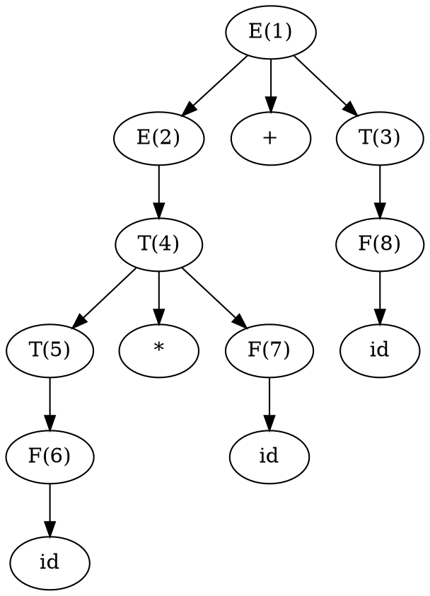

让我来详细讲解短语和句柄的概念。

在讲解短语和句柄之前，先明确：
- $S$是开始符号
- $\alpha,\beta\in V^*$表示任意符号串（可以包含非终结符）
- $A\in V_N$表示某个非终结符

短语（phrase）的定义：
如果存在推导$S\xRightarrow{*}\alpha A\beta\xRightarrow{+}\alpha\gamma\beta$，那么在句型$\alpha\gamma\beta$中，子串$\gamma$称为这个句型相对于非终结符$A$的短语。简称$\gamma$是句型$\alpha\gamma\beta$的一个短语。

当推导只需要一步时，就得到了直接短语的定义：
如果存在推导$S\xRightarrow{*}\alpha A\beta\Rightarrow\alpha\gamma\beta$（即有$A\rightarrow\gamma$是一个产生式），那么$\gamma$是这个句型的一个直接短语。

例如，对于下面的文法：
$$
\begin{aligned}
E &\rightarrow E+T|T \\
T &\rightarrow T*F|F \\
F &\rightarrow (E)|id
\end{aligned}
$$

考虑句型$id*id+id$的推导过程：
$$
\begin{aligned}
E &\Rightarrow_{rm} E+T \\
&\Rightarrow_{rm} E+F \\
&\Rightarrow_{rm} E+id \\
&\Rightarrow_{rm} T+id \\
&\Rightarrow_{rm} T*F+id \\
&\Rightarrow_{rm} T*id+id \\
&\Rightarrow_{rm} F*id+id \\
&\Rightarrow_{rm} id*id+id
\end{aligned}
$$

在这个句型中我们可以找到多个短语。让我们分别验证：

1. `id`是直接短语：
   对于最右边的`id`，存在推导：
   $$E\xRightarrow{*}id*id+F\Rightarrow id*id+id$$

   对于中间的`id`，存在推导：
   $$E\xRightarrow{*}id*F+id\Rightarrow id*id+id$$

   对于最左边的`id`，存在推导：
   $$E\xRightarrow{*}F*id+id\Rightarrow id*id+id$$

   其中$F\rightarrow id$是产生式规则。

2. `id*id`是短语：
   存在推导：
   $$
   \begin{aligned}
   E &\xRightarrow{*} T+id \\
   &\Rightarrow T*F+id \\
   &\Rightarrow F*F+id \\
   &\xRightarrow{+} id*id+id
   \end{aligned}
   $$
   其中`id*id`对应于非终结符$T$。

3. `id*id+id`是短语：
   存在推导：
   $$E\xRightarrow{*}E\xRightarrow{+}id*id+id$$
   其中整个句型`id*id+id`对应于开始符号（非终结符）$E$。

句柄（handle）的定义：
1. 句柄是句型中最左边的直接短语
2. 形式化定义：如果存在最右推导$S\xRightarrow{*}_{rm}\alpha A\beta\Rightarrow_{rm}\alpha\gamma\beta$，那么产生式$A\rightarrow\gamma$和$\gamma$在句型中的位置就构成了这个句型的句柄

句柄的重要性质：
- 句柄总是一个直接短语
- 一个句型可以有多个直接短语，但只有一个句柄
- 归约句柄可以得到最右推导的前一个句型
- 自下而上分析实际上就是不断识别和归约句柄的过程

例如，对于上面的句型$id*id+id$：
1. 最左边的`id`是一个句柄，可以归约为$F$
2. 归约后得到$F*id+id$
3. 接着继续寻找最左直接短语并归约
4. 通过这个过程，最终可以归约到开始符号$E$

在实际的语法分析中，准确识别句柄是自下而上分析的关键任务。各种自下而上的分析方法（如LR分析）的核心就是如何正确、高效地识别句柄。

***

我来详细解释如何通过语法分析树找出短语、直接短语和句柄。

对于文法：
$$
\begin{aligned}
E &\rightarrow E+T|T \\
T &\rightarrow T*F|F \\
F &\rightarrow (E)|id
\end{aligned}
$$

和句子`id*id+id`，我们先画出语法分析树并为每个内部节点编号：

要找出所有短语，我们需要对每个内部节点进行分析。根据短语的形式化定义：如果存在推导$S\xRightarrow{*}\alpha A\beta\xRightarrow{+}\alpha\gamma\beta$，那么在句型$\alpha\gamma\beta$中，子串$\gamma$称为这个句型相对于非终结符$A$的短语。

具体分析方法是：
1. 对于每个内部节点（对应某个非终结符$A$）
2. 找出该节点子树对应的符号串$\gamma$
3. 在句型（这里是句子`id*id+id`）中标识出$\gamma$的范围，它前面的部分就是$\alpha$，后面的部分就是$\beta$
4. 把$\gamma$替换为$A$得到$\alpha A\beta$，这样就能写出符合形式化定义$S\xRightarrow{*}\alpha A\beta\xRightarrow{+}\alpha\gamma\beta$的推导过程，其中$\alpha\gamma\beta$正是我们最初要分析的句型

我们可以列出下面这个表，其中第二列显示了完整的推导过程——从开始符号$S$推导到$\alpha A\beta$（中间的$A$标红），再通过一步或多步推导得到原句子（把最终得到的短语$\gamma$标红）。在第二步推导上方写出了对应的推导式或产生式，这个推导式或产生式的左部就是我们关注的非终结符，右部就是它最终推导得到的符号串，这样可以更清楚地看出每个短语是相对于哪个非终结符得到的：

| 节点编号 | 推导过程 |
|---------|---------|
| 1 | $E\xRightarrow{*}{\color{red}E}\xRightarrow{E\xRightarrow{+}id*id+id}{\color{red}id*id+id}$ |
| 2 | $E\xRightarrow{*}{\color{red}E}+id\xRightarrow{E\xRightarrow{+}id*id}{\color{red}id*id}+id$ |
| 3 | $E\xRightarrow{*}id*id+{\color{red}T}\xRightarrow{T\xRightarrow{+}id}id*id+{\color{red}id}$ |
| 4 | $E\xRightarrow{*}{\color{red}T}+id\xRightarrow{T\xRightarrow{+}id*id}{\color{red}id*id}+id$ |
| 5 | $E\xRightarrow{*}{\color{red}T}*id+id\xRightarrow{T\xRightarrow{+}id}{\color{red}id}*id+id$ |
| 6 | $E\xRightarrow{*}{\color{red}F}*id+id\xRightarrow{F\rightarrow id}{\color{red}id}*id+id$ |
| 7 | $E\xRightarrow{*}id*{\color{red}F}+id\xRightarrow{F\rightarrow id}id*{\color{red}id}+id$ |
| 8 | $E\xRightarrow{*}id*id+{\color{red}F}\xRightarrow{F\rightarrow id}id*id+{\color{red}id}$ |

从这个表中我们可以发现：
1. 所有标红的子串都是短语，因为它们都满足形式化定义中的推导关系
2. 直接短语是那些在最后一步推导中只使用了一个产生式的短语，即推导中带有$\rightarrow$而不是$\xRightarrow{+}$的短语。在这个例子中就是：
   - 节点6对应的`id`（通过$F\rightarrow id$直接得到）
   - 节点7对应的`id`（通过$F\rightarrow id$直接得到）
   - 节点8对应的`id`（通过$F\rightarrow id$直接得到）
3. 句柄就是这些直接短语中最左边的那个，即节点6对应的`id`，因为它是最左边的可以通过一个产生式直接归约的短语

这种分析方法让我们能够系统地找出一个句子中的所有短语、直接短语和句柄，而且能够清楚地看到每个短语是如何通过推导得到的。

***

我来详细讲解移进-归约法（Shift-Reduce Parsing）的基本原理和工作过程。

移进-归约分析的基本组成：

1. 输入缓冲区：
   - 存放待分析的输入符号串
   - 符号串右端有一个结束标记$\#$

2. 分析栈：
   - 存放已经处理过的符号
   - 栈底有一个起始标记$\#$
   - 栈中元素可以是终结符或非终结符

3. 四种基本动作：
   - 移进（shift）：把输入缓冲区的第一个符号移入栈顶
   - 归约（reduce）：用某个产生式$A\rightarrow\beta$把栈顶的$\beta$归约为$A$
   - 接受（accept）：分析成功完成
   - 报错（error）：发现语法错误

例如，考虑文法：
$$
\begin{aligned}
E &\rightarrow E+T|T \\
T &\rightarrow T*F|F \\
F &\rightarrow (E)|id
\end{aligned}
$$

对输入串`id*id+id`的分析过程（用$\vdash$表示一个分析步骤）：

| 步骤 | 栈内容 | 输入串 | 动作 |
|-----|--------|--------|-----|
| 1 | $\#$ | $id*id+id\#$ | 移进 |
| 2 | $\#id$ | $*id+id\#$ | 按$F\rightarrow id$归约 |
| 3 | $\#F$ | $*id+id\#$ | 按$T\rightarrow F$归约 |
| 4 | $\#T$ | $*id+id\#$ | 移进 |
| 5 | $\#T*$ | $id+id\#$ | 移进 |
| 6 | $\#T*id$ | $+id\#$ | 按$F\rightarrow id$归约 |
| 7 | $\#T*F$ | $+id\#$ | 按$T\rightarrow T*F$归约 |
| 8 | $\#T$ | $+id\#$ | 按$E\rightarrow T$归约 |
| 9 | $\#E$ | $+id\#$ | 移进 |
| 10 | $\#E+$ | $id\#$ | 移进 |
| 11 | $\#E+id$ | $\#$ | 按$F\rightarrow id$归约 |
| 12 | $\#E+F$ | $\#$ | 按$T\rightarrow F$归约 |
| 13 | $\#E+T$ | $\#$ | 按$E\rightarrow E+T$归约 |
| 14 | $\#E$ | $\#$ | 接受 |

移进-归约分析中的关键问题：

1. 移进-归约冲突：
   - 在某些状态下，既可以移进也可以归约
   - 需要通过额外的信息（如优先级和结合性）来解决

2. 归约-归约冲突：
   - 在某些状态下，可以使用多个不同的产生式进行归约
   - 通常表明文法存在二义性

3. 句柄的识别：
   - 每次归约实际上就是识别出一个句柄
   - 句柄总是出现在栈顶
   - 正确识别句柄是实现正确分析的关键

移进-归约分析的特点：

1. 优点：
   - 可以处理大部分常用的程序设计语言
   - 分析过程直观易懂
   - 易于实现

2. 缺点：
   - 需要额外的机制来解决冲突
   - 对某些文法可能出现回溯
   - 效率可能不如其他方法

3. 改进方向：
   - 引入状态来指导分析动作的选择
   - 使用预测技术减少冲突
   - 结合优先级和结合性规则

这种分析方法是很多实际编译器中使用的LR分析技术的基础。通过添加状态信息和构造分析表，可以把这种基本的移进-归约方法发展成为功能强大的LR分析器。
