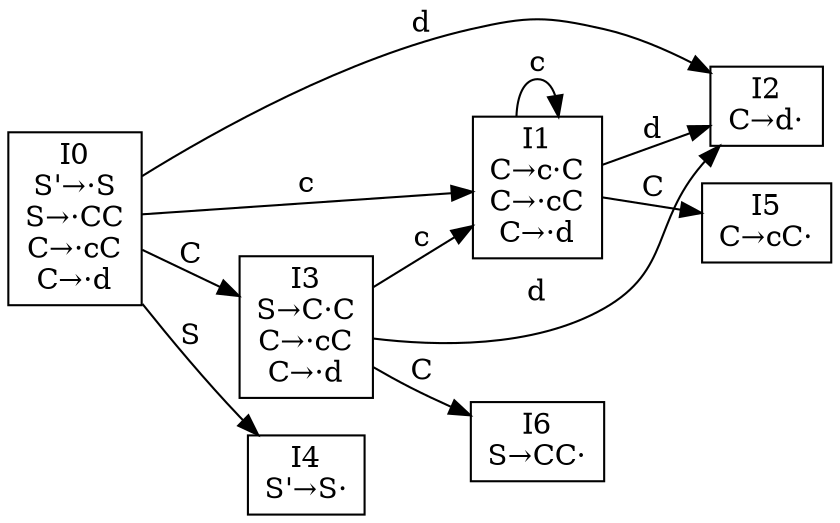
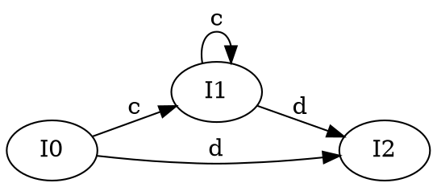
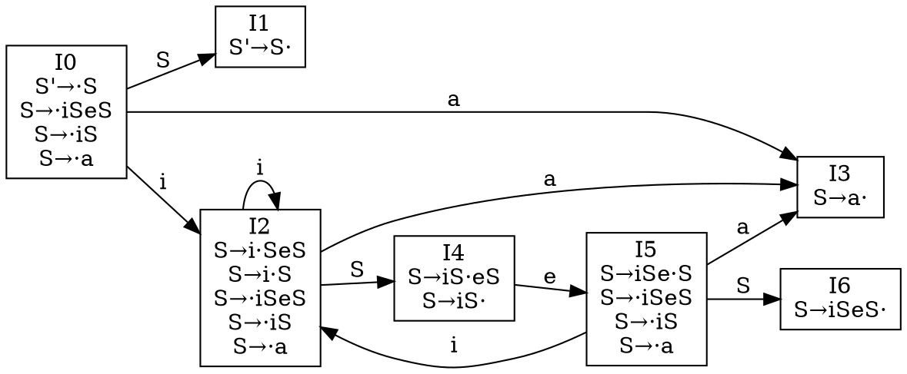

好的，我来详细讲解LR(0)项目的概念和构造方法。

LR(0)项目是在某个产生式右部插入一个点号$\cdot$后得到的表达式。设有产生式$A\rightarrow\alpha$，其对应的LR(0)项目形式是：

$A\rightarrow\alpha_1\cdot\alpha_2$

其中$\alpha_1\alpha_2=\alpha$，点号$\cdot$表示当前分析到的位置。比如对于产生式$E\rightarrow E+T$，它可以产生以下四个LR(0)项目：

$E\rightarrow\cdot E+T$
$E\rightarrow E\cdot+T$
$E\rightarrow E+\cdot T$
$E\rightarrow E+T\cdot$

LR(0)项目的重要性质：
1. 点号$\cdot$在最左边，表示准备用这个产生式进行归约
2. 点号$\cdot$在最右边，表示已经完成了这个产生式的归约
3. 点号$\cdot$在中间，表示正在用这个产生式进行分析

为了构造LR分析器，我们需要计算LR(0)项目集的闭包。给定一个项目集$I$，它的闭包$\text{CLOSURE}(I)$的计算规则是：

1. $I$中的所有项目都属于$\text{CLOSURE}(I)$
2. 如果$\text{CLOSURE}(I)$中有项目$A\rightarrow\alpha\cdot B\beta$，且有产生式$B\rightarrow\gamma$，那么项目$B\rightarrow\cdot\gamma$也属于$\text{CLOSURE}(I)$
3. 重复应用规则2，直到不能添加新的项目

例如，考虑文法：

$$
\begin{aligned}
S&\rightarrow E \\
E&\rightarrow E+T \\
E&\rightarrow T \\
T&\rightarrow (E) \\
T&\rightarrow id
\end{aligned}
$$

对于项目$S\rightarrow\cdot E$，它的闭包计算过程是：

1. 初始项目：$S\rightarrow\cdot E$
2. 因为点号后面是$E$，所以加入$E$的所有产生式：
   - $E\rightarrow\cdot E+T$
   - $E\rightarrow\cdot T$
3. 因为新加入的项目中点号后面有$T$，继续加入$T$的产生式：
   - $T\rightarrow\cdot(E)$
   - $T\rightarrow\cdot id$

最终得到的闭包是：

$$
\begin{aligned}
\text{CLOSURE}(\{S\rightarrow\cdot E\})=\{&S\rightarrow\cdot E, \\
&E\rightarrow\cdot E+T, \\
&E\rightarrow\cdot T, \\
&T\rightarrow\cdot(E), \\
&T\rightarrow\cdot id\}
\end{aligned}
$$

另外，我们还需要定义$\text{GOTO}$函数，它计算项目集$I$对于文法符号$X$的后继项目集：

$\text{GOTO}(I,X)=\text{CLOSURE}(\{A\rightarrow\alpha X\cdot\beta|A\rightarrow\alpha\cdot X\beta\in I\})$

即把$I$中所有点号$\cdot$后面是$X$的项目的点号向后移动一位，然后求闭包。

这些概念和操作是构造LR(0)分析器的基础，通过这些可以构造出完整的LR(0)状态集和状态转换图。这些项目集最终会用于构造LR分析表，指导语法分析过程。

***

让我先从拓广文法讲起，然后详细解释LR(0)项目集和项目集规范族。

一、拓广文法

对于任意文法$G$，其拓广文法$G'$通过在原文法基础上增加一个新的开始符号$S'$和一个新的产生式$S'\rightarrow S$得到，其中$S$是$G$的开始符号。这样做的目的是：
1. 保证分析过程只在最后一步完成归约
2. 使新的开始符号$S'$只出现在一个产生式的左部

比如对于算术表达式文法：

$$
\begin{aligned}
E&\rightarrow E+T|T \\
T&\rightarrow T*F|F \\
F&\rightarrow (E)|id
\end{aligned}
$$

其拓广文法为：

$$
\begin{aligned}
S'&\rightarrow E \\
E&\rightarrow E+T|T \\
T&\rightarrow T*F|F \\
F&\rightarrow (E)|id
\end{aligned}
$$

二、LR(0)项目集与规范族

LR(0)项目集是一个LR(0)项目的集合。LR(0)项目集规范族是一个文法的所有可能的项目集族，它包含了文法分析过程中可能出现的所有状态。我们通过以下步骤构造项目集规范族：

1. 构造初始项目集$I_0$
   - 从拓广文法的开始产生式$S'\rightarrow\cdot S$构造
   - 求其闭包$\text{CLOSURE}(\{S'\rightarrow\cdot S\})$

2. 构造后继项目集
   - 对于每个项目集$I_i$
   - 对于每个文法符号$X$
   - 计算$\text{GOTO}(I_i,X)$

3. 重复步骤2直到不能产生新的项目集

生成的所有项目集的集合就构成了这个文法的LR(0)项目集规范族，通常记作$C=\{I_0,I_1,\ldots,I_n\}$。

例如，考虑简单的表达式文法：

$$
\begin{aligned}
S'&\rightarrow E \\
E&\rightarrow E+T|T \\
T&\rightarrow id
\end{aligned}
$$

其项目集规范族的构造过程：

1. 初始项目集$I_0$：
   $$
   \begin{aligned}
   &S'\rightarrow\cdot E \\
   &E\rightarrow\cdot E+T \\
   &E\rightarrow\cdot T \\
   &T\rightarrow\cdot id
   \end{aligned}
   $$

2. 从$I_0$出发，对于终结符`id`：
   $I_1=\text{GOTO}(I_0,id)$：
   $$
   \begin{aligned}
   &T\rightarrow id\cdot
   \end{aligned}
   $$

3. 从$I_0$出发，对于非终结符$T$：
   $I_2=\text{GOTO}(I_0,T)$：
   $$
   \begin{aligned}
   &E\rightarrow T\cdot
   \end{aligned}
   $$

4. 从$I_0$出发，对于非终结符$E$：
   $I_3=\text{GOTO}(I_0,E)$：
   $$
   \begin{aligned}
   &S'\rightarrow E\cdot \\
   &E\rightarrow E\cdot+T
   \end{aligned}
   $$

5. 从$I_3$出发，对于终结符$+$：
   $I_4=\text{GOTO}(I_3,+)$：
   $$
   \begin{aligned}
   &E\rightarrow E+\cdot T \\
   &T\rightarrow\cdot id
   \end{aligned}
   $$

6. 从$I_4$出发，对于非终结符$T$：
   $I_5=\text{GOTO}(I_4,T)$：
   $$
   \begin{aligned}
   &E\rightarrow E+T\cdot
   \end{aligned}
   $$

这样我们得到了这个简单文法的完整LR(0)项目集规范族$C=\{I_0,I_1,I_2,I_3,I_4,I_5\}$。每个项目集代表了分析过程中的一个状态，我们需要考虑：
1. 项目中点号$\cdot$后面的符号（可能的移进操作）
2. 点号$\cdot$在最右端的项目（可能的归约操作）
3. 通过$\text{GOTO}$函数连接不同的项目集（状态转换关系）

这些项目集构成的规范族最终将用于构造LR(0)分析表，指导语法分析过程。如果一个文法是LR(0)文法，那么其规范族中的项目集在任何时候都不会出现移进-归约冲突或归约-归约冲突。通过项目集规范族，我们可以清晰地看到语法分析过程中所有可能的状态及其转换关系。

***

好的，我来讲解如何基于LR(0)项目集构造识别活前缀的DFA。

对于文法$G$，其LR(0)自动机是一个DFA $M=(Q,\Sigma,\delta,q_0,F)$，其中：

1. 状态集合$Q$
   - 每个状态对应一个LR(0)项目集
   - 初始状态$q_0$对应初始项目集$I_0$
   - 项目集通过$\text{CLOSURE}$运算得到闭包

2. 输入符号集$\Sigma$
   - 包含文法中所有的终结符和非终结符
   - $\Sigma=V_T\cup V_N$

3. 状态转移函数$\delta$
   - 基于$\text{GOTO}$函数定义
   - 如果$\text{GOTO}(I_i,X)=I_j$，则$\delta(q_i,X)=q_j$

让我用一个具体的例子来说明。考虑文法：

$$
\begin{aligned}
S'&\rightarrow S \\
S&\rightarrow CC \\
C&\rightarrow cC|d
\end{aligned}
$$

构造过程：

1. 构造初始项目集$I_0$：

   $$
   \begin{aligned}
   I_0=\text{CLOSURE}(\{S'\rightarrow\cdot S\})=
   \{&S'\rightarrow\cdot S, \\
   &S\rightarrow\cdot CC, \\
   &C\rightarrow\cdot cC, \\
   &C\rightarrow\cdot d\}
   \end{aligned}
   $$

2. 计算$I_0$的后继状态：
   
   对$c$：$I_1=\text{GOTO}(I_0,c)$：
   $$
   \begin{aligned}
   \{&C\rightarrow c\cdot C, \\
   &C\rightarrow\cdot cC, \\
   &C\rightarrow\cdot d\}
   \end{aligned}
   $$

   对$d$：$I_2=\text{GOTO}(I_0,d)$：
   $$
   \{C\rightarrow d\cdot\}
   $$

   对$C$：$I_3=\text{GOTO}(I_0,C)$：
   $$
   \begin{aligned}
   \{&S\rightarrow C\cdot C, \\
   &C\rightarrow\cdot cC, \\
   &C\rightarrow\cdot d\}
   \end{aligned}
   $$

   对$S$：$I_4=\text{GOTO}(I_0,S)$：
   $$
   \{S'\rightarrow S\cdot\}
   $$

3. 继续计算其他状态的后继：

   从$I_1$对$c$：$\text{GOTO}(I_1,c)=I_1$
   
   从$I_1$对$d$：$\text{GOTO}(I_1,d)=I_2$

   从$I_1$对$C$：$I_5=\text{GOTO}(I_1,C)$：
   $$
   \{C\rightarrow cC\cdot\}
   $$

   从$I_3$对$C$：$I_6=\text{GOTO}(I_3,C)$：
   $$
   \{S\rightarrow CC\cdot\}
   $$

   从$I_3$对$c$：$\text{GOTO}(I_3,c)=I_1$
   
   从$I_3$对$d$：$\text{GOTO}(I_3,d)=I_2$

这样就得到了完整的LR(0)自动机的状态集合和转移函数。可以用DOT语言表示这个DFA：



在这个DFA中，每个节点都以方框形式显示其完整的项目集内容，点号"·"表示分析位置，项目之间用换行符分隔，这样可以直观地看到每个状态包含的所有项目信息。

这个DFA可以用来：
1. 识别文法的所有活前缀
2. 指导LR(0)分析器的动作
3. 作为构造LR(0)分析表的基础

通过这个DFA，我们可以：
- 判断某个状态是否有移进-归约冲突或归约-归约冲突
- 确定在每个状态下应该采取的分析动作
- 确定状态转换序列，指导语法分析过程

***

活前缀（viable prefix）是LR分析中的一个重要概念。让我来详细解释：

活前缀的定义：
- 如果右句型$\alpha\beta w$中$\beta$是句柄
- 那么$\alpha\beta$的任何前缀都是一个活前缀

形式化定义：
如果存在推导$S\xRightarrow{*}_{rm}\alpha Aw\Rightarrow_{rm}\alpha\beta w$，其中：
- $\alpha\beta$是句型的一个前缀
- $\beta$是句柄
- $w$是终结符串
- $A\rightarrow\beta$是某个产生式

那么$\alpha\beta$的任何前缀都是活前缀。

***

让我来解释活前缀在LR(0)自动机中的体现。

LR(0)自动机通过其状态和转换来识别活前缀。具体来说，一个串是活前缀，当且仅当它能使LR(0)自动机从初始状态$I_0$转换到某个有效状态。这个关系可以形式化地表示为：

对于文法$G$的一个活前缀$\gamma$，存在一个规范推导：
$$S'\xRightarrow{*}_{rm}\alpha Aw\Rightarrow_{rm}\alpha\beta w$$

其中：
- $\gamma$是$\alpha\beta$的前缀
- $A\rightarrow\beta$是产生式
- $w$是终结符串

在LR(0)自动机中，这个活前缀$\gamma$的识别过程体现为：

1. 状态转换序列：
   - 从初始状态$I_0$开始
   - 对$\gamma$中的每个符号$X$进行状态转换$\text{GOTO}(I_i,X)$
   - 最终到达某个状态$I_k$

2. 状态中的项目反映了可能的句柄：
   - 如果$\gamma$是$\alpha\beta$的真前缀，那么到达的状态$I_k$中会包含形如$A\rightarrow\delta\cdot\eta$的项目，其中$\delta\eta=\beta$
   - 如果$\gamma=\alpha\beta$，那么状态$I_k$中会包含项目$A\rightarrow\beta\cdot$

让我们通过一个具体的例子来说明。考虑文法：

$$
\begin{aligned}
S'&\rightarrow S \\
S&\rightarrow CC \\
C&\rightarrow cC|d
\end{aligned}
$$

在分析输入串`ccdd`（这是一个合法的句子，因为$S\Rightarrow CC\Rightarrow Cd\Rightarrow cCd\Rightarrow ccCd\Rightarrow ccdd$）的过程中：

| 步骤 | 状态栈 | 符号栈 | 输入串 | 动作 |
|-----|--------|--------|--------|------|
| 1 | $0$ | $\epsilon$ | $ccdd\$$ | 移进到$I_1$ |
| 2 | $0\,1$ | $c$ | $cdd\$$ | 移进到$I_1$ |
| 3 | $0\,1\,1$ | $cc$ | $dd\$$ | 移进到$I_2$ |
| 4 | $0\,1\,1\,2$ | $ccd$ | $d\$$ | 按$C\rightarrow d$归约 |
| 5 | $0\,1\,1\,5$ | $ccC$ | $d\$$ | 按$C\rightarrow cC$归约 |
| 6 | $0\,1\,5$ | $cC$ | $d\$$ | 按$C\rightarrow cC$归约 |
| 7 | $0\,3$ | $C$ | $d\$$ | 移进到$I_2$ |
| 8 | $0\,3\,2$ | $Cd$ | $\$$ | 按$C\rightarrow d$归约 |
| 9 | $0\,3\,6$ | $CC$ | $\$$ | 按$S\rightarrow CC$归约 |
| 10 | $0\,4$ | $S$ | $\$$ | 按$S'\rightarrow S$归约（接受） |

从这个分析过程我们可以看出活前缀在LR(0)自动机中的具体体现：

1. 状态转换对应：
   - 每个活前缀都对应一个有效的状态转换序列
   - 比如活前缀`cc`对应状态转换序列$[I_0,I_1,I_1]$
   - 状态栈实际记录了识别活前缀的过程

2. 句柄识别：
   - 状态中的项目直接反映了句柄识别的进展
   - 例如在状态$I_1$中的项目$C\rightarrow c\cdot C$表示正在寻找可能的句柄
   - 在状态$I_2$中的项目$C\rightarrow d\cdot$表示已找到一个完整句柄

3. 活前缀的累积性：
   - 符号栈中出现的所有内容$\{\epsilon,c,cc,ccd,ccC,cC,C,Cd,CC,S\}$都是活前缀
   - 每个活前缀都能通过LR(0)自动机的状态转换得到确认
   - 活前缀集合反映了规范规约过程中的所有有效中间状态

这种对应关系使得LR(0)自动机能够：
1. 准确识别输入串中的句柄
2. 正确指导移进-归约动作的选择
3. 保证分析过程严格按照最右推导的逆过程进行

***

要找出所有仅由终结符组成的活前缀，最直接的方法是观察LR(0)自动机中的状态转换。

对于文法：
$$
\begin{aligned}
S'&\rightarrow S \\
S&\rightarrow CC \\
C&\rightarrow cC|d
\end{aligned}
$$

从LR(0)自动机可以看到，终结符的状态转换只有：
1. 从$I_0$可以读入`c`转到$I_1$
2. 从$I_1$可以继续读入`c`保持在$I_1$（自环）
3. 从$I_0$或$I_1$可以读入`d`转到$I_2$

因此所有由终结符构成的活前缀可以用正则表达式表示为：

$c^*d?$

这表示活前缀可以是：
- 任意数量的`c`（包括0个）
- 后面可以跟一个可选的`d`

***

好的，我来详细说明这个算法。

算法：构造活前缀正则表达式
输入：LR(0)自动机$M=(Q,\Sigma,\delta,q_0,F)$
输出：描述所有终结符活前缀的正则表达式$R$

第一步：构造可达状态集

1. 定义可达状态集$V$：
   - 初始时$V=\{q_0\}$
   - 对$V$中的每个状态$q$和每个终结符$a$：
     - 如果$\delta(q,a)=p$存在，则将$p$加入$V$
   - 重复直到$V$不再增大

2. 构造状态转移图$G=(V,E)$：
   - 节点集合就是$V$
   - 边集合$E$包含所有$q\xrightarrow{a}p$，其中：
     - $q,p\in V$
     - $a$是终结符
     - $\delta(q,a)=p$

第二步：构造正则表达式

1. 对每个状态$q\in V$，构造从$q_0$到$q$的路径正则表达式$R_q$：
   - 初始时$R_{q_0}=\epsilon$
   - 对其他状态初始化为$\emptyset$

2. 重复以下步骤直到所有$R_q$不再变化：
   - 对每个边$p\xrightarrow{a}q$：
     - 如果$R_p\neq\emptyset$：
       - 更新$R_q=R_q|R_p a$

3. 最终结果$R$是所有非空$R_q$的并：
   $R=\sum_{q\in V,R_q\neq\emptyset}R_q$

   其中$\sum$表示用选择运算符`|`连接所有项。

让我们用之前的例子来说明：

$$
\begin{aligned}
S'&\rightarrow S \\
S&\rightarrow CC \\
C&\rightarrow cC|d
\end{aligned}
$$

1. 构造可达状态集$V$：
   - 从$I_0$开始
   - 通过`c`可达$I_1$
   - 通过`d`可达$I_2$
   - 从$I_1$通过`c`可回到$I_1$
   - 从$I_1$通过`d`可达$I_2$
   所以$V=\{I_0,I_1,I_2\}$

2. 构造转移图：
   ```dot
   digraph G {
       rankdir=LR;
       I0 -> I1 [label="c"];
       I0 -> I2 [label="d"];
       I1 -> I1 [label="c"];
       I1 -> I2 [label="d"];
   }
   ```

3. 构造正则表达式：
   - $R_{I_0}=\epsilon$
   - 第一轮迭代（考虑所有可能的边）：
     - 从$I_0\xrightarrow{c}I_1$得到$c$
     - 从$I_1\xrightarrow{c}I_1$得到$cc$
     - 所以$R_{I_1}=c|cc$
     - 从$I_0\xrightarrow{d}I_2$得到$d$
     - 从$I_1\xrightarrow{d}I_2$得到$cd$
     - 所以$R_{I_2}=d|cd|ccd$
   - 第二轮迭代：
     - $R_{I_1}=c|cc|ccc$
     - $R_{I_2}=d|cd|ccd|cccd$
   - 继续迭代...最终得到：
     - $R_{I_1}=c^+$
     - $R_{I_2}=d|c^+d=c^*d$

4. 最终结果：
   $R=\epsilon|c^+|c^*d=c^*|c^*d=c^*(\epsilon|d)=c^*d?$

这个算法的优点是：
1. 系统性：保证找到所有可能的活前缀
2. 可扩展性：适用于任意LR(0)文法
3. 正确性：基于状态转换的完整性

缺点是：
1. 可能需要多次迭代
2. 正则表达式可能不是最简形式
3. 对于复杂文法计算量较大

实际应用中，我们可以通过一些优化来改进这个算法：
1. 使用动态规划减少重复计算
2. 采用正则表达式化简技术
3. 识别特殊模式直接生成对应表达式

***

事实上，我们还可以借助Arden引理来更系统地求解这个问题。Arden引理指出：如果$P$和$Q$是正则语言，且$P$不包含空串$\epsilon$，那么方程$X=PX+Q$的唯一解是$X=P^*Q$。

考虑同样的例子，我们已经得到可达状态集$V=\{I_0,I_1,I_2\}$和对应的转移图。现在我们用Arden引理来求解：

1. 首先写出状态转移关系表$R_{ij}$：

   |    | $I_0$ | $I_1$ | $I_2$ |
   |----|-------|-------|-------|
   | $I_0$ | $\emptyset$ | $c$ | $d$ |
   | $I_1$ | $\emptyset$ | $c$ | $d$ |
   | $I_2$ | $\emptyset$ | $\emptyset$ | $\emptyset$ |

2. 对每个状态$i$，设$X_i$表示从该状态开始的所有可能路径的标号构成的正则表达式。由于我们要求所有活前缀，所有状态都是接受状态，可以列出方程组：

   $$
   \begin{aligned}
   X_0&=cX_1+dX_2+\epsilon \\
   X_1&=cX_1+dX_2+\epsilon \\
   X_2&=\epsilon
   \end{aligned}
   $$

3. 从后向前求解：
   1. $X_2=\epsilon$（已知）
   
   2. 代入第二个方程：
      $$
      \begin{aligned}
      X_1&=cX_1+d\epsilon+\epsilon \\
      &=cX_1+d+\epsilon
      \end{aligned}
      $$
      根据Arden引理：$X_1=c^*(d+\epsilon)$
   
   3. 代入第一个方程：
      $$
      \begin{aligned}
      X_0&=cX_1+d\epsilon+\epsilon \\
      &=c[c^*(d+\epsilon)]+d+\epsilon \\
      &=cc^*(d+\epsilon)+d+\epsilon \\
      &=c^+(d+\epsilon)+d+\epsilon \\
      &=(c^+|\epsilon)(d+\epsilon) \\
      &=c^*d?
      \end{aligned}
      $$

因为$I_0$是初始状态，所以最终的正则表达式是$c^*d?$，这与我们之前通过转移图迭代构造得到的结果完全一致。

这种基于Arden引理的方法相比之前的迭代构造法有以下优点：
1. 计算过程更加理论化和系统化
2. 可以直接应用成熟的NFA→RE转换算法
3. 求解步骤更加清晰，不容易出错
4. 证明过程更加严谨，结果的正确性有理论保证

***

是的，你说得对。在实际分析中，通过观察状态转移图的结构，我们往往可以直观地写出路径正则表达式。对于这个例子：



直观上就能看出：
1. 从$I_0$到$I_1$的路径：先读一个`c`，然后可以读任意多个`c`，即$c^+$
2. 从$I_0$到$I_2$的路径：
   - 要么直接读一个`d`
   - 要么先经过$I_1$（读若干个`c`）再读一个`d`
   - 合起来就是$c^*d$

所以最终的正则表达式就是$c^*d?$。

这种直观分析的方法在状态转移图结构简单时特别有效，主要有以下几种常见模式：
1. 自环：表示$a^*$
2. 两点间多条平行边：表示选择$a|b$
3. 串联路径：表示连接$ab$
4. 菱形结构：表示可选$a?$

算法更多是作为一个理论保证和复杂情况下的系统性方法。

***

你说得对。LR(0)自动机确实和普通的DFA有着本质区别：

1. 普通DFA的目的：
   - 识别某种语言的字符串
   - 需要明确的接受状态来判断字符串是否属于该语言
   - 在处理完整个输入后，根据是否在接受状态来决定接受或拒绝

2. LR(0)自动机的目的：
   - 指导语法分析过程中的移进-归约决策
   - 识别活前缀，但不需要用"接受状态"来标记
   - 任何可达状态都是有效的（能识别活前缀的状态）

虽然在形式化定义中把LR(0)自动机写作五元组$M=(Q,\Sigma,\delta,q_0,F)$是为了与DFA的形式保持一致，但实际上$F$（接受状态集合）在LR(0)分析中并不起实质性作用。重要的是：

1. 状态集$Q$（项目集规范族）
   - 每个状态包含的LR(0)项目反映了分析进展
   - 指示当前可能的句柄位置
   - 决定下一步应该采取的动作（移进或归约）

2. 转移函数$\delta$
   - 定义状态间的转换关系
   - 指导符号的移进操作
   - 体现语法结构的识别过程

3. 初始状态$q_0$（$I_0$）
   - 分析的起点
   - 包含增广文法的初始项目及其闭包

所以我认为，在讨论LR(0)自动机时，完全可以省略接受状态这个概念，将其看作一个三元组$(Q,\Sigma,\delta)$加上指定的初始状态$q_0$就足够了。

***

我来详细讲解LR(0)文法的定义和LR(0)分析表的构造过程。

一、LR(0)文法定义

如果一个文法对应的LR(0)自动机满足下列条件，则称该文法是LR(0)文法：

1. 对于任意项目集$I_i$，如果$I_i$含有项目$A\rightarrow\alpha\cdot$，那么$I_i$中：
   - 不能含有任何形如$B\rightarrow\beta\cdot a\gamma$的项目（$a$是终结符）
   - 不能含有其他形如$C\rightarrow\gamma\cdot$的项目

2. 换句话说，在任何状态下：
   - 不能同时存在移进和归约动作（无移进-归约冲突）
   - 不能同时存在多个归约动作（无归约-归约冲突）

二、LR(0)分析表的构造

在构造分析表时，我们把每个LR(0)项目集$I_i$视为一个状态（称为"状态$i$"）。LR(0)分析表包含两个部分：动作表ACTION和转移表GOTO。构造规则如下：

1. ACTION表的构造规则：
   
   对于状态$i$：
   - 如果项目$A\rightarrow\alpha\cdot a\beta$在状态$i$中（$a$是终结符），且$\text{GOTO}(I_i,a)=I_j$，则：
     $$\text{ACTION}[i,a]=\text{shift }j$$

   - 如果项目$A\rightarrow\alpha\cdot$在状态$i$中（$A\neq S'$），则对所有终结符$a$：
     $$\text{ACTION}[i,a]=\text{reduce }A\rightarrow\alpha$$

   - 如果项目$S'\rightarrow S\cdot$在状态$i$中，则：
     $$\text{ACTION}[i,\$]=\text{accept}$$

2. GOTO表的构造规则：
   
   对于状态$i$和非终结符$A$：
   - 如果$\text{GOTO}(I_i,A)=I_j$，则：
     $$\text{GOTO}[i,A]=j$$

例如，考虑文法：

$$
\begin{aligned}
S'&\rightarrow S &(0)\\
S&\rightarrow aAd &(1)\\
A&\rightarrow bc &(2)
\end{aligned}
$$

构造步骤：

1. 首先构造LR(0)项目集规范族：

   $I_0$：
   $$
   \begin{aligned}
   &S'\rightarrow\cdot S \\
   &S\rightarrow\cdot aAd
   \end{aligned}
   $$

   $I_1$（由$I_0$经过$a$）：
   $$
   \begin{aligned}
   &S\rightarrow a\cdot Ad \\
   &A\rightarrow\cdot bc
   \end{aligned}
   $$

   $I_2$（由$I_1$经过$b$）：
   $$A\rightarrow b\cdot c$$

   $I_3$（由$I_2$经过$c$）：
   $$A\rightarrow bc\cdot$$

   $I_4$（由$I_1$经过$A$）：
   $$S\rightarrow aA\cdot d$$

   $I_5$（由$I_4$经过$d$）：
   $$S\rightarrow aAd\cdot$$

   $I_6$（由$I_0$经过$S$）：
   $$S'\rightarrow S\cdot$$

2. 然后对每个状态检查其中的项目，根据项目的形式填写分析表：

   - 对于形如$A\rightarrow\alpha\cdot a\beta$的项目（点号后面是终结符）：
     填入移进动作$s_j$，其中$j$是$\text{GOTO}$函数的目标状态
   
   - 对于形如$A\rightarrow\alpha\cdot$的项目（点号在最右端）：
     填入归约动作$r_i$，其中$i$是使用的产生式编号
   
   - 对于形如$S'\rightarrow S\cdot$的项目：
     填入接受动作$\text{acc}$
   
   - 对于形如$A\rightarrow\alpha\cdot B\beta$的项目（点号后面是非终结符）：
     在GOTO表中填入目标状态号

   例如对$I_0$：
   - 看到项目$S\rightarrow\cdot aAd$，点号后面是终结符$a$，且$\text{GOTO}(I_0,a)=I_1$
   - 所以填入$\text{ACTION}[0,a]=s_1$
   - 看到项目$S'\rightarrow\cdot S$，点号后面是非终结符$S$，且$\text{GOTO}(I_0,S)=I_6$
   - 所以填入$\text{GOTO}[0,S]=6$

   最终得到的分析表：

   | 状态 | ACTION |     |     |     |     | GOTO |     |
   |-----|---------|-----|-----|-----|-----|------|-----|
   |     | $a$     | $b$ | $c$ | $d$ | $\$$ | $S$ | $A$ |
   | $0$ | $s_1$   |     |     |     |     | $6$  |     |
   | $1$ |         | $s_2$ |     |     |     |     | $4$ |
   | $2$ |         |     | $s_3$ |     |     |     |     |
   | $3$ | $r_2$   | $r_2$ | $r_2$ | $r_2$ | $r_2$ |     |     |
   | $4$ |         |     |     | $s_5$ |     |     |     |
   | $5$ | $r_1$   | $r_1$ | $r_1$ | $r_1$ | $r_1$ |     |     |
   | $6$ |         |     |     |     | $\text{acc}$ |     |     |

其中：
- $s_n$表示移进到状态$n$
- $r_n$表示用第$n$个产生式归约
- $\text{acc}$表示接受
- 空白表示报错

这是一个典型的LR(0)文法，因为：
1. 每个状态下要么只能移进，要么只能归约
2. 归约状态（状态3和状态5）中没有任何移进项目
3. 每个状态的动作都是明确无冲突的

LR(0)分析器的工作过程：
1. 维护状态栈和符号栈
2. 根据当前状态和输入符号查表决定动作：
   - 如果是移进，将状态和符号分别压入对应的栈
   - 如果是归约，弹出相应数量的状态和符号，压入归约结果
   - 如果是接受，分析成功结束
   - 如果是空白，报告语法错误

LR(0)分析的局限性：
1. 要求文法非常简单，实际中很少有文法直接满足LR(0)条件
2. 不能处理需要向前看符号的情况
3. 通常作为构造更强大的LR分析器（如SLR、LALR）的基础

***

让我详细讲解LR(0)分析的工作过程和实现方法。

LR(0)分析器使用两个栈：
1. 状态栈：存放状态编号
2. 符号栈：存放文法符号（终结符或非终结符）

分析步骤：

1. 初始化：
   - 状态栈压入初始状态0
   - 符号栈为空
   - 输入串末尾加上结束符号$\$$

2. 重复以下步骤直到接受或报错：
   - 设当前状态为$s$（状态栈顶）
   - 当前输入符号为$a$
   - 查询$\text{ACTION}[s,a]$确定动作

3. 根据ACTION表的内容执行相应动作：

   - 若$\text{ACTION}[s,a]=\text{shift }j$：
     - 将状态$j$压入状态栈
     - 将输入符号$a$压入符号栈
     - 指向下一个输入符号

   - 若$\text{ACTION}[s,a]=\text{reduce }A\rightarrow\beta$：
     - 从状态栈弹出$|\beta|$个状态
     - 从符号栈弹出$|\beta|$个符号
     - 设当前状态为$t$（现在的状态栈顶）
     - 查找$\text{GOTO}[t,A]=g$
     - 将状态$g$压入状态栈
     - 将非终结符$A$压入符号栈

   - 若$\text{ACTION}[s,a]=\text{accept}$：
     - 分析成功结束

   - 若$\text{ACTION}[s,a]$为空：
     - 报告语法错误

例如，考虑之前的文法：

$$
\begin{aligned}
S'&\rightarrow S &(0)\\
S&\rightarrow aAd &(1)\\
A&\rightarrow bc &(2)
\end{aligned}
$$

分析输入串$abcd$的过程：

| 步骤 | 状态栈 | 符号栈 | 输入串 | 动作 |
|------|--------|--------|--------|------|
| 1 | $0$ | | $abcd\$$ | 移进，状态1 |
| 2 | $0\,1$ | $a$ | $bcd\$$ | 移进，状态2 |
| 3 | $0\,1\,2$ | $ab$ | $cd\$$ | 移进，状态3 |
| 4 | $0\,1\,2\,3$ | $abc$ | $d\$$ | 归约，$A\rightarrow bc$ |
| 5 | $0\,1\,4$ | $aA$ | $d\$$ | 移进，状态5 |
| 6 | $0\,1\,4\,5$ | $aAd$ | $\$$ | 归约，$S\rightarrow aAd$ |
| 7 | $0\,6$ | $S$ | $\$$ | 接受 |

详细说明每一步：

1. 初始状态0，看到$a$，查表得$s_1$，移进到状态1
2. 状态1看到$b$，查表得$s_2$，移进到状态2
3. 状态2看到$c$，查表得$s_3$，移进到状态3
4. 状态3，查表得$r_2$（对任何输入符号都是$r_2$），使用$A\rightarrow bc$归约：
   - 弹出状态栈顶的2个状态
   - 弹出符号栈顶的$bc$
   - 当前状态为1，查GOTO表得$\text{GOTO}[1,A]=4$
   - 压入非终结符$A$和状态4
5. 状态4看到$d$，查表得$s_5$，移进到状态5
6. 状态5，查表得$r_1$，使用$S\rightarrow aAd$归约：
   - 弹出状态栈顶的3个状态
   - 弹出符号栈顶的$aAd$
   - 当前状态为0，查GOTO表得$\text{GOTO}[0,S]=6$
   - 压入非终结符$S$和状态6
7. 状态6看到$\$$，查表得$\text{acc}$，分析成功结束

我们可以写一个简单的LR(0)分析器算法：

**算法：** LR(0)语法分析
**输入：** 输入串$w$，ACTION表和GOTO表
**输出：** 如果$w$属于文法$L(G)$则接受，否则报错

1. $\text{state\_stack} \leftarrow [0]$
2. $\text{symbol\_stack} \leftarrow [\:]$ （空栈）
3. $w \leftarrow w\$$
4. $i \leftarrow 0$ （输入指针）
5. **while** $\text{true}$ **do**
6. $\quad s \leftarrow \text{state\_stack.top()}$
7. $\quad a \leftarrow w[i]$
8. $\quad$ **if** $\text{ACTION}[s,a] = \text{empty}$ **then**
9. $\quad\quad$ **return** "语法错误"
10. $\quad$ **if** $\text{ACTION}[s,a] = \text{shift }t$ **then**
11. $\quad\quad \text{state\_stack.push}(t)$
12. $\quad\quad \text{symbol\_stack.push}(a)$
13. $\quad\quad i \leftarrow i + 1$
14. $\quad$ **else if** $\text{ACTION}[s,a] = \text{reduce }A \rightarrow \beta$ **then**
15. $\quad\quad$ **for** $j \leftarrow 1$ **to** $|\beta|$ **do**
16. $\quad\quad\quad \text{state\_stack.pop()}$
17. $\quad\quad\quad \text{symbol\_stack.pop()}$
18. $\quad\quad t \leftarrow \text{state\_stack.top()}$
19. $\quad\quad g \leftarrow \text{GOTO}[t,A]$
20. $\quad\quad \text{state\_stack.push}(g)$
21. $\quad\quad \text{symbol\_stack.push}(A)$
22. $\quad$ **else if** $\text{ACTION}[s,a] = \text{accept}$ **then**
23. $\quad\quad$ **return** "接受"

LR(0)分析的优缺点：

优点：
1. 自底向上分析，可以及时发现错误
2. 不需要回溯，分析效率高
3. 可以处理左递归文法

缺点：
1. 要求文法必须是LR(0)文法，这个条件太严格
2. 不能处理有冲突的情况
3. 构造分析表比较复杂

为了解决这些限制，实际中常用的是SLR(1)、LALR(1)或LR(1)分析方法，它们都是在LR(0)的基础上改进得到的。

***

我来完整讲解SLR(1)分析，包括文法判定。

一、SLR(1)分析的基本思想

SLR(1)分析是在LR(0)基础上的改进，它通过引入向前看符号的FOLLOW集来解决一些LR(0)中的冲突。这样可以解决一些LR(0)中的移进-归约冲突。

二、SLR(1)文法的判定

一个文法是SLR(1)文法，当且仅当对于其LR(0)自动机的每个状态$I$：

1. 对于一般形式的冲突判定：
   
   假设状态$I$中包含如下形式的项目：
   $$
   \begin{aligned}
   I=\{&U_1\rightarrow x\cdot b_1y_1, U_2\rightarrow x\cdot b_2y_2, \dots, U_m\rightarrow x\cdot b_my_m, \\
   &V_1\rightarrow x\cdot, V_2\rightarrow x\cdot, \dots, V_n\rightarrow x\cdot\}
   \end{aligned}
   $$
   
   其中：
   - $U_i,V_i$都是非终结符
   - $x,y_i$是文法符号串（可以包含终结符和非终结符）
   - $b_i$是终结符

   必须满足：集合$\{b_1,b_2,\dots,b_m\}$与各个$\text{FOLLOW}(V_i)$两两互不相交

2. 这个一般形式可以推导出两种具体情况：

   - 对于移进-归约冲突的情况：
     - 如果状态$I$中有项目$A\rightarrow\alpha\cdot$且有项目$B\rightarrow\beta\cdot a\gamma$
     - 则必须满足$a\notin\text{FOLLOW}(A)$

   - 对于归约-归约冲突的情况：
     - 如果状态$I$中有项目$A\rightarrow\alpha\cdot$且有项目$B\rightarrow\beta\cdot$
     - 则必须满足$\text{FOLLOW}(A)\cap\text{FOLLOW}(B)=\emptyset$

三、SLR(1)分析表的构造规则

对每个状态$i$：

1. 移进动作：
   - 同LR(0)，如果项目$A\rightarrow\alpha\cdot a\beta$在状态$i$中（$a$是终结符），且$\text{GOTO}(I_i,a)=I_j$：
     $$\text{ACTION}[i,a]=\text{shift }j$$

2. 归约动作：
   - 如果项目$A\rightarrow\alpha\cdot$在状态$i$中：
     - 对所有$a\in\text{FOLLOW}(A)$：
       $$\text{ACTION}[i,a]=\text{reduce }A\rightarrow\alpha$$

3. 接受动作：
   - 同LR(0)，如果项目$S'\rightarrow S\cdot$在状态$i$中：
     $$\text{ACTION}[i,\$]=\text{accept}$$

4. GOTO动作：
   - 同LR(0)，如果$\text{GOTO}(I_i,A)=I_j$：
     $$\text{GOTO}[i,A]=j$$

四、举例说明

考虑文法：

$$
\begin{aligned}
S'&\rightarrow S &(0)\\
S&\rightarrow L=R &(1)\\
S&\rightarrow R &(2)\\
L&\rightarrow id &(3)\\
R&\rightarrow L &(4)
\end{aligned}
$$

1. 首先计算FOLLOW集：
   $$
   \begin{aligned}
   \text{FOLLOW}(S)&=\{\$\} \\
   \text{FOLLOW}(L)&=\{=,\$\} \\
   \text{FOLLOW}(R)&=\{\$\}
   \end{aligned}
   $$

2. 构造LR(0)项目集：

   $I_0$：
   $$
   \begin{aligned}
   &S'\rightarrow\cdot S \\
   &S\rightarrow\cdot L=R \\
   &S\rightarrow\cdot R \\
   &L\rightarrow\cdot id \\
   &R\rightarrow\cdot L
   \end{aligned}
   $$

   $I_1$（由$I_0$经过$id$）：
   $$
   \begin{aligned}
   &L\rightarrow id\cdot
   \end{aligned}
   $$

   $I_2$（由$I_0$经过$L$）：
   $$
   \begin{aligned}
   &S\rightarrow L\cdot=R \\
   &R\rightarrow L\cdot
   \end{aligned}
   $$

   $I_3$（由$I_0$经过$R$）：
   $$
   \begin{aligned}
   &S\rightarrow R\cdot
   \end{aligned}
   $$

   $I_4$（由$I_2$经过$=$）：
   $$
   \begin{aligned}
   &S\rightarrow L=\cdot R \\
   &R\rightarrow\cdot L \\
   &L\rightarrow\cdot id
   \end{aligned}
   $$

   $I_5$（由$I_4$经过$R$）：
   $$
   \begin{aligned}
   &S\rightarrow L=R\cdot
   \end{aligned}
   $$

   $I_6$（由$I_4$经过$L$）：
   $$
   \begin{aligned}
   &R\rightarrow L\cdot
   \end{aligned}
   $$

   $I_7$（由$I_0$经过$S$）：
   $$
   \begin{aligned}
   &S'\rightarrow S\cdot
   \end{aligned}
   $$

3. 检查是否是SLR(1)文法：
   - 在状态$I_2$中有潜在的移进-归约冲突：
     - 移进项目：$S\rightarrow L\cdot=R$
     - 归约项目：$R\rightarrow L\cdot$
   - 但$=\notin\text{FOLLOW}(R)=\{\$\}$，所以这不是真正的冲突
   - 其他状态都没有冲突
   - 因此这是一个SLR(1)文法

4. 构造分析表：

| 状态 | ACTION |     |     | GOTO |     |     |
|-----|---------|-----|-----|------|-----|-----|
|     | $id$    | $=$ | $\$$ | $S$  | $L$ | $R$ |
| 0   | $s_1$   |     |     | 7    | 2   | 3   |
| 1   |         | $r_3$ | $r_3$ |     |     |     |
| 2   |         | $s_4$ | $r_4$ |     |     |     |
| 3   |         |     | $r_2$ |     |     |     |
| 4   | $s_1$   |     |     |     | 6   | 5   |
| 5   |         |     | $r_1$ |     |     |     |
| 6   |         |     | $r_4$ |     |     |     |
| 7   |         |     | $\text{acc}$ |     |     |     |

分析过程举例，分析输入串$id=id$：

| 步骤 | 状态栈 | 符号栈 | 输入串 | 动作 |
|------|--------|--------|--------|------|
| 1 | $0$ | | $id=id\$$ | 移进，状态1 |
| 2 | $0\,1$ | $id$ | $=id\$$ | 归约，$L\rightarrow id$ |
| 3 | $0\,2$ | $L$ | $=id\$$ | 移进，状态4 |
| 4 | $0\,2\,4$ | $L=$ | $id\$$ | 移进，状态1 |
| 5 | $0\,2\,4\,1$ | $L=id$ | $\$$ | 归约，$L\rightarrow id$ |
| 6 | $0\,2\,4\,6$ | $L=L$ | $\$$ | 归约，$R\rightarrow L$ |
| 7 | $0\,2\,4\,5$ | $L=R$ | $\$$ | 归约，$S\rightarrow L=R$ |
| 8 | $0\,7$ | $S$ | $\$$ | 接受 |

SLR(1)的特点：

优点：
1. 比LR(0)能处理更多的文法
2. 构造过程相对简单，只需要额外计算FOLLOW集
3. 分析表相对紧凑

缺点：
1. 仍然不能处理所有的LR(1)文法
2. 有时候FOLLOW集可能太大，导致不必要的归约冲突
3. 不能处理需要更多上下文信息的情况

这就是为什么在实际中常常使用LALR(1)或完整的LR(1)分析方法。

***

从LR(0)自动机构造分析表

1. 移进动作和GOTO表项的构造
   - 遍历DFA中的每条边：
     - 如果边上标记是终结符$a$，从状态$i$到状态$j$：
       $$\text{ACTION}[i,a]=\text{shift }j$$
     - 如果边上标记是非终结符$A$，从状态$i$到状态$j$：
       $$\text{GOTO}[i,A]=j$$

2. 归约动作的构造
   - 对DFA的每个状态$i$：
     - 如果状态包含项目$A\rightarrow\alpha\cdot$
     - 对于每个$a\in\text{FOLLOW}(A)$：
       $$\text{ACTION}[i,a]=\text{reduce }A\rightarrow\alpha$$

3. 接受动作的构造
   - 如果某个状态包含项目$S'\rightarrow S\cdot$：
     $$\text{ACTION}[i,\$]=\text{accept}$$

具体例子参见[第七章作业前两题](CP_as/CP_as7.md)

***

让我们来分析if-else语句的匹配问题。对于下面这个描述if-else结构的文法：

$$
\begin{aligned}
S'&\rightarrow S &(0)\\
S&\rightarrow iSeS &(1)\\
S&\rightarrow iS &(2)\\
S&\rightarrow a &(3)
\end{aligned}
$$

其对应的LR(0)自动机如下：



请你根据这个DFA构造SLR(1)分析表，分析其中的冲突，并说明如何通过无二义性规则来消除这些冲突。

我来分析这个if-else问题。首先需要计算FOLLOW集，然后根据DFA构造分析表并找出冲突。

一、计算FOLLOW集：

1. 由于$S$是开始符号，所以$\$\in\text{FOLLOW}(S)$
2. 从产生式$S\rightarrow iSeS$可知，$e\in\text{FOLLOW}(S)$
3. 继续迭代，最终得到：
   $$\text{FOLLOW}(S)=\{e,\$\}$$

二、构造SLR(1)分析表：

状态$I_4$存在移进-归约冲突：
- 包含项目$S\rightarrow iS\cdot eS$（指示移进$e$）
- 包含项目$S\rightarrow iS\cdot$（指示归约）
- 而$e\in\text{FOLLOW}(S)$，因此在输入$e$时既可以移进也可以归约

完整的SLR(1)分析表如下：

| 状态 | ACTION |     |     |     | GOTO |
|-----|---------|-----|-----|-----|------|
|     | $i$    | $e$ | $a$ | $\$$ | $S$ |
| 0   | $s_2$   |     | $s_3$ |     | 1   |
| 1   |         |     |     | $\text{acc}$ |     |
| 2   | $s_2$   |     | $s_3$ |     | 4   |
| 3   |         | $r_3$ |     | $r_3$ |     |
| 4   |         | $s_5/r_2$ |     | $r_2$ |     |
| 5   | $s_2$   |     | $s_3$ |     | 6   |
| 6   |         | $r_1$ |     | $r_1$ |     |

在这个分析表中：
1. $s_n$表示移进到状态$n$
2. $r_n$表示用第$n$个产生式归约
3. $s_5/r_2$表示存在冲突：可以移进到状态5，也可以用产生式2归约

这个冲突正是著名的if-else匹配问题。当分析器处于状态$I_4$时，已经读入了形如$i\,S$的前缀，此时如果遇到输入符号$e$：
1. 可以选择移进$e$，期待后面还有$S$，最终归约为$S\rightarrow iSeS$
2. 也可以选择立即用$S\rightarrow iS$进行归约

这就是为什么这个文法不是SLR(1)文法，因为存在无法通过简单向前看符号解决的冲突。在实际编译器中，这个问题通常通过以下方式解决：
1. 采用最近匹配原则：else总是和最近的未匹配的if配对
2. 在语法分析阶段，优先选择移进而不是归约
3. 或者修改文法，引入明确的配对结构

其中前两种方法实际上是统一的：采用最近匹配原则的具体体现就是在冲突时优先选择移进而不是归约。按照这个规则修改后的分析表如下：

| 状态 | ACTION |     |     |     | GOTO |
|-----|---------|-----|-----|-----|------|
|     | $i$    | $e$ | $a$ | $\$$ | $S$ |
| 0   | $s_2$   |     | $s_3$ |     | 1   |
| 1   |         |     |     | $\text{acc}$ |     |
| 2   | $s_2$   |     | $s_3$ |     | 4   |
| 3   |         | $r_3$ |     | $r_3$ |     |
| 4   |         | $s_5$ |     | $r_2$ |     |
| 5   | $s_2$   |     | $s_3$ |     | 6   |
| 6   |         | $r_1$ |     | $r_1$ |     |

这样处理后，分析器在遇到else时总是优先选择将其与最近的未匹配的if进行配对，从而解决了if-else匹配的二义性问题。

***

关于运算符优先级和结合性规则如何消解LR分析中的冲突，可以参考[第七章作业](CP_as/CP_as7.md)，其中包含了几个典型的算术表达式文法实例及其详细的冲突处理过程。

***

让我详细讲解LR(1)项目及其构造方法。

LR(1)项目引入了"向前看符号"的概念，每个项目都是一个二元组$[A\rightarrow\alpha\cdot\beta,a]$，其中：
- $A\rightarrow\alpha\beta$是一个产生式
- 点号$\cdot$表示当前分析位置
- $a$是向前看符号（终结符或$\$$）

一、LR(1)项目的基本概念

1. 规范LR(1)项目的记法：
   $$[A\rightarrow\alpha\cdot\beta,a]$$
   这表示：
   - 已经匹配了$\alpha$
   - 期望匹配$\beta$
   - 在$\beta$匹配完成后，向前看符号应该是$a$

2. 向前看符号的含义：
   - 只有当下一个输入符号是$a$时，才能使用$A\rightarrow\alpha\beta$进行归约
   - 这比SLR(1)中使用FOLLOW集更精确

二、LR(1)项目集的闭包计算

给定一个LR(1)项目集$I$，其闭包$\text{CLOSURE}(I)$的计算规则：

1. $I$中的所有项目都属于$\text{CLOSURE}(I)$

2. 如果$[A\rightarrow\alpha\cdot B\beta,a]\in\text{CLOSURE}(I)$，且$B\rightarrow\gamma$是一个产生式：
   - 对于每个终结符$b\in\text{FIRST}(\beta a)$
   - $[B\rightarrow\cdot\gamma,b]$也属于$\text{CLOSURE}(I)$

3. 重复步骤2直到不能添加新的项目

举例说明闭包计算：
考虑文法：
$$
\begin{aligned}
S'&\rightarrow S \\
S&\rightarrow CC \\
C&\rightarrow cC|d
\end{aligned}
$$

对于项目$[S'\rightarrow\cdot S,\$]$，其闭包计算过程：

1. 初始项目：$[S'\rightarrow\cdot S,\$]$

2. 由于点号后面是$S$，看产生式$S\rightarrow CC$：
   - $\text{FIRST}(\$)=\{\$\}$
   - 添加$[S\rightarrow\cdot CC,\$]$

3. 对于$[S\rightarrow\cdot CC,\$]$，点号后面是$C$：
   - $\text{FIRST}(C\$)=\{c,d\}$
   - 添加：
     - $[C\rightarrow\cdot cC,c]$
     - $[C\rightarrow\cdot cC,d]$
     - $[C\rightarrow\cdot d,c]$
     - $[C\rightarrow\cdot d,d]$

最终得到的闭包是：
$$
\begin{aligned}
\text{CLOSURE}(\{[S'\rightarrow\cdot S,\$]\})=\{&[S'\rightarrow\cdot S,\$], \\
&[S\rightarrow\cdot CC,\$], \\
&[C\rightarrow\cdot cC,c], \\
&[C\rightarrow\cdot cC,d], \\
&[C\rightarrow\cdot d,c], \\
&[C\rightarrow\cdot d,d]\}
\end{aligned}
$$

三、LR(1)项目集的GOTO函数

对于LR(1)项目集$I$和文法符号$X$，$\text{GOTO}(I,X)$的计算规则：

1. 首先找出$I$中所有形如$[A\rightarrow\alpha\cdot X\beta,a]$的项目

2. 将点号移到$X$之后，得到$[A\rightarrow\alpha X\cdot\beta,a]$

3. 计算这些新项目集合的闭包

即：
$$\text{GOTO}(I,X)=\text{CLOSURE}(\{[A\rightarrow\alpha X\cdot\beta,a]|[A\rightarrow\alpha\cdot X\beta,a]\in I\})$$

四、LR(1)项目集规范族的构造

构造步骤：

1. 计算初始项目集$I_0=\text{CLOSURE}(\{[S'\rightarrow\cdot S,\$]\})$

2. 对于已经得到的项目集$I_i$：
   - 对于每个文法符号$X$
   - 如果$\text{GOTO}(I_i,X)$非空且不在已有的项目集中
   - 将其作为新的项目集加入规范族

3. 重复步骤2直到不能产生新的项目集

五、LR(1)项目的特点：

1. 优点：
   - 提供了最精确的向前看信息
   - 能处理更多的文法
   - 不会产生虚假的冲突

2. 缺点：
   - 项目集数量可能非常大
   - 构造过程复杂
   - 需要更多的存储空间

与其他分析方法的比较：
1. 比LR(0)多了向前看符号
2. 比SLR(1)的向前看信息更精确
3. 是LALR(1)的基础

这种精确的向前看信息使得LR(1)分析器能够处理几乎所有的确定性上下文无关文法，但由于其项目集数量庞大，实际中更常用的是LALR(1)分析器，它在保持LR(1)大部分分析能力的同时，大大减少了状态数量。

***

好的，我来详细讲解LR(1)分析表的构造过程。

一、构造规则

对于每个LR(1)项目集$I_i$，根据其中的项目类型按以下规则构造分析表：

1. 如果$[A\rightarrow\alpha\cdot a\beta,b]\in I_i$（$a$是终结符），且$\text{GOTO}(I_i,a)=I_j$：
   $$\text{ACTION}[i,a]=\text{shift }j$$

2. 如果$[A\rightarrow\alpha\cdot,a]\in I_i$（$A\neq S'$）：
   $$\text{ACTION}[i,a]=\text{reduce }A\rightarrow\alpha$$

3. 如果$[S'\rightarrow S\cdot,\$]\in I_i$：
   $$\text{ACTION}[i,\$]=\text{accept}$$

4. 如果$\text{GOTO}(I_i,A)=I_j$（$A$是非终结符）：
   $$\text{GOTO}[i,A]=j$$

二、举例说明

考虑文法：
$$
\begin{aligned}
S'&\rightarrow S &(0)\\
S&\rightarrow CC &(1)\\
C&\rightarrow cC &(2)\\
C&\rightarrow d &(3)
\end{aligned}
$$

1. 首先构造LR(1)项目集：

   $I_0$：
   $$
   \begin{aligned}
   &[S'\rightarrow\cdot S,\$] \\
   &[S\rightarrow\cdot CC,\$] \\
   &[C\rightarrow\cdot cC,c] \\
   &[C\rightarrow\cdot cC,d] \\
   &[C\rightarrow\cdot d,c] \\
   &[C\rightarrow\cdot d,d]
   \end{aligned}
   $$

   $I_1$（由$I_0$经过$c$）：
   $$
   \begin{aligned}
   &[C\rightarrow c\cdot C,c] \\
   &[C\rightarrow c\cdot C,d] \\
   &[C\rightarrow\cdot cC,c] \\
   &[C\rightarrow\cdot cC,d] \\
   &[C\rightarrow\cdot d,c] \\
   &[C\rightarrow\cdot d,d]
   \end{aligned}
   $$

   $I_2$（由$I_0$经过$d$）：
   $$
   \begin{aligned}
   &[C\rightarrow d\cdot,c] \\
   &[C\rightarrow d\cdot,d]
   \end{aligned}
   $$

   $I_3$（由$I_0$经过$C$）：
   $$
   \begin{aligned}
   &[S\rightarrow C\cdot C,\$] \\
   &[C\rightarrow\cdot cC,\$] \\
   &[C\rightarrow\cdot d,\$]
   \end{aligned}
   $$

   $I_4$（由$I_1$经过$C$）：
   $$
   \begin{aligned}
   &[C\rightarrow cC\cdot,c] \\
   &[C\rightarrow cC\cdot,d]
   \end{aligned}
   $$

   $I_5$（由$I_3$经过$C$）：
   $$
   \begin{aligned}
   &[S\rightarrow CC\cdot,\$]
   \end{aligned}
   $$

   $I_6$（由$I_0$经过$S$）：
   $$
   \begin{aligned}
   &[S'\rightarrow S\cdot,\$]
   \end{aligned}
   $$

2. 构造分析表：

   | 状态 | ACTION |     |     | GOTO |     |     |
   |-----|---------|-----|-----|------|-----|-----|
   |     | $c$    | $d$ | $\$$ | $S$  | $C$ |
   | 0   | $s_1$   | $s_2$ |     | 6    | 3   |
   | 1   | $s_1$   | $s_2$ |     |      | 4   |
   | 2   | $r_3$   | $r_3$ |     |      |     |
   | 3   | $s_1$   | $s_2$ |     |      | 5   |
   | 4   | $r_2$   | $r_2$ |     |      |     |
   | 5   |         |     | $r_1$ |      |     |
   | 6   |         |     | $\text{acc}$ |      |     |

三、分析过程示例

让我们分析输入串$cdd$：

| 步骤 | 状态栈 | 符号栈 | 输入串 | 动作 |
|------|--------|--------|--------|------|
| 1 | $0$ | | $cdd\$$ | 移进，状态1 |
| 2 | $0\,1$ | $c$ | $dd\$$ | 移进，状态2 |
| 3 | $0\,1\,2$ | $cd$ | $d\$$ | 归约，$C\rightarrow d$ |
| 4 | $0\,1\,4$ | $cC$ | $d\$$ | 归约，$C\rightarrow cC$ |
| 5 | $0\,3$ | $C$ | $d\$$ | 移进，状态2 |
| 6 | $0\,3\,2$ | $Cd$ | $\$$ | 归约，$C\rightarrow d$ |
| 7 | $0\,3\,5$ | $CC$ | $\$$ | 归约，$S\rightarrow CC$ |
| 8 | $0\,6$ | $S$ | $\$$ | 接受 |

四、LR(1)分析的特点

1. 优点：
   - 能力最强，可以处理几乎所有的确定性上下文无关文法
   - 分析精确，不会产生不必要的冲突
   - 错误检测能力强

2. 主要特征：
   - 每个项目都带有精确的向前看符号
   - 状态转换基于项目集和向前看符号
   - 归约动作只对特定的向前看符号有效

3. 与其他分析方法的比较：
   - 比LR(0)多了向前看信息，能力更强
   - 比SLR(1)使用更精确的向前看信息
   - 生成的状态数通常比LALR(1)多

4. 实现考虑：
   - 状态数量可能很大，需要有效的存储方案
   - 可以使用压缩技术减少分析表的大小
   - 可以根据具体需求选择合适的实现方式

由于LR(1)分析表可能非常大，实际编译器通常使用LALR(1)分析器，它在保持大部分分析能力的同时，显著减少了状态数量。